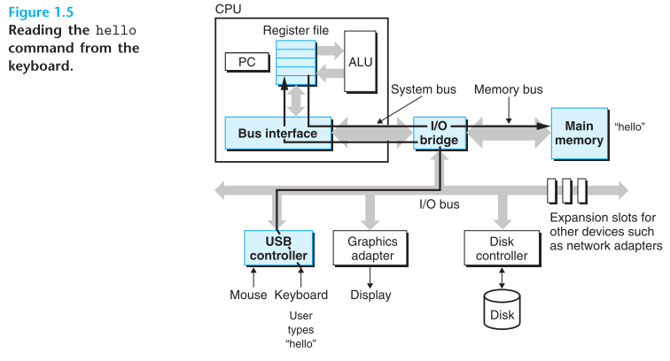
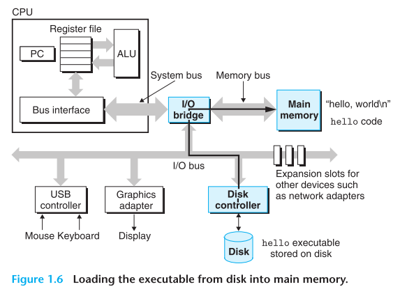
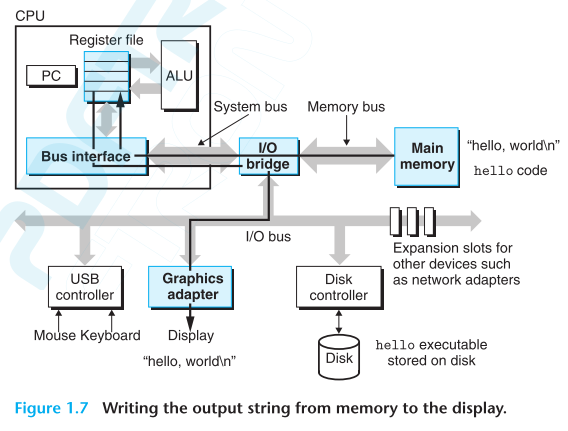
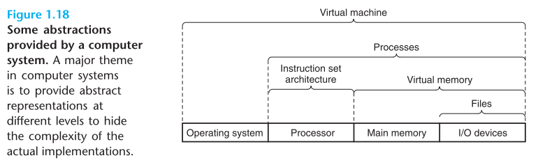

## Information Is Bits + Context
hello.c:
```c
#include <stdio.h>
int main()
{
	printf("hello, world\n");
	return 0;
}
```

- `source program(source file)`
	- programmer creates with an editor and saves in a text file called hello.c.[**P33**](obsidian://booknote?type=annotation&book=book/Computer%20Systems.%20A%20Programmer%E2%80%99s%20Perspective%203rd%20Edition%20Global%20Edition.pdf&id=93cc5a65-6f78-aa35-9b0f-ead7bae183b0&page=33&rect=103.500,425.273,430.094,436.979)
	- The source program is a sequence of bits, each with a value of 0 or 1, organized in 8-bit chunks called bytes.[**P33**](obsidian://booknote?type=annotation&book=book/Computer%20Systems.%20A%20Programmer%E2%80%99s%20Perspective%203rd%20Edition%20Global%20Edition.pdf&id=22c7ee81-6cd1-9430-5cee-b2f3618fb1d3&page=33&rect=103.500,401.362,450.248,436.979) 
	- The hello.c program is stored in a file as a sequence of bytes.[**P33**](obsidian://booknote?type=annotation&book=book/Computer%20Systems.%20A%20Programmer%E2%80%99s%20Perspective%203rd%20Edition%20Global%20Edition.pdf&id=a8470845-7f89-562d-1e23-84f5d48863fb&page=33&rect=121.432,353.278,387.782,364.984)
	- source program文件里面存储的内容实际上是什么，实际上就是0和1
- `ASCII`
	- Each byte represents some **text character** in the program.[**P33**](obsidian://booknote?type=annotation&book=book/Computer%20Systems.%20A%20Programmer%E2%80%99s%20Perspective%203rd%20Edition%20Global%20Edition.pdf&id=57f89ad9-2df6-5a3e-c11a-cad2647d49a0&page=33&rect=190.812,401.362,437.954,413.068)
	- Most computer systems represent text characters using the ASCII standard that represents each character with a unique byte-size integer value.[**P33**](obsidian://booknote?type=annotation&book=book/Computer%20Systems.%20A%20Programmer%E2%80%99s%20Perspective%203rd%20Edition%20Global%20Edition.pdf&id=a1832d17-219c-be79-f551-f12b8d22e102&page=33&rect=103.500,377.193,450.228,401.113) 
		
	- 8个0和1组成的byte都对应一个字符，渲染成人类可读的符号
- `text file`
	- Files such as hello.c that consist exclusively of ASCII characters are known as `text files`.
	- All other files are known as `binary files`.[**P33**](obsidian://booknote?type=annotation&book=book/Computer%20Systems.%20A%20Programmer%E2%80%99s%20Perspective%203rd%20Edition%20Global%20Edition.pdf&id=67f6365b-2d92-c5fb-f761-09ba4236f1cb&page=33&rect=103.499,269.592,450.208,305.208)
- `context`
	- 这里主要表达一个思想：All information in a system—including disk files, programs stored in memory, user data stored in memory, and data transferred across a network—is represented as a bunch of bits.[**P33**](obsidian://booknote?type=annotation&book=book/Computer%20Systems.%20A%20Programmer%E2%80%99s%20Perspective%203rd%20Edition%20Global%20Edition.pdf&id=6a6b6e5c-4389-89d9-3462-91e8d6e4574f&page=33&rect=103.509,233.726,450.218,269.343)
	- In different contexts, the same sequence of bytesmight represent an integer, floating-point number, character string, or machine instruction.[**P33**](obsidian://booknote?type=annotation&book=book/Computer%20Systems.%20A%20Programmer%E2%80%99s%20Perspective%203rd%20Edition%20Global%20Edition.pdf&id=027bb5cf-8073-8f8f-ea98-fc37dbec629c&page=33&rect=103.509,185.906,450.218,221.522)
	- 计算机世界都是0和1，有的内容中虽然0和1串都一样，但是表达的意思不一样，具体得看context
## Processors Read and Interpret Instructions Stored in Memory
### Hardware Organization of a System
- `Buses`
	- Running throughout the system is a collection of **electrical conduits** called buses that **carry bytes of information** back and forth between the components.[**P38**](obsidian://booknote?type=annotation&book=book/Computer%20Systems.%20A%20Programmer%E2%80%99s%20Perspective%203rd%20Edition%20Global%20Edition.pdf&id=ce3b184b-166b-4d1a-36c4-eabd298f44dc&page=38&rect=161.800,188.973,508.499,212.634)
	  *在整个系统中运行的是一组称为总线的电气导管，它们在组件之间来回传输字节信息*
	- Buses are typically designed to transfer fixed-size chunks of bytes known as `words`.
	- The number of bytes in a word (the `word size`) is a fundamental system parameter that varies across systems.
	  *是一个基本的系统参数，会因系统而异*
	- Most machines today have word sizes of either 4 bytes (32bits) or 8 bytes (64 bits).[**P38**](obsidian://booknote?type=annotation&book=book/Computer%20Systems.%20A%20Programmer%E2%80%99s%20Perspective%203rd%20Edition%20Global%20Edition.pdf&id=61df0fcc-5ef4-665b-05fd-57521377882c&page=38&rect=161.800,141.153,508.509,200.679)
- `I/O Devices`
	- Each I/O device is connected to the I/O bus by either a **controller** or an **adapter**.[**P39**](obsidian://booknote?type=annotation&book=book/Computer%20Systems.%20A%20Programmer%E2%80%99s%20Perspective%203rd%20Edition%20Global%20Edition.pdf&id=dbae7a69-a334-35aa-3e11-cd98207b3cda&page=39&rect=121.433,589.472,450.198,601.178)
	- controller是设备本身或主板上的芯片组。adapter是插在主板上插槽中的卡片。
	- Regardless(总的来说), the purpose of each is to transfer information back and forth betweenthe I/O bus and an I/O device.[**P39**](obsidian://booknote?type=annotation&book=book/Computer%20Systems.%20A%20Programmer%E2%80%99s%20Perspective%203rd%20Edition%20Global%20Edition.pdf&id=378c888a-6432-f359-6bcf-7079bd12830e&page=39&rect=103.500,529.696,450.218,553.357)
- `Main Memory`
	- Physically,main memory consists of a collection of dynamic random access memory(DRAM)chips. 
	- Logically, memory is organized as a linear array of bytes, each with its own unique address (array index) starting at zero.[**P39**](obsidian://booknote?type=annotation&book=book/Computer%20Systems.%20A%20Programmer%E2%80%99s%20Perspective%203rd%20Edition%20Global%20Edition.pdf&id=32e13738-863b-5ad2-fb55-66cab7340bab&page=39&rect=103.500,389.220,450.248,436.792)
### Running the hello Program
1. Initially, the shell program is executing its instructions, waiting for us to type acommand. 
2. As we type the characters ./hello at the keyboard, the shell program reads each one into a register and then stores it in memory.[**P40**](obsidian://booknote?type=annotation&book=book/Computer%20Systems.%20A%20Programmer%E2%80%99s%20Perspective%203rd%20Edition%20Global%20Edition.pdf&id=1c9c5ab8-bb4a-2039-f4bc-476ab8915fe6&page=40&rect=161.796,153.108,508.504,188.724)
   
3. When we hit the enter key on the keyboard, the shell knows that we have finished typing the command.[**P40**](obsidian://booknote?type=annotation&book=book/Computer%20Systems.%20A%20Programmer%E2%80%99s%20Perspective%203rd%20Edition%20Global%20Edition.pdf&id=89fd9eb0-b6de-bcb4-c8e4-6c65349dde87&page=40&rect=161.796,129.198,508.484,152.859)
4. The shell then loads the executable hello file by executing a sequence of instructions that copies the code and data in the hello object file from disk to main memory.
	- The data includes the string of characters `hello, world\n` that will eventually be printed out.[**P41**](obsidian://booknote?type=annotation&book=book/Computer%20Systems.%20A%20Programmer%E2%80%99s%20Perspective%203rd%20Edition%20Global%20Edition.pdf&id=8bb95146-9457-f353-3f0e-7060b982e716&page=41&rect=103.500,398.347,450.149,422.008)
5. Using a technique known as direct memory access (DMA), the data travel directly from disk to main memory, without passing throughthe processor.[**P41**](obsidian://booknote?type=annotation&book=book/Computer%20Systems.%20A%20Programmer%E2%80%99s%20Perspective%203rd%20Edition%20Global%20Edition.pdf&id=45a475da-faf1-d9ec-0aa6-f52d837410f2&page=41&rect=103.500,362.482,450.198,398.098)
   
6. Once the code and data in the hello object file are loaded into memory, the processor begins executing the machine-language instructions in the hello program's main routine.[**P41**](obsidian://booknote?type=annotation&book=book/Computer%20Systems.%20A%20Programmer%E2%80%99s%20Perspective%203rd%20Edition%20Global%20Edition.pdf&id=a97da219-9f95-9685-b539-bc16d0ad0190&page=41&rect=103.500,326.617,450.198,362.233)
7. These instructions copy the bytes in the `hello, world\n` string from memory to the register file, and from there to the display device, where they are displayed on the screen.[**P41**](obsidian://booknote?type=annotation&book=book/Computer%20Systems.%20A%20Programmer%E2%80%99s%20Perspective%203rd%20Edition%20Global%20Edition.pdf&id=41d7aa2c-e67b-28bd-18e4-22cdee6e14ac&page=41&rect=103.510,302.706,450.208,338.323)
   

---
- we can distinguish (区分) the processor's #instruction-set-architecture （指令集结构）, describing the effect of each machine-code instruction, from its #microarchitecture , describing how the processor is actually implemented. [**P40**](obsidian://booknote?type=annotation&book=book/Computer%20Systems.%20A%20Programmer%E2%80%99s%20Perspective%203rd%20Edition%20Global%20Edition.pdf&id=4da12840-62a6-f41c-09cb-c24501627ba2&page=40&rect=161.800,318.411,508.489,365.983)



- On the processor side, the #instruction-set-architecture  provides an abstraction of the actual processor hardware. [**P57**](obsidian://booknote?type=annotation&book=book/Computer%20Systems.%20A%20Programmer%E2%80%99s%20Perspective%203rd%20Edition%20Global%20Edition.pdf&id=5378d1bc-20aa-ff9b-5e08-bcf4cb10523d&page=57&rect=103.500,481.999,450.408,505.660)
