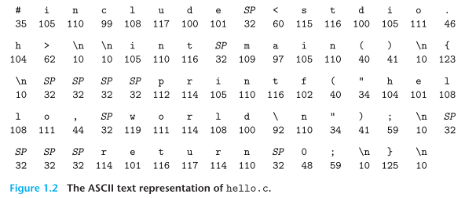

## Information Is Bits + Context
hello.c:
```c
#include <stdio.h>
int main()
{
	printf("hello, world\n");
	return 0;
}
```

- `source program(source file)`
	- programmer creates with an editor and saves in a text file called hello.c.[**P33**](obsidian://booknote?type=annotation&book=book/Computer%20Systems.%20A%20Programmer%E2%80%99s%20Perspective%203rd%20Edition%20Global%20Edition.pdf&id=93cc5a65-6f78-aa35-9b0f-ead7bae183b0&page=33&rect=103.500,425.273,430.094,436.979)
	- The source program is a sequence of bits, each with a value of 0 or 1, organized in 8-bit chunks called bytes.[**P33**](obsidian://booknote?type=annotation&book=book/Computer%20Systems.%20A%20Programmer%E2%80%99s%20Perspective%203rd%20Edition%20Global%20Edition.pdf&id=22c7ee81-6cd1-9430-5cee-b2f3618fb1d3&page=33&rect=103.500,401.362,450.248,436.979) 
	- The hello.c program is stored in a file as a sequence of bytes.[**P33**](obsidian://booknote?type=annotation&book=book/Computer%20Systems.%20A%20Programmer%E2%80%99s%20Perspective%203rd%20Edition%20Global%20Edition.pdf&id=a8470845-7f89-562d-1e23-84f5d48863fb&page=33&rect=121.432,353.278,387.782,364.984)
	- source program文件里面存储的内容实际上是什么，实际上就是0和1
- `ASCII`
	- Each byte represents some **text character** in the program.[**P33**](obsidian://booknote?type=annotation&book=book/Computer%20Systems.%20A%20Programmer%E2%80%99s%20Perspective%203rd%20Edition%20Global%20Edition.pdf&id=57f89ad9-2df6-5a3e-c11a-cad2647d49a0&page=33&rect=190.812,401.362,437.954,413.068)
	- Most computer systems represent text characters using the ASCII standard that represents each character with a unique byte-size integer value.[**P33**](obsidian://booknote?type=annotation&book=book/Computer%20Systems.%20A%20Programmer%E2%80%99s%20Perspective%203rd%20Edition%20Global%20Edition.pdf&id=a1832d17-219c-be79-f551-f12b8d22e102&page=33&rect=103.500,377.193,450.228,401.113) 
		
	- 8个0和1组成的byte都对应一个字符，渲染成人类可读的符号
- `text file`
	- Files such as hello.c that consist exclusively of ASCII characters are known as `text files`.
	- All other files are known as `binary files`.[**P33**](obsidian://booknote?type=annotation&book=book/Computer%20Systems.%20A%20Programmer%E2%80%99s%20Perspective%203rd%20Edition%20Global%20Edition.pdf&id=67f6365b-2d92-c5fb-f761-09ba4236f1cb&page=33&rect=103.499,269.592,450.208,305.208)
- `context`
	- 这里主要表达一个思想：All information in a system—including disk files, programs stored in memory, user data stored in memory, and data transferred across a network—is represented as a bunch of bits.[**P33**](obsidian://booknote?type=annotation&book=book/Computer%20Systems.%20A%20Programmer%E2%80%99s%20Perspective%203rd%20Edition%20Global%20Edition.pdf&id=6a6b6e5c-4389-89d9-3462-91e8d6e4574f&page=33&rect=103.509,233.726,450.218,269.343)
	- In different contexts, the same sequence of bytesmight represent an integer, floating-point number, character string, or machine instruction.[**P33**](obsidian://booknote?type=annotation&book=book/Computer%20Systems.%20A%20Programmer%E2%80%99s%20Perspective%203rd%20Edition%20Global%20Edition.pdf&id=027bb5cf-8073-8f8f-ea98-fc37dbec629c&page=33&rect=103.509,185.906,450.218,221.522)
	- 计算机世界都是0和1，有的内容中虽然0和1串都一样，但是表达的意思不一样，具体得看context
