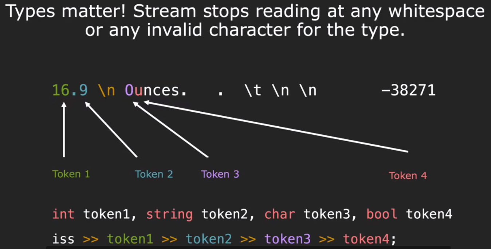

# ostringstream

```c++
#include <iostream>
#include <sstream>

int main() {
    std::ostringstream oss("Hello world");
    std::cout << oss.str() << std::endl;

    oss << "wtf";
    std::cout << oss.str() << std::endl;

    oss << "wtf";
    std::cout << oss.str() << std::endl;
    return 0;
}

/*
Hello world
wtflo world
wtfwtfworld
*/
```

使用ate字符从缓冲区后面开始添加

```c++
#include <iostream>
#include <sstream>

int main() {
    std::ostringstream oss("Hello world", std::ostringstream::ate);
    std::cout << oss.str() << std::endl;

    oss << "wtf";
    std::cout << oss.str() << std::endl;

    oss << "wtf";
    std::cout << oss.str() << std::endl;
    return 0;
}

/*
Hello world
Hello worldwtf
Hello worldwtfwtf
*/
```

# istringstream

```c++
#include <iostream>
#include <sstream>

int main() {
    std::istringstream iss("16.9 abc");

    double d;
    std::string s;
    iss >> d >> s;
    std::cout << d << "&&" << s;
}

/*
16.9&&abc
*/
```

```c++
#include <iostream>
#include <sstream>

int main() {
    std::istringstream iss("16.9 abc");

    int i;
    std::string s;
    iss >> i >> s;
    std::cout << i << "&&" << s;
}
/*
16&&.9
*/
```



# state bits

Four bits indicate the state of the stream:

- Good bit: ready for read/write.

- Fail bit: previous operation failed, all future operations frozen. Type mismatch, file can’t be opened, seekg failed.

- EOF bit: previous operation reached the end of buffer content.

- Bad bit: external error , likely irrecoverable. Could not move characters to buffer from external source.

  (e.g. the file you are reading from suddenly is deleted)

```c++
int stringToInteger(const std::string& s){
    std::istringstream iss(s);
    int result;
    iss >> result;
    if (iss.fail()) throw std::runtime_error("输入的字符串开头不是数字!, 比如aa123");
    
    //char remain;
    //iss >> remain;
    //if (!iss.fail()) throw std::runtime_error("输入的字符串开头是数字，但是后面带了不是数字的字符, 比如123aa");
    if (!iss.eof()) throw std::runtime_error("输入的字符串开头是数字，但是后面带了不是数字的字符, 比如123aa");
    return result;
}
```

```c++
int stringToInteger(const std::string& s){
    std::istringstream iss(s);
    int result;
    if (!(iss >> result)) throw std::runtime_error("输入的字符串开头不是数字!, 比如aa123");

    char remain;
    if (iss >> remain) throw std::runtime_error("输入的字符串开头是数字，但是后面带了不是数字的字符, 比如123aa");
    return result;
}
```

# buffer

```c++
#include <iostream>
#include <unistd.h>

int main()
{
    //一般情况下是line buffered，也就是字符一般在换行符之后出现在stout
    std::cout << "Hello\nworld";
    sleep(2);
    std::cout << std::endl;
    return 0;
}

/*
Hello
<2s后>
world
<endl>
*/
```

```c++
#include <iostream>
#include <unistd.h>

int main()
{	
    // 关闭cout与stout的同步，需要flush才能同步到stout
    std::ios_base::sync_with_stdio(false);
    // 将字符缓冲到cout，但是关闭了同步并且没有flush，所以不会输出
    std::cout << "Hello\nworld";
    sleep(2);
    // endl输出换行的同时还执行flush
    std::cout << std::endl;
    return 0;
}

/*
<2s后>
Hello
world
<endl>
*/
```

# size_t

- `size_t` is the name of the type returned by a standard-library `size()` and as is guaranteed to be able to express the maximum size of any object (including any array) in C++. It is also guaranteed to be big enough for any array index so it is a natural type for a loop by index over an array.

- the standard header `<cstddef>` contains a definition of the alias size_t, maybe:
  ```c++
  using size_t = unsigned int;
  ```

- The actual type named size_t is implementation-dependent, so in another implementation size_t may be an `unsigned long`. Having the alias size_t allows the programmer to write portable code (64bit and 32bit both behave nicely with system functions and size_t).

```c++
void chopBothEnds(const std::string& s){
    std::string result;
    for (size_t i = 1; !s.empty() && i < s.size()-1; ++i){
        result += s[i];
    }
    std::cout << "result: " << result << std::endl;
}
```

这里需要注意`s.size()`返回unsigned类型变量，可能-1后变为负数了，unsigned变成负数可能是一个很大的值。需要提前判空

# type alias

```c++
using map_iterator=std::unordered_map<forward_list<Student>, unordered_set>::const_iterator; 
map_iterator begin=studentMap.cbegin(); 
map_iterator end=studentMap.cend();
```

