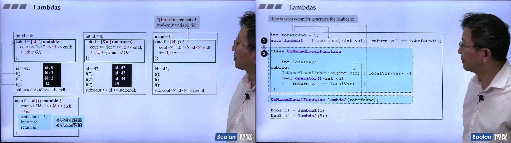

```c++
#include <iostream>
#include <vector>
#include <algorithm>

int main() {
    std::vector<int> vi{5, 28, 50, 83, 70, 590, 245};
    int x = 30;
    int y = 100;
    vi.erase(std::remove_if(vi.begin(), vi.end(),
                            [x, y](int n) { return x < n && n < y; }), vi.end());
    for (auto i: vi) {
        std::cout << i << std::endl;
    }
}
```

```c++
#include <iostream>
#include <vector>
#include <algorithm>

class LambdaFunctor{
private:
    int m_a;
    int m_b;
public:
    LambdaFunctor(int a, int b): m_a{a}, m_b{b}{};
    bool operator()(int n) const{
        return m_a < n && n < m_b;
    }
};

int main() {
    std::vector<int> vi{5, 28, 50, 83, 70, 590, 245};
    int x = 30;
    int y = 100;
    vi.erase(std::remove_if(vi.begin(), vi.end(),LambdaFunctor(x, y)), vi.end());
    for (auto i: vi) {
        std::cout << i << std::endl;
    }
}
```

