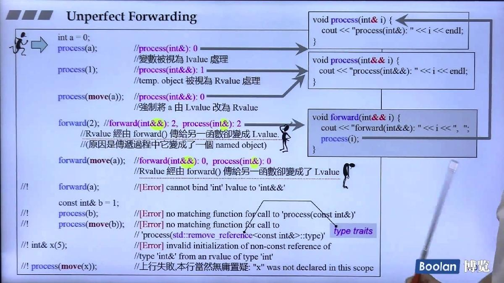

# Rvalue

- 一般情况下temp object不会继续用到，所以编译器看到temp object一定当作Rvalue
- Rvalue被move之后就不能再使用了
- 如果Lvalue明确不会继续用到，可以显式指定：`M c2(std::move(c1))`

# Unperfect Forwarding

函数调用传递过程中可能会丢失一些信息，比如insert会调用insert(&&)再到move constructor



使用std::forward能够达到完美forward，参数的性质（modifiable, const, lvalue or rvalue）不会发生改变

```c++
template<typename T1, typename T2>
void function1(T1&& t1, T2&& t2){
    function2(std::forward<T1>(t1), std::forward<T2(t2));
}
```

# Move Aware Class

```c++
#include <iostream>
#include <cstring>

class MyString{
private:
    char* _data{};
    size_t _len;

    void _init_data(const char* s){
        _data = new char[_len+1];
        memcpy(_data, s, _len);
        _data[_len] = '\0';
    }

public:
    //constructor
    MyString(const char* p): _len(strlen(p)){
        std::cout << "constructor" << std::endl;
        _init_data(p);
    }

    //copy constructor
    MyString(const MyString& str): _len(str._len){
        std::cout << "copy constructor" << std::endl;
        _init_data(str._data);
    }

    //move constructor
    MyString(MyString&& str) noexcept :_data(str._data), _len(str._len){
        std::cout << "move constructor" <<std::endl;
        str._len = 0;
        str._data= nullptr;
    }

    MyString& operator=(const MyString& str){
        std::cout << "copy operator=" << std::endl;
        if(this != &str){
            delete _data;
            _len = str._len;
            _init_data(str._data);
        }
        return *this;
    }

    MyString& operator=(MyString&& str) noexcept {
        std::cout << "move operator=" << std::endl;
        if(this != &str){
            delete _data;
            _len = str._len;
            _data = str._data;
            str._data=nullptr;
        }
        return *this;
    }

    virtual ~MyString(){
        delete _data;
    }
};

int main() {
    MyString s1{"123"};
    MyString s2{s1};
    MyString s3{std::move(s2)};
}
```

