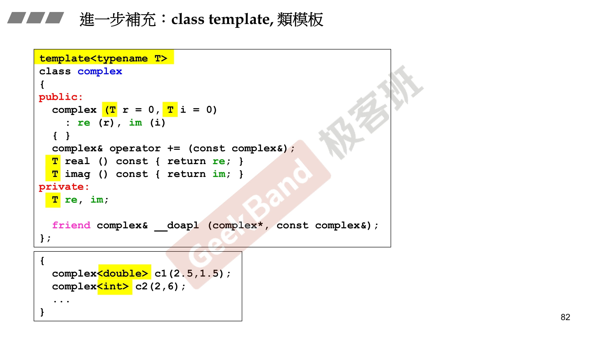
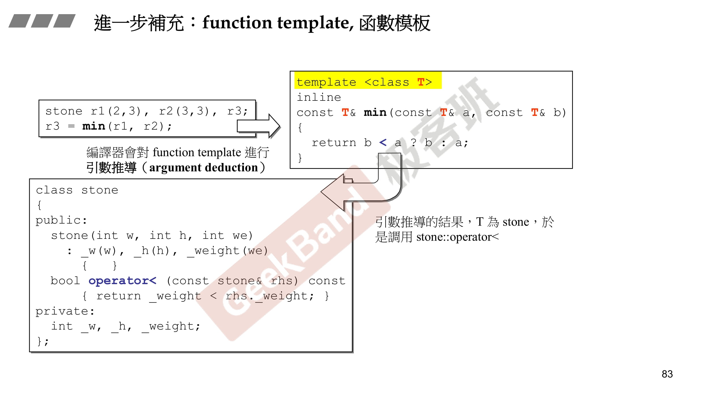
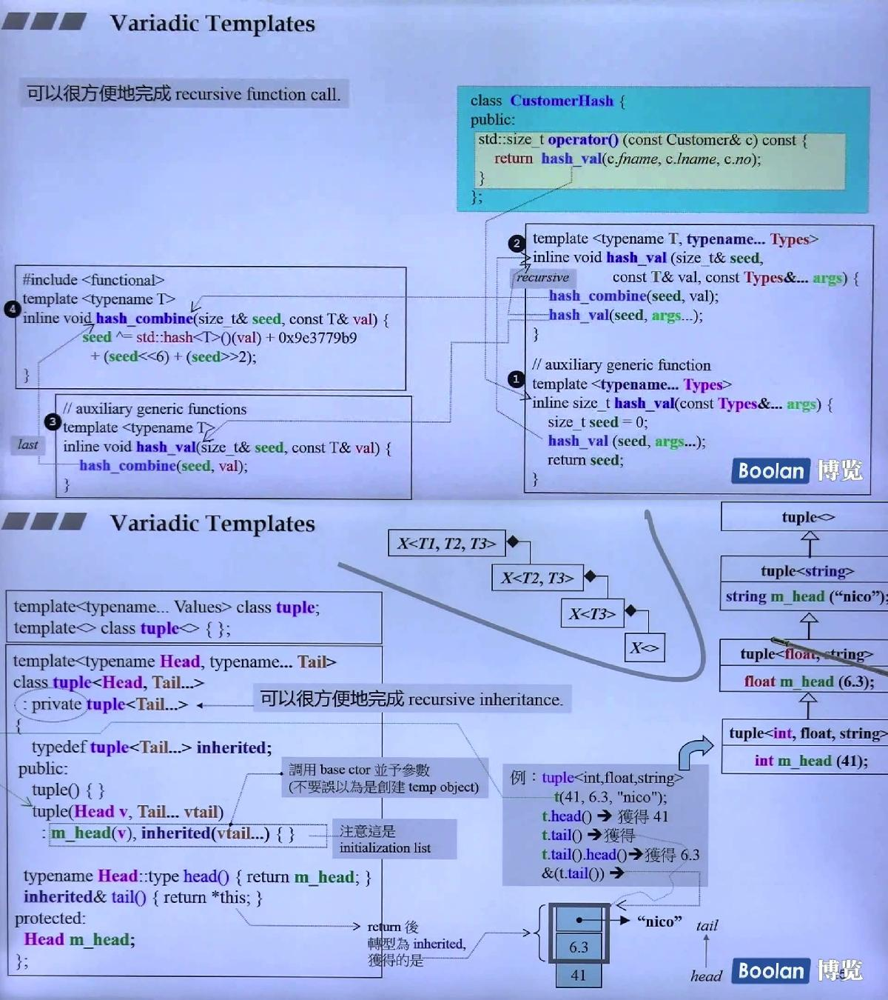

# Class Template



# Function Template

class template需要指定类型，function template则不需要，会进行推导（argument deduction）



# Member Template

```c++
template<class T1, class T2>
struct pair{
    T1 first;
    T2 second;
    
    pair(): first{T1()}, second{T2()} {};
    pair(const T1& a, const T2& b): first{a}, second{b} {};

    template<class U1, class U2>
    explicit pair(const pair<U1, U2>& p): first{p.first}, second{p.second} {};
};

class Base1 {};
class Derived1: public Base1{};

class Base2 {};
class Derived2: public Base2{};

int main(){
    pair<Derived1, Derived2> p;
    pair<Base1, Base2> p2(p);

    //等同于上面p2
    pair<Base1, Base2> p3((pair<Derived1, Derived2>()));
}
```

# Variadic Template

```c++
#include <iostream>
#include <bitset>

//处理最后没有参数的情况
void print(){
    std::cout << "no args" << std::endl;
}

template <typename T, typename... Types>
void print(const T& firstArg, const Types&... args){
    std::cout << firstArg << std::endl;
    print(args...);
}

int main(){
    print(7.5, "Hello", std::bitset<16>(377), 42);
}

/*
7.5
Hello
0000000101111001
42
no args
*/
```

```c++
#include <iostream>

template<typename... values> class Tuple;
template<> class Tuple<> {};

template<typename Head, typename... Tail>
class Tuple<Head, Tail...>: private Tuple<Tail...>{
    typedef Tuple<Tail...> inherited;
public:
    Tuple() = default;;
    explicit Tuple(Head v, Tail... vtail): m_head{std::move(v)}, inherited(vtail...){};

    auto head() {return m_head;};
    inherited& tail() {return *this;};
protected:
    Head m_head;
};

int main(){
    Tuple<int, float, std::string> t {41, 6.3, "nico"};
    std::cout << t.head() << std::endl; //41
    std::cout << t.tail().head() << std::endl; //6.3
    std::cout << t.tail().tail().head() << std::endl; //nico
}
```

