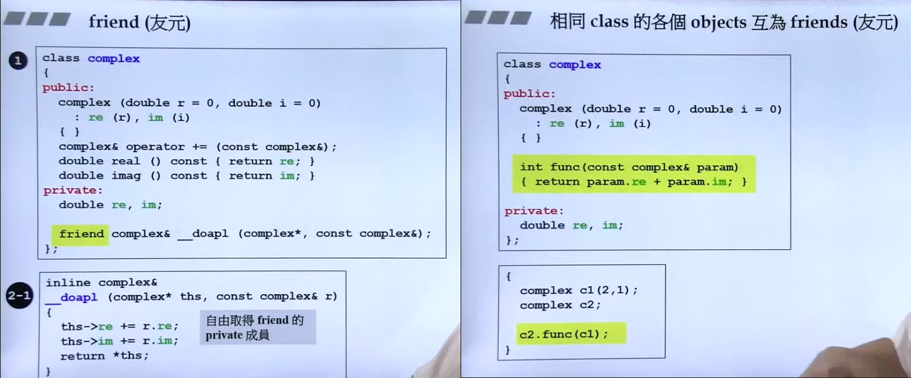
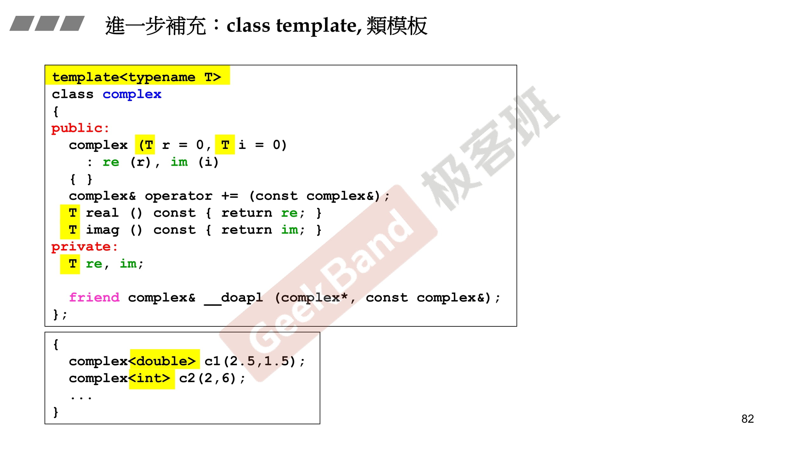
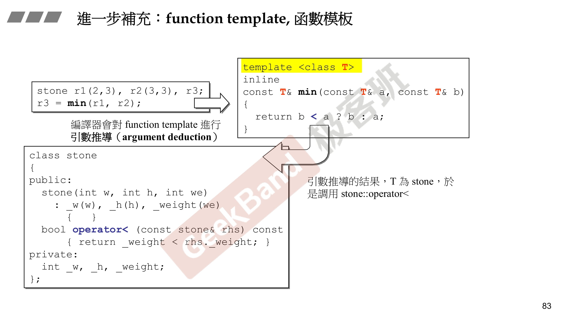

# 设计不带指针的类

- 一般class有两种，Class without/with pointer member(s)，不带指针的多半不用写析构函数

- 先养成防卫式习惯，在头文件中加入三行，防止重复include

- 数据尽量放在private
- 参数和返回值先考虑通过by reference，不行再by value
- 传参和返回值考虑先加const
- 使用构造函数特有的initialization list: : `re(r), im(i)`

header:

```c++
#ifndef _COMPLEX_
#define _COMPLEX_
class complex
{
public:
  complex (double r = 0, double i = 0)
  : re (r), im (i)
  { }
  complex& operator += (const complex& r); // return by reference
  double real() const {return re;} // return by value
  double imag const () { return im;} //inline
private:
  double re, im;
  friend complex& _doapl (complex*, const complex);
}
#endif
```

cpp:

```c++
#include <iostream>

inline complex& doapl(complex *ths, const complex &r) {
    ths->re += r.re;
    ths->im += r.im;
    return *ths;
}

// 成员函数
inline complex& complex::operator += (const complex& r) {
    return doapl(this, r);
}

inline double real(const complex& x){
    return x.real();
}

inline double imag(const complex& x){
    return x.imag();
}

// 下面三个函数不能return by reference，返回的是local object
// temp object: typename();
inline complex operator + (const complex& x, const complex& y){
    return complex(real(x) + real(y), imag(x)+ imag(y));
}

inline complex operator + (const complex& x, double y){
    return complex(real(x) + y, imag(x));
}

inline complex operator + (double x, const complex& y){
    return complex(x + real(y), imag(y));
}

std::ostream& operator << (std::ostream& os, const complex& x){
    return os << '(' << real(x) << ',' << imag(x) << ')' << std::endl;
}

int main(){
    complex c1(3, 4); // pass by value
    complex c2;
    c2 += c1; // pass by reference (to const)
    c2 = c2 + 3;
    std::cout << c2;
}
```

- by reference占4 bytes

- 如果把<<重载的返回值改为void，那么则不能使用`cout << c1 << c2;`
  ```c++
  void operator << (std::ostream& os, const complex& x){
      os << '(' << real(x) << ',' << imag(x) << ')' << std::endl;
  }
  ```

# 构造函数不能共存例子

```c++
// (1)
complex (double r = 0, double i = 0)
  : re(r), im(i)
{ }

//(2)
complex() : re(0), im(0) { }
```

```c++
complex c1;
complex c2();
```

使用上面两种方法创建对象时，都代表使用默认构造函数，编译器可以调用（1），对于（2）虽然函数有参数，但是有默认值，也可以调用，所以会冲突，不能共存。

# 构造函数放在private

一般我们不把构造函数放在private里面，因为这样不能被外界调用。其实也有特殊情况，下面列举一种，Singleton设计模式

```c++
class A
{
public:
  static A& getInstance() {return a;};
  setup() {...}
private:
  A();	//构造函数
  A(const A& rhs);	//构造函数
  static A a;
};
```

上面这种情况如果没有调用getInstance，那么a的存在则是浪费了，可以转换为下面的例子：

```c++
class A
{
public:
  static A& getInstance();
  setup() {...}
private:
  A();	//构造函数
  A(const A& rhs);	//构造函数
};

A& A::getInstance()
{
  static A a; //只有调用到getInstance才会有a
  return a;
}

调用：A::getInstance().setup(); //通过函数来得到唯一的一份
```

# Const

```c++
class complex{
public:
    explicit complex(double r = 0, double i = 0): re{r}, im{i} {}
    double real() {return re;}
    double imag() {return im;}
private:
    double re, im;
};

int main(){
    const complex c; 
    c.real(); //error: c为const对象，但是real并没有加const
}
```

```c++
class complex{
public:
    explicit complex(double r = 0, double i = 0): re{r}, im{i} {}
    double real() const {return re;}
    double imag() const {return im;}
private:
    double re, im;
};

int main(){
    const complex c;
    c.real();
}
```

- by reference占4 bytes

- 如果把<<重载的返回值改为void，那么则不能使用`cout << c1 << c2;`
  ```c++
  void operator << (std::ostream& os, const complex& x){
      os << '(' << real(x) << ',' << imag(x) << ')' << std::endl;
  }
  ```

# Friend



# Static

```c++
class Account{
public:
    static double m_rate;
    static void set_rate(const double&x) {m_rate = x;};
};
double Account::m_rate = 8.0;

int main(){
    Account::set_rate(5.0);
    Account a;
    a.set_rate(7.0);
}
```

# Template

## Class Template



## Function Template

class template需要指定类型，function template则不需要，会进行推导（argument deduction）



## Member Template

```c++
template<class T1, class T2>
struct pair{
    T1 first;
    T2 second;
    
    pair(): first{T1()}, second{T2()} {};
    pair(const T1& a, const T2& b): first{a}, second{b} {};

    template<class U1, class U2>
    explicit pair(const pair<U1, U2>& p): first{p.first}, second{p.second} {};
};

class Base1 {};
class Derived1: public Base1{};

class Base2 {};
class Derived2: public Base2{};

int main(){
    pair<Derived1, Derived2> p;
    pair<Base1, Base2> p2(p);

    //等同于上面p2
    pair<Base1, Base2> p3((pair<Derived1, Derived2>()));
}
```

# Conversion Function

```c++
#include <iostream>

class Fraction{
public:
    explicit Fraction(int num, int den = 1): m_numerator{num}, m_denominator{den}{};
    operator double() const{
        return double(m_numerator)/double(m_denominator);
    }
private:
    int m_numerator; //分子
    int m_denominator; //分母
};

int main(){
    Fraction f(3, 5);
    double d = 4.0 + f; //调用non-explicit operator double将f转为double
    std::cout << d << std::endl;
}
```

加上explicit代表不能隐式转换

```c++
#include <iostream>

class Fraction{
public:
    explicit Fraction(int num, int den = 1): m_numerator{num}, m_denominator{den}{};
    explicit operator double() const{
        return double(m_numerator)/double(m_denominator);
    }
private:
    int m_numerator; //分子
    int m_denominator; //分母
};

int main(){
    Fraction f(3, 5);
    double d = 4.0 + double(f); //需要显式调用double()
    std::cout << d << std::endl;
}
```

`Fraction d = f + 4`, 此时会出现两种情况，导致编译不通过

- f调用operator double()，然后+4变为4.6再调用构造函数变为Fraction
- 直接调用operator +返回Fraction

```c++
#include <iostream>

class Fraction{
public:
    Fraction(int num, int den = 1): m_numerator{num}, m_denominator{den}{};
    operator double() const{
        return double(m_numerator)/double(m_denominator);
    }
    Fraction operator + (const Fraction& f){
        return {f.m_numerator, f.m_denominator};
    }
private:
    int m_numerator; //分子
    int m_denominator; //分母
};

int main(){
    Fraction f(3, 5);
    Fraction d = f + 4; //error: ambiguous
}
```

# Shared_ptr

```c++
#include <iostream>

template<class T>
class shared_ptr{
public:
    T& operator*() const {return *px;};
    T* operator->() const {return px;};
    explicit shared_ptr(T* p): px{p}{};
private:
    T* px;
};

class Foo{
public:
    void method(){
        std::cout << "Foo::method" << std::endl;
    }
};

int main(){
    shared_ptr<Foo> sp(new Foo());
    sp->method();
}
```

