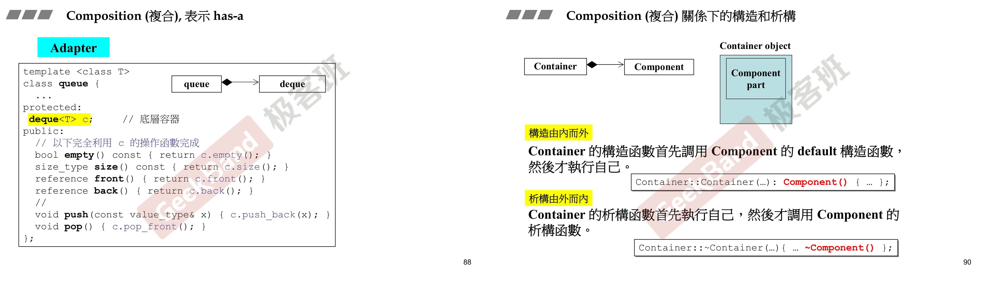
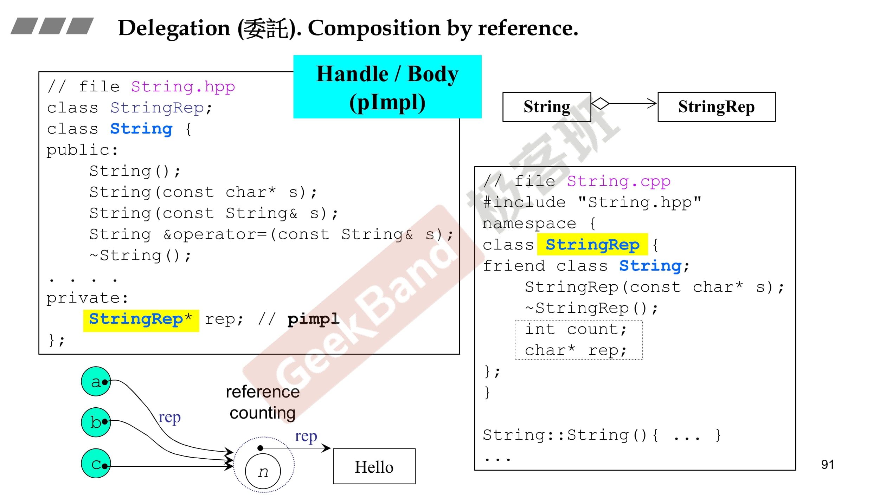
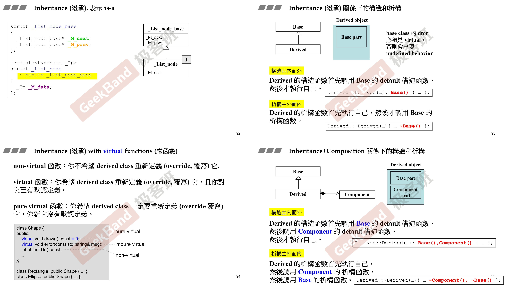

# Composition



- deque和queue同时出现同时消失

# Delegation



- StringRep与String没有共存关系，也就是一开始只是指针指向，但是并没有实例化

- pimpl：pointer to implement，public是对外暴露的，真正实现的放在private放在另外一个地方，可以很方便改变内部实现而不影响对外。
  - 可以共享同一份实现，如果需要修改时候，可以单独提供一个副本，copy on write

# Inheritance



```c++
#include <iostream>

class CDocument{
public:
    void OnFileOpen(){
        std::cout << "open file..." << std::endl;
        Serialize();
    }

    virtual void Serialize() {};
};

class CMyDoc: public CDocument{
public:
    void Serialize() override{
        std::cout << "CMyDoc::Serialize()" << std::endl;
    }
};

int main(){
    CMyDoc doc;
    doc.OnFileOpen();
}
```

