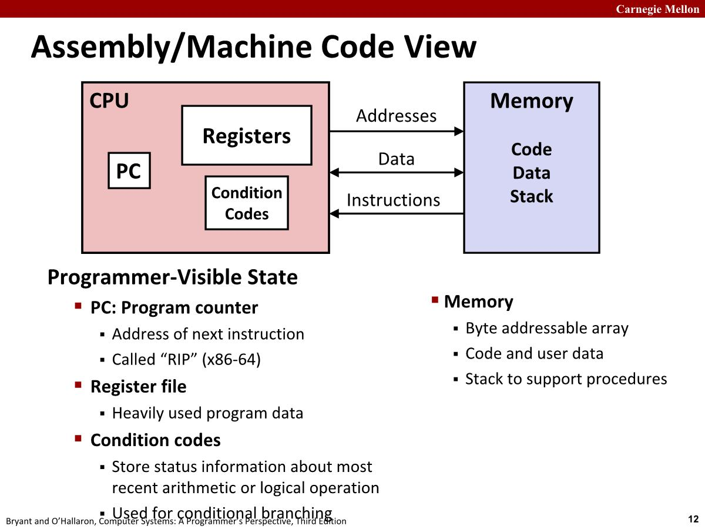
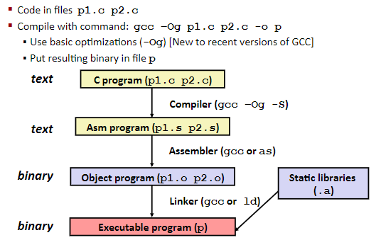
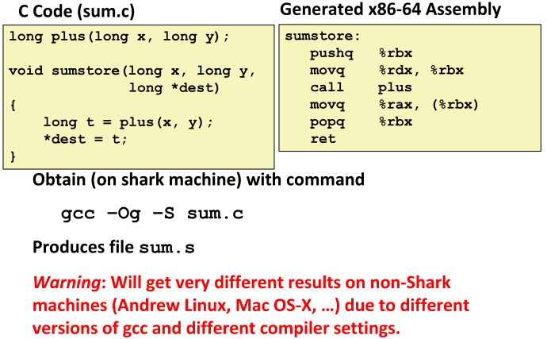
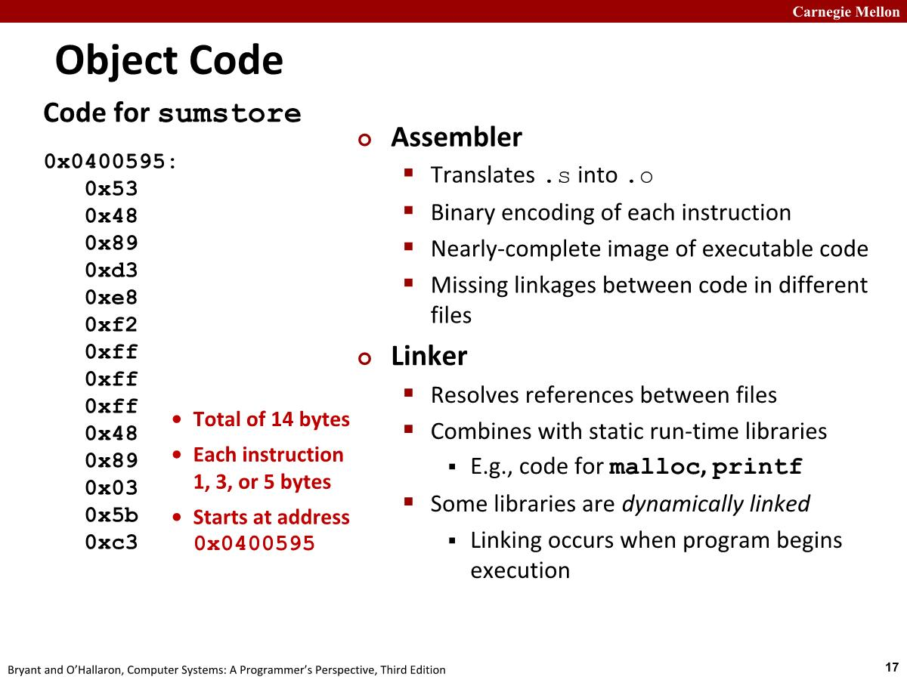
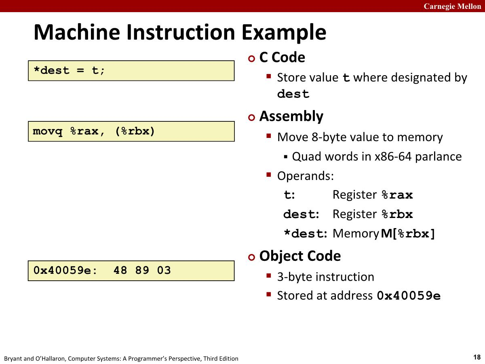

# History of Intel processors and architectures
## Intel x86 Processors
- x86只是口头描述，因为 intel 推出8086处理器后，接着推出了8286，8386等处理器，都带一个86，所以称为 x86。
- x86有时候被称为 CISC(Complex instruction set computer)，与 RISC(Reduced Instruction Set Computers)相对，具体许多不同格式的指令，但是 Linux 程序只用到一小部分。
## Intel x86 Evolution: Milestones(演进:里程碑)

- 1985年的386，扩展到了32位，真正实现可以实际运行Linux/Unix，移除一些奇怪的指令，让其更加通用。也称IA32(Intel architecture 32)，基于这种指令集架构的编码方式持续了很多年。
- 2004年之前，为了加快CPU运行速度，CPU频率一直增大，直到遇到芯片功耗问题。所以不再提高单核处理器CPU频率，而是采用多核的方式。这些核心彼此间是独立的，它们共同位于同一个芯片内。
## Intel’s 64-Bit History
- 2001: Intel Attempts Radical Shift(*彻底转变*) from IA32 to IA64\
	- Totally different architecture (Itanium)
	- Executes IA32 code only as legacy(*仅将 IA32代码作为传统代码执行*)
	- Performance disappointing(*表现令人失望*)
	- 基于全新的设计理念
- 2003: AMD Steps in with Evolutionary Solution
	- x86-64 (now called “AMD64”)
	- 在x86上面做加法，基于x86，使寄存器更大
- Intel Felt Obligated(*觉得有义务*) to Focus on IA64
	- Hard to admit mistake(*承认错误*) or that AMD is better
- 2004: Intel Announces EM64T extension to IA32
	- Extended Memory 64-bit Technology
	- Almost identical to x86-64!
- All but low-end x86 processors support x86-64
	- But, lots of code still runs in 32-bit mode

# C, assembly, machine code
## Architecture Definitions
- Architecture: (also ISA: #instruction-set-architecture ) The parts of a processor design that one needs to understand or write assembly/machine code.
	- Examples:  instruction set specification, registers.
	- Example ISAs: Intel: x86, IA32, Itanium, x86-64、ARM: Used in almost all mobile phones
- #Microarchitecture : Implementation of the architecture.
	- Examples: cache sizes and core frequency.
- Code Forms
	- Machine Code: The byte-level programs that a processor executes
	- Assembly Code: A text representation of machine code

## Assembly/Machine Code View

- Register file: 存放操作要用的数据
- Condition codes
	- 通过几位的状态码表示最近一些指令的执行结果
	- 主要用于实现条件分支

> In computer programming, a procedure is a set of coded instructions that tell a computer how to run a program or calculation. Depending on the programming language, a procedure may also be called a subroutine, subprogram or function.

## Turning C into Object Code

- Gcc: 如果什么参数也不指定，它会生成完全未优化的代码，实际上这种代码很难阅读，-g 用来调试

## Compiling Into Assembly

- %：寄存器
- pushq：将一些东西压到栈上
- movq：将数据从一个地方复制到另外一个地方
- call：call procedure
- ret：从特定函数退出并将值返回

## Object Code

## Machine Instruction Example

