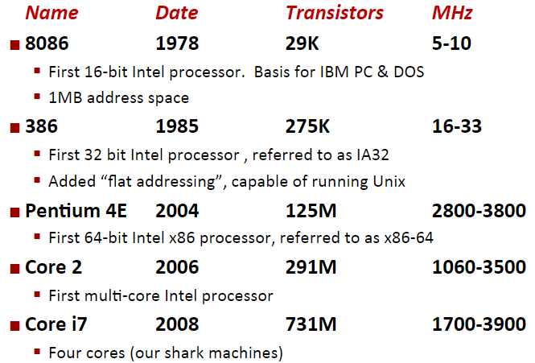
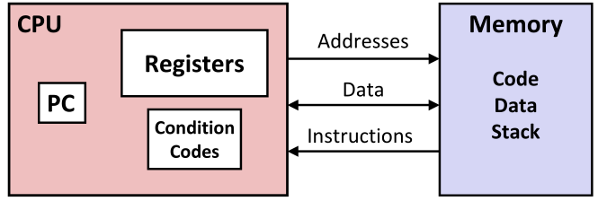
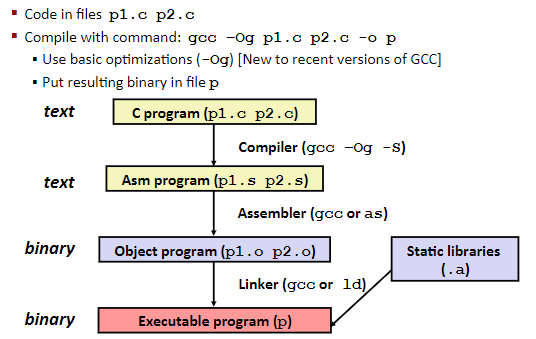

# Machine basics

## Intel x86 Processors

- x86只是口头描述，因为intel推出8086处理器后，接着推出了8286，8386等处理器，都带一个86，所以称为x86。

- x86有时候被称为CISC(Complex instruction set computer)，与RISC(Reduced Instruction Set Computers)相对，具体许多不同格式的指令，但是Linux程序只用到一小部分。

### Intel x86 Evolution: Milestones

- 1985年的386，扩展到了32位，真正实现可以实际运行Linux/Unix，移除一些奇怪的指令，让其更加通用。也称IA32(Intel architecture 32)，基于这种指令集架构的编码方式持续了很多年。

- 2004年之前，为了加快CPU运行速度，CPU频率一直增大，直到遇到芯片功耗问题。所以不再提高单核处理器CPU频率，而是采用多核的方式。这些核心彼此间是独立的，它们共同位于同一个芯片内。

## Architecture Definitions

- **Architecture: (also ISA: instruction set architecture) The parts of a processor design that one needs to understand or write assembly/machine code.**
  - Examples:  instruction set specification, registers.
  - Example ISAs: Intel: x86, IA32, Itanium, x86-64、ARM: Used in almost all mobile phones

- **Microarchitecture: Implementation of the architecture.**
  - Examples: cache sizes and core frequency.

- **Code Forms**:
  - Machine Code: The byte-level programs that a processor executes
  - Assembly Code: A text representation of machine code

## Assembly/Machine Code View

Programmer-Visible State:

- PC: Program counter
  - 下一条指令的地址，内存中的位置
  - Called “RIP” (x86-64)
- Register file: 存放操作要用的数据
- Condition codes
  - 通过几位的状态码表示最近一些指令的执行结果
  - 主要用于实现条件分支
- Momery
  - 虚拟内存（cpu高速缓存不可见）
  - Code and user data
  - Stack to support procedures
  >In computer programming, a procedure is a set of coded instructions that tell a computer how to run a program or calculation. Depending on the programming language, a procedure may also be called a subroutine, subprogram or function.

## Turning C into Object Code

### Compiling Into Assembly

- %：寄存器
- pushq：将一些东西压到栈上
- movq：将数据从一个地方复制到另外一个地方
- call：call procedure
- ret：从特定函数退出并将值返回

