# 14-ECF-Exceptions&Processes

## Control Flow

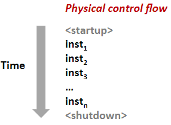

- cpu只做一件事情：从开始和结束，CPU只是读取和执行一系列指令，一次一条。如果有多个内核，每个内核都会一个接一个地执行指令。
- 指令序列称为控制流(control flow)，硬件正在执行的实际指令序列称为物理控制流（physical control flow)。

### Altering the Control Flow

对program state的改变做出的反应：

- Jumps and branches
- Procedure call and return

上述更多指的是用户代码一些判定分支流转，这些是不能适应system state的改变：

- Data arrives from a disk or a network adapter
- Instruction divides by zero
- User hits Ctrl-C at the keyboard
- System timer expires

为此系统需要一种机制：exceptional control flow

### Exceptional Control Flow

Exists at all levels of a computer system

- Low level mechanisms：Exceptions
  - 响应系统事件(system event)的控制流变化（即系统状态变化）
  - Implemented using combination of hardware and OS software

- Higher level mechanisms
  - 进程上下文切换(Process context switch)：Implemented by OS software and hardware timer
  - Signals：Implemented by OS software
  - 非局部跳转(Nonlocal jumps)：setjmp() and longjmp(),  Implemented by C runtime library。允许打破正常的调用和返回模式，从一个函数中，通常只能返回调用该函数的函数，Nonlocal jumps允许在函数内break并return到其他函数或者代码的某个部分

## Exceptions

- 为了响应某些事件而将控制权转移到操作系统的内核（内核常驻于操作系统内存中）。这些事件实际上是系统状态的变化：Divide by 0, arithmetic overflow, page fault, I/O request completes, typing Ctrl-C等
    >算术溢出(arithmetic overflow)计算产生出来的结果是非常大的，大于寄存器或存储器所能存储或表示的能力限制

- 异常处理之后可能会发生三件事件：返回并重新执行当前指令（对page fault之类的很有用）、执行下一条指令或者中止

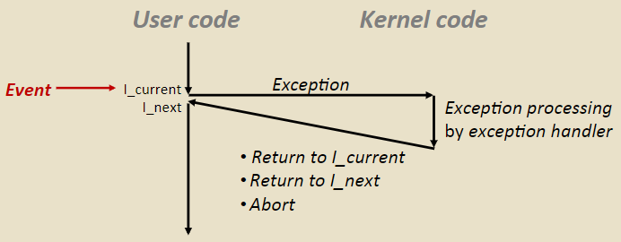

### Exception Tables

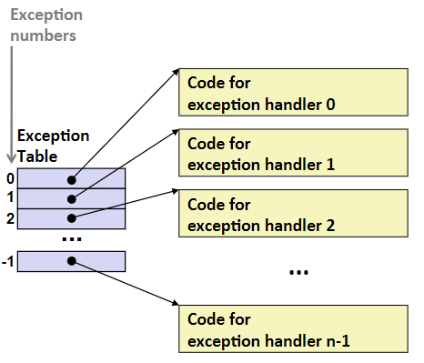

- 每种类型的事件都有一个唯一的exception number k
- k = index into exception table。当事件k发生的时候，硬件使用k作为该表的索引进行查找，并获取对应的exception handler地址
- 每当事件k发生时候，都会调用handler k

### Asynchronous Exceptions (Interrupts)

由发生在处理器之外的状态变化引起，通过在处理器上设置一个中断引脚来通知处理器这些状态变化（例如，当磁盘控制器完成直接内存访问并将数据从磁盘复制到内存时，通过设置中断引脚为high来通知处理已经完成复制）

中断发生后，handler返回，接着执行用户程序next指令

Examples：

- Timer interrupt：每隔几ms，一个外部定时器芯片(external timer chip)就会设置引脚触发一个中断。timer interrupt有个特殊的exception number，内核使用它来从用户程序中夺取控制权，否则用户程序可能会在无限循环中永远运行，以至于操作系统无法获得控制权。内核拿到控制权后可能会安排一个新进程或者让当前进行运行，这取决了内核。

- I/O interrupt from external device：Hitting Ctrl-C at the keyboard、Arrival of a packet from a network、Arrival of data from a disk

### Synchronous Exceptions

由执行指令后发生的事件引起的

- Traps：由程序故意引起的exception，例如system calls（允许用户程序调用内核的函数，将控制权转移给内核）。中断返回后执行用户程序的next指令。
- Faults：无意引起但是可能可以恢复的。例如page faults（程序引用的地址空间部分的数据实际上不存在，需要从磁盘中将对应的page复制到内存，然后重新执行指令，recoverable）。中断后要么重新执行当前指令要么中止。
- Aborts：无意且不可恢复的，例如非法指令、硬件错误等，中断后不会返回到程序中。

#### System Calls

Each x86-64 system call has a unique ID number

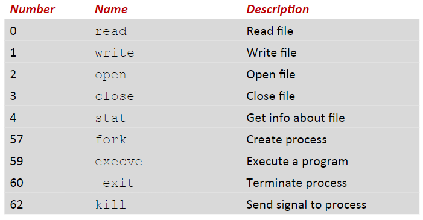

#### System Call Example:opening file

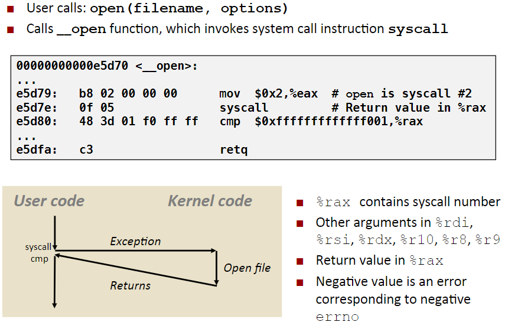

- 实际执行系统调用的是syscall指令（不能直接调用这些指令，Linux 将这些指令包装在系统级函数中，通过调用这些函数来实际调用它）。例如打开文件调用系统级函数open()
- cmp用来判断函数返回有没有异常，负数异常，正数意味着正常。
- open会返回一个文件描述符(file descriptor，整数)，在后续调用中使用它来读取和写入。

#### Fault Example: Page Fault

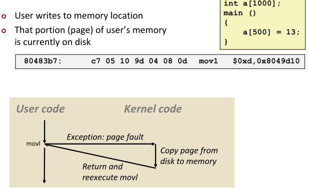

`a[500]`这个地址的内存不可用（即movl第二个参数地址），触发page fault，exception handler会将该page从磁盘复制到内存，返回时会重试执行movl指令。

#### Fault Example: Invalid Memory Reference

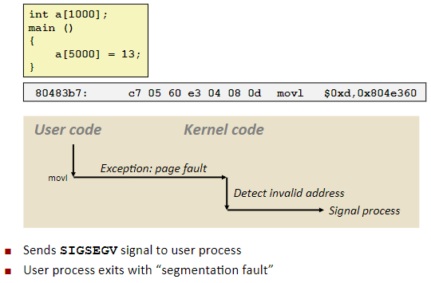

内核检测到是一个无效的地址，没有任何东西可以从磁盘加载，向进程发送一个signal，然后永远也不会返回。

## Processes

A process is an instance of a running program.

Process provides each program with two key abstractions:

- Logical control flow
  - Each program seems to have exclusive use of the CPU。给程序一种错觉，可以独占访问CPU和寄存器，永远不必担心任何其他程序会修改你的寄存器。这里与物理控制流相对，物理控制流是CPU正在执行的指令序列，但是CPU实际是共享的，这里引出逻辑控制流，让程序误以为自己的指令是独占运行在CPU上面。
  - Provided by kernel mechanism called context switching

- Private address space
  - Each program seems to have exclusive use of main memory.
  - Provided by kernel mechanism called virtual memory

每个正在运行的程序都有独属于自己的code、data、heap、stack，看不到其他进程正在使用的内存，因此进程(process)会给程序一种错觉，程序拥有所有内存和处理器独占的访问权限。

### Multiprocessing

假设只有一个cpu核心

错觉：

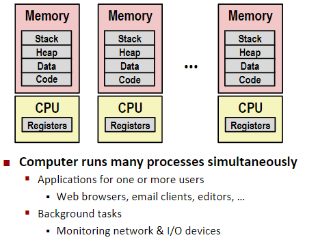

即使在单核的系统上，实际在同一时间也存在着许多进程（单个核心一次只执行一个进程）。每个进程都有一个process ID(PID)。

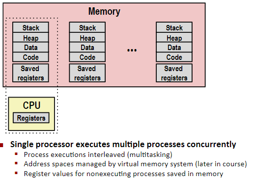

这些进程实际上是在共享着cpu，由操作系统管理着。在某个时候，由timer interrupt或者trap等而发生exception，然后操作系统会获得系统的控制权，假设在这种情况下它决定要运行另外一个进程。

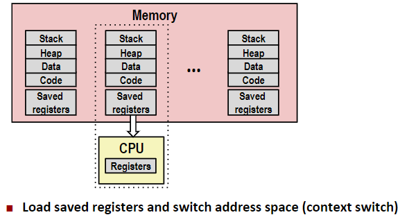

它会将当前寄存器值复制到内存中保存，然后调度下一个运行。它会读取上次进程运行时保存的寄存器的值，并将它们加载到cpu寄存器中，然后将地空间切换(address space)到这个进程的地址空间。所谓的上下文切换就是地址空间和寄存器的变化。

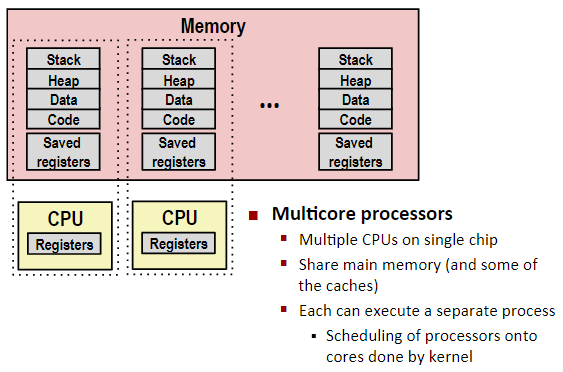
在现代的多核系统中，操作系统会在这些多核上调度进程，如果没有足够的cpu内核来处理进程，就会出现上下文切换。

### Concurrent Processes

- Each process is a logical control flow.
- Two processes run concurrently (are concurrent) if their flows(逻辑指令执行序列，但是物理执行序列不重叠) overlap in time.Otherwise, they are sequential.无论cpu内核数量多少，这种并发性定义都成立。

三个进程，进程A运行了一段时间，然后被进程B和进程C中断，最后它继续运行，然后终止。进程B中断进程A，然后它运行一段时间然后终止。当进程B完成时，进程C会运行一段时间。然后进程A运行一段时间，然后进程C终止。（纵坐标是时间轴，黑的竖线代表此时哪个进程在运行）

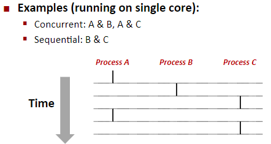

B和C不是并发的，B在C开始之前就结束了。但是在用户看来是并行的。

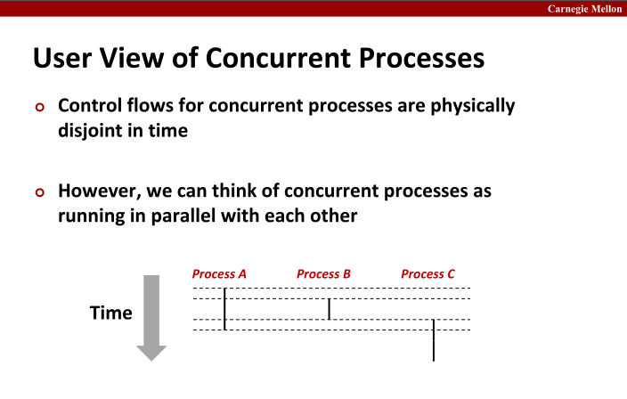

### Context Switching

上下文切换由内核管理，内核不是一个单独的进程在运行，而是在一些现有进程的上下文中运行，是由于exception而执行的位于地址空间上的代码。

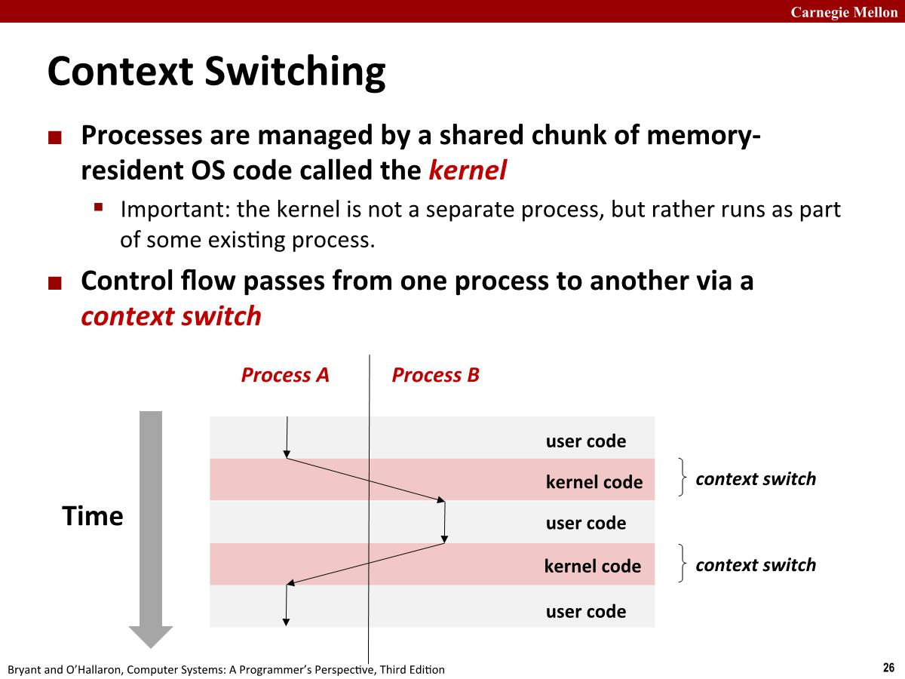

A进程发生了exception，处理完之后调度器决定运行进程B，执行代码然后重新指向B的地址空间，在进程B的上下文中运行，它完成了进程B通用寄存器的加载，然后将控制权转移到B，B从它上一次停止的地方开始。

## Process Control

### System Call Error Handling

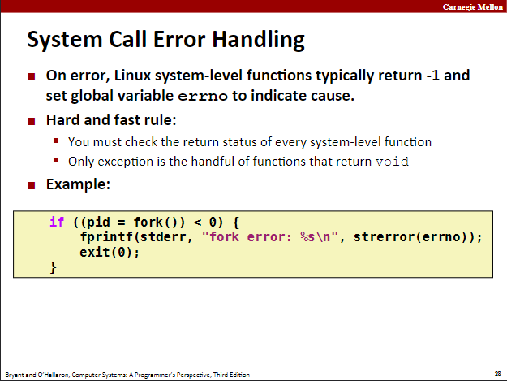

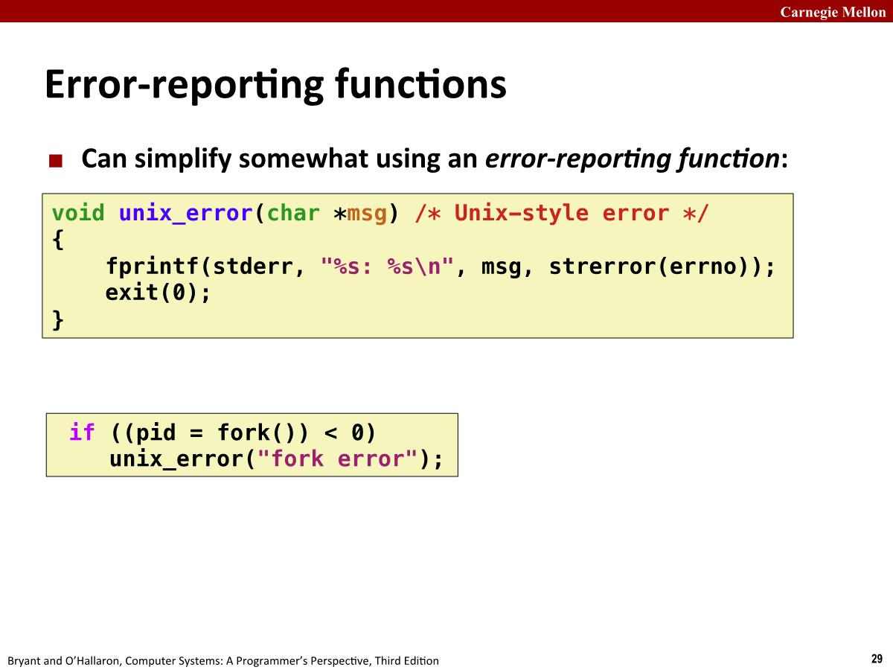

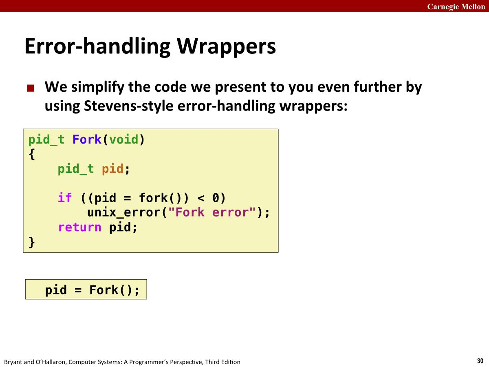

### Obtaining Process IDs

- `pid_t getpid(void)`：Returns PID of current process
- `pid_t getppid(void)`：Returns PID of parent process

### Creating and Terminating Processes

From a programmer’s perspective, we can think of a process as being in one of three states

- Running：Process is either executing, or waiting to be executed and will eventually be scheduled (i.e., chosen to execute) by the kernel.
- Stopped：Process execution is suspended and will not be scheduled until further notice.
- Terminated：Process is stopped permanently.

进程状态是stopped，意味着进程被挂起，在等待进一步通知之前不会被安排进调度队列，通常是因为收到了某种信号（signal），然后以某种方式停止。

#### Terminating Processes

Process becomes terminated for one of three reasons:

- Receiving a signal whose default action is to terminate
- Returning from the `main` routine.可以理解为main函数
- Calling the `exit` function.

`void exit(int status)`：Convention: normal return status is 0, nonzero on error

#### Creating Processes

Parent process creates a new running child process by calling fork.

`int fork(void)`

- Returns 0 to the child process, child’s PID to parent process. 调用一次返回两次，在父进程中，fork返回新创建子进程的进程ID。在子进程中，fork返回0。如果出现错误，fork返回一个负值。
- 子进程和父进程基本相同
  - Child get an identical (but separate) copy of the parent’s virtual address space. 这意味着所有的变量（包括全局变量）、stack、code，一切都是相同的。
  - Child gets identical copies of the parent’s open file descriptors. 子进程可以访问任何父进程打开的文件，包括父进程拥有的标准输入和标准输出。
  - Child has a different PID than the parent

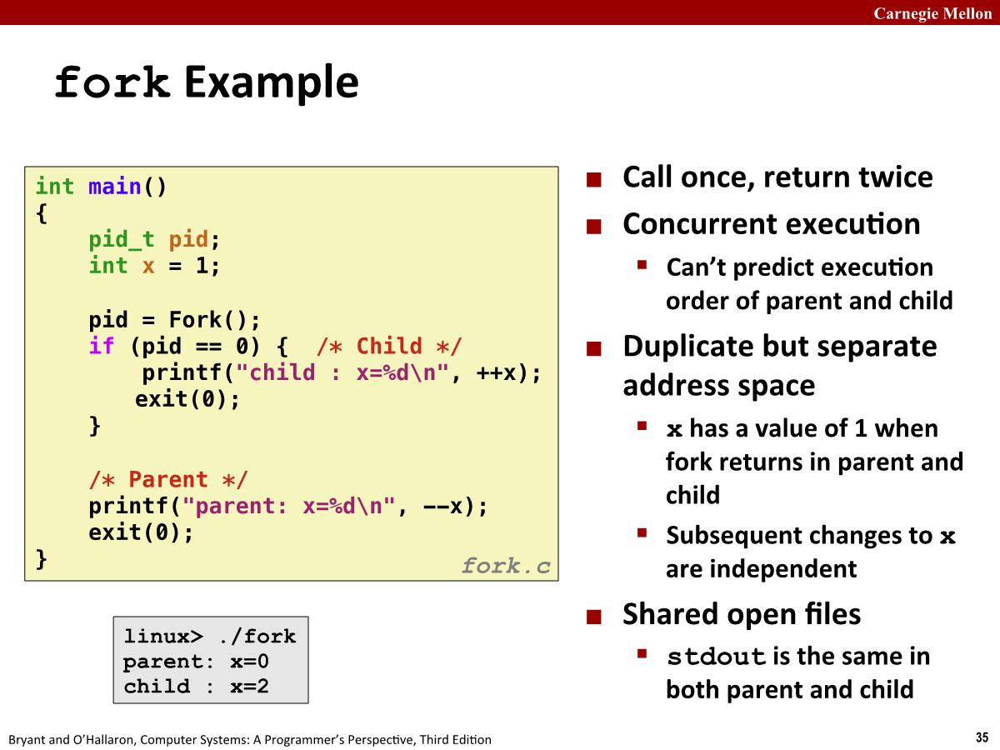

#### Modeling fork with Process Graphs

process graph工具可以捕获调用fork时可能发生的情况。

- 每个顶点对应一条语句的执行
- a -> b means a happens before b
- 边的值为变量的当前值
- printf顶点代表输出

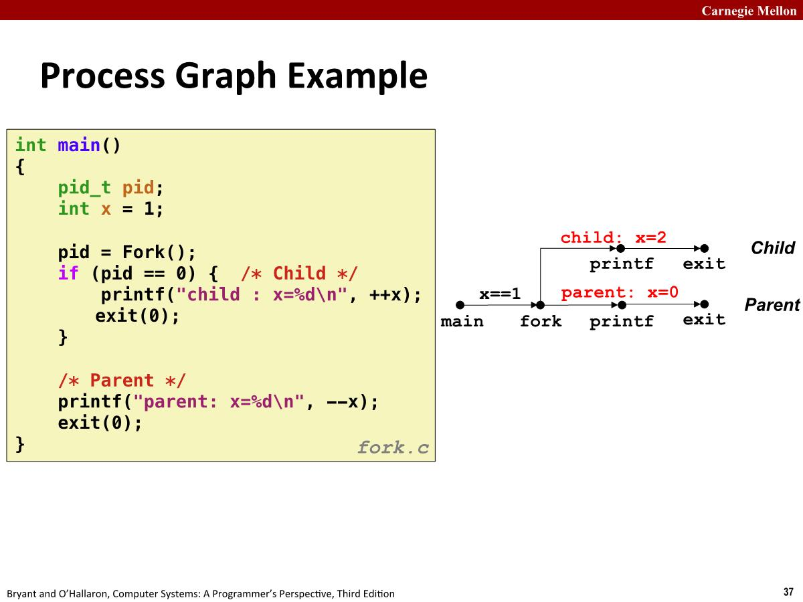

调用两个fork的情况

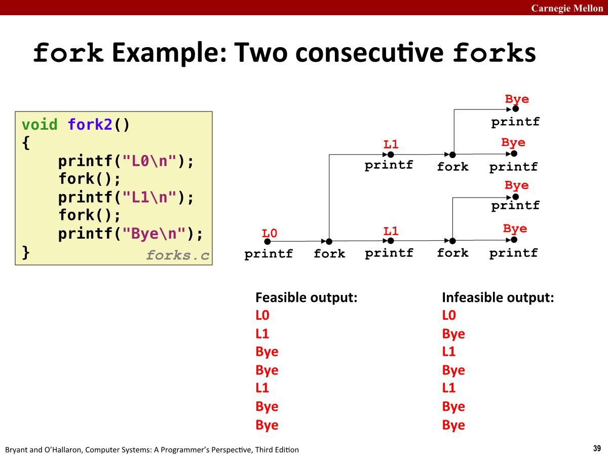

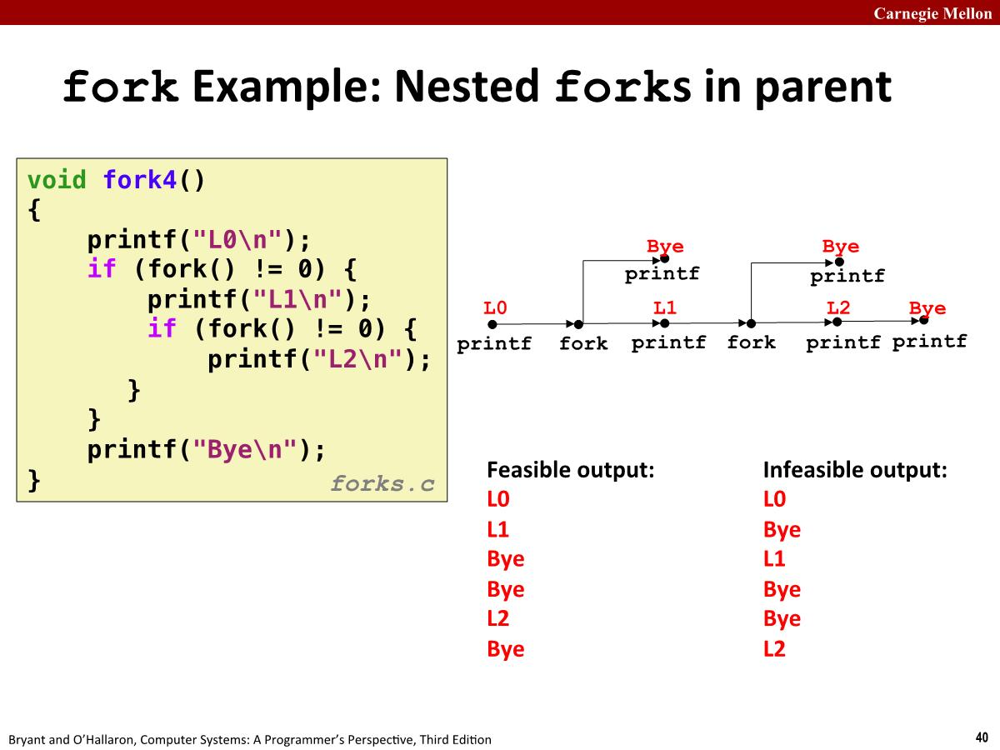

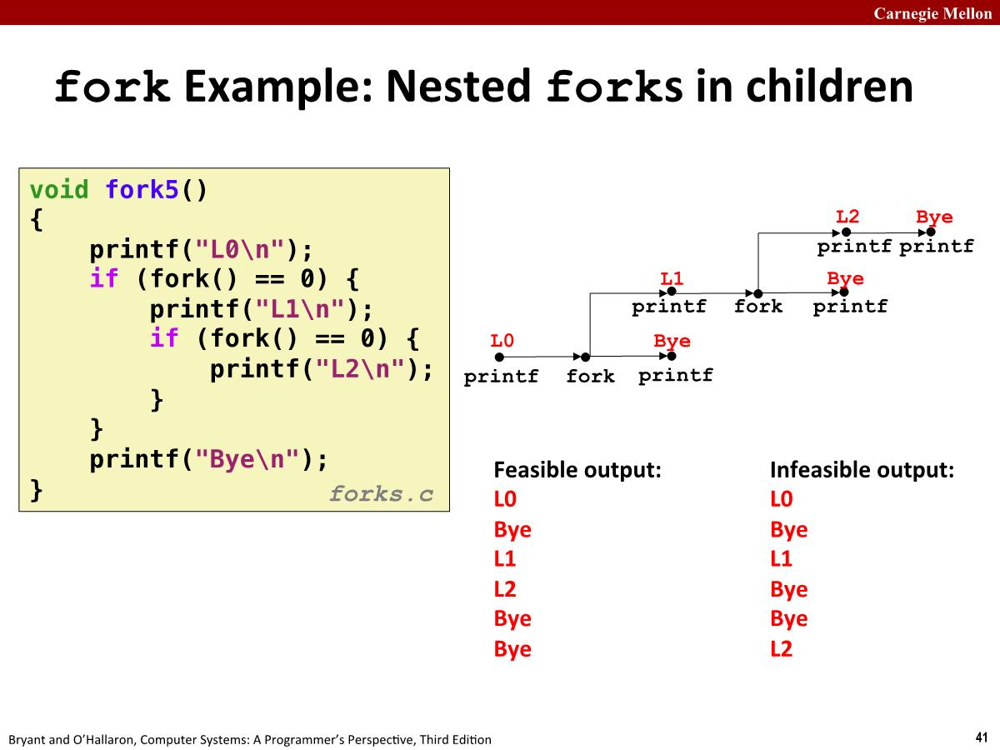

### Reaping Child Processes

When process terminates, it still consumes system resources.

任何进程终止时，系统并不会完全从系统中删除它（父进程可能希望等待子进程完成并检查其退出状态），会在一些os table中记录着该子进程的退出状态。这些进程被称为僵尸(zombie)进程。

父进程对已经终止的子进程执行wait或者waitpid函数，父进程将获得其退出状态，然后内核将删除该僵尸进程。

如果父进程一直没有处理僵尸进程，然后父进程终止了，这时候进程变为孤儿进程(orphaned child)，系统会让该系统存在的第一个进程(init进程，PID=1)reap该孤儿进程。

只有在有长期运行的父进程(shells或者servers)的情况下，才要担心僵尸进程。在这种情况下，服务器可能会创建很多个子进程，这些子进程中的每一个在它们终止时都会变成僵尸并且它们的状态占用了内核中的空间，这是内存泄漏的一种形式。

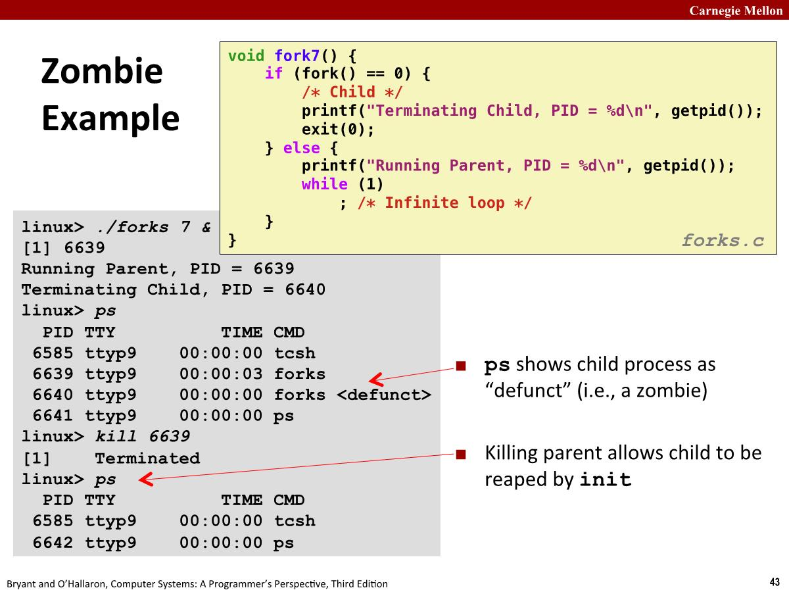

父进程永远没有机会reap子进程

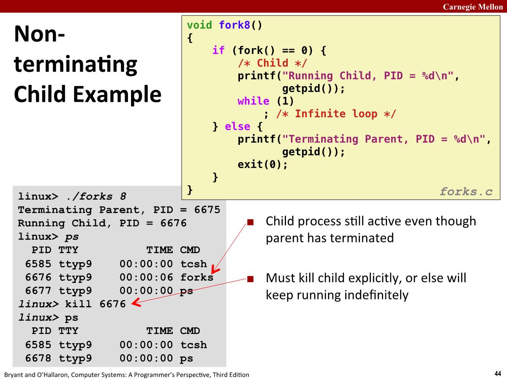

如果子进程没有终止（上一个调用了exit），即使父进程终止了，子进程依旧运行中。必须手动kill掉变为僵尸进程后由init进程reap。

#### wait:Synchronizing with Children

Parent reaps a child by calling the wait function.

`int wait(int *child_status)`

- Suspends current process until one of its children terminates.没有指定是哪个。
- Return value is the pid of the child process that terminated
- 如果`child_status != NULL`，那么该值将被赋值为子进程终止的原因，用整数表示，可以用一些宏去查看终止的原因，宏被定义在wait.h：WIFEXITED，WEXITSTATUS, WIFSIGNALED,
WTERMSIG, WIFSTOPPED, WSTOPSIG,
WIFCONTINUED等。

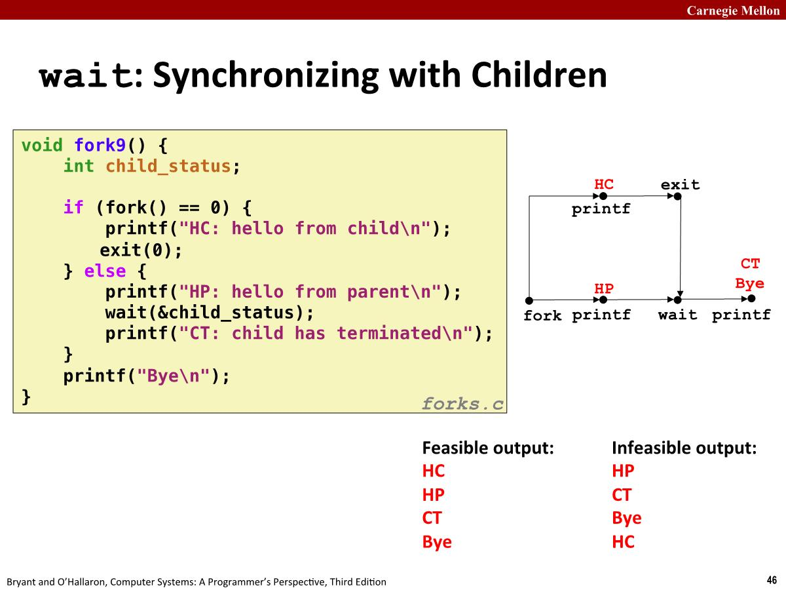

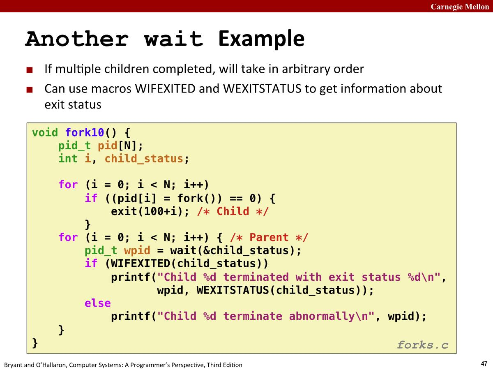

创建一堆子进程，等待所有子进程终止。

如果WIFEXITED为false，则这意味着子进程因其他原因终止，而不是因为它调用了exit。

这里可用waitpid去等待具体某个子进程。

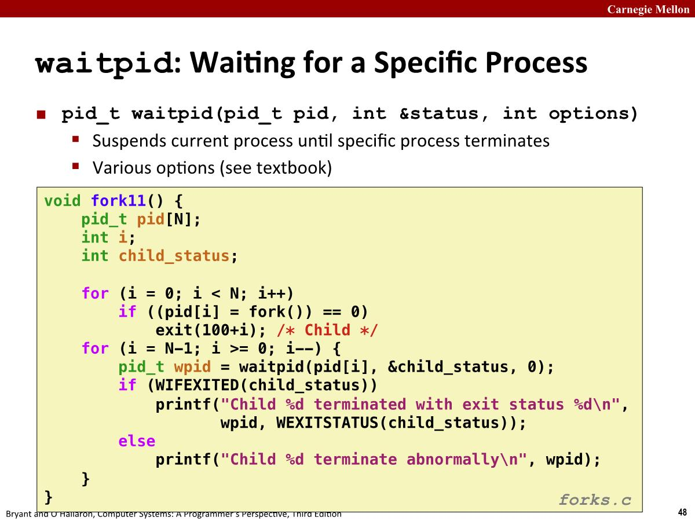

### execve:Loading and Running Programs

对于fork，只是创建了一堆和父进程类似的子进程，要在进程中运行不同的程序，得使用execve函数。它的第一行以#号开头，然后是某个解释器的路径。

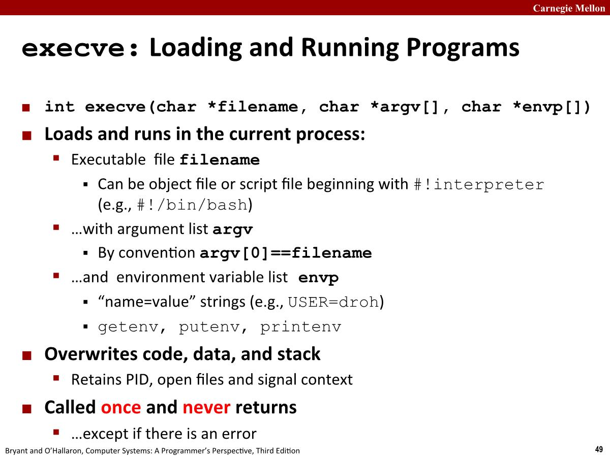

它会完全覆盖虚拟地址空间，一旦在一个进程中调用execve，它就代替了当前程序，保留了PID，打开的文件等。

#### Structure of the stack when a new program starts

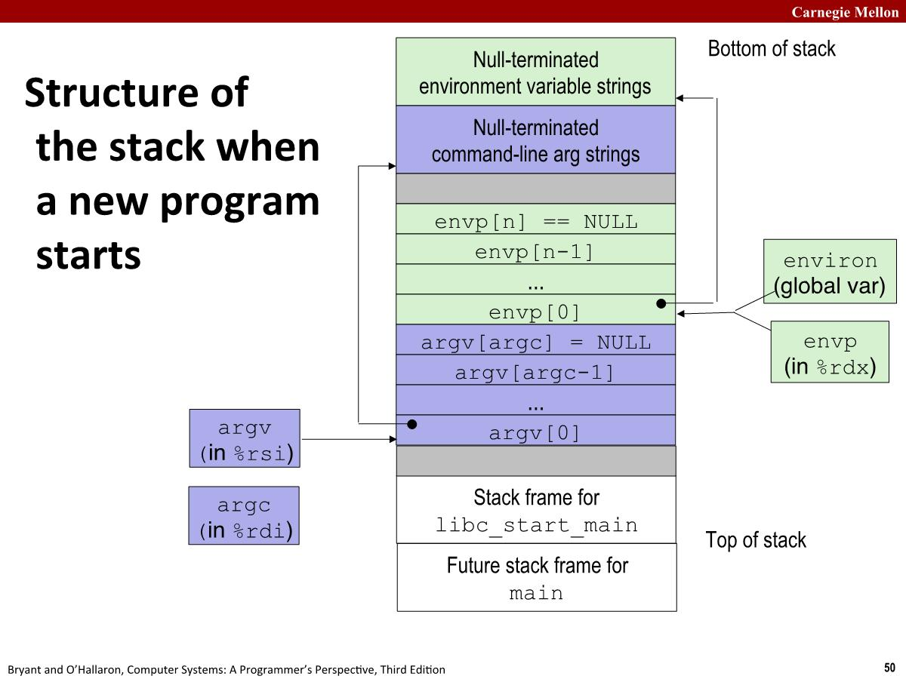

execve会创建一个新的stack，加载新的code和数据。

第一个执行的函数是一个名为libc_start_main的函数，它有一个栈帧(stack frame)。

main的第一个参数是参数数量，在寄存器%rdi中(x86-64)。

main的第二个参数argv是一个指针列表，在寄存器%rsi中，最后一个元素是空指针，这些指针中的每一个都指向一个对应于参数的字符串。

环境列表(envp)也包含在栈中，它也包含一个指针列表，每个指针指向一个环境字符串，该字符串是一组键值对。全局变量environ指向`envp[0]`。

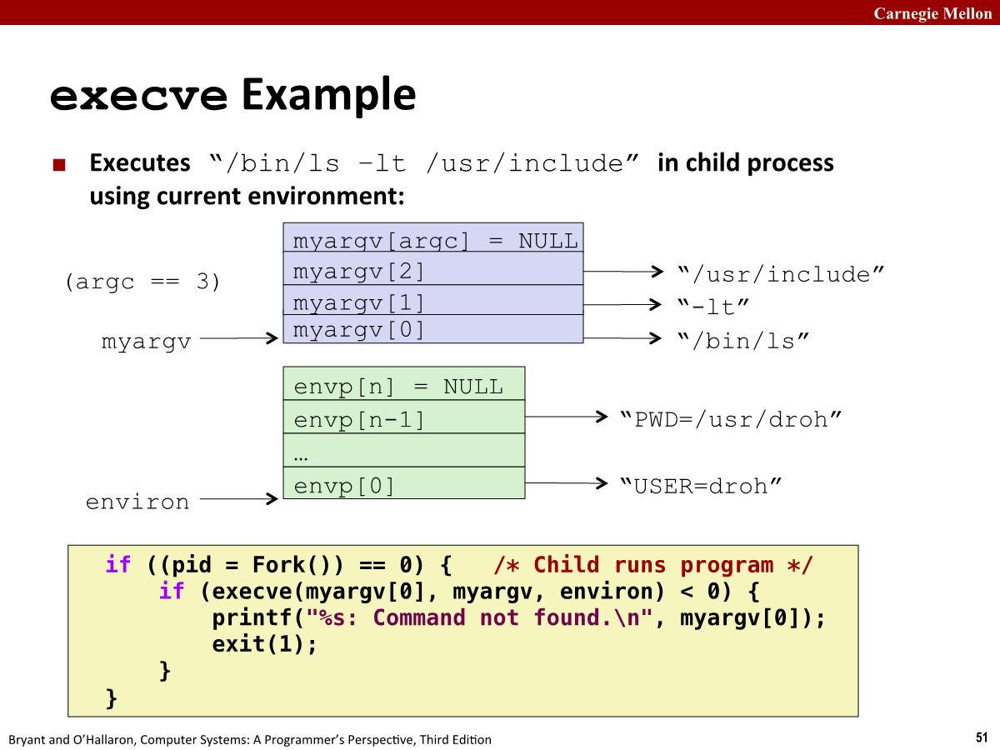

environ为父进程的环境变量。

为什么不只使用一个命令来创建一个新进程并在该进程中运行一个程序？为什么有这两个独立的 fork和execve？

事实上windows就是这样做的，windows有一个类似的命令来创建一个进程并执行。但事实证明，拥有像 fork 这样的单独函数来创建进程实际上非常有用。有时只想创建当前进程的副本，比如想创建一个并发服务器，想创建服务器的多个副本，只需要fork。并且还允许在调用execve之前在子进程中执行代码，处理信号之类的一些事情。