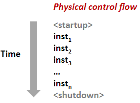
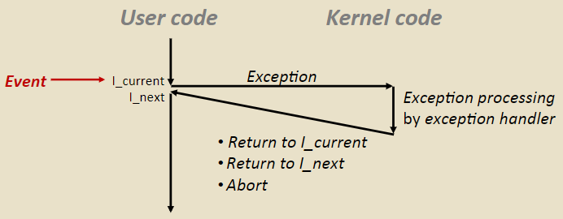
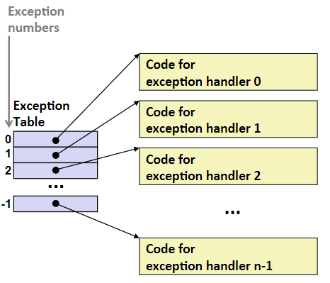
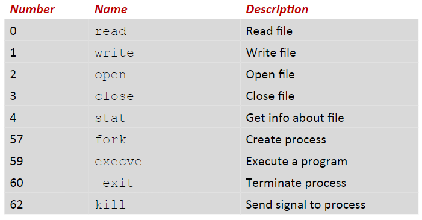
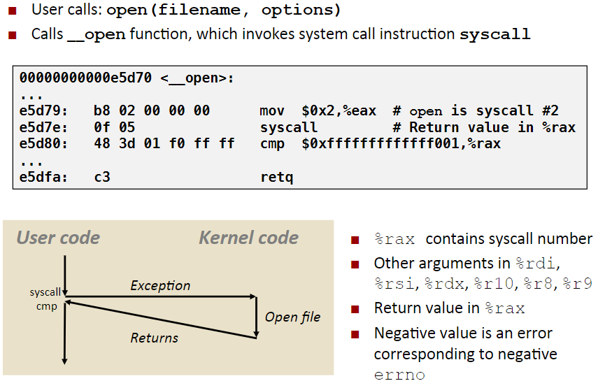
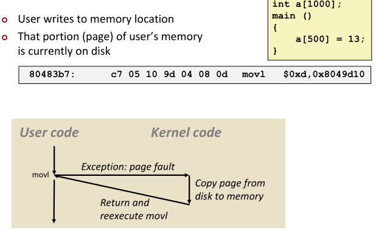
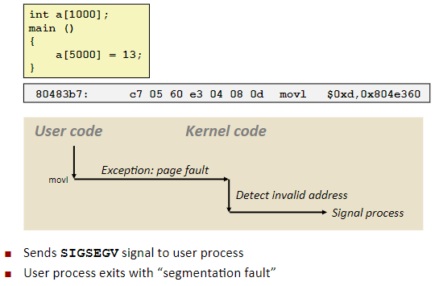

# ECF: Exceptions & Processes

## Control Flow

- cpu只做一件事情：从开始和结束，CPU只是读取和执行一系列指令，一次一条。如果有多个内核，每个内核都会一个接一个地执行指令。
- 指令序列称为控制流(control flow)，硬件正在执行的实际指令序列称为物理控制流（physical control flow)。

### Altering the Control Flow

对program state的改变做出的反应：

- Jumps and branches
- Procedure call and return

上述更多指的是用户代码一些判定分支流转，这些是不能适应system state的改变：

- Data arrives from a disk or a network adapter
- Instruction divides by zero
- User hits Ctrl-C at the keyboard
- System timer expires

为此系统需要一种机制：exceptional control flow

### Exceptional Control Flow

Exists at all levels of a computer system

- Low level mechanisms：Exceptions
  - 响应系统事件(system event)的控制流变化（即系统状态变化）
  - Implemented using combination of hardware and OS software

- Higher level mechanisms
  - 进程上下文切换(Process context switch)：Implemented by OS software and hardware timer
  - Signals：Implemented by OS software
  - 非局部跳转(Nonlocal jumps)：setjmp() and longjmp(),  Implemented by C runtime library。允许打破正常的调用和返回模式，从一个函数中，通常只能返回调用该函数的函数，Nonlocal jumps允许在函数内break并return到其他函数或者代码的某个部分

## Exceptions

- 为了响应某些事件而将控制权转移到操作系统的内核（内核常驻于操作系统内存中）。这些事件实际上是系统状态的变化：Divide by 0, arithmetic overflow, page fault, I/O request completes, typing Ctrl-C等
    >算术溢出(arithmetic overflow)计算产生出来的结果是非常大的，大于寄存器或存储器所能存储或表示的能力限制

- 异常处理之后可能会发生三件事件：返回并重新执行当前指令（对page fault之类的很有用）、执行下一条指令或者中止

### Exception Tables

- 每种类型的事件都有一个唯一的exception number k
- k = index into exception table。当事件k发生的时候，硬件使用k作为该表的索引进行查找，并获取对应的exception handler地址
- 每当事件k发生时候，都会调用handler k

### Asynchronous Exceptions (Interrupts)

由发生在处理器之外的状态变化引起，通过在处理器上设置一个中断引脚来通知处理器这些状态变化（例如，当磁盘控制器完成直接内存访问并将数据从磁盘复制到内存时，通过设置中断引脚为high来通知处理已经完成复制）

中断发生后，handler返回，接着执行用户程序next指令

Examples：

- Timer interrupt：每隔几ms，一个外部定时器芯片(external timer chip)就会设置引脚触发一个中断。timer interrupt有个特殊的exception number，内核使用它来从用户程序中夺取控制权，否则用户程序可能会在无限循环中永远运行，以至于操作系统无法获得控制权。内核拿到控制权后可能会安排一个新进程或者让当前进行运行，这取决了内核。

- I/O interrupt from external device：Hitting Ctrl-C at the keyboard、Arrival of a packet from a network、Arrival of data from a disk

### Synchronous Exceptions

由执行指令后发生的事件引起的

- Traps：由程序故意引起的exception，例如system calls（允许用户程序调用内核的函数，将控制权转移给内核）。中断返回后执行用户程序的next指令。
- Faults：无意引起但是可能可以恢复的。例如page faults（程序引用的地址空间部分的数据实际上不存在，需要从磁盘中将对应的page复制到内存，然后重新执行指令，recoverable）。中断后要么重新执行当前指令要么中止。
- Aborts：无意且不可恢复的，例如非法指令、硬件错误等，中断后不会返回到程序中。

#### System Calls

Each x86-64 system call has a unique ID number

#### System Call Example:opening file

- 实际执行系统调用的是syscall指令（不能直接调用这些指令，Linux 将这些指令包装在系统级函数中，通过调用这些函数来实际调用它）。例如打开文件调用系统级函数open()
- cmp用来判断函数返回有没有异常，负数异常，正数意味着正常。
- open会返回一个文件描述符(file descriptor，整数)，在后续调用中使用它来读取和写入。

#### Fault Example: Page Fault

`a[500]`这个地址的内存不可用（即movl第二个参数地址），触发page fault，exception handler会将该page从磁盘复制到内存，返回时会重试执行movl指令。

#### Fault Example: Invalid Memory Reference

内核检测到是一个无效的地址，没有任何东西可以从磁盘加载，向进程发送一个signal，然后永远也不会返回。
