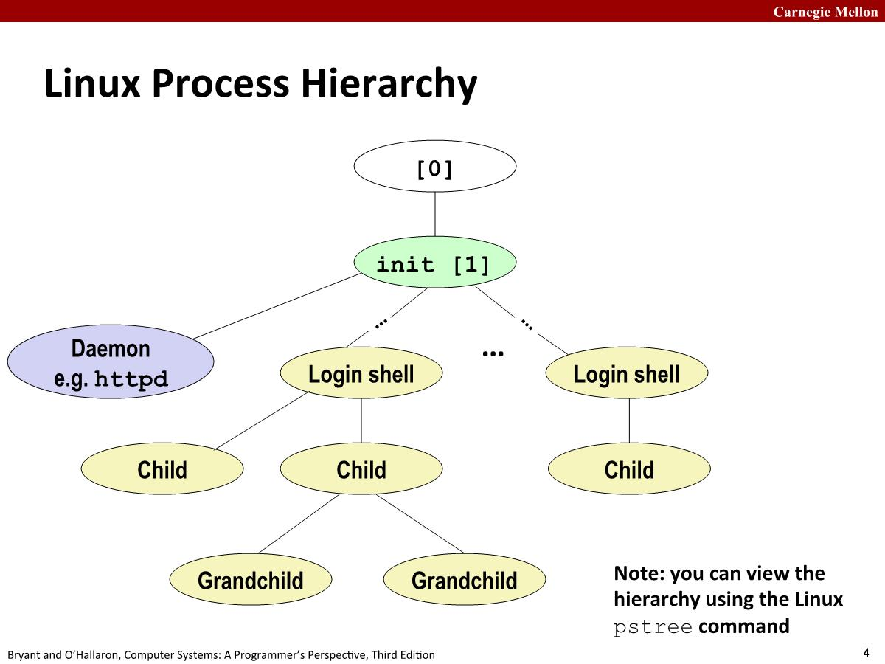
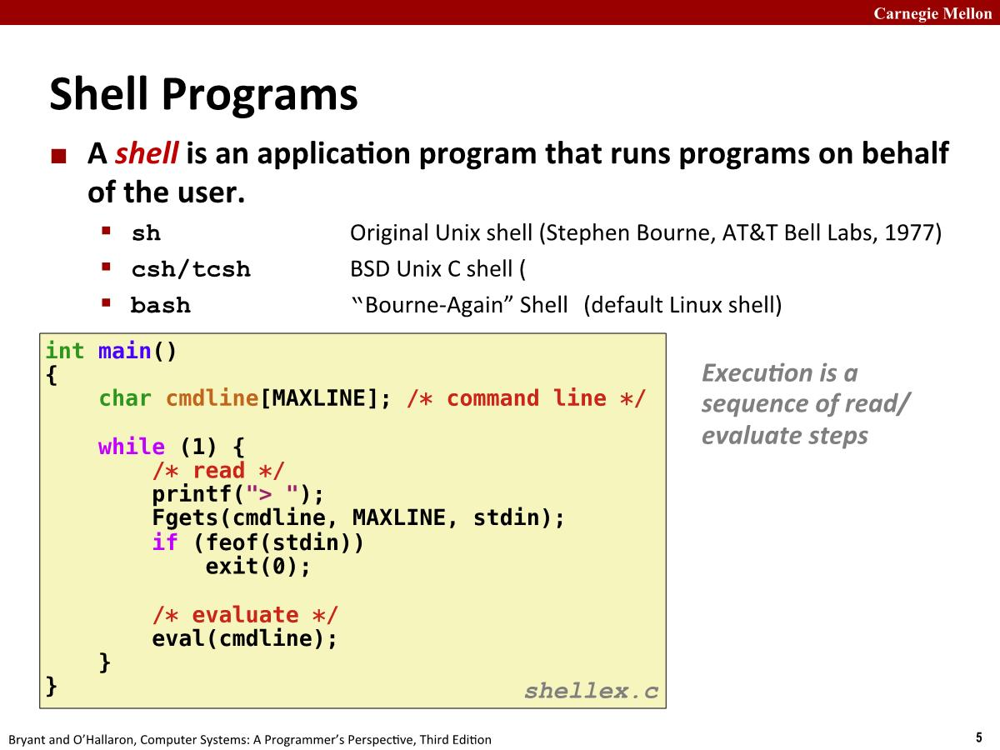
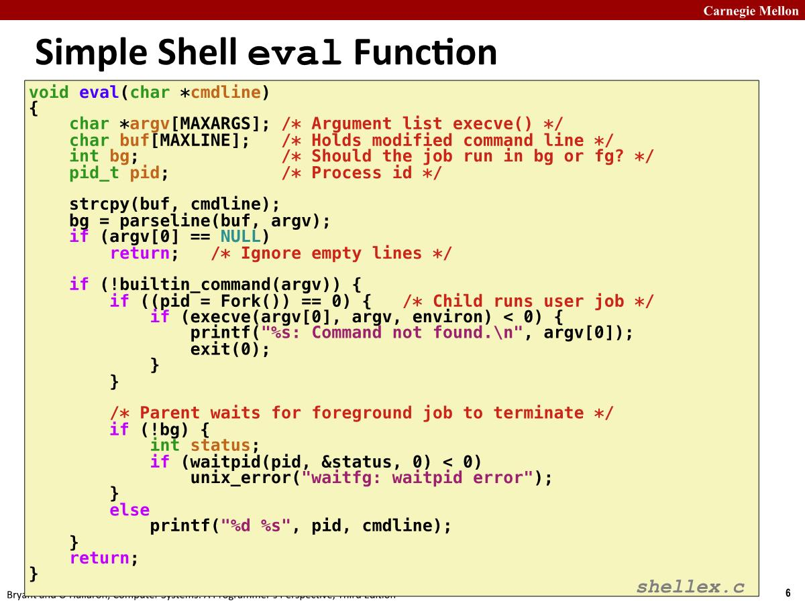
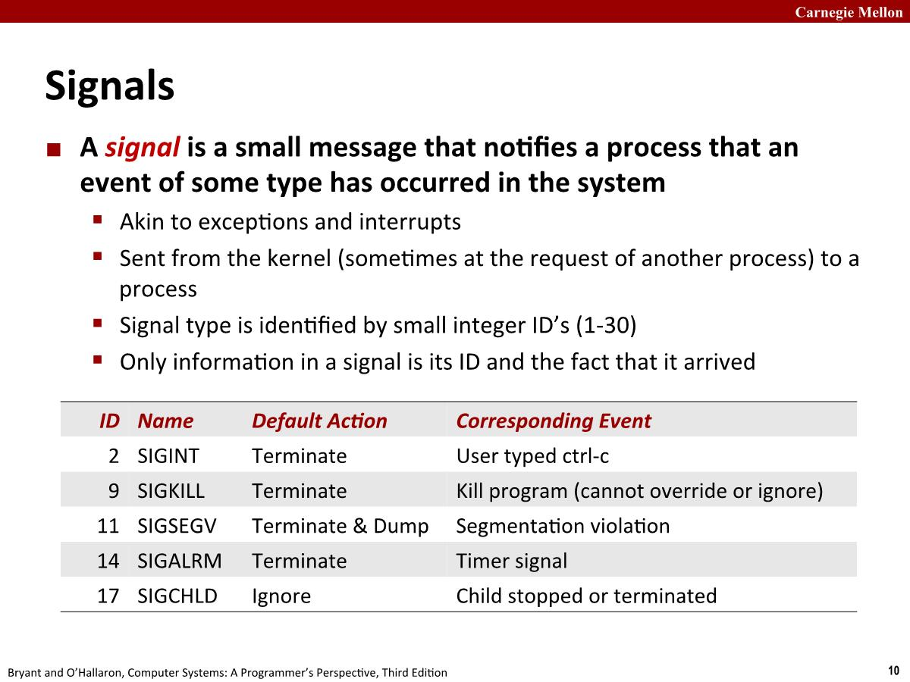

# 15-ECF:Signals

## Shells

在Linux上创建进程一种方法，使用fork调用。系统上的所有进程形成了一个层次结构，启动系统时创建的第一个进程是PID为1的init进程，系统上的所有其他进程都是init进程的后代。

init 进程在启动时会创建守护进程(daemon)，这些守护进程通常是提供服务的长期运行程序。并且会创建login shell为用户提供命令行界面。shell会在子进程中执行命令，并且该子进程可能也会创建其他子进程。

### Shell Programs

在shell中，执行(execution)包含了一系列读取和解析命令行的步骤。

### Simple Shell eval Function

parseline用于解析命令行，命令解析到argv数组。

bg代表命令是否以`&`结束，如果有，那么该命令将会后台运行(background job)，这意味着shell不会等待该任务完成，即在它完成之前，它会进行下一个读取步骤。如果没有，需要shell前台运行命令(foreground job)，意味着shell需要等待命令执行完成。

shell实现了内置命令(built-in command)，比如jobs(显示当前系统任务列表)、bg、fg(前台运行)，都是shell自身实现。

如果不是内置命令，shell会fork出一个子进程，该子进程会通过调用execve来执行这个程序。execve没有错误情况下不会return，出现了错误会exit，所以子进程不会继续往下执行。

前台job和后台job之间的唯一区别就是shell是否对该job执行waitpid。

#### Problem with Simple Shell Example

可以看到对于前台job有waitpid reap子进程没有问题，但是后台job会造成以下影响：

1. shell终止后子进程会变成僵尸进程，永远不会被reaped。
2. 造成内存泄漏导致内核耗尽内存。

Exceptional control flow可以解决这个问题：内核将在其任何子进程终止时通知shell，然后shell可以对此做出反应并调用waitpid。在Unix中这种机制称为信号(signal)。

## Signals

A signal is a small message that notifies a process that an event of some type has occurred in the system.

- 类似于exceptions和interrupts
- 信号总是从内核发送的，有时另一个进程会要求内核向其他进程发送消息。
- 信号中包含的唯一信息是唯一的整数id

- SIGINT和SIGKILL都是终止进程，但是后者是无法忽略或者被覆盖。

- SIGSEGV是最常见的分段错误，即分段违规(Segmentation violation)，如果访问受保护或不合法的内存区域，内核将向你的进程发送一个SIGSEGV信号。

- SIGALRM用于将信号发送给程序自己，可以用作timer功能。

- SIGCHLD：每当进程它的一个子进程停止或者终止时候，内核会给父进程一个该信号。

