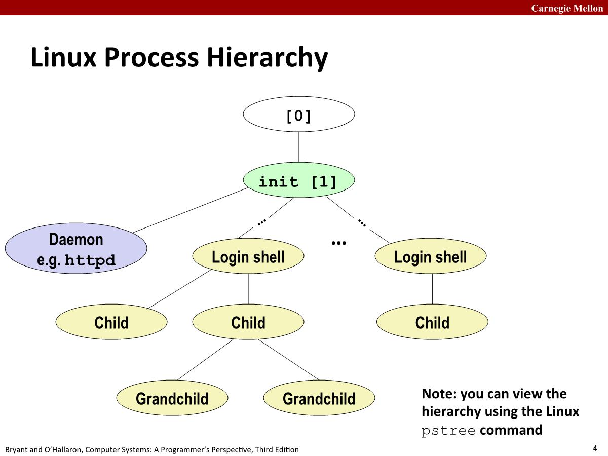
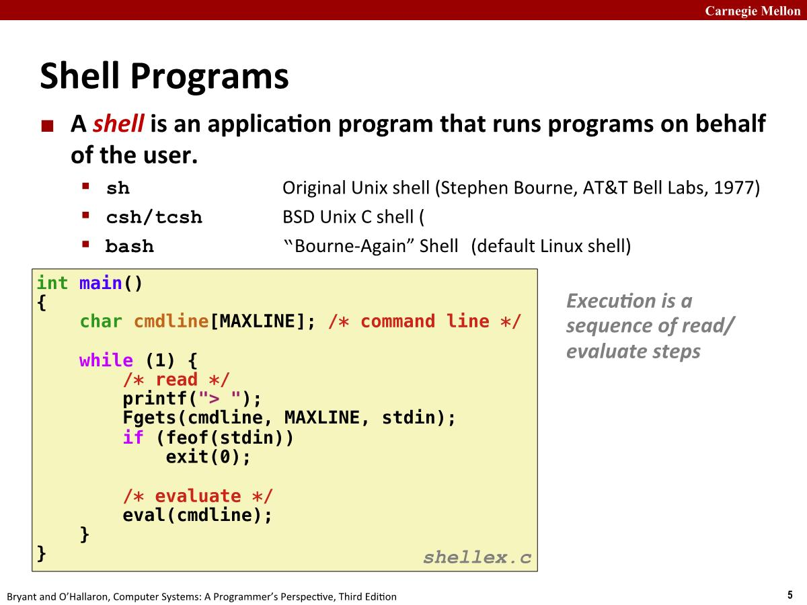

# 15-ECF:Signals

## Shells

在Linux上创建进程一种方法，使用fork调用。系统上的所有进程形成了一个层次结构，启动系统时创建的第一个进程是PID为1的init进程，系统上的所有其他进程都是init进程的后代。

init 进程在启动时会创建守护进程(daemon)，这些守护进程通常是提供服务的长期运行程序。并且会创建login shell为用户提供命令行界面。shell会在子进程中执行命令，并且该子进程可能也会创建其他子进程。

### Shell Programs

在shell中，执行(execution)包含了一系列读取和解析命令行的步骤。

