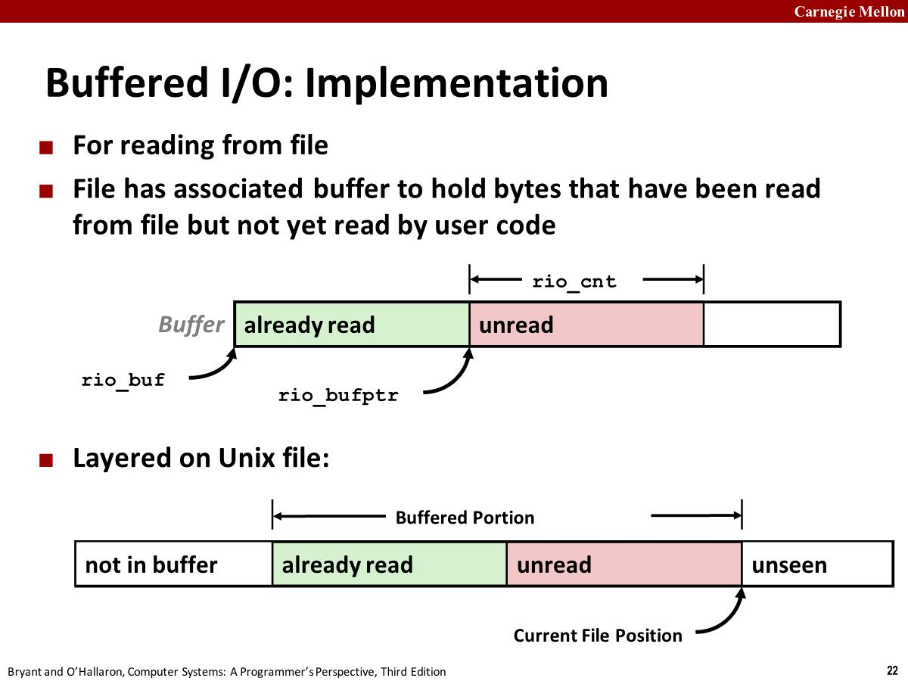

# 16-System-Level-IO

## Unix I/O

### Unix I/O Overview

- A Linux file is a sequence of m bytes: `B0 , B1 , .... , Bk , .... , Bm-1`
- All I/O devices are represented as files
  - `/dev/sda2 (/usr disk partition)`
  - `/dev/tty2 (terminal)`
- Even the kernel is represented as a file
  - `/boot/vmlinuz-3.13.0-55-generic (kernel image)`
  - `/proc (kernel data structures)`
- 文件与设备(devices)的优雅映射允许内核向外暴露简单的接口，称为`Unix I/O`
  - Opening and closing files：`open()`、`close()`
  - Reading and writing a file: `read()`、`write()`
  - Changing the current file position (seek)
  

### File Types

Each file has a type indicating its role in the system

- **Regular file**: Contains arbitrary data
- **Directory**:  Index for a related group of files(一组相关文件的索引)
- **Socket**: 用于与另一台机器上的进程通信
- Pipes: 用于进程之间通信，即是第一个程序的输出，又是第二个程序的输入，将某些内容写入pipe，从pipe中取出某些内容。
- Symbolic links: 符号链接
- Character and block devices: 其他特殊设备

### Regular Files

- 应用程序通常区分文本文件(text file)和二进制文件(binary file)
  - Text files are regular files with only ASCII or Unicode characters
  - Binary files are everything else: object files, JPEG images...
  - Kernel doesn’t know the difference!
- 文本文件是一系列文本行(text lines)，文本行是以换行符(newline char)结尾的字符序列
- End of line (EOL) indicators in other systems
  - Linux and Mac OS: `\n` (0xa)
    - 换行符LF(line feed)
  - Windows and Internet protocols: `\r\n` (0xd 0xa)
    - 回车符CR(Carriage return)+换行符LF

### Directories

- Directory consists of an array of links:  Each link maps a filename to a file
- Each directory contains at least two entries
  - `.` (dot) is  a link to itself
  - `..` (dot dot) is a link to the parent directory in the directory hierarchy


### Opening Files

`open()`：打开一个文件，通知内核正准备访问该文件。

```c
int fd;   /* file descriptor */
if ((fd = open("/etc/hosts", O_RDONLY)) < 0) {
    perror("open");
    exit(1);
}
```

- Returns a small identifying integer **file descriptor**.
  - fd == -1 indicates that an error occurred.
  - 文件描述符(fd)是按程序打开文件的顺序进行编号的，其实是索引值，指向内核为每一个进程维护的打开文件记录表。
  - 在大多数机器上允许同时打开的文件量是有限的，在linux上使用`ulimit -n`查看限制数量。
- 每个运行的进程都有三个特定的文件描述符
  - 0: standard input (stdin)
  - 1: standard output (stdout)
  - 2: standard error (stderr)

### Closing Files

```c
int fd;     /* file descriptor */
int retval; /* return value */

if ((retval = close(fd)) < 0) {
    perror("close");
    exit(1);
}
```

- 关闭已经关闭的文件会导致错误

### Reading Files

Reading a file copies bytes from the current file position to memory, and then updates file position

```c
char buf[512];
int fd;       /* file descriptor */
int nbytes;   /* number of bytes read */

/* Open file fd ...  */
/* Then read up to 512 bytes from file fd */
if ((nbytes = read(fd, buf, sizeof(buf))) < 0) {
    perror("read");
    exit(1);
}
```

- Returns number of bytes read from file fd into buf
  - Return type ssize_t is signed integer(*有符号整数*)
  - nbytes < 0 indicates that an error occurred
  - nbytes == 0 代表EOF
  - Short counts (`nbytes < sizeof(buf)`) are possible and are not errors!

### Writing Files

Writing a file copies bytes from memory to the current file position, and then updates current file position

```c
char buf[512];
int fd;       /* file descriptor */
int nbytes;   /* number of bytes read */

/* Open the file fd ... */
/* Then write up to 512 bytes from buf to file fd */
if ((nbytes = write(fd, buf, sizeof(buf)) < 0) {
    perror("write");
    exit(1);
}
```

- Returns number of bytes written from buf to file fd
  - nbytes < 0 indicates that an error occurred
  - As with reads, short counts are possible and are not errors!

### Simple Unix I/O example

Copying stdin to stdout, one byte at a time

```c
#include "csapp.h"
int main(void)
{
    char c;
    while(Read(STDIN_FILENO, &c, 1) != 0)
        Write(STDOUT_FILENO, &c, 1);
    exit(0);
}
```

只是一个demo，缺点是太慢了，每次只有处理一个字节，频繁系统调用开销很大。

使用`strace`可以展示系统调用的情况。

### On Short Counts

- 可能发生的场景：
  - 读文件遇到EOF
  - Reading text lines from a terminal
  - Reading and writing network sockets
- 不会发生在下面的场景：
  - Reading from disk files(EOF除外)
  - Writing to disk files
- 编写代码的时候需要始终考虑short counts的情况

## RIO (robust I/O) package

RIO is a set of wrappers that provide efficient and robust I/O in apps

RIO provides two different kinds of functions

- Unbuffered input and output of binary data: `rio_readn` and `rio_writen`
  - 调用readn/writen并指定字节数，那么在读取到这么多字节数之前，函数不会返回，比如是网络连接，会挂起并等待。
- Buffered input of text lines and binary data: `rio_readlineb` and `rio_readnb`
  - Buffered RIO routines are thread-safe.

### Unbuffered RIO Input and Output

- Same interface as Unix read and write
- Especially useful for transferring data on network sockets

```c
#include "csapp.h"
ssize_t rio_readn(int fd, void *usrbuf, size_t n);
ssize_t rio_writen(int fd, void *usrbuf, size_t n);
```

- Return: num. bytes transferred if OK, 0 on EOF (rio_readn only), -1 on error
- `rio_readn` returns short count only if it encounters EOF
  - Only use it when you know how many bytes to read
- rio_writen never returns a short count

```c
/*
* rio_readn - Robustly read n bytes (unbuffered)
*/
ssize_t rio_readn(int fd, void *usrbuf, size_t n) 
{
    size_t nleft = n;
    ssize_t nread;
    char *bufp = usrbuf;

    while (nleft > 0) {
        if ((nread = read(fd, bufp, nleft)) < 0) {
            if (errno == EINTR) /* Interrupted by sig handler return */
                nread = 0;      /* and call read() again */
            else
                return -1;      /* errno set by read() */ 
        } 
        else if (nread == 0)
            break;              /* EOF */
        nleft -= nread;
        bufp += nread;
    }
    return (n - nleft);    /* Return >= 0 */
}
```

### Buffered RIO Input Functions

File has associated buffer to hold bytes that have been read from file but not yet read by user code



```c
typedef struct {
    int rio_fd;                /* descriptor for this internal buf */
    int rio_cnt;               /* unread bytes in internal buf */
    char *rio_bufptr;          /* next unread byte in internal buf */
    char rio_buf[RIO_BUFSIZE]; /* internal buffer */
} rio_t;
```

### RIO Example

Copying the lines of a text file from standard input to standard output

```c
#include "csapp.h"

int main(int argc, char **argv) 
{
    int n;
    rio_t rio;
    char buf[MAXLINE];

    Rio_readinitb(&rio, STDIN_FILENO);
    while((n = Rio_readlineb(&rio, buf, MAXLINE)) != 0) 
        Rio_writen(STDOUT_FILENO, buf, n);
    exit(0);
}
```

## Metadata,sharing,redirection

### File Metadata

Metadata is data about data, in this case file data.

Per-file metadata maintained by kernel.

Accessed by users with the `stat` and `fstat` functions.

```c
/* Metadata returned by the stat and fstat functions */
struct stat {
    dev_t st_dev;      /* Device */
    ino_t st_ino;      /* inode */
    mode_t st_mode;     /* Protection and file type */
    nlink_t st_nlink;    /* Number of hard links */
    uid_t st_uid;      /* User ID of owner */
    gid_t st_gid;      /* Group ID of owner */
    dev_t st_rdev;     /* Device type (if inode device) */
    off_t st_size;     /* Total size, in bytes */
    unsigned long st_blksize;  /* Blocksize for filesystem I/O */
    unsigned long st_blocks;   /* Number of blocks allocated */
    time_t st_atime;    /* Time of last access */
    time_t st_mtime;    /* Time of last modification */
    time_t st_ctime;    /* Time of last change */
};
```

Example of Accessing File Metadata

```c
int main(int argc, char **argv) {
    struct stat stat;
    char *type, *readok;
    Stat(argv[1], &stat);
    if (S_ISREG(stat.st_mode))     /* Determine file type */
        type = "regular";
    else if (S_ISDIR(stat.st_mode))
        type = "directory";
    else
        type = "other";
    if ((stat.st_mode & S_IRUSR)) /* Check read access */
        readok = "yes";
    else
        readok = "no";
    printf("type: %s, read: %s\n", type, readok);
    exit(0);
}
```

### How the Unix Kernel Represents Open Files

任何进程都有一个相关联的描述符表(Descriptor table)每一个

