# 17-Virtual-Memory-Concepts

## Address spaces

- **Linear address space**: 连续非负整数地址的有序集 `{0, 1, 2, 3 … }`
- **Virtual address space**: Set of N = 2^n virtual addresses `{0, 1, 2, 3, …, N-1}`
- **Physical address space**: Set of M = 2m physical addresses `{0, 1, 2, 3, …, M-1}`

（N通常大于M）

Why Virtual Memory (VM)?

- Uses main memory efficiently: 参考局部性缓存一部分虚拟地址空间内容到DRAM以提高效率。
- Simplifies memory management: 每个进程都有相似的虚拟地址空间
- Isolates address spaces
  - One process can’t interfere with another’s memory
  - User program cannot access privileged kernel information and code

## VM as a Tool for Caching

**virtual memory** is an array of N contiguous(*连续的*) bytes stored on **disk**.

The contents of the array on disk are cached in **physical memory (DRAM cache)**

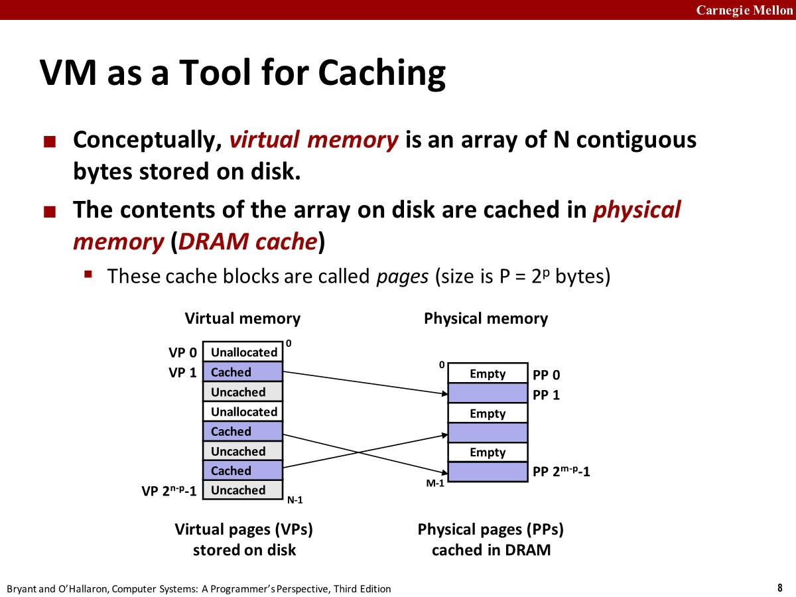

在DRAM的某处缓存了三个virtual page，一些page没有被缓存依旧存储在磁盘上(比如vp2)，有些page甚至没有分配，所以在磁盘上不存在。

### DRAM Cache Organization

- 若未命中DRAM cache，从磁盘中获取数据的代价是非常大的。

  - DRAM is about **10x** slower than SRAM.
  - Disk is about **10,000x** slower than DRAM.

造成的影响：

- Large page (block) size: typically 4 KB, sometimes 4 MB
- Fully associative
  - Any VP can be placed in any PP.
  - Requires a “large” mapping function – different from cache memories.
- 更复杂的替换算法（替换page），无法在硬件中实现，而替换算法相对简单的cache memory则利用了硬件并行查找。替换失误造成未命中的成本远远大于复杂算法执行的成本。
- Write-back rather than write-through

### Page table

A page table(页表) is an array of page table entries (PTEs) that maps virtual pages to physical pages.

内核会将它作为每一个进程上下文的一部分进行维护，所以每个进程都有自己的页表。

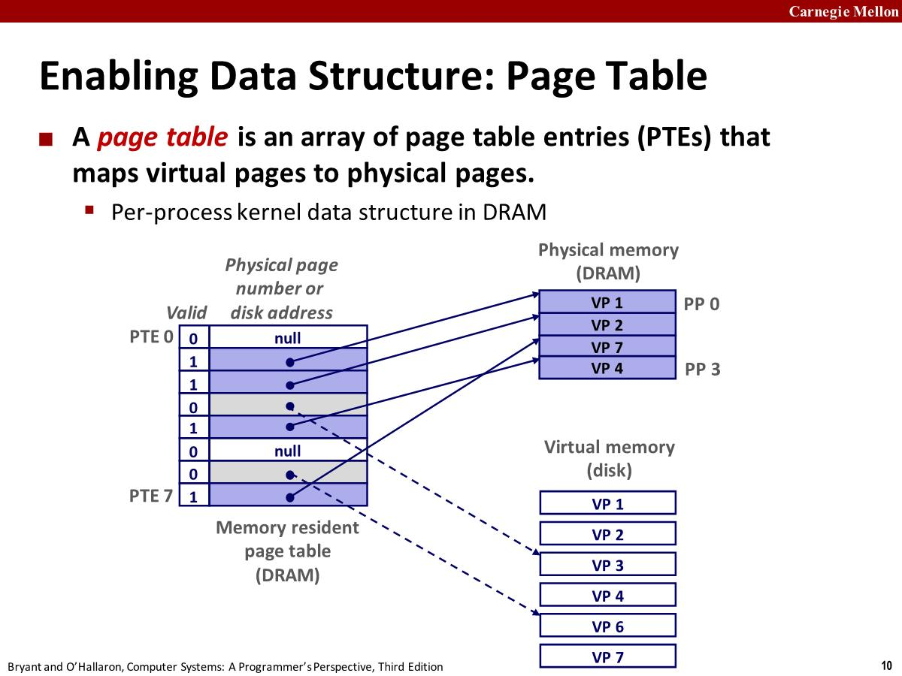

### Page hit

CPU执行move指令、call指令、ret指令、或者任何类型的控制转移指令，会生成一个虚拟地址。MMU(Memory Management Unit)会在页表中查找。

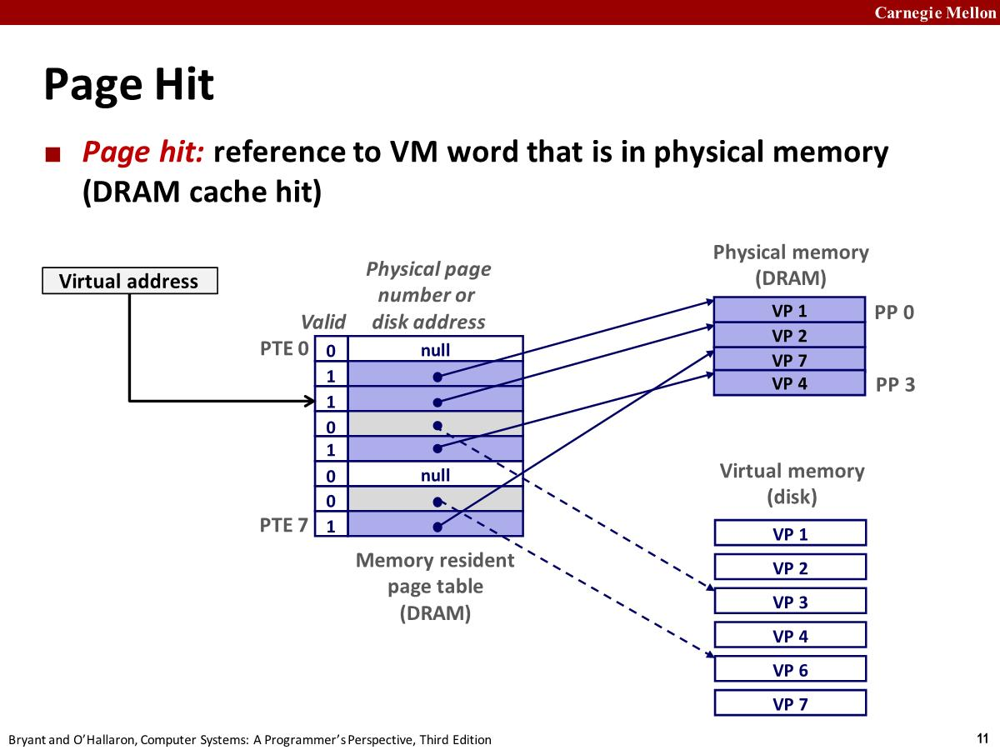

### Handling Page Fault

- **Page fault**: reference to VM word that is not in physical memory (DRAM cache miss)

1. Page miss causes page fault (an exception)。硬件触发异常。
2. 导致控制权转移到内核中的page fault handler的代码块
3. 从Physical memory选择出一个page需要被替换，比如pp4
4. 从磁盘上获取vp3加载到内存中，并更新Physical memory和页表。如果vp4被修改过，还需要将数据写回到磁盘。
5. 当内核中的Page fault handler返回时，它返回到导致错误的指令位置，然后重新执行该指令，page hit。

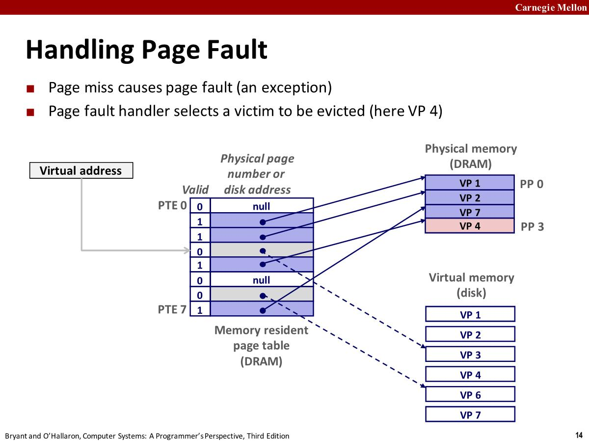

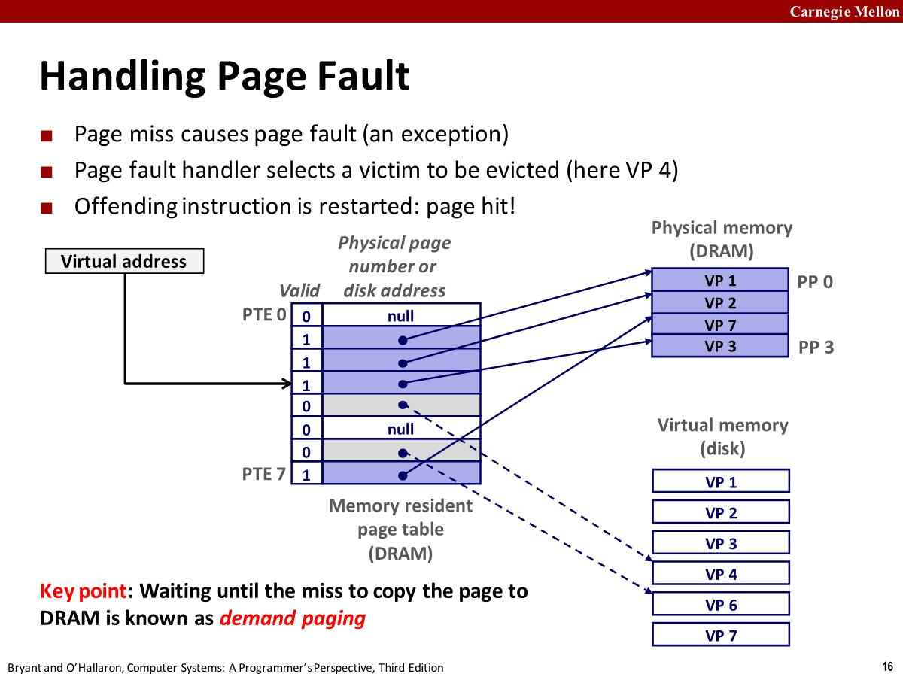

### Allocating Pages

page table中的PTE5还没有分配，如果需要分配则要调用malloc函数：先在磁盘上分配这个page(vp5)，PT5指向vp5。并不会一开始就存放在DRMA缓存中，直到被使用到为止。所谓的分配只是修改PTE而已。

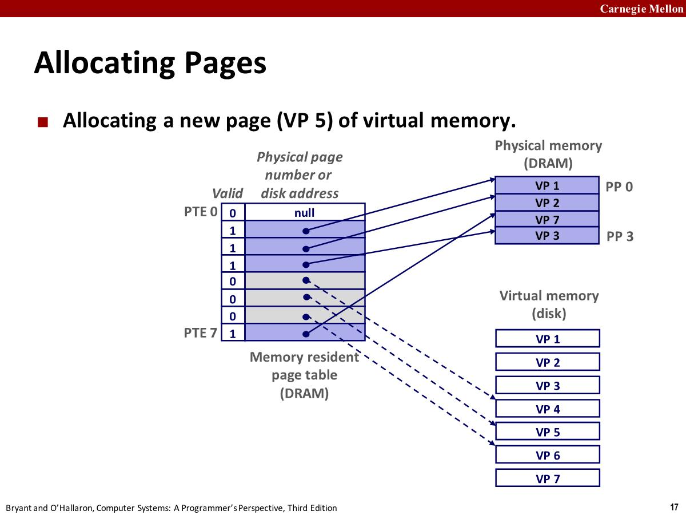

分配新page的时候大多是都会有一个选项，可以分配全为0的page，这样的page不需要存储在磁盘上，它会在内存中，就好像它是在磁盘上创建然后加载到内存中一样，磁盘上不存在这些全为零的pages。page可以映射到文件，code对应的page实际上映射到二进制文件中包含code的部分，当未命中page时候，会将这些code pages加载进来。

### Locality to the Rescue Again

虚拟内存因为要复制数据、分配内存、修改页表看起来看低效，但是因为局部性原理并不是这样的。

在任何时间点，程序因为局部性去访问一组page(set of active virtual pages called the working set)，具有更好的时间局部性程序的working set会更小。

- If (working set size < main memory size): 当前所有的page都在主存
- If (SUM(working set sizes) > main memory size)。当所有进程的working set之和大于主存大小，就会导致Thrashing：页面不断的在内存和磁盘之间来回复制。

## VM as a Tool for Memory Management

- Key idea: each process has its own virtual address space。
  - It can view memory as a simple linear array.
  - 内核通过为每个进程的上下文中提供属于自己的单独页表来实现。
- Simplifying memory allocation
  - Each virtual page can be mapped to any physical page
  - 每个进程的页表映射了该进程的虚拟地址空间，虚拟地址空间中的page可以映射到物理地址空间(DRAM)中的任何位置。不同的虚拟页(vp)和不同的进程可以映射到不同的物理页(pp)。
  - 相同的虚拟页也可以在不同的时间存储在不同的物理页中。
  - 每个进程都有一个非常相似的虚拟地址空间，相同大小的地址空间、code和data都从相同的位置开始，但是随后进程使用的page可以分散在内存中，以最有效的方式使用内存。
  - 没有虚拟内存以前，是按物理内存分区的形式为进程分配内存，增加进程及其麻烦，无法知道物理空间位于内存中的哪个地方，需要重新定位等。
- Sharing code and data among processes
  - Map virtual pages to the same physical page (here: PP 6)
  - 这就是共享库的实现方式，比如共享lib.c，只需要在物理内存中加载一次即可。

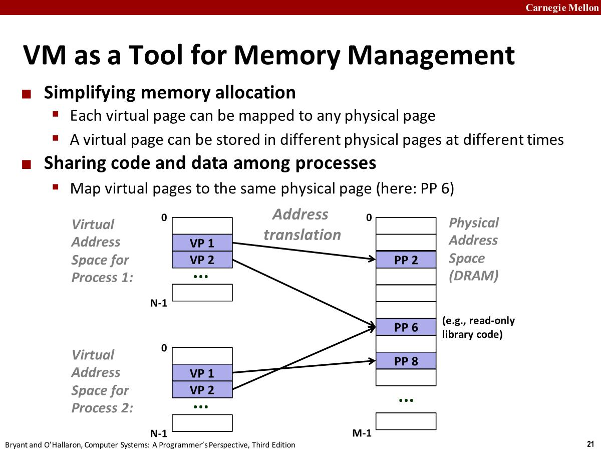

### Simplifying Linking and Loading

程序代码和数据一开始没有被加载到内存，只有出现未命中才会进行真正的加载，demand paging。

loading其实是一个非常有效率的机制，可能有一个包含大型数组的程序，但是只访问数组的一部分，可以延迟加载。

## VM as a Tool for Memory Protection

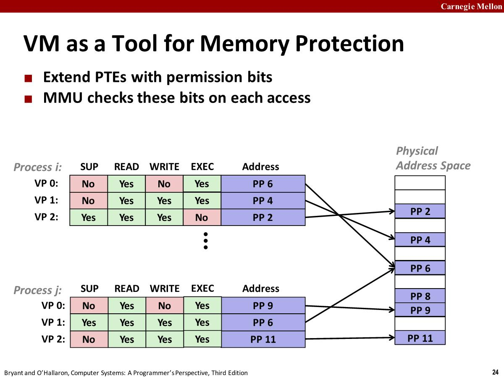

sup：supervisor，是否必须由内核访问

在x86-64系统上，指针和地址都是64位的，但是虚拟地址空间则是48位的，超过48位的bit要么全是0要么全是1，这是intel制定的规则，高位全为1的地址为内核保留（地址指向内核中的代码或者数据），高位全为0的地址为用户代码保留。

## VM Address Translation

### Address Translation With a Page Table

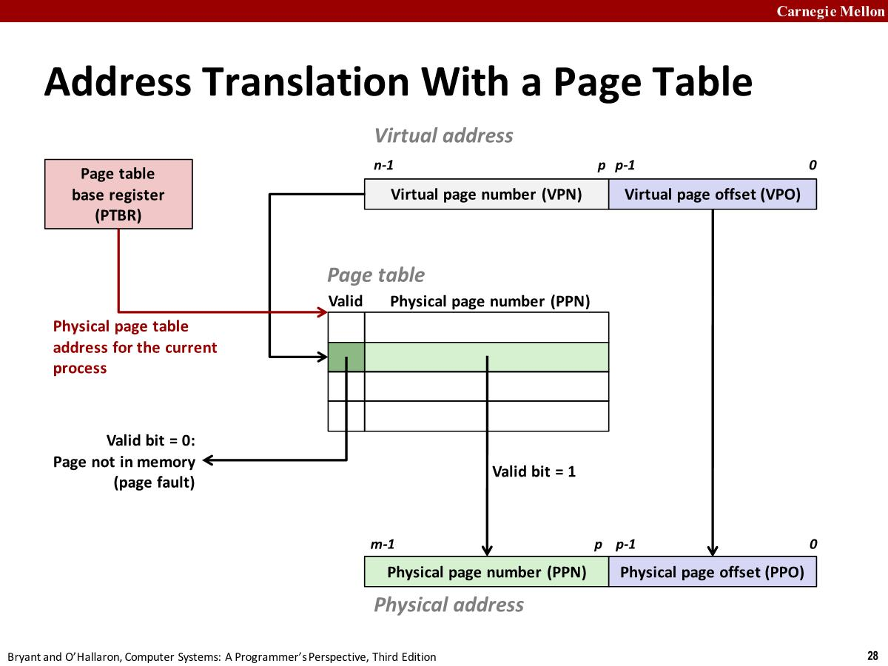

在intel系统中，页表的起始地址(物理地址)保存在一个特殊的CPU寄存器页表基址寄存器(Page Table Base Register，PTBR)中，它被称为CR3(control register 3：控制寄存器3)

虚拟块中的offset与物理块中的offset相同

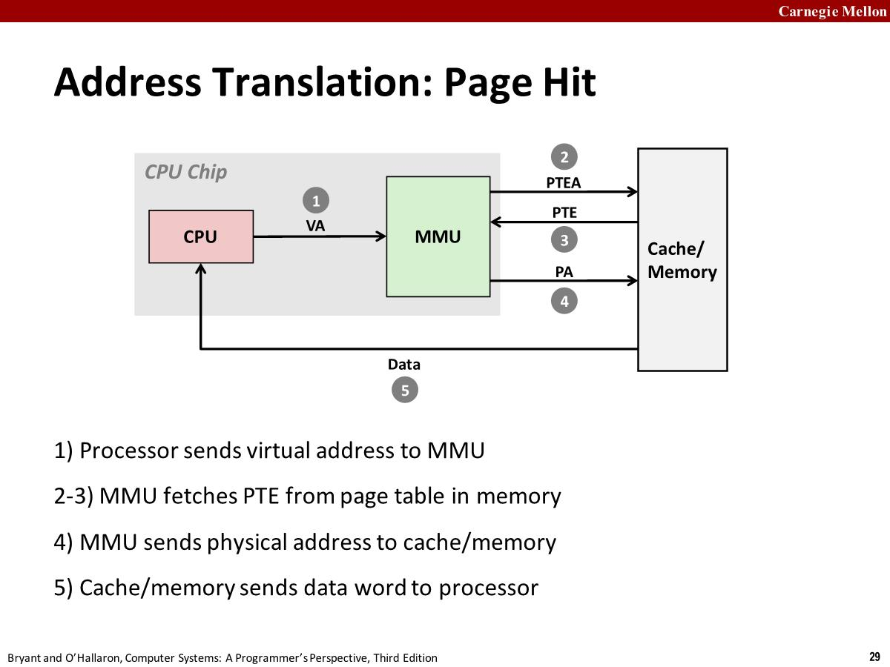

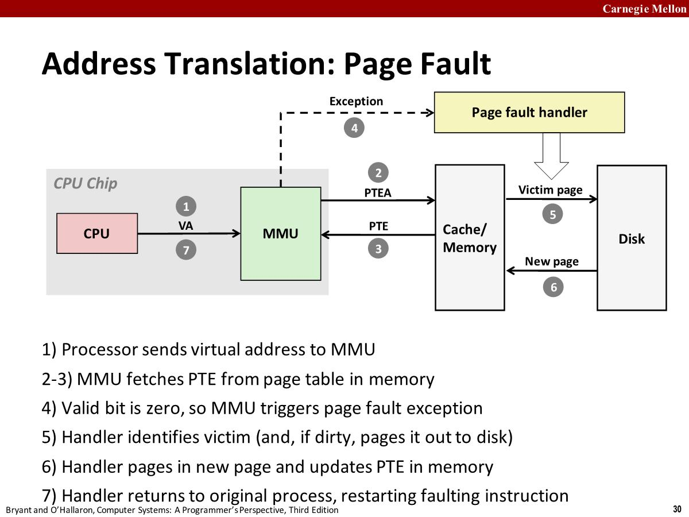

### Speeding up Translation with a TLB

- Page table entries (PTEs) are cached in L1 like any other memory word
  - PTEs may be evicted(*驱逐*) by other data references
  - PTE hit still requires a small L1 delay

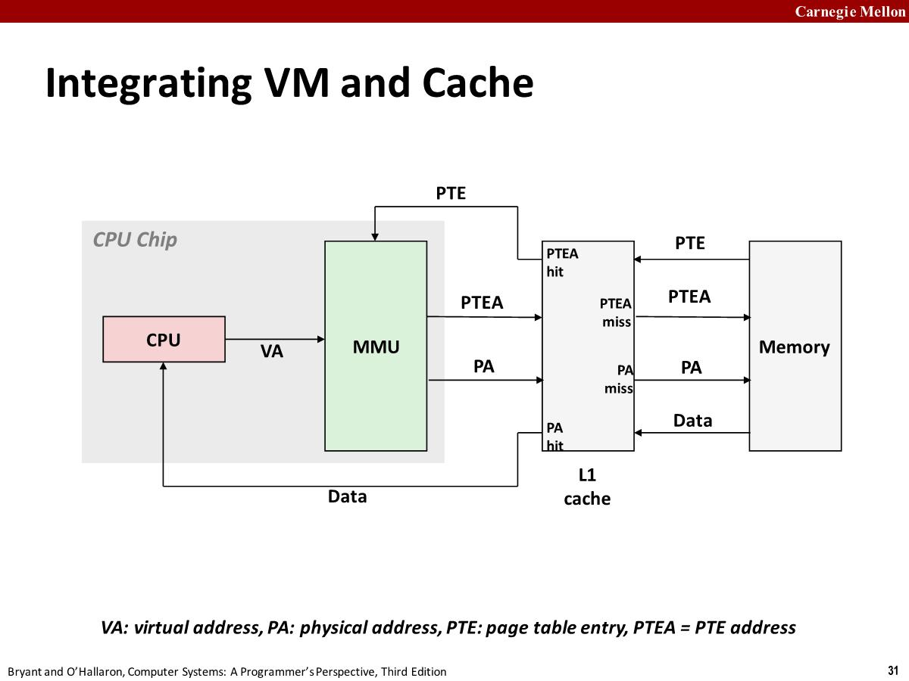

- Solution: **Translation Lookaside Buffer** (TLB)
  - Small set-associative hardware cache in MMU
  - Maps virtual page numbers to  physical page numbers
  - Contains complete page table entries for small number of pages

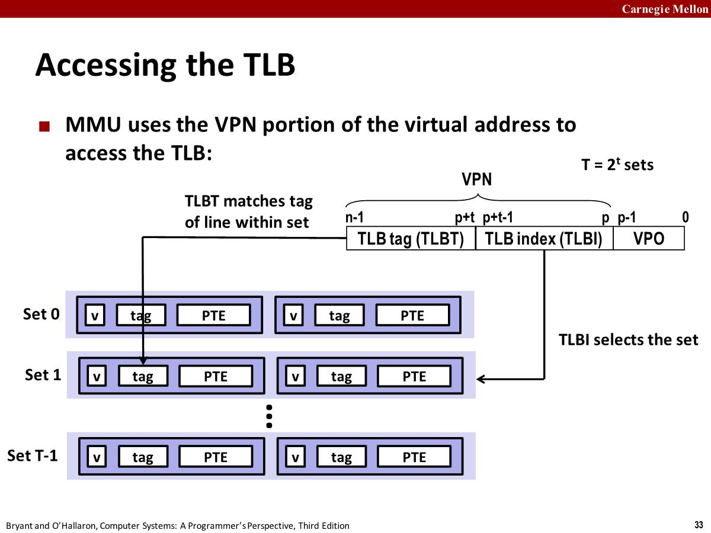

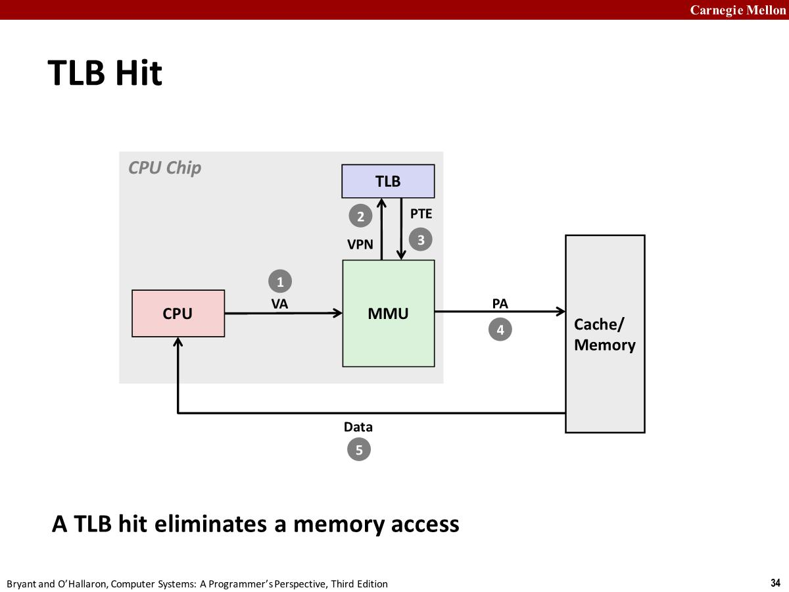

PTE中valid为0或者指向的是磁盘地址

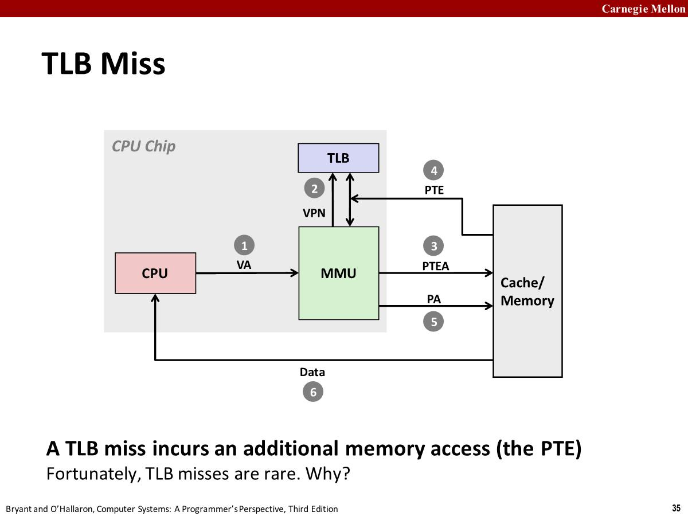

### Multi-Level Page Tables

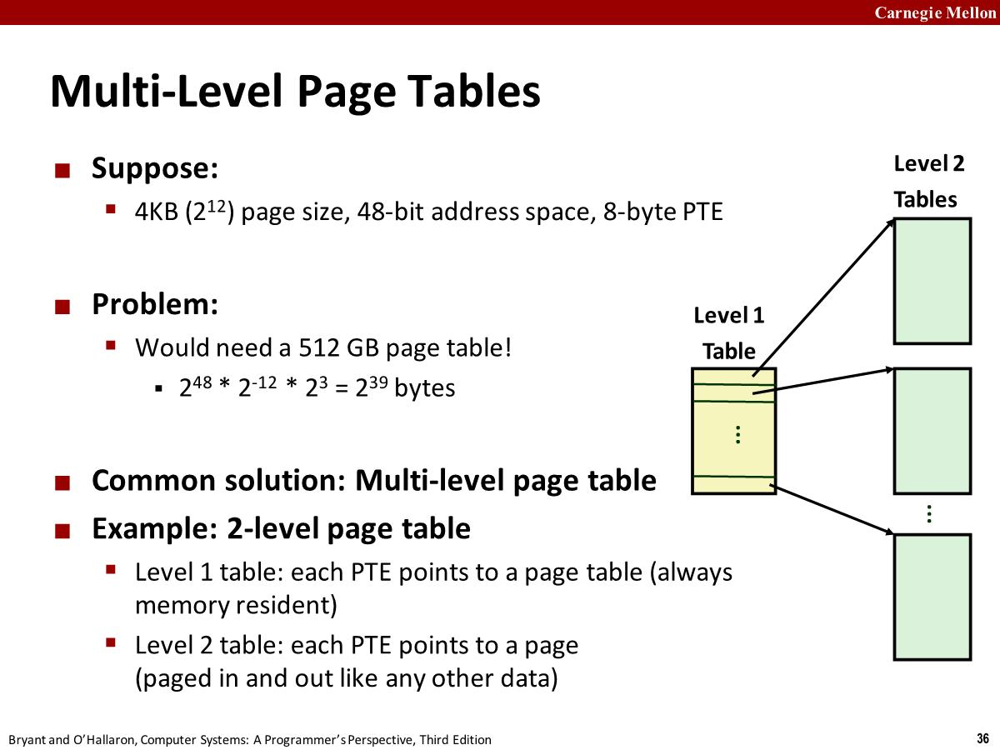

一个页表需要的空间很大，见图，需要512GB，因为如果想用一个页表映射虚拟地址空间，需要为每个page的地址提供一个PTE，不管page有没有被使用过，比如48位地址空间，则需要512GB，但是很多都没有使用到，为此使用多级页表可以避免创建不必要的页表。

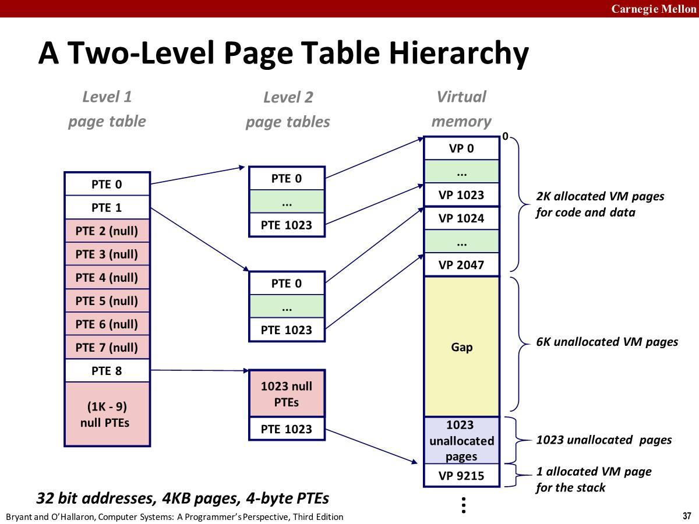

上图已经为这个程序的代码和数据分配了2k个page，还有6个没有分配的page，低下有一个为栈分配的1024个page，但是大部分没有使用，只为栈顶分配了一个page。

2个level 2的页表覆盖了这分配的2k个page，1个level 2页表覆盖栈page(1023个null PTEs，因为大部分没有使用到)，1个level 1页表，共需要4个页表。

足够的level 2的页表就能覆盖实际使用的虚拟地址空间部分。没有用到的page就放到Gap区域，无需为它搞一个页表。

### Translating with a k-level Page Table

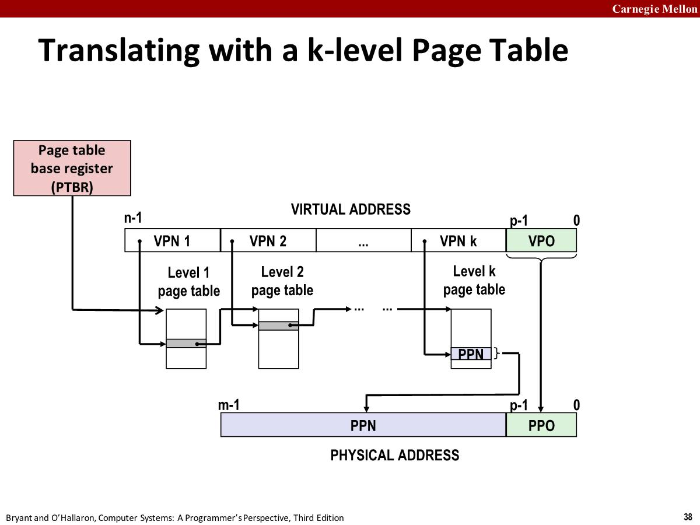

MMU做的这些都是硬件逻辑，包括有多少级页表，由硬件架构定义。
