# 18-Virtual-Memory-Systems

## Simple memory system example

### Address Translation Example #1

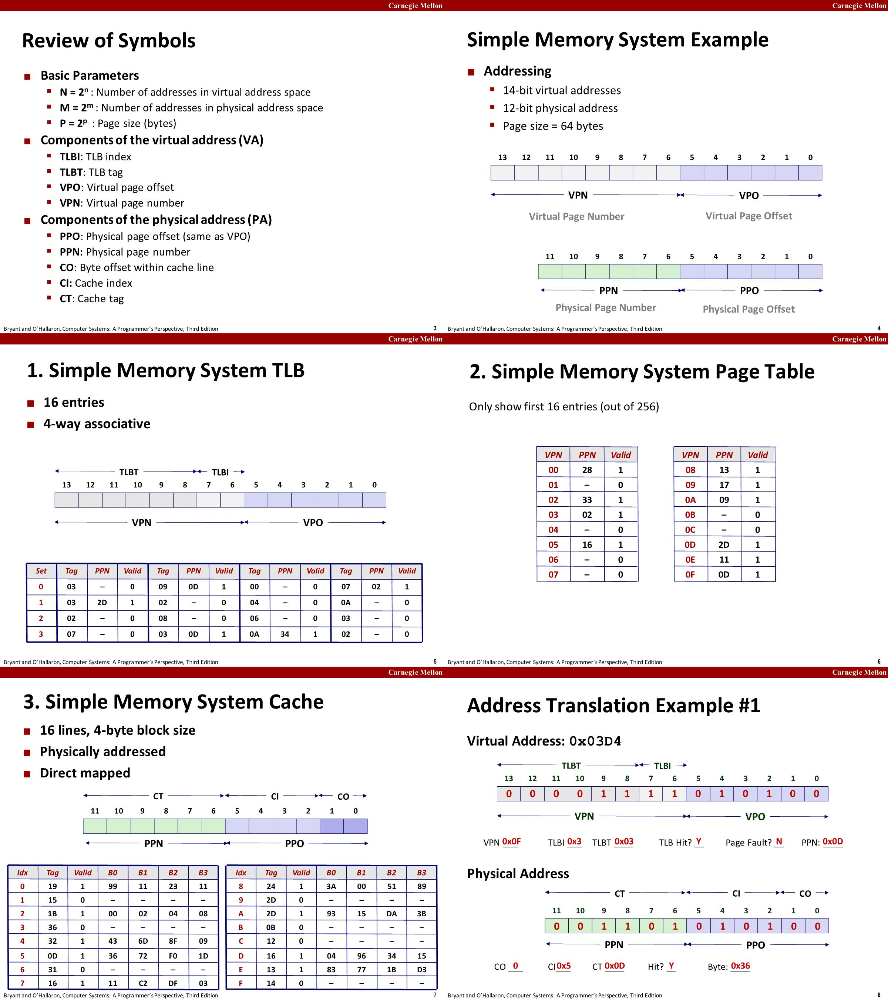

PPN实际不存在页表中

1. MMU做的第一件事是检查TLB，将VA中的VPN的TLBI(0x3)和TLBT(0x03)提取出来。所以会去查set3找到tag为3的line，找到对应的line并且valid为1，TLB将PPN(0D)返回给MMU
2. MMU使用0D构建物理地址。将VA的VPO复制到PA的PPO，0D作为PA的PPN，由此构成了一个物理地址
3. 将地址发送给cache，提取出CI(0x5)、CT(0x0D)，所以会去查set5找到tag为0xD的line，找到并且valid为1，因为CO为0，所以找到B0(36)
4. cache将该字节通过MMU返回给CPU，并将其存到一个寄存器中。

### Address Translation Example #2

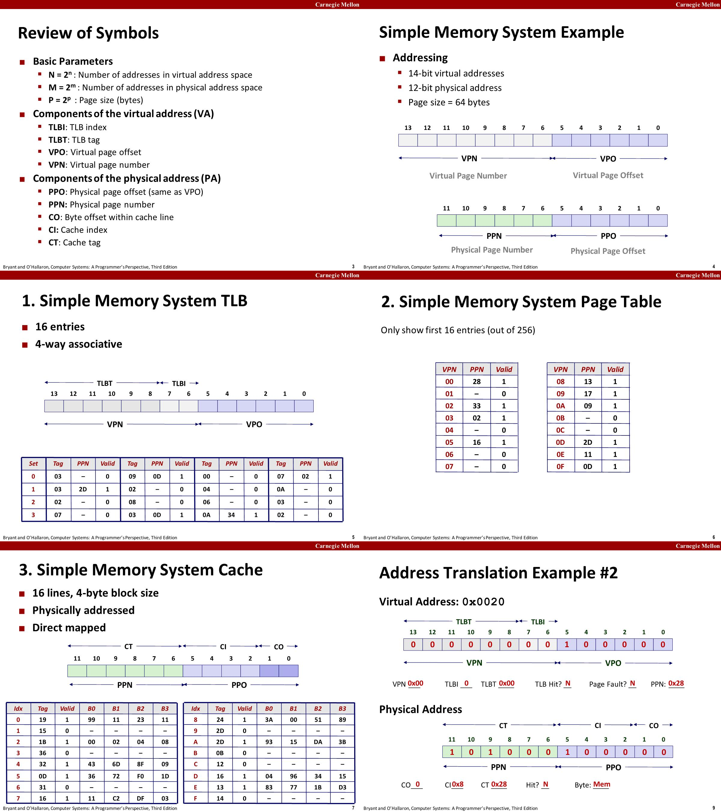

1. VA中的VPN的TLBI=TLBT=0，TLB的set=0&tag=0的line的valid=0，TLB miss
2. 通过VPN=0查找页表，valid=1有效，内存将PTE返回给MMU构造物理地址。
3. MMU用物理地址请求cache，CI=0x8,CT=0x28，set 8中不存在tag为28的line，cache miss
4. 将物理地址传递给内存获取数据

## Case study: Core i7/Linux memory system

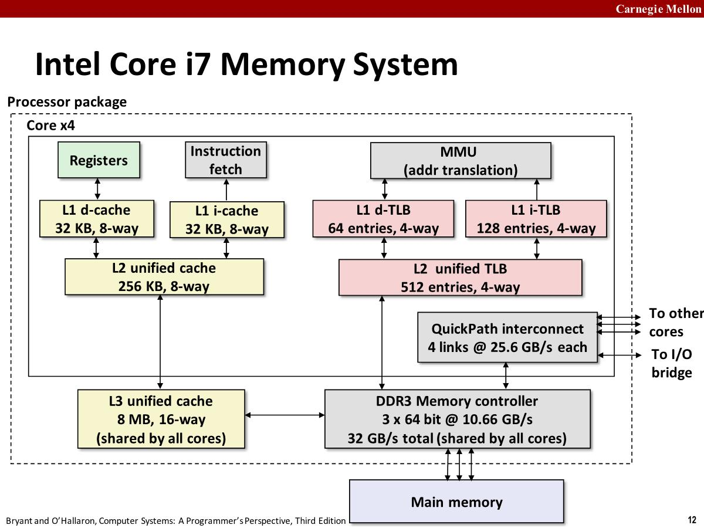

单个芯片封装了4个核心，每个核都可以看作一个单独的cpu，可以各自独立的执行指令。

每个核心都有：

- 寄存器、获取指令的硬件(instruction fetch)
- 两个L1 cache：d-cache保存从内存中获取的数据，i-cache保存从code region获取的指令，d-cache只有数据，i-cache只有指令。访问L1大概需要4个CPU周期。
- L2 unified cache：既可以保存指令，又可以保存数据。访问L1大概需要10个CPU周期。

### End-to-end Core i7 Address Translation

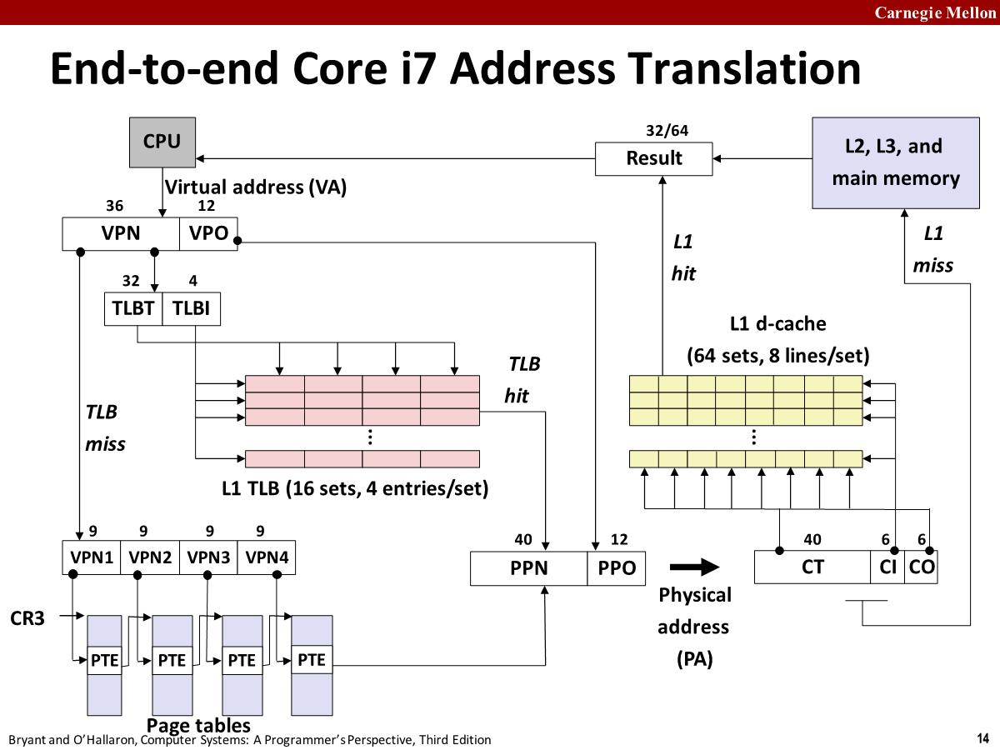

### Core i7 Level 1-4 Page Table Entries

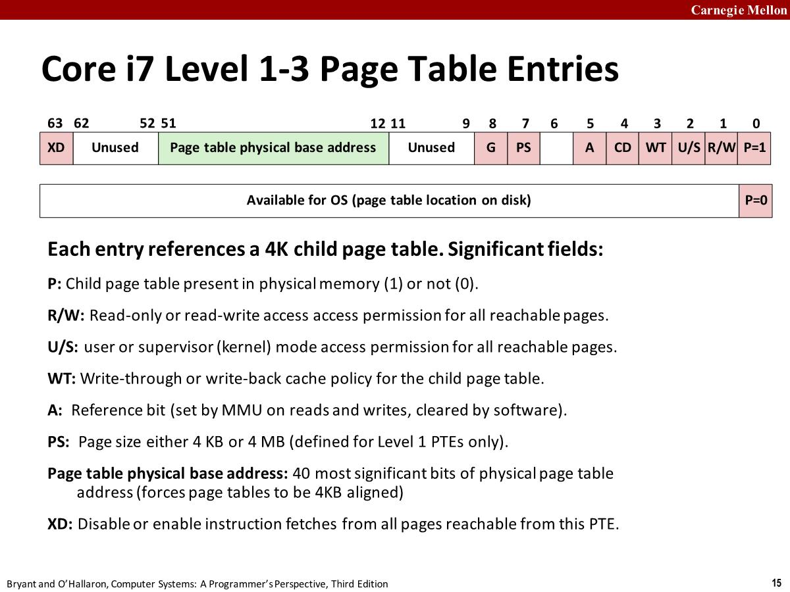

这三级的PTE指向的是下一级的页表的地址

CD表示能不能缓存

XD为disable意味着无法从这个page上加载到任何指令

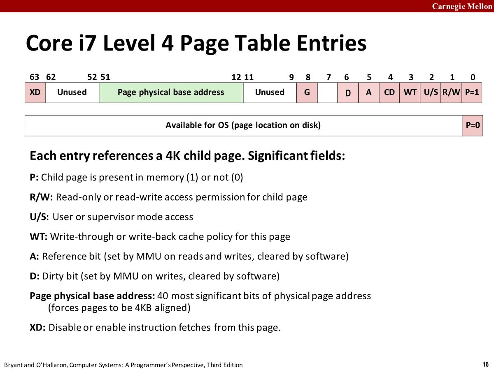

### Cute Trick for Speeding Up L1 Access

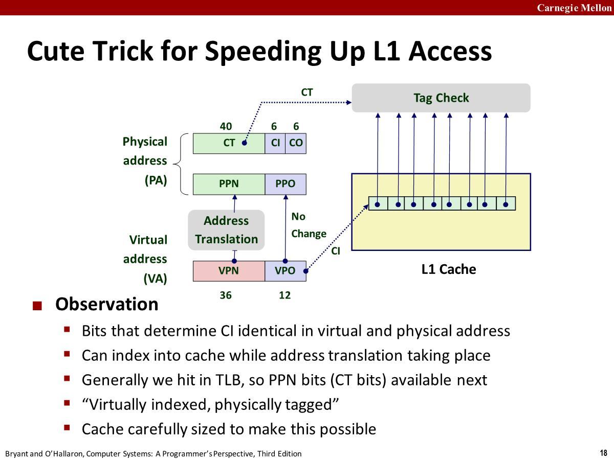

因为VPO和PPO都是一样的，所以CI也是一样的。当CPU需要转换虚拟地址时，它会将VPN发送到MMU，将VPO发送到L1 cache，MMU查询TLB的时候cache可以并行做set的查找，找到所有的line后并且MMU完成地址转换，此时就可以根据tag找到特定的line了。

### Virtual Address Space of a Linux Process

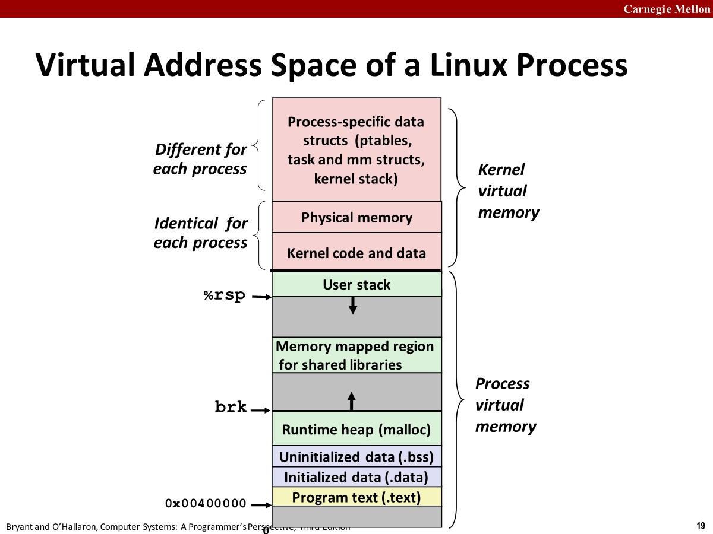

- 程序的代码(`program .text`)总是在相同的地址：0x400000上加载的。
- `.data`可执行二进制文件的的初始化数据，`.bss`二进制文件中定义的未初始化数据
- Runtime heap逐渐向上增长，内核通过进程上下文中brk全局变量来跟踪该进程中堆顶(heap top)的位置
- User stack：用户程序可访问内存，向下增长，底部由%rsp指向。
- User stack与kernel code and data还有一段空间隔开，原因是intel架构虚拟地址只有48位，其他12位被内核利用。
- 每个进程都有相同的内核部分，内核代码也是一样的，内核为每个进程维护特定的数据结构，所有这些数据结构称为上下文。

### Linux Organizes VM as Collection of "Areas"

- Linux organizes the virtual memory as a **collection of areas** (also called segments). An area is a **contiguous chunk** of existing (allocated) virtual memory whose pages are related in some way.

- The code segment, data segment, heap, shared library segment, and user stack are all distinct areas.

- It allows the virtual address space to have **gaps**. The kernel **does not keep track of virtual pages that do not exist**, and such pages do not consume any additional resources in memory, on disk, or in the kernel itself.

the kernel data structures that keep track of the virtual memory areas in a process:

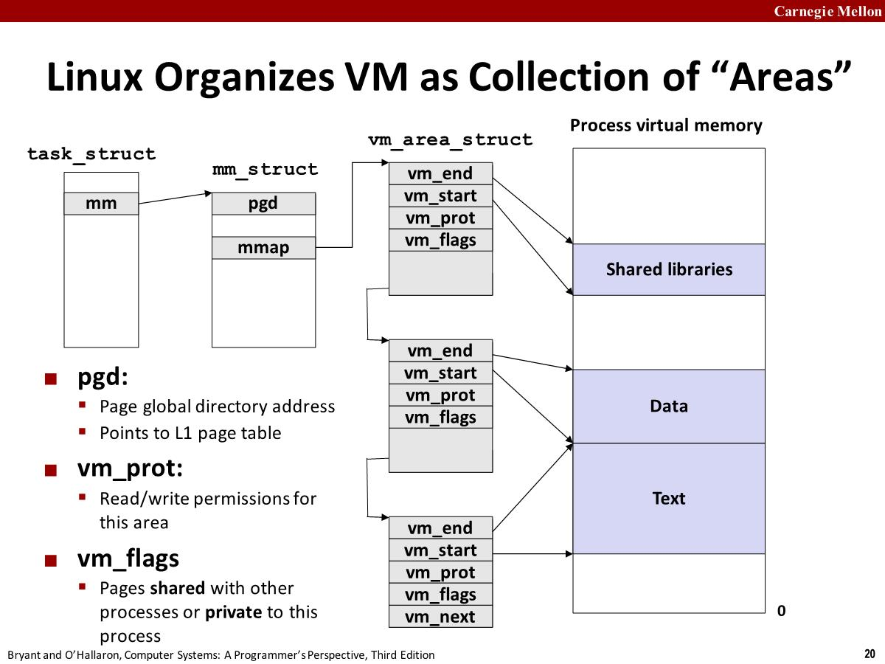

- 内核为每个进程维护了一个数据结构task_struct，包含或者指向了内核运行该进程需要的所有信息(e.g., the PID, pointer to the user stack, name of the executable object file, and program counter)

- task_struct包含了一个指向代表VM当前状态的mm struct的指针，mm_struct包含了指向L1 page table的地址，这是上下文的一部分，当这个进程被调度时，内核把pgd复制到CR3中（通过修改CR3进而修改虚拟地址空间地址）。一旦CR3的值发生了改变，该进程不再有权访问之前进程的页表。

- area_struct通过vm_start标识该area的开始位置，通过vm_end标识该area结束的位置。

- vm_prot: Describes the read/write permissions for all of the pages contained in the area.

- vm_flags: whether the pages in the area are shared with other processes or private to this process.

- vm_next: Points to the next area struct in the list(图这里描述是链表，实际上在操作系统中的实现可能是树).

### Linux Page Fault Handling

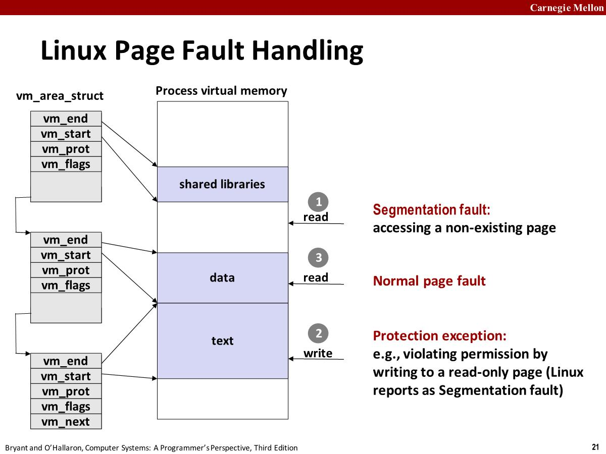

MMU尝试转换虚拟地址A的时候触发了一个page fault，随后将控制权转向kernel's page fault handler，该handler会执行以下步骤：

1. 判断A是否位于某个area_struct定义的area区间内。handler会搜索所有的area struct，将A与vm_start和vm_end比较。如果不合法，则handler触发segmentation fault，进而终止进程。
2. 判断A是否有权读取或者写入该area中的page。比如写入一个只读的page，或者是运行在用户态的进程访问只能由内核访问的page。如果不合法，则handler触发protection exception，进而终止进程。
3. 否则是normal page fault，即page不在DRAM，执行paging流程。

## Memory Mapping

Linux **initializes the contents of a virtual memory area** by associating it with **an object on disk**, a process known as **memory mapping**.

 Areas can be mapped to one of two types of objects:

- **Regular file on disk** (e.g., an executable object file)
  - An area can be mapped to a **contiguous section** of a regular disk file.
  - The file section is divided into **page-size pieces**, with each piece containing the initial contents of a virtual page.
  - Demand paging
  - If the area is larger than the file section, then the area is **padded with zeros**.
- **Anonymous file** (e.g., nothing, there isn't a file specified)
  - The first time the CPU touches a virtual page in such an area, the kernel finds an appropriate victim page in physical memory, swaps out the victim page if it is dirty, **overwrites the victim page with binary zeros**, and updates the page table to mark the page as resident.
  - Once the page is written to (dirtied), it is like any other page
  - No data are actually transferred between disk and memory.
  - Pages in areas that are mapped to anonymous files are sometimes called **demand-zero pages**.

In either case, once a virtual page is initialized, it is swapped back and forth(*来回*) between a special **swap file** maintained by the kernel.

### Shared Objects

- Many programs need to access identical copies of readonly run-time library code. For example, every C program requires functions from the standard C library such as printf.

- Memory mapping provides us with a clean mechanism for controlling how objects are shared by multiple processes.

- An object can be mapped into an area of virtual memory as either a **shared object** or a **private object**.

- Since each object has a unique filename, the kernel can quickly determine that process has already mapped the object.

如果一个进程对共享对象(shared object)对应的虚拟地址空间进行了写操作，那么这个写操作也会同步到磁盘上的文件，并且所有映射了该对象的进程都可见该修改。

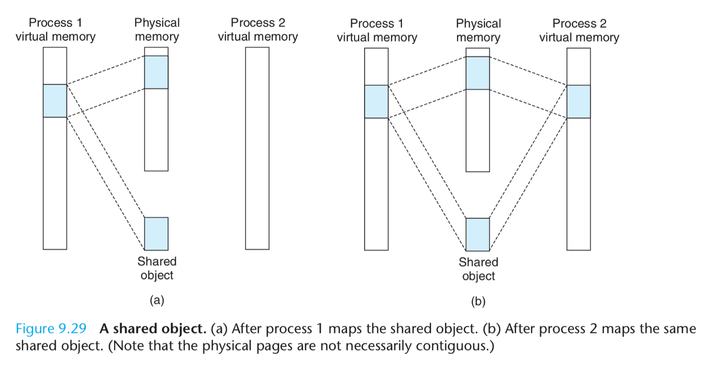

The key point is that only a single copy of the shared object needs to be stored in physical memory, even though the object is mapped into multiple shared areas.

### Private Copy-on-write (COW) Objects

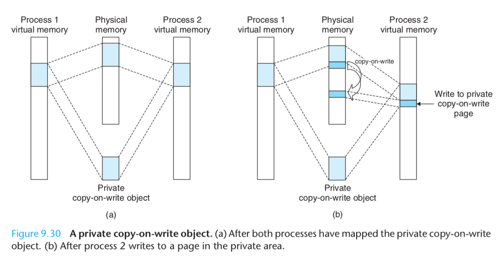

- Two processes have mapped a private object into different areas of their virtual memories but share the same physical copy of the object.

- Area flagged as private copy-on-
write.PTEs in private areas are flagged as read-only.

- So long as neither(*只要两者都不*) process attempts to write to its respective(*各自的*) private area, they continue to share a single copy of the object in physical memory. 

- As soon as a process attempts to write to some page in the private area, the write triggers a **protection fault**.

- Handler creates a new copy of the page in physical memory, updates the page table entry to point to the new copy, and then restores write permissions to the page. 返回时CPU重新执行写操作，将会在新的page上写。

- Copying deferred as long a possible. 更有效利用内存。

### fork

fork时候会提供一个几乎一样但是独立的虚拟地址空间，如果将所有页表都复制一遍效率很低，COW就提供了一个高效的方法。

- VM and memory mapping explain how fork provides private 
address space for each process. 

- To create virtual address for new new process：
  - Create exact copies of current mm_struct, vm_area_struct, and page tables.内核只拷贝所有的内核数据结构，无法避免，但是不大。
  - Flag each page in both processes as read-only.
  - Flag each vm_area_struct in both processes as private COW.

- On return, each process has exact copy of virtual memory

- Subsequent(*后续*) writes create new pages using COW mechanism.

本质是让copy延迟了，只有在写时候才复制。

### execve

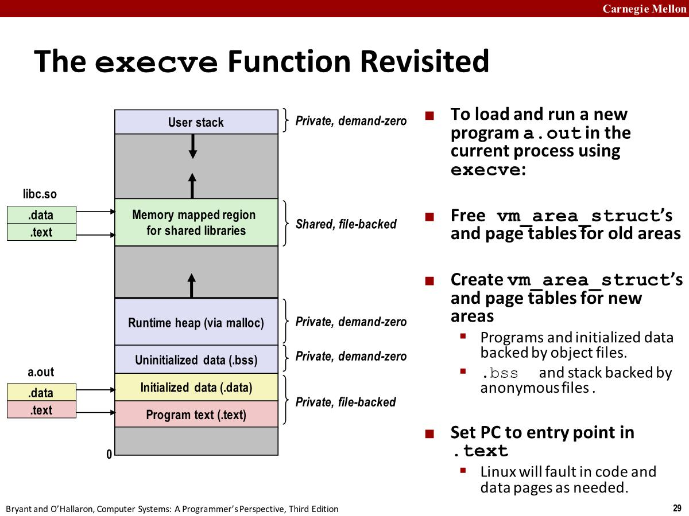

execve做的仅仅是创建一个新的area，映射到想执行的对象文件中，创建.bss和栈，映射到匿名函数，创建Memory mapped region，映射到libc，然后把程序计数器%rip设置为代码区域的入口点。

当程序运行时，并没有加载任何内容，只是在内核中创建了数据结构和内存映射，还没有任何内容拷贝到内存。

### User-Level Memory Mapping

```c
void *mmap(void *start, int len,
    int prot, int flags, int fd, int offset)
```

允许像内核一样进行内存映射(系统调用)，只是内存映射，没有copy，只是将虚拟地址空间中空闲的部分映射到文件

start：虚拟空间地址，mmap函数尝试将这个地址开始，长度为length 字节的区域，映射到由fd确定的某个文件的offset位置。

prot: PROT_READ, PROT_WRITE, ....权限，只写只读读写

flags: MAP_ANON, MAP_PRIVATE, MAP_SHARED, ...

Return a pointer to start of mapped area (may not be start)

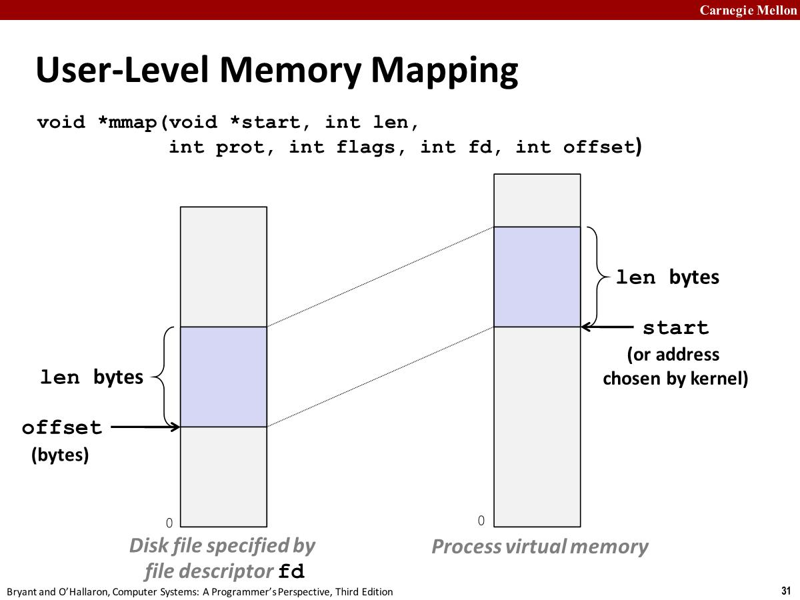

拷贝文件到标准输出，没有把数据拷贝到用户地址空间。标准做法是从标准输入中读，然后写到标准输出中去，需要用两个系统调用，read和write。用mmap只需要一个系统调用。

从命令行得到一个文件名，然后打开这个文件，获取到文件的大小。调用mmap，传递fd、大小、长度，设置flag为私有。然后调用write，把buffer指向的内容拷贝到标准输出。write 函数会从bufp中一个字节一个字节地读取，执行的时候会出现异常，异常处理完成后，write把bufp写入到fd对应的文件，也就是stdout

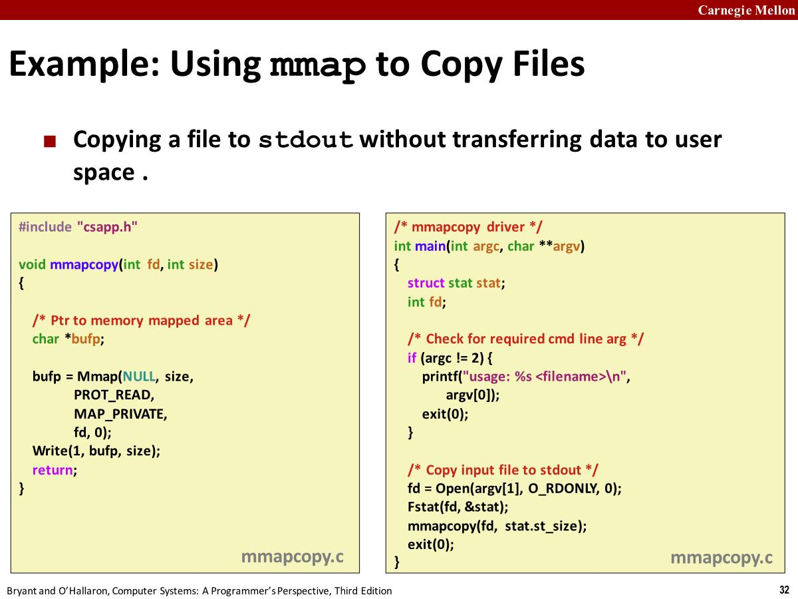
