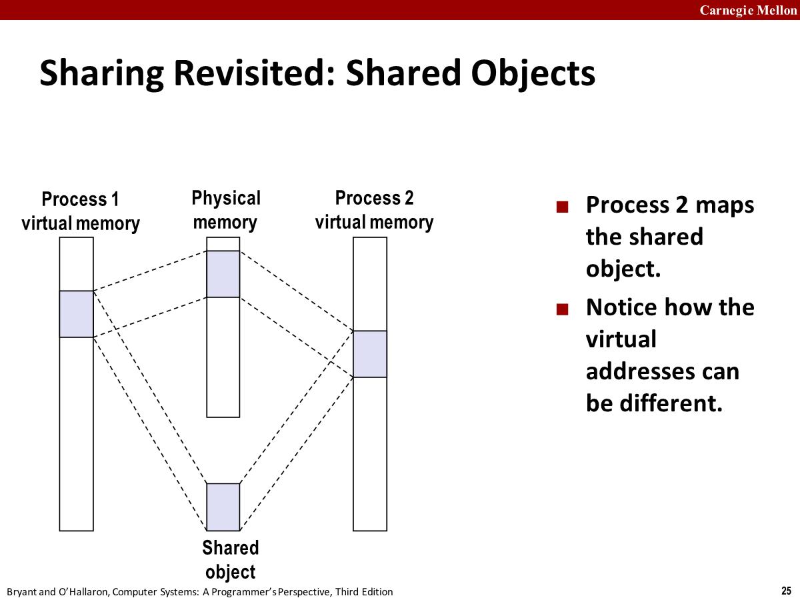
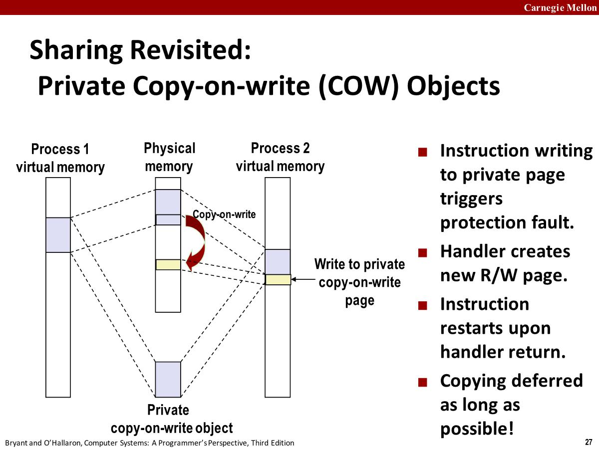

# 18-Virtual-Memory-Systems

## Simple memory system example

### Address Translation Example #1


PPN实际不存在页表中

1. MMU做的第一件事是检查TLB，将VA中的VPN的TLBI(0x3)和TLBT(0x03)提取出来。所以会去查set3找到tag为3的line，找到对应的line并且valid为1，TLB将PPN(0D)返回给MMU
2. MMU使用0D构建物理地址。将VA的VPO复制到PA的PPO，0D作为PA的PPN，由此构成了一个物理地址
3. 将地址发送给cache，提取出CI(0x5)、CT(0x0D)，所以会去查set5找到tag为0xD的line，找到并且valid为1，因为CO为0，所以找到B0(36)
4. cache将该字节通过MMU返回给CPU，并将其存到一个寄存器中。

### Address Translation Example #2


1. VA中的VPN的TLBI=TLBT=0，TLB的set=0&tag=0的line的valid=0，TLB miss
2. 通过VPN=0查找页表，valid=1有效，内存将PTE返回给MMU构造物理地址。
3. MMU用物理地址请求cache，CI=0x8,CT=0x28，set 8中不存在tag为28的line，cache miss
4. 将物理地址传递给内存获取数据

## Case study: Core i7/Linux memory system


单个芯片封装了4个核心，每个核都可以看作一个单独的cpu，可以各自独立的执行指令。

每个核心都有：

- 寄存器、获取指令的硬件(instruction fetch)
- 两个L1 cache：d-cache保存从内存中获取的数据，i-cache保存从code region获取的指令，d-cache只有数据，i-cache只有指令。访问L1大概需要4个CPU周期。
- L2 unified cache：既可以保存指令，又可以保存数据。访问L1大概需要10个CPU周期。

### End-to-end Core i7 Address Translation


### Core i7 Level 1-4 Page Table Entries


这三级的PTE指向的是下一级的页表的地址

CD表示能不能缓存

XD为disable意味着无法从这个page上加载到任何指令


### Cute Trick for Speeding Up L1 Access


因为VPO和PPO都是一样的，所以CI也是一样的，在MMU进行地址转换的同时将CI发送给L1 cache，然后cache做set的查找，找到所有的line后并且MMU完成地址转换，此时就可以根据tag找到特定的line了，有那么一点并行的存在。

### Virtual Address Space of a Linux Process


- 程序的代码(`program .text`)总是在相同的地址：0x400000上加载的。
- `.data`可执行二进制文件的的初始化数据，`.bss`二进制文件中定义的未初始化数据
- Runtime heap逐渐向上增长，内核通过进程上下文中brk全局变量来跟踪该进程中堆顶(heap top)的位置
- User stack：用户程序可访问内存，向下增长，底部由%rsp指向。
- User stack与kernel code and data还有一段空间隔开，原因是intel架构虚拟地址只有48位，其他12位被内核利用。
- 每个进程都有相同的内核部分，内核代码也是一样的，内核为每个进程维护特定的数据结构，所有这些数据结构称为上下文。

### Linux Organizes VM as Collection of "Areas"


Linux将虚拟内存相关区域组合成为areas，每个area是连续的一块内存。比如有code、stack、share lib相关的area。

为每个进程设定的数据结构task_struct，包含了一个指向mm struct的指针，mm_struct包含了指向L1 page table的地址，这是上下文的一部分，当这个进程被调度时，内核把pgd复制到CR3中（通过修改CR3进而修改虚拟地址空间地址）。

一旦CR3的值发生了改变，该进程不再有权访问之前进程的页表。

area_struct 通过vm_start标识该区域的开始位置，通过vm_end标识该区域结束的位置。

### Linux Page Fault Handling


## Memory Mapping

memory mapping: VM areas initialized by associating them with disk objects.

Area can be backed(*支持*) by (i.e., get its initial values from) :

- Regular file on disk (e.g., an executable object file)
  - Initial page bytes come from a section(*某部分*) of a file。比如对于code area，映射了可执行二进制文件的一部分。
- Anonymous file (e.g., nothing)
  - First fault will allocate a physical page full of 0's (demand-zero page)
  - Once the page is written to (dirtied), it is like any other page
  - Dirty pages are copied back and forth(*来回复制*) between memory and a special swap file.一个与匿名文件关联的page被修改后，当需要同步回文件的时候，会被回写到内核维护的swap file。

### Shared Objects

利用内存映射可以在进程间共享对象



进程1映射某area到文件的某一部分(shared object)，进程2也可以映射到同一个对象，并且进程1的那个area和进程2的没有关系。

### Private Copy-on-write (COW) Objects

Two processes mapping a private copy-on-write (COW)  object.

Area flagged as private copy-on-
write.PTEs in private areas are flagged as read-only.



如果一个进程对共享对象对应的虚拟地址空间进行了写操作，那么这个写操作也会同步到磁盘上的文件。如果是COW对象，那么写不会同步到共享对象的物理内存，而是将page拷贝一份，并且把它映射到一个没有使用的物理地址。如果是读则是和共享对象一样，直接读取即可。

### fork

fork时候会提供一个几乎一样但是独立的虚拟地址空间，如果将所有页表都复制一遍效率很低，COW就提供了一个高效的方法。

 To create virtual address for new new process：

- Create exact copies of current mm_struct, vm_area_struct, and page tables.内核只拷贝所有的内核数据结构，无法避免，但是不大。
- Flag each page in both processes as read-only.
- Flag each vm_area_struct in both processes as private COW.

On return, each process has exact copy of virtual memory

Subsequent writes create new pages using COW mechanism.

本质是让copy延迟了，只有在写时候才复制。

### execve


execve做的仅仅是创建一个新的area，映射到想执行的对象文件中，创建.bss和栈，映射到匿名函数，创建Memory mapped region，映射到libc，然后把程序计数器%rip设置为代码区域的入口点。

当程序运行时，并没有加载任何内容，只是在内核中创建了数据结构和内存映射，还没有任何内容拷贝到内存。

### User-Level Memory Mapping

```c
void *mmap(void *start, int len,
    int prot, int flags, int fd, int offset)
```

允许像内核一样进行内存映射(系统调用)，只是内存映射，没有copy，只是将虚拟地址空间中空闲的部分映射到文件

start：虚拟空间地址，mmap函数尝试将这个地址开始，长度为length 字节的区域，映射到由fd确定的某个文件的offset位置。

prot: PROT_READ, PROT_WRITE, ....权限，只写只读读写

flags: MAP_ANON, MAP_PRIVATE, MAP_SHARED, ...

Return a pointer to start of mapped area (may not be start)


拷贝文件到标准输出，没有把数据拷贝到用户地址空间。标准做法是从标准输入中读，然后写到标准输出中去，需要用两个系统调用，read和write。用mmap只需要一个系统调用。

从命令行得到一个文件名，然后打开这个文件，获取到文件的大小。调用mmap，传递fd、大小、长度，设置flag为私有。然后调用write，把buffer指向的内容拷贝到标准输出。write 函数会从bufp中一个字节一个字节地读取，执行的时候会出现异常，异常处理完成后，write把bufp写入到fd对应的文件，也就是stdout

