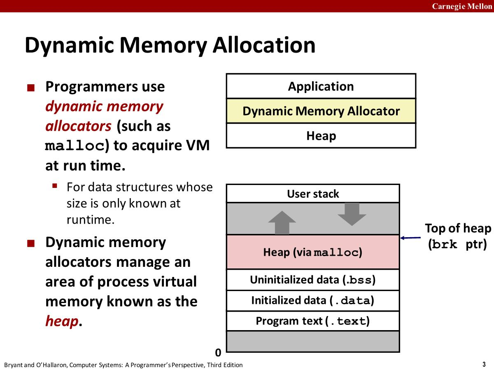

# 19-Dynamic-Memory-Allocation-Basic

We can use the low-level mmap and munmap functions to create and delete areas of virtual memory, but using **dynamic memory allocators** (such as malloc) to acquire VM at run time is more convenient and portable(*可移植的*).

A dynamic memory allocator maintains an area of a process's virtual memory known as the **heap**.



An allocator maintains the heap as **a collection of various-size blocks**. Each block is a contiguous chunk of virtual memory that is either **allocated** or **free**.

Types of allocators:

- **Explicit(*显式*) allocator**: application allocates and frees space. E.g., malloc and free in C.
- **Implicit allocator**: application allocates, but does not free space. E.g. garbage collection in Java, ML, and Lisp.

## Explicit allocator

### The malloc Package

```c
#include <stdlib.h>
```

- `void *malloc(size_t size)`
  - If `size == 0`, returns NULL
  - successful: Returns a pointer to a memory block of at least **size** bytes aligned to an 8-byte (x86) or 16-byte (x86-64) boundary.
  - unsuccessful: returns NULL(0) and sets **errno**
- `void free(void *p)`
  - 将p所指向的block释放回可用的内存池中
  - p must come from a previous call to `malloc` or `realloc`
- `calloc`: Version of malloc that initializes allocated block to zero. `Malloc` does not initialize the memory it returns.
- `realloc`: Changes the size of a previously allocated block.
- `sbrk`: Used internally by allocators to grow or shrink the heap.

```c
#include <stdio.h>
#include <stdlib.h>

void foo(int n)
{
    int i, *p;
    /*Allocate a block of n ints */
    p = (int*) malloc(n* sizeof(int));
    if (p == NULL)
    {
        perror("malloc");
        exit(0);
    }

    /*Initialize allocated block */
    for (i = 0; i < n; i++)
        p[i] = i;
    /*Return allocated block to the heap */
    free(p);
}
```

