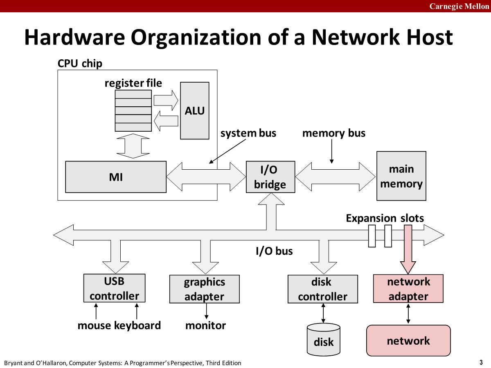
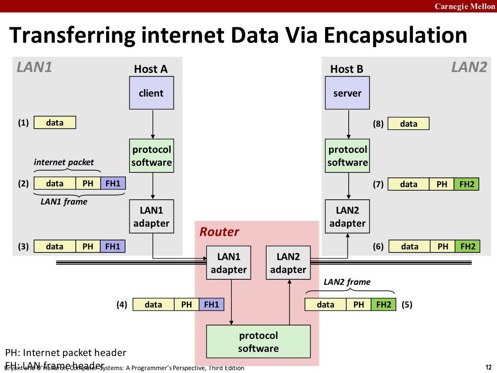
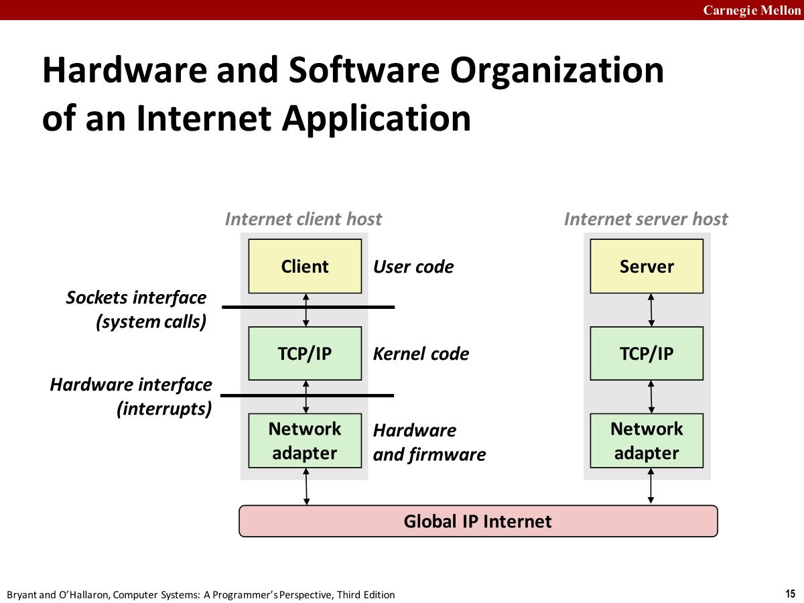
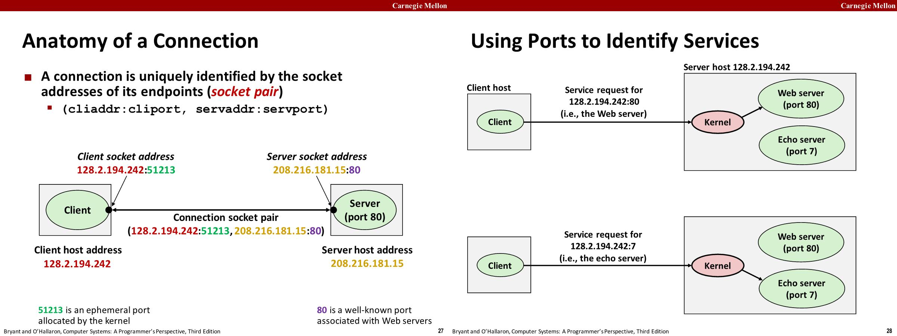
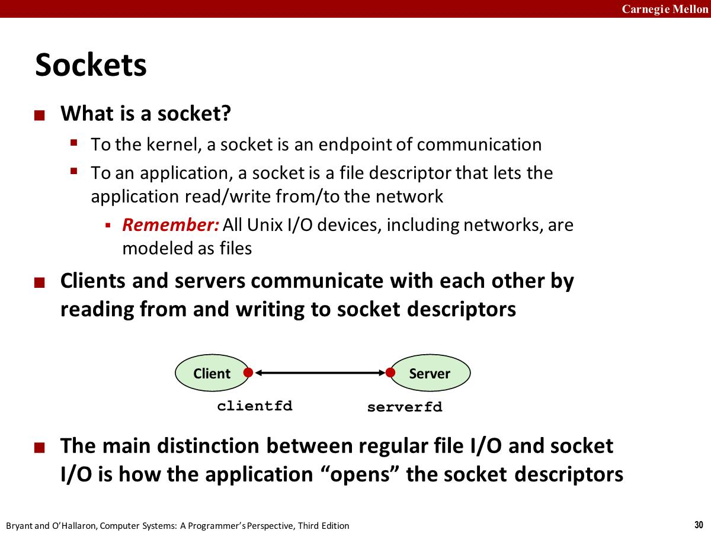

# Networks

## Hardware Organization

To a host, a network is just **another I/O device** that serves as a source and sink for data(*数据的源和接收*)

## Internet Protocol

- How is it possible to send bits across incompatible LANs  and WANs（不同厂商，不同技术，不同国家的运营商）
  - `protocol` software running on each host and router
  - Protocol is a set of rules that governs(*管理*) how hosts and routers should cooperate when they transfer data from network to network.
  - Smooths out(*消除了*) the differences between the different networks

- What Does an internet Protocol Do

  - Provides a naming scheme
    - An internet protocol defines a uniform format for host addresses
    - Each host (and router) is assigned at least one of these internet addresses that uniquely identifies it
  - Provides a delivery mechanism(*交付机制*)
    - An internet protocol defines a standard transfer unit (packet)(*标准传输单元*)
    - Packet consists of **header** and **payload**
    - Header: contains info such as packet size, source and destination  addresses
    -  Payload: contains data bits sent from source host

  

# Global IP Internet

- The global IP Internet is the most famous and successful implementation of an internet. It's based on the **TCP/IP** (Transmission Control Protocol/Internet Protocol) protocol family.
  - IP (Internet Protocol): Provides **basic naming scheme** and unreliable **delivery capability**(*不可靠的交付能力*) of packets (datagrams) from **host-to-host**.
  - UDP (Unreliable Datagram Protocol): Uses IP to provide **unreliable** datagram delivery from  **process-to-process**.
  -  TCP (Transmission Control Protocol): Uses IP to provide **reliable** byte streams from **process-to-process**  over **connections**.

- Each Internet host runs software that implements the TCP/IP protocol, which is supported by almost every modern computer system(*几乎所有现代计算机系统都支持TCP/IP协议*).

## Internet Connections

- Clients and servers communicate by sending streams of bytes over connections. Each connection is:
  - Point-to-point: connects a pair of processes
  - Full-duplex(*全双工*): data can flow in both directions at the same time
  - Reliable: stream of bytes sent by the source is eventually received by the destination in the same order it was sent.
- A **socket** is an endpoint of a connection. Socket address is an `IPaddress:port` pair

- A **port** is a 16-bit integer that identifies a process. (Mappings between well-known ports and service names  is contained in the file /etc/services on each Linux  machine.)

# Sockets Interface

