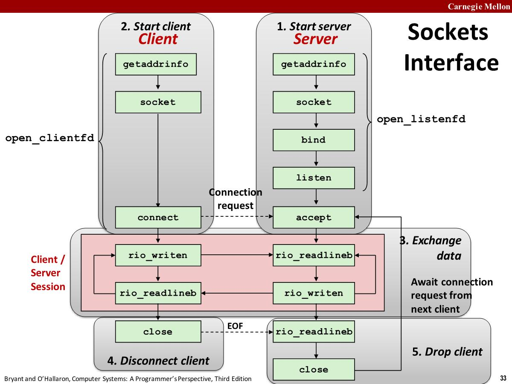
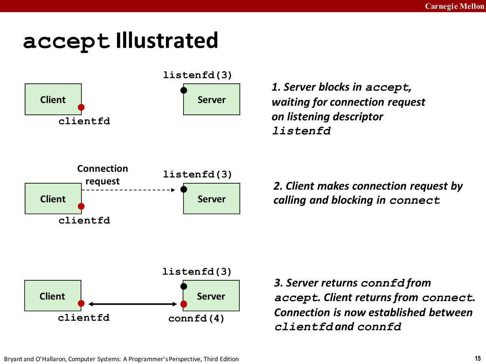

# Networks

## Hardware Organization

To a host, a network is just **another I/O device** that serves as a source and sink for data(*数据的源和接收*)


## Internet Protocol

- How is it possible to send bits across incompatible LANs  and WANs（不同厂商，不同技术，不同国家的运营商）
  - `protocol` software running on each host and router
  - Protocol is a set of rules that governs(*管理*) how hosts and routers should cooperate when they transfer data from network to network.
  - Smooths out(*消除了*) the differences between the different networks

- What Does an internet Protocol Do

  - Provides a naming scheme
    - An internet protocol defines a uniform format for host addresses
    - Each host (and router) is assigned at least one of these internet addresses that uniquely identifies it
  - Provides a delivery mechanism(*交付机制*)
    - An internet protocol defines a standard transfer unit (packet)(*标准传输单元*)
    - Packet consists of **header** and **payload**
    - Header: contains info such as packet size, source and destination  addresses
    -  Payload: contains data bits sent from source host

  

# The Global IP Internet

- The global IP Internet is the most famous and successful implementation of an internet. It's based on the **TCP/IP** (Transmission Control Protocol/Internet Protocol) protocol family.
  - IP (Internet Protocol): Provides **basic naming scheme** and unreliable **delivery capability**(*不可靠的交付能力*) of packets (datagrams) from **host-to-host**.
  - UDP (Unreliable Datagram Protocol): Uses IP to provide **unreliable** datagram delivery from  **process-to-process**.
  -  TCP (Transmission Control Protocol): Uses IP to provide **reliable** byte streams from **process-to-process**  over **connections**.

- Each Internet host runs software that implements the TCP/IP protocol, which is supported by almost every modern computer system(*几乎所有现代计算机系统都支持TCP/IP协议*).


## Internet Connections

- Clients and servers communicate by sending streams of bytes over connections. Each connection is:
  - Point-to-point: connects a pair of processes
  - Full-duplex(*全双工*): data can flow in both directions at the same time
  - Reliable: stream of bytes sent by the source is eventually received by the destination in the same order it was sent.
- A **socket** is an endpoint of a connection. Socket address is an `IPaddress:port` pair

- A **port** is a 16-bit integer that identifies a process. (Mappings between well-known ports and service names  is contained in the file /etc/services on each Linux  machine.)


# The Sockets Interface

## Sockets


## Interface

The sockets interface is a set of functions that are used in conjunction with(*结合*) the Unix I/O functions to build network applications. It has been implemented on most modern systems.



### getaddrinfo

- getaddrinfo is the modern way to convert string  representations of `hostnames`, `host addresses`, `ports`, and  `service names` to socket address structures. Reentrant (can be safely used by threaded programs).

    ```c
    int getaddrinfo(const char* host,             /* Hostname or address */
                    const char* service,          /* Port or service name */
                    const struct addrinfo* hints, /* Input parameters */
                    struct addrinfo** result);    /* Output linked list */
    ```

- getaddrinfo returns a result that points to a **linked list of addrinfo structures**, each of which points to a socket address structure that corresponds to host and service. （单个域名可能对应多个IP地址，也可能IP对应多个域名，所以返回链表）
  - Clients: walk this list, trying each socket address in turn, until  the calls to `socket` and `connect` succeed.
  - Servers: walk the list until calls to `socket` and `bind` succeed.

### socket

- Clients and servers use the `socket function` to create a  socket descriptor

    ```c
    // int socket(int domain, int type, int protocol)
    // AF_INET: Indicates that we are using  32-bit IPV4 addresses
    // SOCK_STREAM: Indicates that the socket  will be the end point of a  connection
    // Returns: nonnegative descriptor. if OK, −1 on error
    int clientfd = Socket(AF_INET, SOCK_STREAM, 0);
    ```

- The best practice is to use the `getaddrinfo` function to generate these parameters automatically, so that the code is protocol-independent(*协议无关*).

### bind

- A server uses  bind to ask the kernel to associate the  server’s socket address with a socket descriptor.

    ```c
    // addrlen is sizeof(sockaddr_in)
    // Returns: 0 if OK, −1 on error
    int bind(int sockfd, SA *addr, socklen_t addrlen);
    ```

- The process can read bytes that arrive on the connection whose endpoint is `addr` by reading from descriptor `sockfd`. （对于写同理）

- Best practice is to use getaddrinfo to supply the  arguments addr and addrlen.

### listen

- A server calls the listen function to tell the kernel that a  descriptor will be used by a server rather than a client（By default, kernel assumes that descriptor from socket  function is an `active socket` that will be on the `client` end  of a connection.）

  ```c
  // Returns: 0 if OK, −1 on error
  int listen(int sockfd, int backlog);
  ```

- Converts `sockfd` from an `active socket` to a `listening socket` that can accept connection requests from clients.
- 

### connect

- A client establishes a connection(*建立连接*) with a server by calling  connect

  ```c
  // Returns: 0 if OK, −1 on error
  int connect(int clientfd, SA *addr, socklen_t addrlen);
  ```

- The connect function **blocks** until either the connection is successfully established or an error occurs.
- Attempts to establish a connection with server at socket  address addr, If successful, then `clientfd` is now ready for reading and writing.

### accept

- Servers wait for connection requests from clients by calling the accept function.

  ```c
  // Returns: nonnegative connected descriptor if OK, −1 on error
  int accept(int listenfd, SA *addr, int *addrlen);
  ```

- Waits for connection request to arrive on the connection  bound to `listenfd`, then fills in client’s socket address  in `addr` and size of the socket address in `addrlen`.
- Returns a `connected descriptor` that can be used to  communicate with the client via Unix I/O routines.



