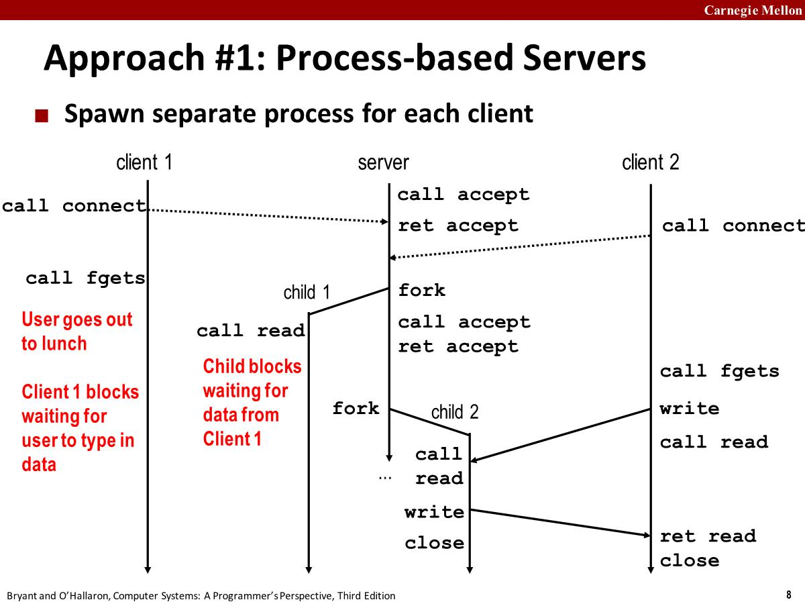
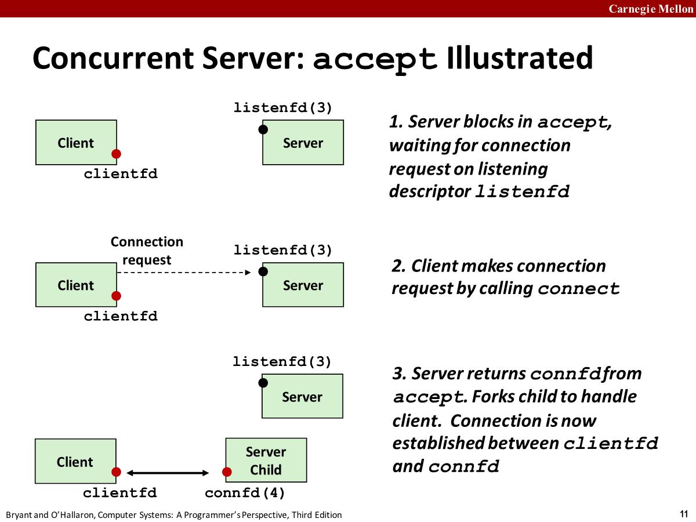

# Client Block

1. **Call to connect returns**: Even though connection not  yet accepted. Server side TCP manager queues request.

   - **TCP  listen backlog**: When multiple clients connect to the server, the server then **holds the incoming requests in a queue**. The clients are arranged in the queue, and the server processes their requests one by one as and when queue-member proceeds. The nature of this kind of connection is called queued connection.
       [python - What is "backlog" in TCP connections? - Stack Overflow](https://stackoverflow.com/questions/36594400/what-is-backlog-in-tcp-connections)


   - The `backlog` parameter specifies the number of pending connections the queue will hold.

       ```c
       int listen(int sockfd, int backlog);
       ```

2. **Call to rio_writen returns**: Server side TCP manager  buffers input data

3. **Call to rio_readlineb blocks**: Server hasn’t written  anything for it to read yet.

# Concurrent Servers

Modern operating systems provide three basic approaches for building concurrent programs.

## Process-based

- Each logical control flow is a process that is scheduled and maintained by the **kernel**. 
- Since processes have **separate virtual address spaces**, flows that want to communicate with each other must use some kind of explicit(`显式`) `interprocess communication` (IPC) mechanism.





- Each client handled by independent child process.  No shared state between them.
- We must include `SIGCHLD` handler that reaps zombie children.
- The parent and the child must close their respective(*各自的*) copies of `connfd`.
  - Kernel keeps reference count for each socket/open file
  - After fork, `refcnt(connfd) = 2`
  - Connection will not be closed until `refcnt(connfd) = 0`

```c
#include "csapp.h"

void echo(int connfd)
{
    int n;
    char buf[MAXLINE];
    rio_t rio;

    Rio_readinitb(&rio, connfd);
    while ((n = Rio_readlineb(&rio, buf, MAXLINE)) != 0) {
        printf("server received %d bytes\n", n);
        Rio_writen(connfd, buf, n);
    }
}

void sigchld_handler(int sig)
{
    while (waitpid(-1, 0, WNOHANG) > 0)
        ;
    return;
}

int main(int argc, char** argv)
{
    int listenfd, connfd;
    socklen_t clientlen;
    struct sockaddr_storage clientaddr;

    if (argc != 2) {
        fprintf(stderr, "usage: %s <port>\n", argv[0]);
        exit(0);
    }

    Signal(SIGCHLD, sigchld_handler);
    listenfd = Open_listenfd(argv[1]);
    while (1) {
        clientlen = sizeof(struct sockaddr_storage);
        connfd = Accept(listenfd, (SA*)&clientaddr, &clientlen);
        if (Fork() == 0) {
            Close(listenfd); /* Child closes its listening socket */
            echo(connfd); /* Child services client */
            Close(connfd); /* Child closes connection with client */
            exit(0); /* Child exits */
        }
        Close(connfd); /* Parent closes connected socket (important!) */
    }
}
```

## Event-based

假设有一个echo server，从standard input输入然后server返回同样的内容。此时这里有两个io事件，一个是网络连接的io事件，另外一个是键盘输入的io事件，如果没有额外的机制，那么我们不知道应该先等待哪个事件，因为这两个io都是需要等待的，如果等待了其中某一个，则另外一个会被阻塞。（假设现在只知道一个process-based实现并发的方法，可以参考上面代码，fork一个之后做出的处理，只有一个io，如果有两个，不知道放哪个在前面，因为都是串行的）

解决这个问题的一个方法是使用io多路复用(I/O multiplexing)。The basic idea is to use the `select` function to ask the kernel to suspend the process, returning control to the application only after one or more I/O events have occurred. （epoll也可以）

```c
#include <sys/select.h>
//fdset: descriptor sets. also read set.
// Returns : nonzero count of ready descriptors, −1 on error
int select(int n, fd_set* fdset, NULL, NULL, NULL);

//Macros for manipulating descriptor sets
FD_ZERO(fd_set *fdset); /* Clear all bits in fdset */
FD_CLR(int fd, fd_set* fdset); /* Clear bit fd in fdset */
FD_SET(int fd, fd_set* fdset); /* Turn on bit fd in fdset */
FD_ISSET(int fd, fd_set* fdset); /* Is bit fd in fdset on? */
```

The select blocks until at least one descriptor in the fdset is ready for reading. fdset是个bitmap，最大可有1024位，代表了1024个fd，每次收到事件的时候os都会从0到n遍历fdset。
[linux - The first parameter of the select call is the maximum value of the incoming fd to be listened to plus one - Stack Overflow](https://stackoverflow.com/questions/49604626/the-first-parameter-of-the-select-call-is-the-maximum-value-of-the-incoming-fd-t)

```c
#include "csapp.h"
void echo(int connfd);
void command(void);

int main(int argc, char** argv)
{
    int listenfd, connfd;
    socklen_t clientlen;
    struct sockaddr_storage clientaddr;
    fd_set read_set, ready_set;

    if (argc != 2) {
        fprintf(stderr, "usage: %s <port>\n", argv[0]);
        exit(0);
    }
    listenfd = Open_listenfd(argv[1]); //line:conc:select:openlistenfd

    FD_ZERO(&read_set); /* Clear read set */ //line:conc:select:clearreadset
    FD_SET(STDIN_FILENO, &read_set); /* Add stdin to read set */ //line:conc:select:addstdin
    FD_SET(listenfd, &read_set); /* Add listenfd to read set */ //line:conc:select:addlistenfd

    while (1) {
        ready_set = read_set;
        Select(listenfd + 1, &ready_set, NULL, NULL, NULL); //line:conc:select:select
        if (FD_ISSET(STDIN_FILENO, &ready_set)) //line:conc:select:stdinready
            command(); /* Read command line from stdin */
        if (FD_ISSET(listenfd, &ready_set)) { //line:conc:select:listenfdready
            clientlen = sizeof(struct sockaddr_storage);
            connfd = Accept(listenfd, (SA*)&clientaddr, &clientlen);
            echo(connfd); /* Echo client input until EOF */
            Close(connfd);
        }
    }
}

void command(void)
{
    char buf[MAXLINE];
    if (!Fgets(buf, MAXLINE, stdin))
        exit(0); /* EOF */
    printf("%s", buf); /* Process the input command */
}
```

