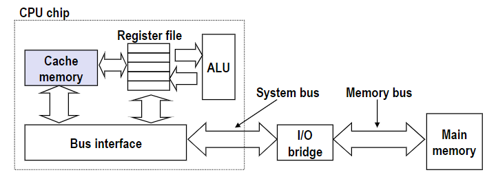
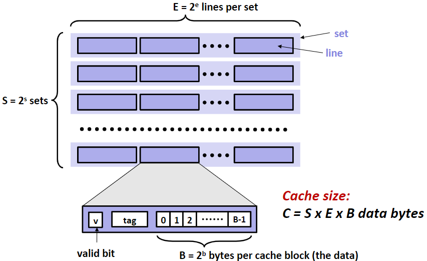
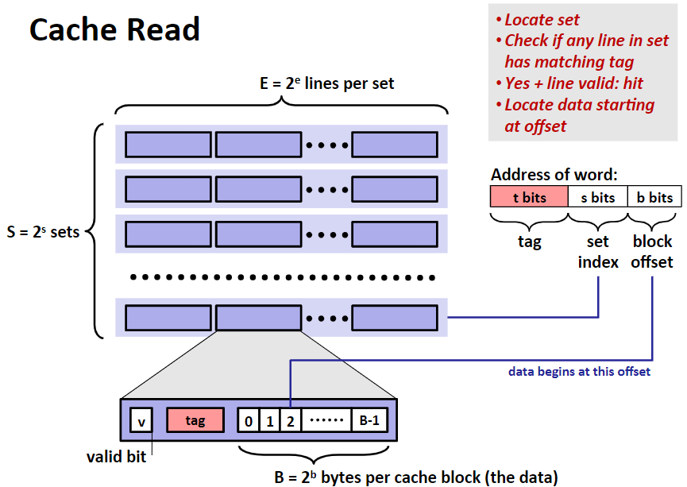

# Cache Memories

- Cache memories are small, fast SRAM-based memories managed automatically in hardware
  - Hold frequently accessed blocks of main memory
- CPU looks first for data in cache

## General Cache Organization (S,E,B)

- 可以把Cache Memory的组织形式看成是一个二维数组
- valid bit指示着这些数据block是否有实际意义

## Cache Read

当程序执行一条引用内存中某个数据的指令时，CPU 将该地址发送到缓存（cache），并要求缓存返回该地址处的数据，Cache拿到地址后，定位方式如下：

1. 定位set：从地址中提取set index找到特定set
2. 检查tag：查看set中所有line的tag，找到与地址中tag一样的tag，并检查是否有效，这样就对应到了具体某个line
3. 使用block offset定位数据在line中第几个block

