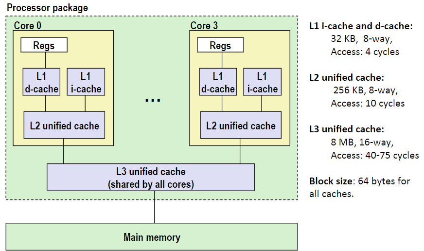

# Cache Memories

- Cache memories are small, fast SRAM-based memories managed automatically in hardware
  - Hold frequently accessed blocks of main memory
- CPU looks first for data in cache

## General Cache Organization (S,E,B)

- 可以把Cache Memory的组织形式看成是一个二维数组
- valid bit指示着这些数据block是否有实际意义

## Cache Read

当程序执行一条引用内存中某个数据的指令时，CPU 将该地址发送到缓存（cache），并要求缓存返回该地址处的数据，Cache拿到地址后，定位方式如下：

1. 定位set：从地址中提取set index找到特定set
2. 检查tag：查看set中所有line的tag，找到与地址中tag一样的tag，并检查是否有效，这样就对应到了具体某个line
3. 使用block offset定位数据从line中第几个block开始读，具体读多少个看是什么类型的，比如int就4bytes

### Example: Direct Mapped Cache(E=1)

直接映射缓存（Direct Mapped Cache）

定位到第1个set后（index从0开始）

tag不匹配的话，旧的line将被新的line覆盖，并且tag也要更新

### Direct Mapped Cache原理

假设内存系统由16个字节组成，地址4位，切分出每个block包含2个字节，缓存由4个set组成，每个set一个block。执行下面的5个指令内存最终形态：

变化的过程：

1. 刚开始处于默认的情况

    |     | v | Tag | Block |
    | :--: | :--: | :---: | :--: |
    |  **Set 0**  | 0 |  ?  | ? |
    | **Set 1** |      |       |  |
    | **Set 2** |      |       |  |
    | **Set 3** |      |       |  |

2. 接收到set index=0的指令，无效，所以miss。然后从内存中获取该block放到缓存中。`M[0-1]`代表从内存0~1字节处加载数据

    |     | v | Tag | Block |
    | :--: | :--: | :---: | :--: |
    |  **Set 0**  | 1 |  0  | M[0-1] |
    | **Set 1** |      |       |  |
    | **Set 2** |      |       |  |
    | **Set 3** |      |       |  |

3. 接收到set index=0，tag=0的指令，有效，hit

4. 接收到set index=3（二进制为11），同样miss并从内存中拿数据

    |     | v | Tag | Block |
    | :--: | :--: | :---: | :--: |
    |  **Set 0**  | 1 |  0  | M[0-1] |
    | **Set 1** |      |       |  |
    | **Set 2** |      |       |  |
    | **Set 3** | 1 | 0 | M[6-7] |

5. 接收set index=0，tag=1的指令，但是set 0被`tag=0 block M[0-1]`占据了，所以是miss，然后从内存中拿数据覆盖，出现了Conflict miss。

    |     | v | Tag | Block |
    | :--: | :--: | :---: | :--: |
    |  **Set 0**  | 1 |  1  | M[8-9] |
    | **Set 1** |      |       |  |
    | **Set 2** |      |       |  |
    | **Set 3** | 1 | 0 | M[6-7] |

6. 同样set index=0，又miss不得不替换，唯一原因是每个set只有一个line。

    |     | v | Tag | Block |
    | :--: | :--: | :---: | :--: |
    |  **Set 0**  | 1 |  0  | M[0-1] |
    | **Set 1** |      |       |  |
    | **Set 2** |      |       |  |
    | **Set 3** | 1 | 0 | M[6-7] |

### E-way Set Associative Cache(E=2)

定位到第1个set后，现在一个set有两个line

然后从这两个line中搜寻可匹配的tag，同时得看valid。这是在硬件层次的比较，随着E越来越大，硬件越来越贵。

没有匹配到，则从set选出一个line进行替换，策略为random或者LRU等等

### 2-Way Set Associative Cache原理

假设内存系统由16个字节组成，地址4位，切分出每个block包含2个字节，缓存由2个set组成，每个set两个block。执行下面的5个指令内存最终形态：

变化的过程：

1. 刚开始处于默认的情况

    |           | v    | Tag  | Block |
    | --------- | ---- | ---- | ----- |
    | **Set 0** | 0    | ?    | ?     |
    | **Set 0** | 0    |      |       |
    | **Set 1** | 0    |      |       |
    | **Set 1** | 0    |      |       |

2. 接收到set index=0的指令，无效

    |           | v    | Tag  | Block  |
    | --------- | ---- | ---- | ------ |
    | **Set 0** | 1    | 00   | M[0-1] |
    | **Set 0** | 0    |      |        |
    | **Set 1** | 0    |      |        |
    | **Set 1** | 0    |      |        |

3. 接收到set index=0，tag=0的指令，有效，hit

4. 接收到set index=1，miss，随机挑选一个line替换

    |           | v    | Tag  | Block  |
    | --------- | ---- | ---- | ------ |
    | **Set 0** | 1    | 00   | M[0-1] |
    | **Set 0** | 0    |      |        |
    | **Set 1** | 1    | 01   | M[6-7] |
    | **Set 1** | 0    |      |        |

5. 接收到set index=0的指令，miss，因为有两个line，所以可以替换到空的line上

    |           | v    | Tag  | Block  |
    | --------- | ---- | ---- | ------ |
    | **Set 0** | 1    | 00   | M[0-1] |
    | **Set 0** | 1    | 10   | M[8-9] |
    | **Set 1** | 1    | 01   | M[6-7] |
    | **Set 1** | 0    |      |        |

6. 接收到set index=0的指令，hit

## Cache Write

- 存在多个数据副本：L1、L2、L3 cache，Main Memory，Disk。k层会建立k+1层数据的缓存。

- 对缓存中的block进行写入的时候（write hit），有两种选择：
  - Write-through：更新缓存，然后立即将其写入内存中，让缓存和内存的内容始终保持一致，但是访问内存很慢（相对于高速缓存来讲）。
  - Write-back：不会立马写回内存，直到缓存想要覆盖该数据为止。需要在line中有一个dirty bit记录block的数据是否已经更新过。

- write-miss（正在写的数据并不包含在缓存中的任何block中）时候：
  - Write-allocate：从内存中获取数据，更新cache line
  - No-write-allocate：直接写入到内存，不加载到缓存

- 一般使用：
  - Write-through+No-write-allocate
  - Write-back+Write-allocate：不会立马将数据写回内存，每当出现一个write miss，就在写入到cache，是一个比较简单的模型。

### Intel Core i7 Cache Hierarchy

- regs：寄存器
- d-cache：数据缓存
- i-cache：指令缓存
- L2 unified cache：统一包含了数据和指令
- L1找不到cache到L2、L3、Main memory

