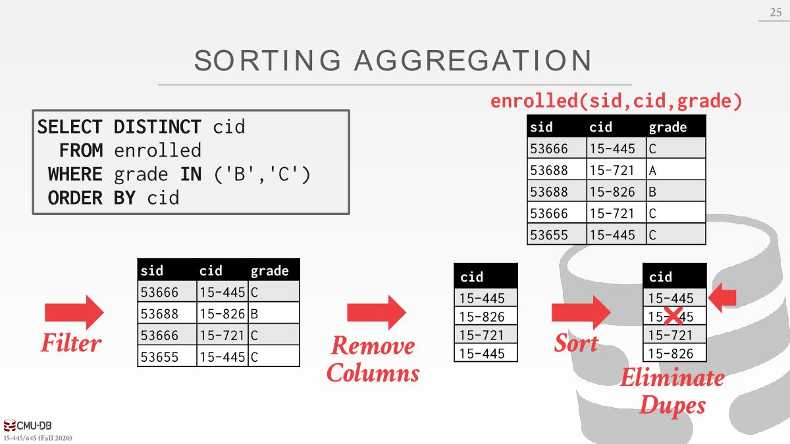
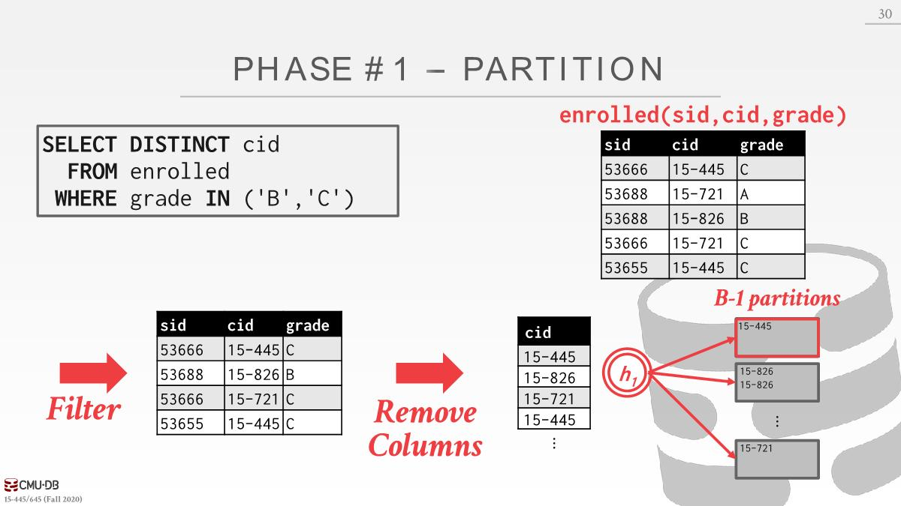
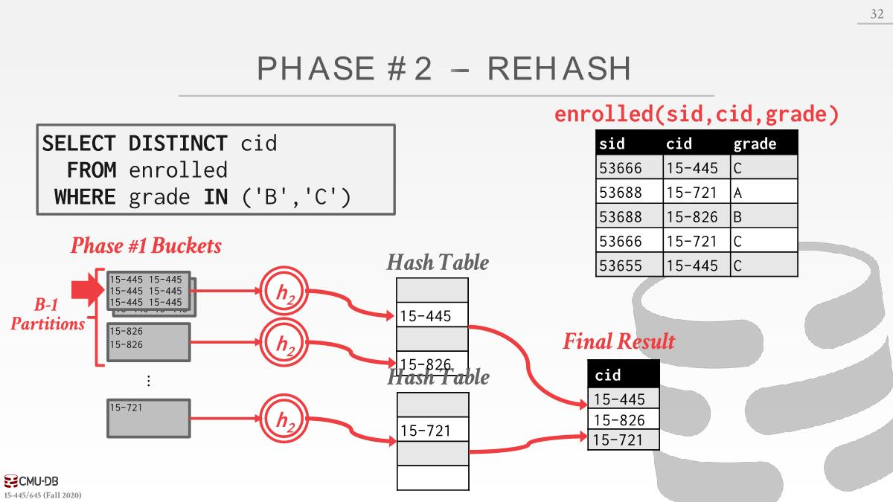
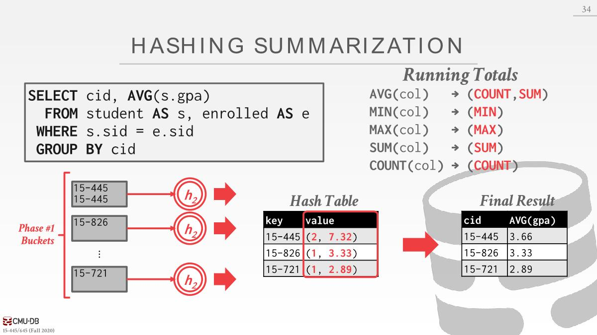

# Query Plan

A和B使用某种join算法计算在一起，A的数据可能没法放在内存中，B中的数据甚至输出的结果也可能没法放在内存中，所以我们需要一种能够处理这种情况的join算法，使用buffer pool manager来处理溢出到磁盘的情况。

# Sorting Algorithms

- Why do we need to sort
  1. order by
  2. distinct
  3. Bulk loading sorted tuples into a B+Tree index is faster.
  4. group by

- If data fits in memory, then we can use a standard sorting algorithm like quick-sort.
- If the data does not fit, then the DBMS needs to use **external sorting** that is able to spill to(*溢出到*) disk as needed and **prefers sequential** over random I/O.

## External Merge Sort

The standard algorithm for sorting data which is too large to fit in memory is **external merge sort**. 

It is a divide-and-conquer(*分治*) sorting algorithm that splits the data set into separate **runs**(*更小的数据集*) and then sorts them individually(*单独排序*). It can spill runs to disk as needed then read them back in one at a time. 

The algorithm is comprised of two phases:

- **Sorting**: First, the algorithm sorts small chunks of data that fit in main memory, and then writes the sorted pages back to disk.
- **Mergeing**: Combine sorted sub-files into a single larger file.

### 2-way External Merge Sort

- The algorithm **reads each page** during the sorting phase, sorts it, and writes the sorted version back to disk. 
- Then, in the merge phase, it uses **three buffer pages**. It reads two sorted pages in from disk, and merges them together into a third buffer page.
  - Whenever(*每当*) the third page fills up, it is written back to disk and replaced third page with an empty page. （要合并的结果有2个page那么大，但是只有一个page用于保存结果，所以写满后得先写回到磁盘然后清空再继续处理）
  - Each set of sorted pages is called a **run**.

Data set is broken up into **N** pages. The DBMS has a finite(*有限的*) number of **B** buffer pages  to hold input and output data. （Postgresql中working memory，一个查询在进行中间操作(构建一个hash table，排序...)时被允许使用的内存量）

2-PAGE runs：一个run有两个page大

This algorithm only requires three buffer pages to  perform the sorting (B=3). 

But even if we have more buffer space available  (B>3), it does not effectively utilize(*利用*) them if the  worker must block on disk I/O.

The generalized version of the algorithm allows the DBMS to take advantage of using more than three buffer pages. Let B be the total number of buffer pages available. Then, during the sort phase, the algorithm can **read B pages at a time and write N/B sorted runs back to disk**.

### Double Buffering Optimization

- One optimization for external merge sort is **prefetching** the next run in the background and storing it in a second buffer while the system is processing the current run. 
- This **reduces the wait time for I/O requests** at each step by continuously utilizing(*连续利用*) the disk. 
- This optimization requires the use of multiple threads, since the prefetching should occur while the computation for the current run is happening.

## Using B+Tree

如果想要排序的key和B+Tree上索引中的key是一样的，那么就可以复用B+Tree。对于聚簇索引和非聚簇索引来讲是不一样的。

聚簇索引指的是page中的tuple的物理位置和索引中定义的顺序相匹配。

获得排序的key的列表的方式

- 对于聚簇索引：遍历最左边的叶子节点，然后从所有节点检索tuple。这总是比外部排序好，因为没有计算成本，而且所有磁盘访问都是顺序的。

- 对于非聚簇索引：已经使用该key创建B+Tree索引，但是tuple存储的顺序和排序顺序不一样，需要随机读取每个page，读取效率慢。

# Aggregations

two implementation choices: sorting, hashing

## Sorting

- The DBMS first sorts the tuples on the `GROUP BY` key(s). It can use either an in-memory sorting algorithm or the external merge sort algorithm. 
- Then performs a sequential scan over the sorted data to compute the aggregation.

- What if we do not need the data to be ordered
  - GROUP BY(no ordering)
  - DISTINCT(no ordering)
  - Hashing is a better alternative in this scenario(*在这种情况下*).
    - Only need to remove duplicates, no need for ordering.
    - Can be computationally cheaper(*计算占用更小*) than sorting.

## Hashing

- Populate an ephemeral(*填充到一个临时的*) hash table as the DBMS  scans the table. For each record, check whether there is already an entry in the hash table.
- If the size of the hash table is too large to fit in memory, then the DBMS has to spill it to disk(external hashing aggregate).

### External Hashing Aggregate

- Phase1 **Partition**: 将tuple使用hash函数拆分到不同的partition，partition满了后可以写到磁盘中。A partition is one or more pages that contain the set of  keys with the same hash value. 如果一个page满了写出到磁盘，分配一个新的page继续写数据。
  

- Phase2 **Rehash**: For each partition on disk, read its pages into memory and build an in-memory hash table based on a second hash function. Then go through(*遍历*) each bucket of this hash table to bring together matching tuples to compute the aggregation. This assumes that each partition fits in memory.
  
  当移动下一个partition时候就把上一个partition的hash table扔掉。
- During the ReHash phase, the DBMS can store pairs of the form (`GroupByKey→RunningValue`) to compute the aggregation. The contents of `RunningValue` depends on the aggregation function. 
  
