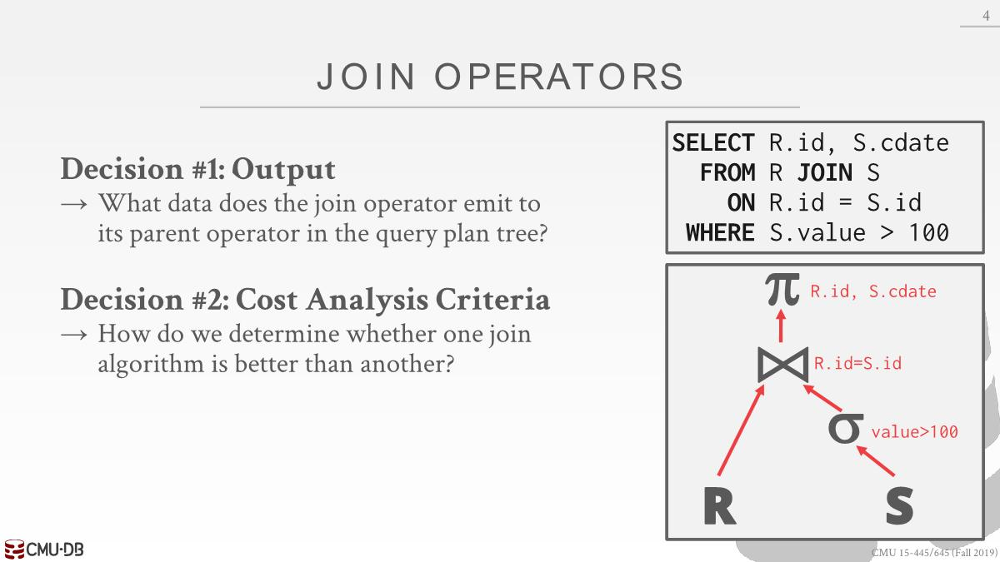
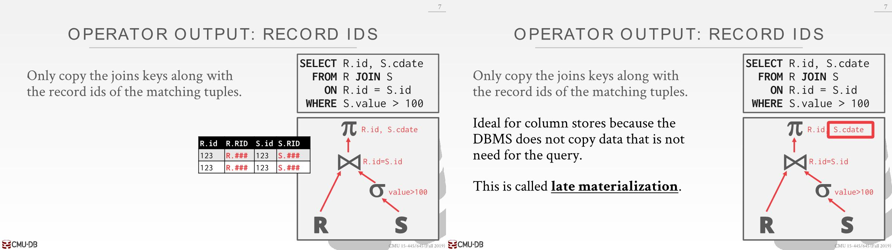
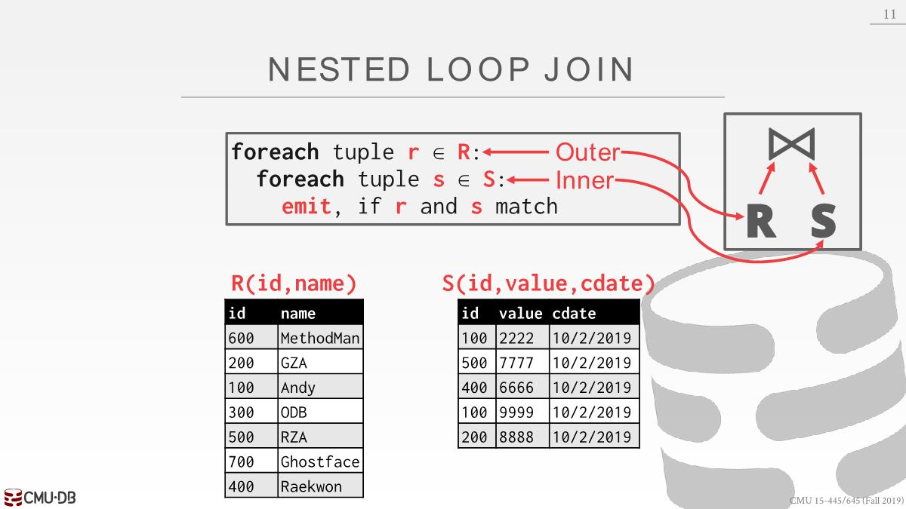
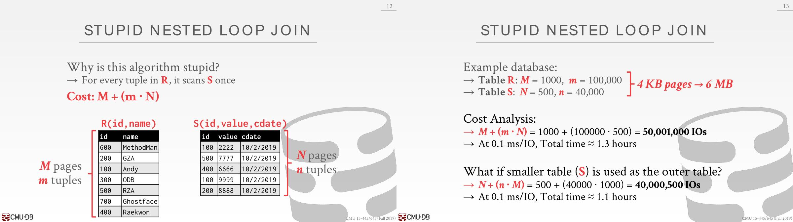
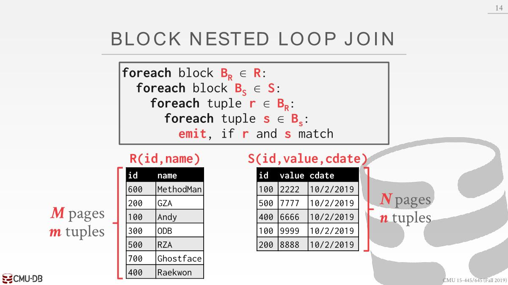
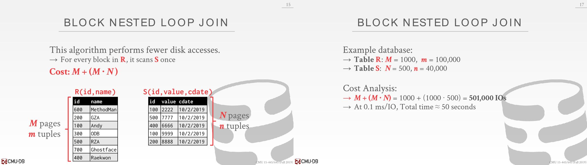
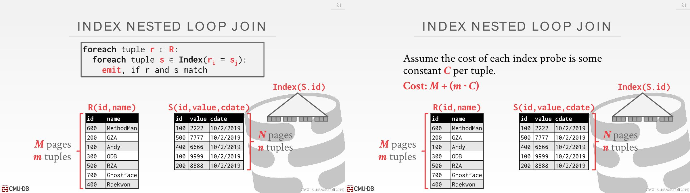

# Join Operator

## Operator Output

### Data

- The advantage of this approach is that future operators in the query plan **never need to go back to the base tables to get more data**. 
- The disadvantage is that this **requires more memory** to materialize the entire tuple.

这里可以在join operator时候添加个projection的操作，将多余的列去除掉。

### Record Ids

尽可能延迟获取所需要的列的操作，这样就不用上传一大堆数据。一开始就拿所有数据代价很大，因为另外一个数据可能在别的地方，甚至需要通过网络传输。

## Cost Analysis

- 分析不同join算法的开销： the number of disk I/Os used to compute the join. 
  - This includes I/Os incurred(*引起*) by reading data from disk as well as(*以及*) writing intermediate data out to disk.
  - We will ignore **output costs** since that depends on  the data and we cannot compute that yet.

# Join Algorithm

`M` pages in table `R`, `m` tuples in `R`
`N` pages in table `S`, `n` tuples in `S`

## Nested Loop Join

### Simple Nested Loop Join

match: join条件和where条件是否符合

读取M个page，遍历M个page中m个tuple，每一次tuple遍历都得读取一次S表（这里应该是考虑到没有那么多buffer去容纳整个S表，所以假设都从磁盘读，为了利用buffer，引出了下面的分块）

### Block Nested Loop Join

 

上面是让outer的每个tuple和inner的每个tuple join，现在是每个page join。

为了让该算法变快，需要outer表page数量更少（和tuple数量没关系）

每进行一次IO，读的都是一个page，会得到多个tuple。If the DBMS has `B` buffers available to compute the join, then it can use `B-2` buffers to scan the outer table. It will use one buffer to hold a block from the inner table and one buffer to store the output of the join. （其实就是一个block的情况没有利用完buffer，现在要将buffer全部利用完）

M+2：2代表innner table和output of join。`B>M+2`代表可以一下子把outer表放到buffer。

所以如果有足够的内存来放outer表中的数据，那么Nested Loop Join可能是Ok的。

### Index Nested Loop Join

- Why do basic nested loop joins suck(*糟糕*): For each tuple in the outer table, we must do a **sequential  scan** to check for a match in the inner table.
- We can avoid sequential scans by using an **index** to  find inner table matches.Build one on the fly (hash table, B+Tree).
  - Use an existing index for the join.
  - Build one on the fly(*动态*) (hash table, B+Tree).

- The outer table will be the one without an index. The inner table will be the one with the index.

### Conclusion

- Pick the smaller table as the outer table.
- Buffer as much of the outer table in memory as possible.
- Loop over the inner table or use an index.

## Sort-Merge Join

