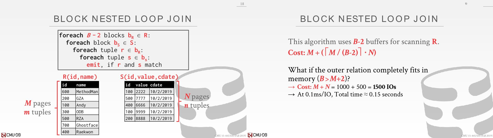
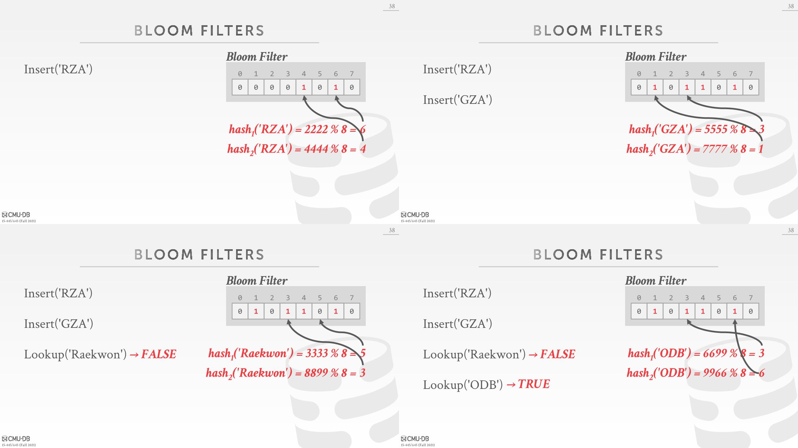

# Join Operator

## Operator Output

### Data

- The advantage of this approach is that future operators in the query plan **never need to go back to the base tables to get more data**. 
- The disadvantage is that this **requires more memory** to materialize the entire tuple.

这里可以在join operator时候添加个projection的操作，将多余的列去除掉。

### Record Ids

尽可能延迟获取所需要的列的操作，这样就不用上传一大堆数据。一开始就拿所有数据代价很大，因为另外一个数据可能在别的地方，甚至需要通过网络传输。

## Cost Analysis

- 分析不同join算法的开销： the number of disk I/Os used to compute the join. 
  - This includes I/Os incurred(*引起*) by reading data from disk as well as(*以及*) writing intermediate data out to disk.
  - We will ignore **output costs** since that depends on  the data and we cannot compute that yet.

# Join Algorithm

`M` pages in table `R`, `m` tuples in `R`
`N` pages in table `S`, `n` tuples in `S`

## Nested Loop Join

### Simple Nested Loop Join

match: join条件和where条件是否符合

读取M个page，遍历M个page中m个tuple，每一次tuple遍历都得读取一次S表（这里应该是考虑到没有那么多buffer去容纳整个S表，所以假设都从磁盘读，为了利用buffer，引出了下面的分块）

### Block Nested Loop Join

上面是让outer的每个tuple和inner的每个tuple join，现在是每个page join。

为了让该算法变快，需要outer表page数量更少（和tuple数量没关系）

每进行一次IO，读的都是一个page，会得到多个tuple。If the DBMS has `B` buffers available to compute the join, then it can use `B-2` buffers to scan the outer table. It will use one buffer to hold a block from the inner table and one buffer to store the output of the join. （其实就是一个block的情况没有利用完buffer，现在要将buffer全部利用完）

M+2：2代表innner table和output of join。`B>M+2`代表可以一下子把outer表放到buffer。

所以如果有足够的内存来放outer表中的数据，那么Nested Loop Join可能是Ok的。

### Index Nested Loop Join

- Why do basic nested loop joins suck(*糟糕*): For each tuple in the outer table, we must do a **sequential  scan** to check for a match in the inner table.
- We can avoid sequential scans by using an **index** to  find inner table matches.Build one on the fly (hash table, B+Tree).
  - Use an existing index for the join.
  - Build one on the fly(*动态*) (hash table, B+Tree).

- The outer table will be the one without an index. The inner table will be the one with the index.

### Conclusion

- Pick the smaller table as the outer table.
- Buffer as much of the outer table in memory as possible.
- Loop over the inner table or use an index.

## Sort-Merge Join

- Phase1 Sort: Sort both input tables on the join attribute. We can use the external merge sort algorithm.
- Phase2 Merge: Scan the two sorted tables in parallel, and emit matching tuples. 可能会触发inner table的回溯（扫描指针向上走），但是outer table不会。

没有遇到需要回溯的情况

遇到需要回溯的情况（这里需要回溯的原因可能是内存不够，丢弃了上一个page，所以回溯需要重新获取上一次的page）

最坏的情况是两个表需要join的列的值都是一样的，排序没有什么作用，变成了nested loop join。一般数据库可以识别这种，直接做笛卡尔积即可。

什么情况下使用：

- 要join的列已经排好序，比如聚簇索引的情况，这样就省去了排序的开销
- 查询语句order by要join的列

可以使用scan share，可以共享排序好的结果，但是MySQL/PostgreSQL不支持该特性，但是支持sort-merge，一般一些嵌入式数据库不支持sort-merge，只支持nested loop join和hash join。

## Hash Join

核心思想是通过hash区分到不同的partition，减少比较次数。如果数据都能放在内存，就可以使用linear hash table，否则可以使用bucket chain hash table。

- Phase1 **Build**: Scan the outer relation and populate a hash table using  the hash function `h1` on the join attributes.

- Phase2 **Probe**: Scan the inner relation and use `h1` on each tuple to jump  to a location in the hash table and find a matching tuple.

key: join的列的值

value: 取决于需要往查询计划上传递什么信息。Full tuple/Tuple ID(适用于列存储，不会从磁盘中获取不需要的信息)

### Probe Phase Optimization

可以添加一个布隆过滤器，在没有查看hash table的情况下判断key是否位于table，布隆过滤器速度很快，而且占用不大，可以放到内存中。

布隆过滤器只有两个操作：

- Insert(x): Use k hash functions to set bits in the filter to 1.
- Lookup(x): Check whether the bits are 1 for each hash function.

## Grace Hash Join

When the tables do not fit on main memory, you do not want the buffer pool manager constantly(*不断地*) swapping tables in and out.

- Phase1Build: Hash both tables(outer/inner table) on the join  attribute into partitions.
- Phase2 Probe: Compares tuples in  corresponding(*对应的*) partitions for each table. （取出同一个分区的所有bucket，循环遍历。提前partition，就可以知道tuple位于哪个partition）

hash table是bucket chain hash table。

If the buckets do not fit in memory, then use  **recursive partitioning** to split the tables into  chunks that will fit(*将表分成适合内存的块*).

- Build another hash table for bucketR,i using hash  function h2 (with h2≠h1). （进行第二轮partition）
- Then probe it for each tuple of the other table's bucket **at  that level**.

# Observation

- If the DBMS knows the size of the outer table,  then it can use a static hash table: Less computational overhead for build / probe  operations.
- If we do not know the size, then we have to use a  dynamic hash table or allow for overflow pages. (多个操作之间所产生的临时中间表大小，比如join多个表)

- Hashing is almost always better than sorting for operator execution.
  - Sorting is better on non-uniform(*不均匀分布*) data.
  - Sorting is better when result needs to be sorted.

