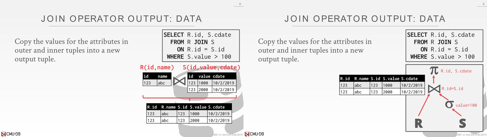

# Join Operator

## Operator Output

### Data

- The advantage of this approach is that future operators in the query plan **never need to go back to the base tables to get more data**. 
- The disadvantage is that this **requires more memory** to materialize the entire tuple.

这里可以在join operator时候添加个projection的操作，将多余的列去除掉。

### Record Ids

尽可能延迟获取所需要的列的操作，这样就不用上传一大堆数据。一开始就拿所有数据代价很大，因为另外一个数据可能在别的地方，甚至需要通过网络传输。

## Cost Analysis

- 分析不同join算法的开销： the number of disk I/Os used to compute the join. 
  - This includes I/Os incurred(*引起*) by reading data from disk as well as(*以及*) writing intermediate data out to disk.
  - We will ignore **output costs** since that depends on  the data and we cannot compute that yet.

# Join Algorithm

`M` pages in table `R`, `m` tuples in `R`
`N` pages in table `S`, `n` tuples in `S`

## Simple Nested Loop Join

match: join条件和where条件是否符合

读取M个page，遍历M个page中m个tuple，每一次tuple遍历都得读取一次S表（one disk I/O to read each tuple,  there is no caching or access locality）

## Block Nested Loop Join

上面是让outer的每个tuple和inner的每个tuple join，现在是每个page join