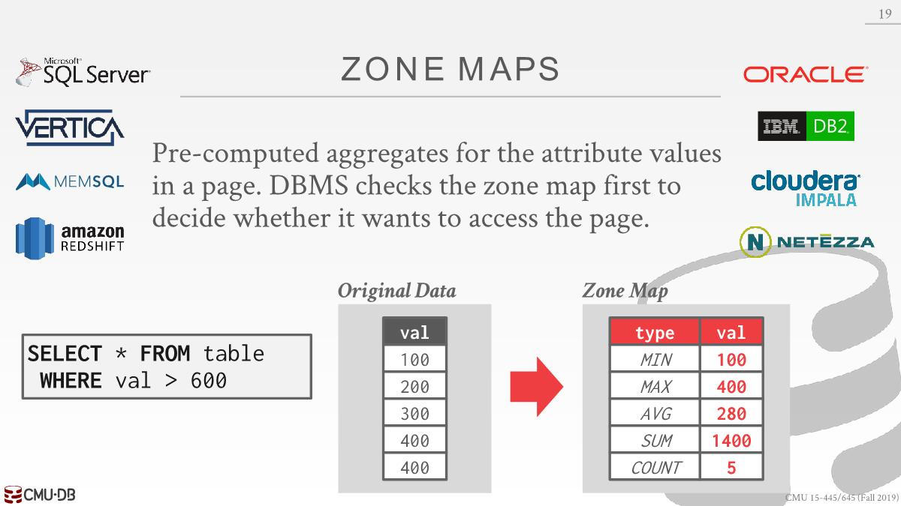
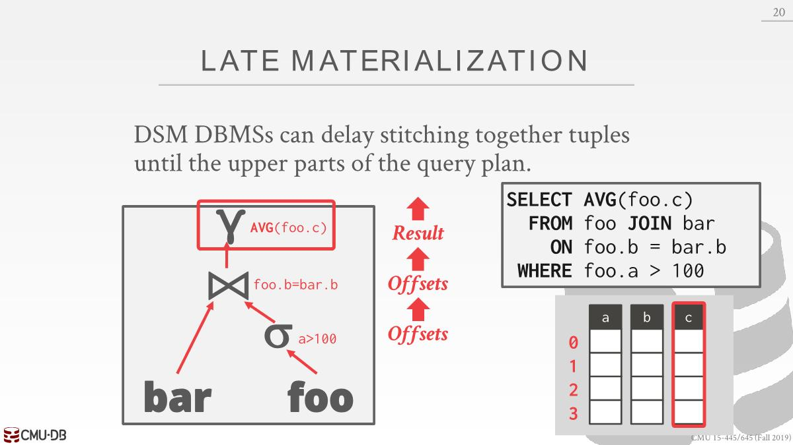
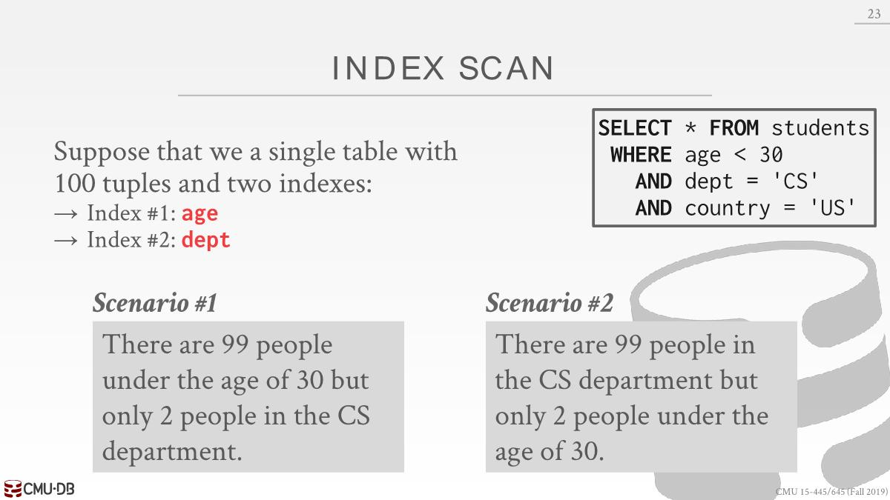
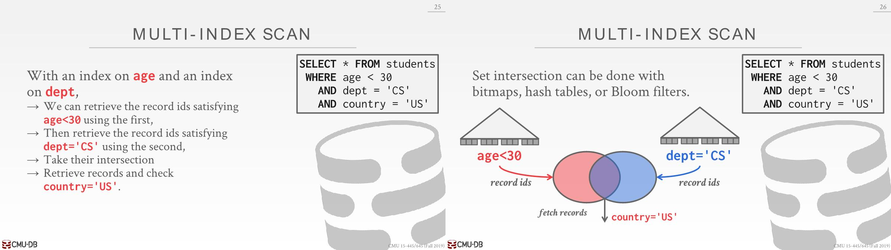

# Processing Models

A DBMS `processing model` defines how the system executes a query plan. There are different models that have various trade-offs(*权衡*) for different workloads.

## Iterator Model

- This is the most common processing model and is used by almost every (row-based) DBMS

- Every query plan operator implements a `next` function
  - On each call to `next`, the operator returns either **a single tuple** or a null marker if there are no more tuples.
  - The operator implements a loop that calls `next` on its children to retrieve their tuples and then process them (i.e., calling next on a parent calls `next` on their children).


在我们对下一条数据处理前，我们想在内存中尽可能多的对当前这条数据做处理工作，磁盘IO开销太大了。

Some operators will block until children emit all of their tuples (joins, subqueries, order by). These are known as `pipeline breakers`.

## Materialization Model

- Every query plan operator implements an `output` function. 
  - The operator processes **all the tuples** from its children at once.
  - The DBMS can push down hints into to avoid scanning  too many tuples. （比如使用了limit）
  - 可以是以行为单位发送所需要的数据，也可以是以列


This approach is better for OLTP workloads because queries typically only access a small number of tuples at a time. 

Thus, there are fewer function calls to retrieve tuples. 

Not good for OLAP queries with large intermediate results because the DBMS may have to spill those results to disk between operators. （主要还是OLAP的数据量太大了，如果较小能全部放到内存则这个很好，这个适用于内存型数据库，面向磁盘的OLAP采用下面的方法更点，用来保存中间结果的内存量很小，不会溢出到磁盘）

## Vectorization Model

Each operator emits a batch of tuples instead of a  single tuple. The size of the batch can vary based on hardware or  query properties.


This approach is ideal for OLAP queries that have to scan a large number of tuples because there are fewer invocations of the next function.

# Plan Processing Direction

- Top-to-Bottom: Start with the root and "pull" data up from its children. Tuples are always passed with function calls. （上面三种都是这个）
- Bottom-to-Top:  Start with leaf nodes and push data to their parents. Allows for tighter(*更严格*) control of caches/registers in pipelines.

对于面向磁盘数据库采用第一种更好，面向内存采用第二种更好

# Access Methods

An access method is a way that the  DBMS can access the data stored in a  table.

## Sequential Scan

- For each page in the table

  - Retrieve it from the buffer pool.

  - Iterate over each tuple and check whether to include it.

    ```c
    for page in table.pages:
        for t in page.tuples:
            if evalPred(t):
                // Do Something!
    ```

- Optimizations:

  - **Prefetching**: Fetches next few pages in advance(*提前*) so that the DBMS does not have to block when accessing each page.

  - **Parallelization**: Execute the scan using multiple threads/processes in parallel.

  - **Buffer Pool Bypass**: The scan operator stores pages that it fetches from disk in its local memory instead of the buffer pool. This avoids the sequential flooding problem.

  - **Zone Map**
    
    查询val>600之前发现MAX最大为400，所以不用遍历该page。有些系统把zone map保存到专属的page中，上面保存了不同page的zone map，有些则是在buffer中，或者page中。

    一般不会再OLTP中使用，因为得维护zone map，对于OLAP读多写少来说则会更好

  - **Late Materialization**: Each operator passes the minimal amount of information needed to by the next operator (e.g., record id). This is only useful in column-store systems (i.e., DSM).

    
    在列式存储中，为了获取单个tuple所有的数据，得做一大堆读操作，因为tuple的列被拆散了，想要尽可能延迟读取这些额外的列。对于a>100，只需要将tuple对应的b列的offset值上传即可，该a列中的数据最终其实并不需要的，对于b同理。对于c则需要从磁盘中获取这一列计算。

  - **Clustering Index**: Tuples are sorted in the heap's pages  using the order specified by a  clustering index. If the query accesses tuples using the  clustering index's attributes, then the  DBMS can jump directly to the pages  that it needs.

## Index Scan

The DBMS picks an index (or indexes) to find the tuples that the query needs.



If there are multiple indexes that the DBMS can  use for a query. Postgres calls this Bitmap Scan



组织id可以使用bitmaps, hash tables, or Bloom filters等
