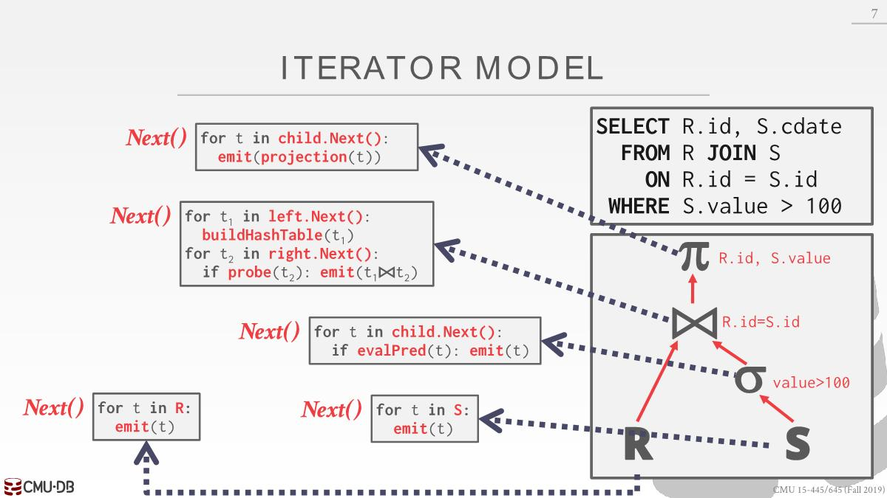
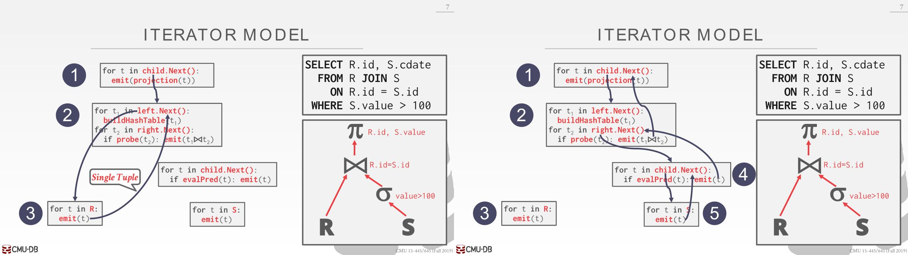
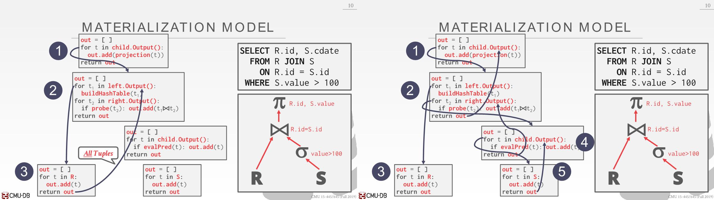
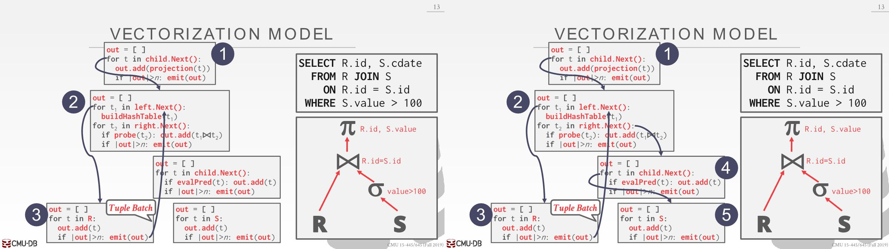

# Processing Models

A DBMS `processing model` defines how the system executes a query plan. There are different models that have various trade-offs(*权衡*) for different workloads.

## Iterator Model

- This is the most common processing model and is used by almost every (row-based) DBMS

- Every query plan operator implements a `next` function
  - On each call to `next`, the operator returns either **a single tuple** or a null marker if there are no more tuples.
  - The operator implements a loop that calls `next` on its children to retrieve their tuples and then process them (i.e., calling next on a parent calls `next` on their children).

在我们对下一条数据处理前，我们想在内存中尽可能多的对当前这条数据做处理工作，磁盘IO开销太大了。

Some operators will block until children emit all of their tuples (joins, subqueries, order by). These are known as `pipeline breakers`.

## Materialization Model

- Every query plan operator implements an `output` function. 
  - The operator processes **all the tuples** from its children at once.
  - The DBMS can push down hints into to avoid scanning  too many tuples. （比如使用了limit）
  - 可以是以行为单位发送所需要的数据，也可以是以列

This approach is better for OLTP workloads because queries typically only access a small number of tuples at a time. 

Thus, there are fewer function calls to retrieve tuples. 

Not good for OLAP queries with large intermediate results because the DBMS may have to spill those results to disk between operators. （主要还是OLAP的数据量太大了，如果较小能全部放到内存则这个很好，这个适用于内存型数据库，面向磁盘的OLAP采用下面的方法更点，用来保存中间结果的内存量很小，不会溢出到磁盘）

## Vectorization Model

Each operator emits a batch of tuples instead of a  single tuple. The size of the batch can vary based on hardware or  query properties.

This approach is ideal for OLAP queries that have to scan a large number of tuples because there are fewer invocations of the next function.

# Plan Processing Direction

- Top-to-Bottom: Start with the root and "pull" data up from its children. Tuples are always passed with function calls. （上面三种都是这个）
- Bottom-to-Top:  Start with leaf nodes and push data to their parents. Allows for tighter(*更严格*) control of caches/registers in pipelines.

对于面向磁盘数据库采用第一种更好，面向内存采用第二种更好

