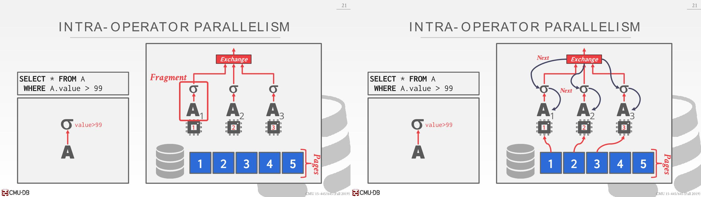
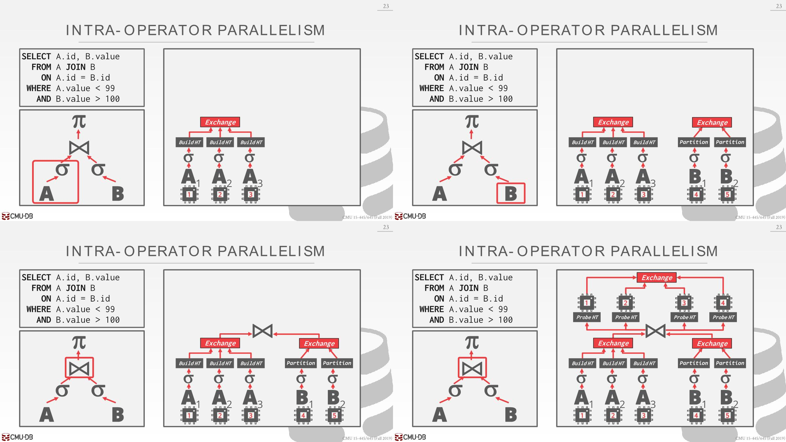
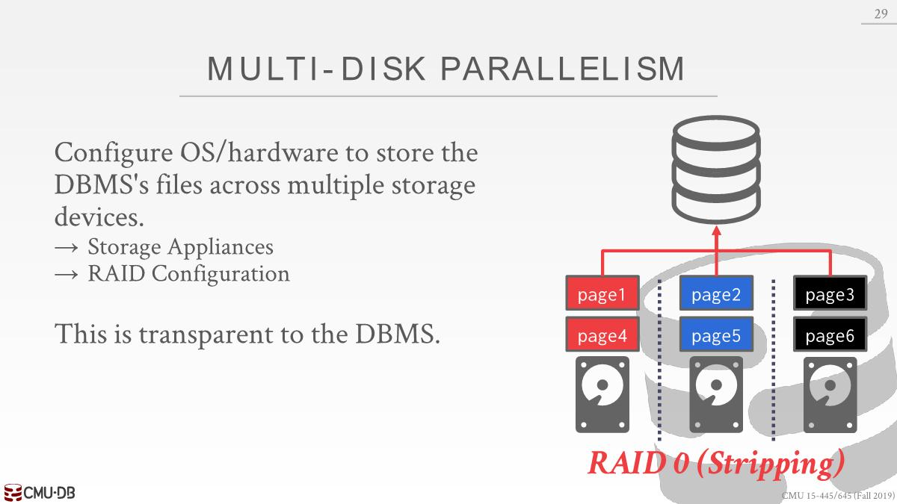
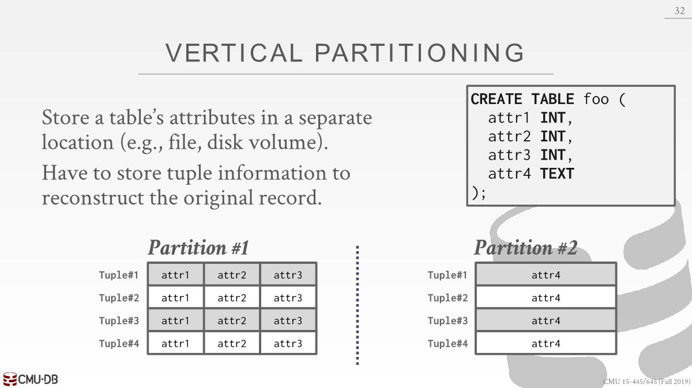
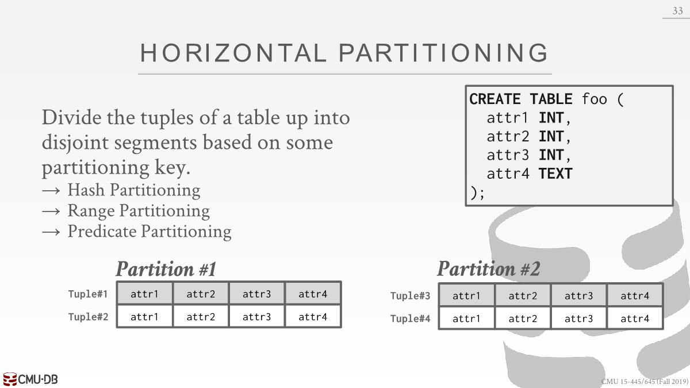

# Process Models

The DBMS is comprised of more or more `workers` that are responsible for executing tasks on behalf of the client and returning the results. （worker可以是一个进程也可以是一个线程）

## Process per Worker

- Each worker is a separate OS process, and thus relies on OS scheduler.
-  Use shared memory for global data structures.

每个进程上有同一个page的副本，浪费内存，解决方法是使用共享内存，OS提供了支持。

好处是如果代码有bug进程崩溃了，不至于整个系统都崩溃。

老系统(1970)使用了这种方案：IBM DB2,Postgres,Oracle。即使当时已经出现了线程，但是没有标准的api，有各种OS，不好扩展DB到不同的OS，但是每个OS都有fork和join。

## Process Pool

- A worker uses any process that is free in a pool.
- Still relies on OS scheduler and shared memory.
- This approach can be bad for CPU cache locality due to no guarantee of using the same process between queries.

## Thread per Worker

- Single process with multiple worker threads.
-  DBMS has to manage its own scheduling.
- Although a thread crash (may) kill the entire system, we have to make sure that we write high-quality code to ensure that this does not happen.

- Using a multi-threaded architecture has advantages that there is less overhead per context switch and you do not have to manage shared model. 

- The thread per worker model does not mean that you have intra-query parallelism. （无法保证拆分查询后可以多个线程并行执行这些任务）

- For each query plan, the DBMS has to decide where, when, and how to execute. The DBMS always knows more than the OS.
  - How many tasks should it use?
  - How many CPU cores should it use?
  - What CPU core should the tasks execute on?
  - Where should a task store its output?

#  Parallelism

- Inter-Query: 同时执行多个查询来提高 DBMS 的整体性能
- Intra-Query: 并行执行单个查询的操作（通过并行执行其operator来提高单个查询的性能，每个relational operator(*关系运算符*)都有并行算法）

## Intra-Query Parallelism

- Decompose(*分解*) operators into independent fragments that  perform the same function on different subsets of data.

- The DBMS inserts an `exchange` operator into the  query plan to coalesce(*合并*) results from children operators.（所有DBMS都是通过这种方式来做到并行执行，甚至分布式DBMS也是按照这种套路来并行执行）
- In general, there are three types of exchange operators
  - **Gather**: Combine the results from multiple workers into a single output stream. This is the most common type used in parallel DBMSs.
  - **Repartition**: Reorganize multiple input streams across multiple output streams. This allows the DBMS take inputs that are partitioned one way and then redistribute(*重新分配*) them in another way.
  - **Distribute**: Split a single input stream into multiple output streams.

对A循序扫描，然后将结果传入filter operator。为了做到并行执行查询，将这个查询计划分为3个不同的fragment，每个fragment中都有一个scan operator以及filter operator。它们会在同一时间在不同的CPU core上并行执行这些任务。

对A并行扫描，分配三个不同的worker线程执行，在查询计划任务的fragment中，对fragment进行scan操作，然后filter操作，接着会去构建hashtable。在例子中，hashtable是全局的，由worker一起维护，因为扫描的时候不知道表中有哪些数据，如果hashtable是分开的，join的时候需要去查看所有的hashtable。接着对B并行扫描，完事后多线程进行join操作。

## I/O Parallelism

Using additional processes/threads to execute queries in parallel will not improve performance if the disk is always the main bottleneck(*瓶颈*). Thus, we need a way to split the database up across multiple storage devices.

### Multi-Disk Parallelism

Configure OS/hardware to store the DBMS’s files across multiple storage devices.

Can be done through storage appliances and RAID configuration. 

This is transparent(*透明的*) to the DBMS. It cannot have workers operate on different devices because it is unaware of the underlying parallelism(*不知道底层的并行性*).

写数据时RAID控制器根据Round-Robin(*轮流*)策略决定应该写到哪个存储设备上

### File-based Partitioning

Some DBMSs allow you to specify the disk location of each individual database. The buffer pool manager maps a page to a disk location. This is also easy to do at the file-system level if the DBMS stores each database in a separate directory. However, the log file might be shared.

one file per database or one directory for database

可以通过链接的方式将数据联系起来

### Logical Partitioning

Split single logical table into disjoint physical segments(*不相交的物理段*) that are stored/managed separately. Such partitioning is ideally transparent to the application. That is, the application should be able to access logical tables without caring how things are stored.

#### Vertical Partitioning

#### Horizontal Partitioning

