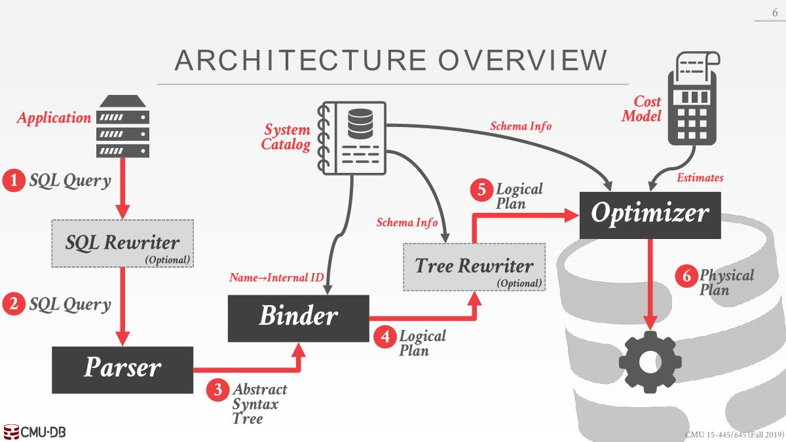

# Query Optimization

- Heuristics / Rules
  - Rewrite the query to remove stupid / inefficient(*愚蠢/低效*) things.
  - These techniques may need to examine catalog, but they  do not need to examine data.
- Cost-based Search
  - Use a model to estimate(*估计*) the cost of executing a plan.
  - Evaluate multiple equivalent plans for a query and pick  the one with the lowest cost.

# Architecture Overview

- SQL Rewriter：通过某些转换规则以某种方式对SQL语句进行重写，传统优化，并不常见

- Binder：将SQL查询中所引用的named object(命名对象)转换为某种内部标识符(internal identifier)。通过查询catalog，有无该表、列等。

- Logical Plan：这个查询想要干什么，比如join两张表，但是并不会说怎么实际执行这个查询(Physical Plan)。

- Tree Rewriter：比SQL Rewriter更常见。静态规则重写，不需要查表数据，只需要查表结构。
- Optimizer：使用成本模型找出最合适的方案

# Relational Algebra Equivalences

关系代数等价：

Two relational algebra expressions are equivalent if they generate the same set of tuples.

The DBMS can identify better query plans without  a cost model.

This is often called query rewriting.

