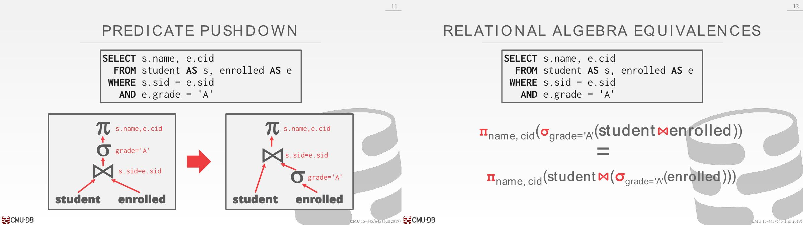
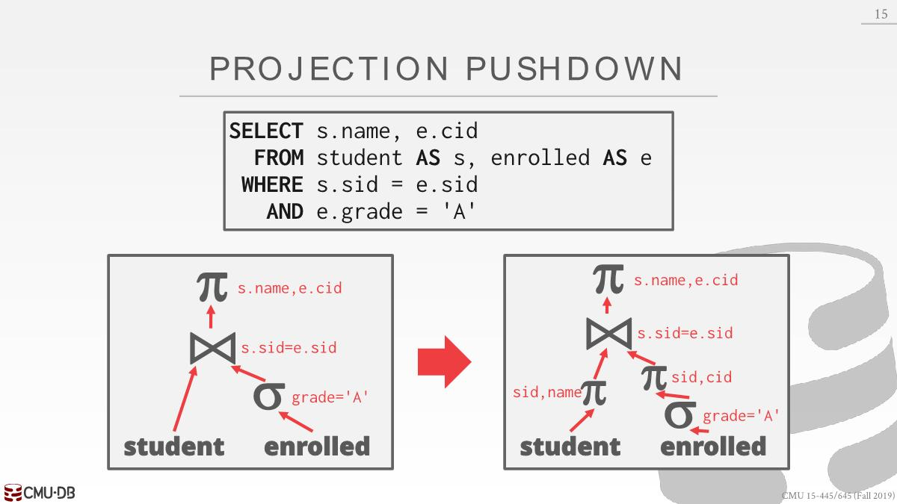
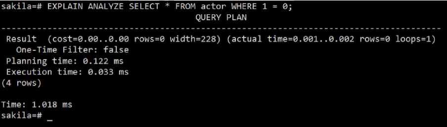
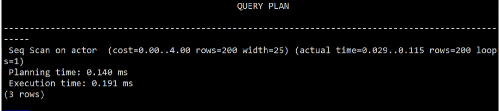
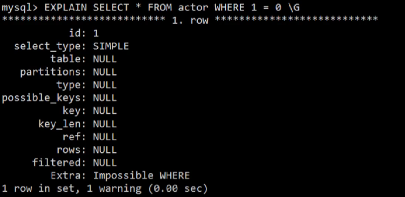
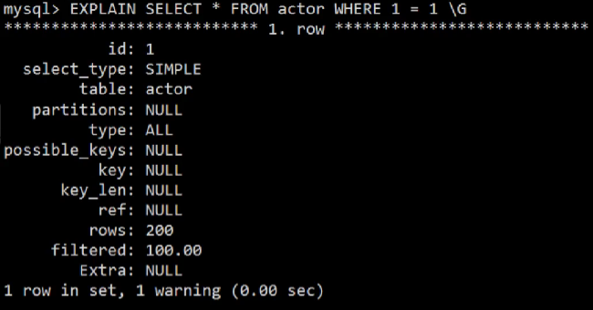

# Query Optimization

- Heuristics / Rules
  - Rewrite the query to remove stupid / inefficient(*愚蠢/低效*) things.
  - These techniques may need to examine catalog, but they  do not need to examine data.
- Cost-based Search
  - Use a model to estimate(*估计*) the cost of executing a plan.
  - Evaluate multiple equivalent plans for a query and pick  the one with the lowest cost.

# Architecture Overview


- SQL Rewriter：通过某些转换规则以某种方式对SQL语句进行重写，传统优化，并不常见

- Binder：将SQL查询中所引用的named object(命名对象)转换为某种内部标识符(internal identifier)。通过查询catalog，有无该表、列等。

- Logical Plan：这个查询想要干什么，比如join两张表，但是并不会说怎么实际执行这个查询(Physical Plan)。

- Tree Rewriter：比SQL Rewriter更常见。静态规则重写，不需要查表数据，只需要查表结构。
- Optimizer：使用成本模型找出最合适的方案

# Relational Algebra Equivalences

关系代数等价：

Two relational algebra expressions(*关系代数表达式*) are equivalent if they generate the same set of tuples.

The DBMS can identify better query plans without  a cost model.

This is often called `query rewriting`.

## Predicate Push-down

谓词下推：Perform filters as early as possible. 重排序谓词，以便先执行有选择性的谓词。



## Projections Push-down

Perform them early to create smaller tuples and reduce  intermediate results. This is not important for a column store.



## More

- Impossible / Unnecessary Predicates:

  ```sql
  SELECT * FROM A WHERE 1 = 0;
  SELECT * FROM A WHERE 1 = 1;
  ```

  在Postgresql中，one-time filter为false表示不会返回任何东西
  
  1=1则是全表扫描

  在MySQL中，看Impossible Where
  
  

- Join Elimination(*消除*)

  id不能为NULL的情况下，NULL != NULL

  ```sql
  SELECT A1.*
  	FROM A AS A1 JOIN A AS A2
  		ON A1.id = A2.id;
  ```

  ```sql
  SELECT * FROM A;
  ```

- Ignoring Projections

  ```sql
  SELECT * FROM A AS A1
  	WHERE EXISTS(SELECT val FROM A AS A2
  		WHERE A1.id = A2.id);
  ```

  ```sql
  SELECT * FROM A;
  ```

- Merging Predicates

  ```sql
  SELECT * FROM A
  	WHERE val BETWEEN 1 AND 100
  		OR val BETWEEN 50 AND 150;
  ```

  ```sql
  SELECT * FROM A
  	WHERE val BETWEEN 1 AND 150;
  ```


