# Cost-based Query Optimization

衡量SQL的开销指标：

- CPU: 成本小，难以估计
- Disk: Number of block transferred.
- Memory: Amount of DRAM used.
- Network: Number of messages transfered.

It is too expensive to run every possible plan to  determine this information, so the DBMS need a  way to derive(*获取*) this information.

To accomplish this(*为此*), the DBMS stores internal statistics about tables, attributes, and indexes in its internal catalog.

Different systems update them at different times.

# Statistics

For each relation `R`, the DBMS maintains the following information:

- $N_R$: Number of tuples in `R`.
- $V(A,R)$: Number of distinct values for attribute `A`.

- The `selection cardinality` $SC(A,R)$ is the  average number of records with a value for an  attribute `A` given $N_R / V(A,R)$. 本意是想求出每个去重属性的值出现的次数，这里假设数据是分布均匀的，但是在现实不会这样。通过使用`SC`来计算children operator要提供的数据量。

## Complex Predicates

selectivity (`sel`): 针对表的一个给定条件，算出表中符合条件的tuple的比例，计算方式取决于操作类型

### Equality

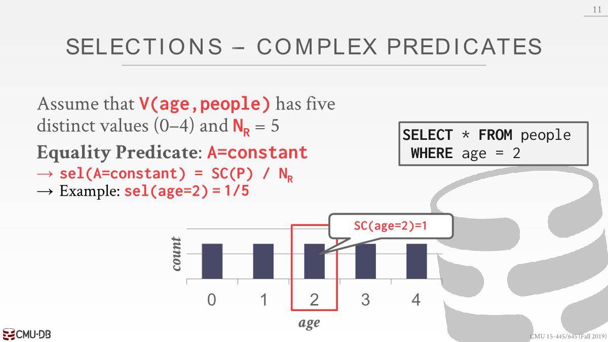

这里$V(P, age)=5$，自然$SC(P)=N_R/V(P,age)=1$

### Range

这里算出的结果是1/2，但是正确结果应该是3/5，公式算出来的结果不一定对

### Negation

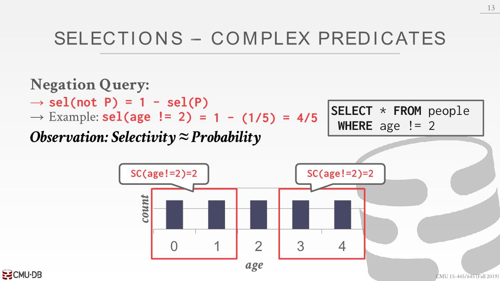

### Conjunction

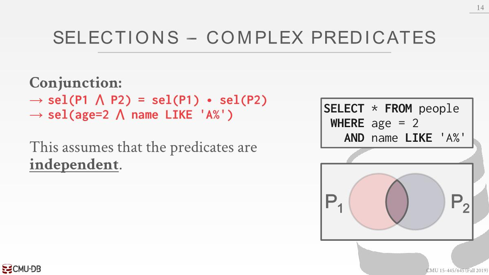

### Disjunction

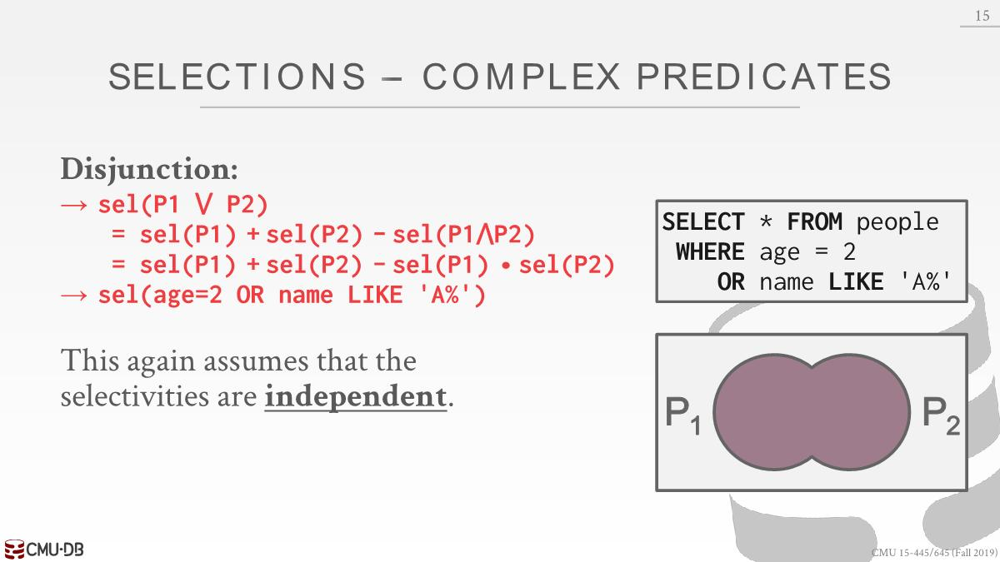

## Statistics Storage

在数据库系统中使用analyze或者stats时，系统会我们生成这种数据，并将这些信息保存在我们的catalog中并持久化。

### Histograms

上面假设的数据分布都是均匀的，都是独立的

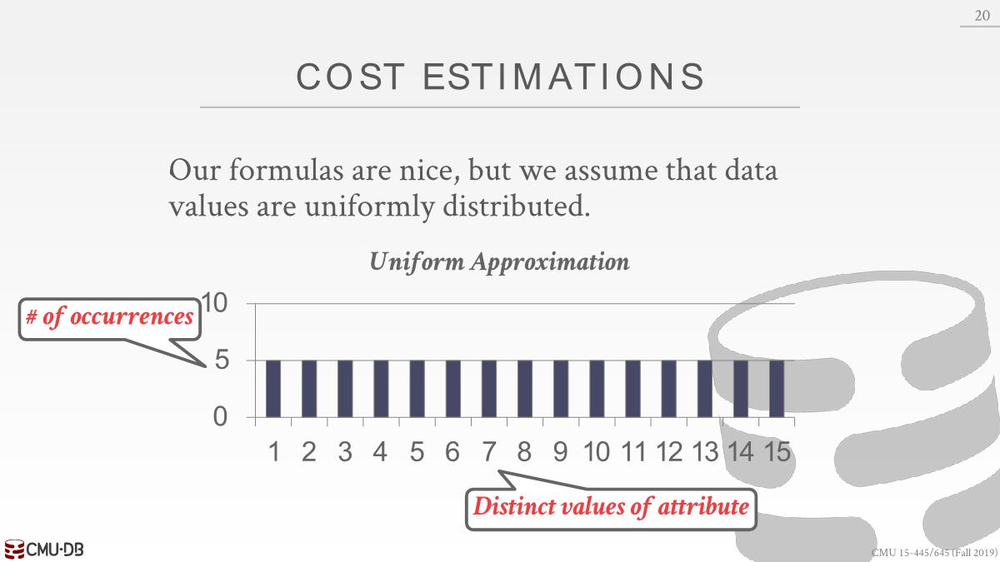

但是在现实中不会这样，因此维护histograms(*直方图*)的成本可能会很高。可以把把多个值放入一个bucket里面，避免逐值存储。每个bucket的值为该bucket里面每个值出现次数的总和。比如想要查看2出现的次数大概是多少，会定位到bucket1，预测出现3次(9/3)

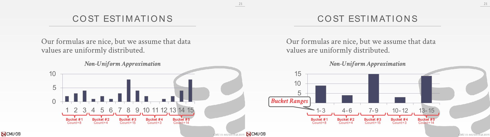

但是这样可能会出现一个问题，比如8的值很大，但是7和9的值很小，这样平均起来会造成预测的偏差更大。可以使用quantiles(分位数)，调整bucket的大小，使它们的分布相同，它们各自持有相似数量的值。

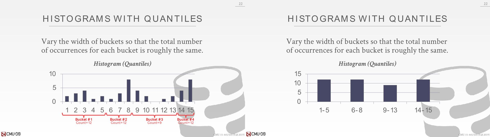

### Sampling

Modern DBMSs also collect samples(*抽样*)  from tables to estimate selectivities. 当基础表发生显着变化时更新样本。

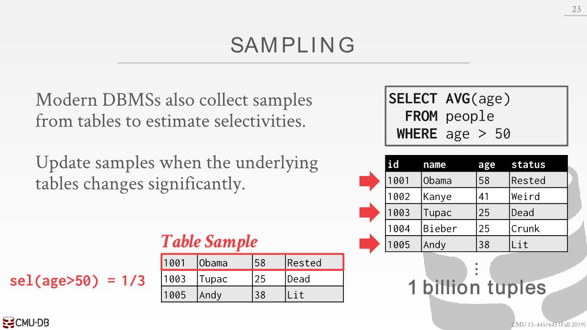

# Query Optimization

## Single Relation

- 需要解决的问题：

  1. 选出最佳的access method：Sequential Scan、Binary Search (clustered indexes)、Index Scan

  2. 选出比较有选择性的条件进行过滤
- Simple heuristics are often good enough for this. Query planning for OLTP queries is easy because 
  they are sargable (Search Argument Able).
  - Queries where it easy to pick the right index to use are called sargable
  - 查看所有适用的索引，然后选出那个具有最佳选择率的索引。
  

## Multiple Relation

### Left-Deep

- For an `n`-way join, the number of different ways to order the join operations is known as a Catalan number (approx $4^n$ alternative plans).

- This is too large of a solution space and it is infeasible(*不可能*) for the DBMS to consider all possible plans. Thus, we need a way to reduce the search complexity.

- For example, in IBM’s System R, they only considered `left-deep` join trees。join operator顺序不同不影响最终的结果。这样做的好处是只需要将join的结果向上传递就行，不需要额外花费磁盘存储，像第三种方案，CD join后的结果还得保存起来，再join AB的。
  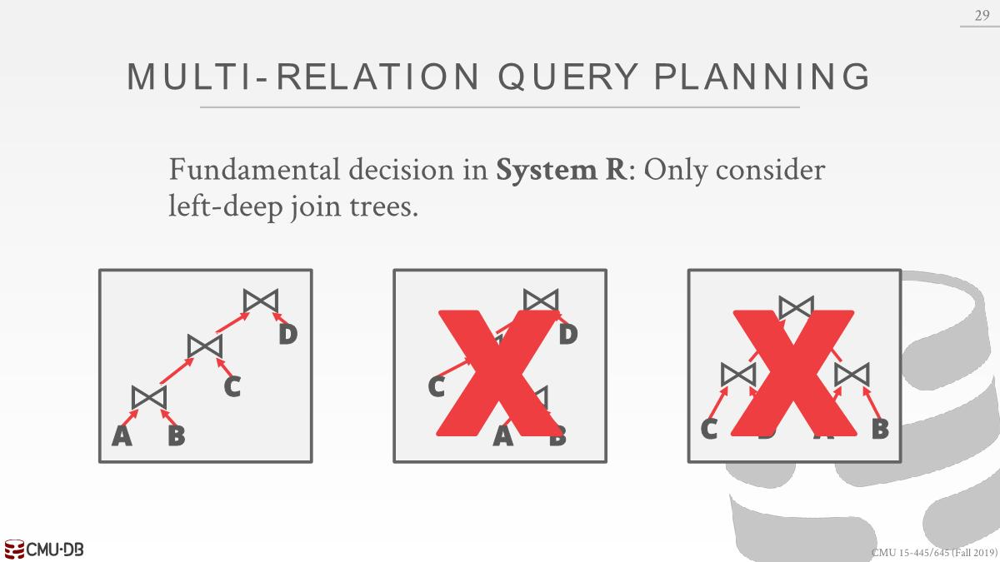

  上述类型分别为Left-deep, Right-deep, bushy

### Dynamic Programming

如何枚举所有的可能性呢，需要枚举所有的join operator顺序（Left-deep tree #1, Left-deep tree #2…），然后为每个join operator枚举算法（Hash, Sort-Merge, Nested Loop…），还得枚举每个表访问方式（ Index #1, Index #2, Seq Scan…）。这样就很麻烦，需要枚举的东西有很多，可以使用dp(dynamic programming)去处理这个问题。

1. 弄清楚第一次应该先join哪两张表
2. 然后算出使用不同的join算法的成本（通过公式算出磁盘io次数）
3. 只保留成本最低的那个join算法
4. 进行同样的操作，算出不同join operator的成本

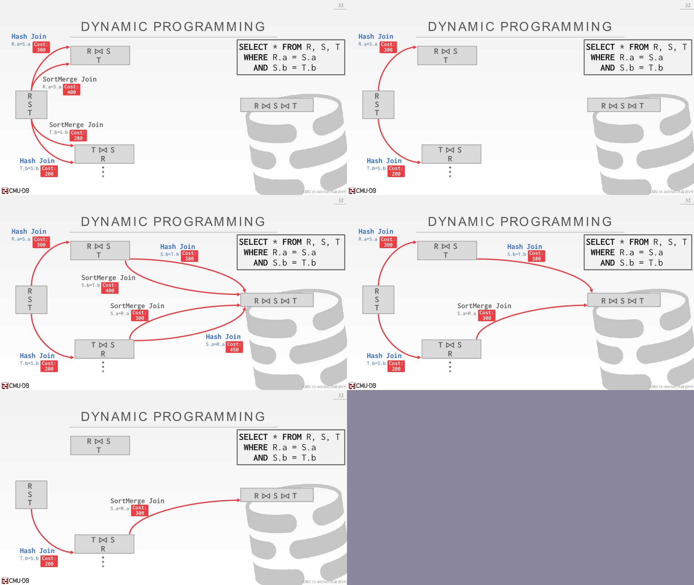

MySQL、PG、ORACLE都会这样做。上述忽略了很多需要思考的点，比如每个join operator会向上传递的数据量、是否需要排序、有没有被压缩、行存储还是列存储。

比较详细的过程如下：

1. Enumerate relation orderings。去除掉相同结果的枚举，比如join TS和join ST
   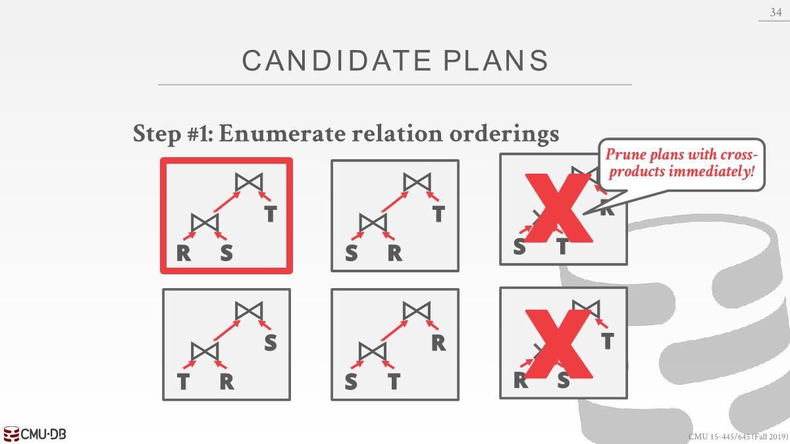
2. Enumerate join algorithm choices
   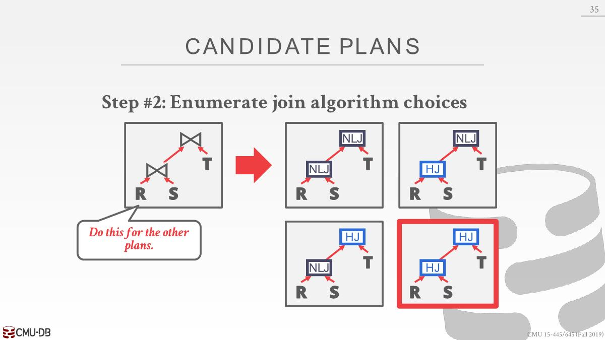

3. Enumerate access method choices
   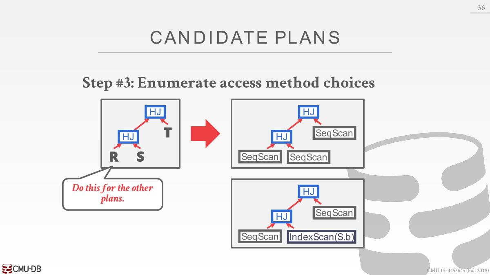

4. 使用dp确定最优化路径

### Postgres Optimizer

- support all types of join trees：Left-deep, Right-deep, bushy

- Two optimizer implementations: Traditional Dynamic Programming Approach、Genetic(*遗传*) Query Optimizer (GEQO)
  - Postgres uses the traditional algorithm when # of  tables in query is less than 12 and switches to GEQO when there are 12 or more.

GEQO：

1st Generation：以某种方式随机生成一堆配置（包括上面的提到的三种），计算出这些配置的成本，选出最佳方案，丢弃最高成本的方案，将成本低的方案的特征结合在一起，根据特征再次随机生成计划。

2nd Generation以及后面的都是这样，直到超时，并没有找到比现有最佳方案还要好的方案。

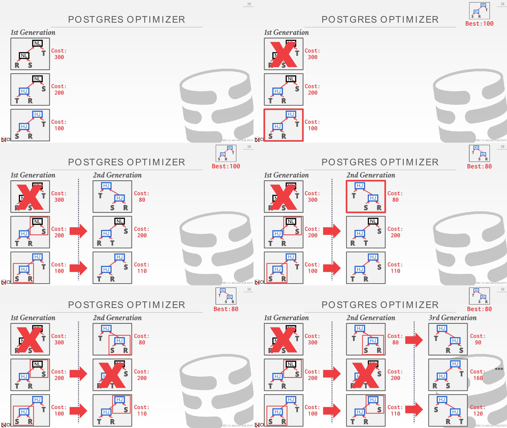
