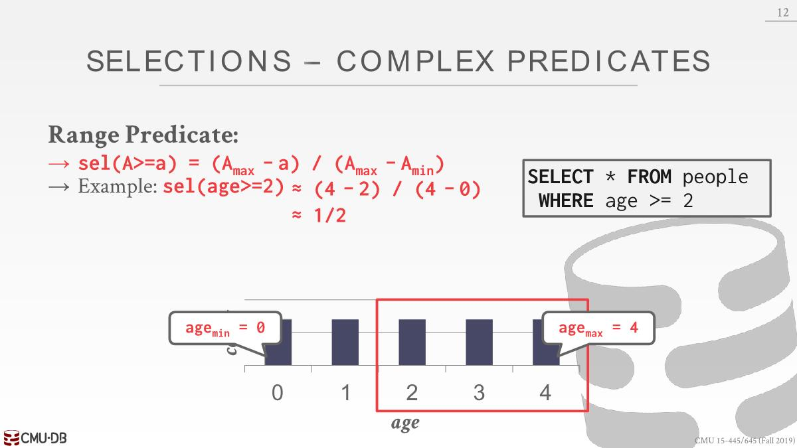

# Cost-based Query Optimization

如果要对n张表进行join，总共有4^n(Catalan number)个排列，不可能一一枚举来决定哪个join最优，所以还需要一个成本模型去决定哪条查询成本最低。

衡量SQL的开销指标：

- CPU: 成本小，难以估计
- Disk: Number of block transferred.
- Memory: Amount of DRAM used.
- Network: Number of messages transfered.

It is too expensive to run every possible plan to  determine this information, so the DBMS need a  way to derive(*获取*) this information.

To accomplish this(*为此*), the DBMS stores internal statistics about tables, attributes, and indexes in its internal catalog.

Different systems update them at different times.

# Statistics

For each relation `R`, the DBMS maintains the following information:

- $N_R$: Number of tuples in `R`.
- $V(A,R)$: Number of distinct values for attribute `A`.

- The `selection cardinality` $SC(A,R)$ is the  average number of records with a value for an  attribute `A` given $N_R / V(A,R)$. 本意是想求出每个去重属性的值出现的次数，这里假设数据是分布均匀的，但是在现实不会这样。通过使用`SC`来计算children operator要提供的数据量。

## Complex Predicates

selectivity (`sel`): 针对表的一个给定条件，算出表中符合条件的tuple的比例，计算方式取决于操作类型

### Equality

这里$V(P, age)=5$，自然$SC(P)=N_R/V(P,age)=1$

### Range

这里算出的结果是1/2，但是正确结果应该是3/5，公式算出来的结果不一定对

### Negation

### Conjunction

### Disjunction

## Statistics Storage

在数据库系统中使用analyze或者stats时，系统会我们生成这种数据，并将这些信息保存在我们的catalog中并持久化。

### Histograms

上面假设的数据分布都是均匀的，都是独立的

但是在现实中不会这样，因此维护histograms(*直方图*)的成本可能会很高。可以把把多个值放入一个bucket里面，避免逐值存储。每个bucket的值为该bucket里面每个值出现次数的总和。比如想要查看2出现的次数大概是多少，会定位到bucket1，预测出现3次(9/3)

但是这样可能会出现一个问题，比如8的值很大，但是7和9的值很小，这样平均起来会造成预测的偏差更大。可以使用quantiles(分位数)，调整bucket的大小，使它们的分布相同，它们各自持有相似数量的值。

### Sampling

Modern DBMSs also collect samples(*抽样*)  from tables to estimate selectivities. 当基础表发生显着变化时更新样本。

