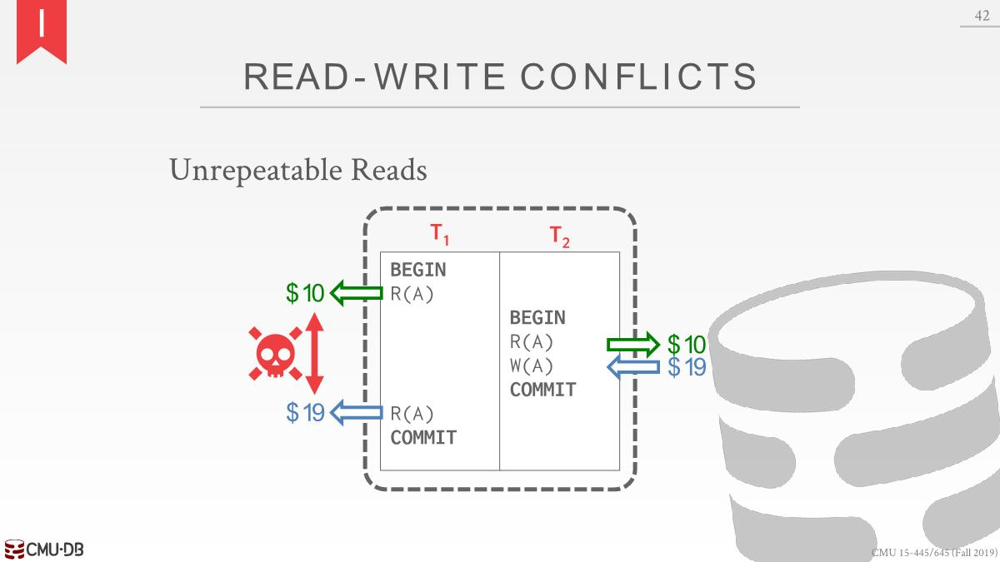
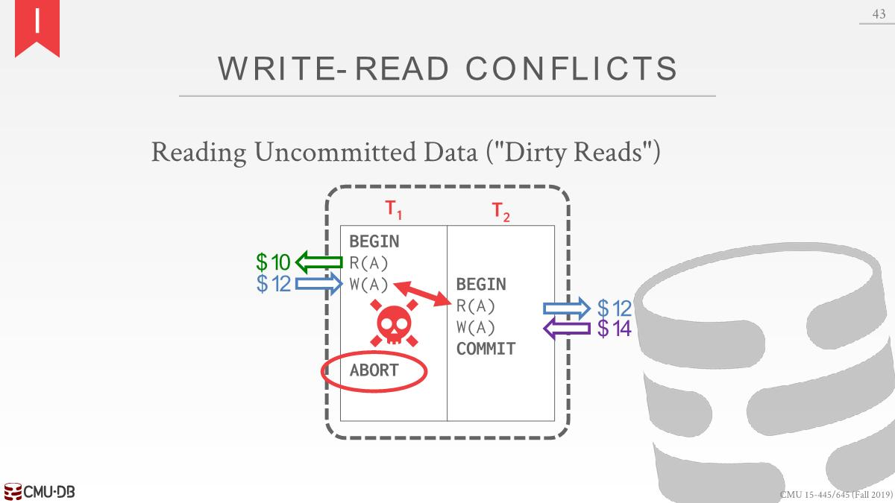
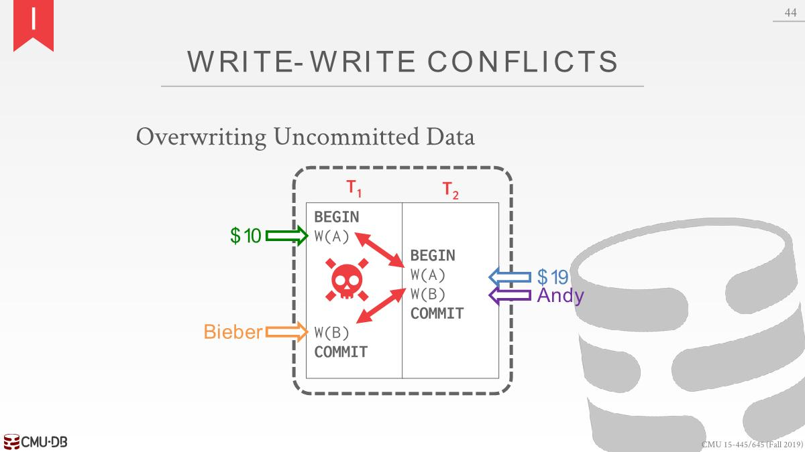

# ACID: Consistency

All questions (i.e., queries) that the application asks about the data will return correct results.

- Database Consistency
  - The database accurately(*准确地*) represents the real world entity it is modeling(*正在建模的*) and follows integrity constraints(*遵循完整性约束*). 防止不符合规范的数据
  - Transactions in the future see the effects of transactions committed in the past inside of the database. 分布式系统看重，不支持ACID的NOSQL可能在看不到之前的事务修改，因为还没有被传播。
- Transaction Consistency

# ACID: Isolation

A `concurrency control protocol` is how the DBMS decides the proper interleaving(*适当的交错*) of operations from multiple transactions.

There are two categories of concurrency control protocols: `Pessimistic`, `Optimistic`

## Interleaves Execution Anomalies

交错执行异常情况

### Read-Write Conflicts

**Unrepeatable Reads**: A transaction is not able to **get the same value** when reading the same object multiple times.

### Write-Read Conflicts

**Dirty Reads**: 事务在另一个事务提交其更改之前查看该事务的写效果。

### Write-Write conflict 

Lost Updates: One transaction **overwrites** the uncommitted data of another concurrent transaction

