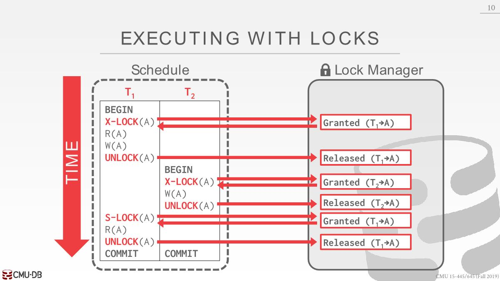
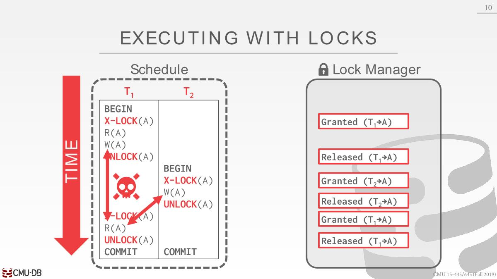

# Locks

we need a way to guarantee that all execution  schedules are correct (i.e., serializable) without  knowing the entire schedule ahead of time.

Solution: Use `locks` to protect database objects.

## Basic Lock Types

S-Lock、X-Lock

- The DBMS contains a centralized(*集中式*) lock manager that decides decisions whether a transaction can have a lock or not. It has a global view of whats going on inside the system.

- Lock-table: It keeps track of what transactions hold what locks and  what transactions are waiting to acquire any locks.

这里会遇上unrepeatable read的问题，所以需要一个完善的协议去约束，下面的2PL

## 2PL

- Two-Phase locking (2PL) is a pessimistic concurrency control protocol that determines whether a transaction is allowed to access an object in the database on the fly(*动态*). 
- The protocol does not need to know all of the queries that a transaction will execute ahead of time.