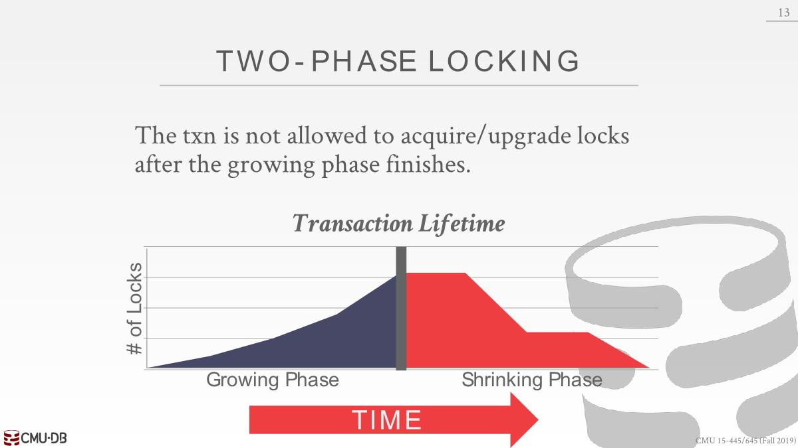
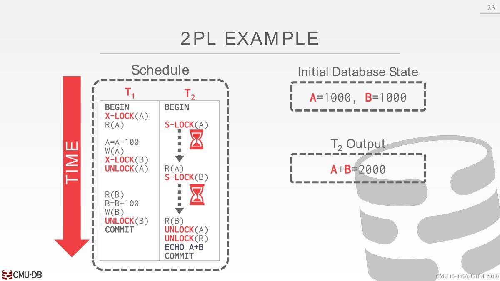
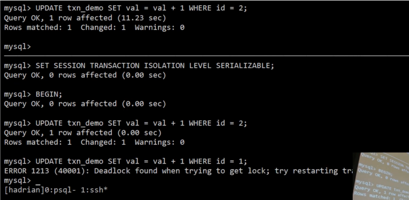

# Locks

we need a way to guarantee that all execution schedules are correct (i.e., serializable) without  knowing the entire schedule ahead of time.

Solution: Use `locks` to protect database objects.

## Basic Lock Types

S-Lock、X-Lock

- The DBMS contains a centralized(*集中式*) lock manager that decides decisions whether a transaction can have a lock or not. It has a global view of whats going on inside the system.

- Lock-table: It keeps track of what transactions hold what locks and  what transactions are waiting to acquire any locks.


这里会遇上unrepeatable read的问题，所以需要一个完善的协议去约束，下面的2PL


## 2PL

- Two-Phase locking (2PL) is a pessimistic concurrency control protocol that determines whether a transaction is allowed to access an object in the database on the fly(*动态*). 
- The protocol does not need to know all of the queries that a transaction will execute ahead of time(*提前*).

### Two Phase

几乎所有的系统都用到了，比如PostgreSQL、SQL server、MySQL。

- Phase #1: **Growing**
  - Each transaction requests the locks that it needs from the DBMS’s lock manager.
  - The lock manager grants/denies lock requests.
- Phase #2: **Shrinking**
  - The transaction enters this phase immediately after it **releases its first lock**. 可以申请多把锁
  - The transaction is allowed to only release locks that it previously acquired. It cannot acquire new locks in this phase. 这里针对的是一个txn，不是指所有的txn。也就是有的txn处于1阶段，有的可以处于2阶段。

正常的情况是：



异常的情况是这样的：


2PL示例：


### Cascading Aborts

When a transaction aborts and now another transaction must be rolled back, which results in wasted work(*导致无用工*). 回滚的逻辑可能也得很复杂。

这里的情况是T2读到了T1的值，但是T1已经abort了，单独使用2PL不会避免出现了脏读的情况。这里就会出现了依赖，T1 abort，T2也得abort。


## Strong Strict 2PL

The transaction only releases locks when it finishes. Does not incur cascading aborts. 


示例：


1. T1获取X-LOCK(A)后释放
2. T2获取S-LOCK(A)，S-LOCK(A)，打印出1900（图错误）

这里出现了脏读




## 2PL Deadlock Handling


MySQL 2PL死锁示例：

设置死锁检测和事务的隔离级别

```sql
SET GLOBAL innodb_lock wait_timeout=10;
SET SESSION TRANSACTION ISOLATION LEVEL SERIALIZABLE;
```

| TXN1                                      | TXN2                                      |
| ----------------------------------------- | ----------------------------------------- |
| UPDATE txn_demo SET val=val+1 WHERE id=1; |                                           |
|                                           | UPDATE txn_demo SET val=val+1 WHERE id=2; |
| UPDATE txn_demo SET val=val+1 WHERE id=2; |                                           |
|                                           | UPDATE txn_demo SET val=val+1 WHERE id=1; |

此时出现了死锁



MySQL检测到死锁和T2有关系，会重启T2，T1就会拿到锁并继续执行

PostgreSQL 2PL死锁示例

```SQL
SET deadlock timeout To '10s';
BEGIN TRANSACTION ISOLATION LEVEL SERIALIZABLE;
```


### Deadlock Detection

The DBMS creates a `waits-for` graph: `Nodes` are transactions, and edge from $T_i$ to $T_j$ if transaction $T_i$ is waiting for transaction $T_j$ to release a lock. 

The system will periodically check for cycles in waits-for graph and then make a decision on how to break it.


When the DBMS detects a deadlock, it will select a "victim" txn to rollback to break the cycle.

The victim txn will either restart or abort(more common) depending on how it was invoked.

Selecting the proper victim depends on a lot of  different variables:

1. By age (newest or oldest timestamp).
2. By progress (least/most queries executed). 已经执行的查询次数
3. By the count of items already locked. 
4. By the count of transactions that we have to rollback with it.
5. Count of times a transaction has been restarted in the past. 事务在之前一段时间内已经重启的次数

**Rollback Length**: After selecting a victim transaction to abort, the DBMS can also decide on how
far to rollback the transaction’s changes. Can be either the entire transaction or just enough queries to
break the deadlock. rollback的范围，整个事务或者是事务的部分语句

### Deadlock Prevention

When a transaction tries to acquire a lock, if that lock is currently held by another transaction, then perform some action to prevent a deadlock.

Assign priorities based on timestamps: Older Timestamp = Higher Priority

- Wait-Die ("Old Waits for Young"): 请求锁的txn如果older，那么需要等待锁，否则abort。也就是先来先得
- Wound-Wait ("Young Waits for Old"): 与上面相反


如果一个事务重启后，时间戳依旧是之前的时间戳，不能分配新的时间戳，避免事务饿死（比如规则是新时间戳不能获得锁，那么该事务就一直不会获得到锁，反之可能老的事务可能会一直获取不到锁）

## Lock Granularities

锁的粒度

- When we say that a txn acquires a “lock”, what  does that actually mean?  On an Attribute? Tuple? Page? Table?

- Ideally, each txn should obtain fewest number of locks that is needed.
- To avoid this overhead, the DBMS can use to use a lock hierarchy that allows a transaction to take more coarse-grained(*粗粒度*) locks in the system.

### Intention Lock

An **intention lock** allows a **higher level** node to  be locked in **shared** or **exclusive** mode without  having to check all descendent(*后代*) nodes.

-  **Intention-Shared (IS)**: Indicates explicit locking at a lower level with **shared** locks.

- **Intention-Exclusive (IX)**: Indicates explicit locking at a lower level with **exclusive or shared** locks.
- **Shared+Intention-Exclusive (SIX): **适用于一个txn中又有查询又有更新的操作


- Each txn obtains appropriate(*适当的*) lock at **highest level**  of the database hierarchy.
- To get **S** or **IS** lock on a node, the txn must hold at least **IS** on parent node.
- To get **X**, **IX**, or **SIX** on a node, must hold at least  **IX** on parent node.


T3想要全表扫描，需要S-LOCK，但是SIX无法与IS兼容，所以T3此时只能等待

### Lock Escalation

锁升级

- Lock escalation dynamically asks for coarser-grained locks when too many low level locks acquired. 

- This reduces the number of requests that the lock manager has to process.
  - Doesn't violate(*不违反*) two-phase locking
  - Can upgrade locks don't actually release the lock

## Locking In Practice

- You typically don't set locks manually in txns. 
- Sometimes you will need to provide the DBMS  with hints to help it to improve concurrency. 
  - Explicit locks are also useful when doing major changes(*大量的修改*) to the database.


MySQL将S-LOCK和X-LOCK称为READ LOCK、WRITE LOCK


`SELECT FOR UPDATE`: 适用于读取某个tuple，然后想对其进行更新的情况。该语句给数据库一个暗示，表示我知道数据库正在执行读操作，会去请求一个S-LOCK，之后我会执行写操作，现在可以帮我请求一个X-LOCK。简单来讲就是会告诉数据库现在去请求一个X-LOCK。
