# T/O Concurrency Control

- Timestamp ordering (T/O) is a optimistic class of concurrency control protocols where the DBMS assumes that transaction conflicts are rare. 

- Instead of requiring transactions to acquire locks before they are allowed to read/write to a database object, the DBMS instead uses **timestamps** to determine the serializability **order of transactions**.

---

- Each transaction Ti is assigned a **unique fixed timestamp** that is monotonically increasing(*单调递增*)
  - Let TS(Ti) be the timestamp allocated to transaction Ti
  - Different schemes(*不同的方案*) assign timestamps at different times  during the txn.  不同的时间戳协议对应的分配时间戳机制不同，可以在事务执行期内任意时间点给事务分配时间。

- If TS(Ti) < TS(Tj), then the DBMS must ensure that the execution schedule is equivalent to a serial schedule  where Ti appears before Tj.

- Multiple timestamp allocation implementation strategies
  - System clock. 缺点：分布式、机器同步时间后可能会回调时间、冬至时夏至时时间调整

  - Logical counter. 缺点：分布式、值的长度

  - Hybrid(*混合*). 同时使用上述两种方法进行匹配，常见

## Basic T/O

- Every database object X is tagged with(*标记*) timestamp of the last transaction that successfully did read/write.

  - W-TS(X): Write timestamp on object X.

  - R-TS(X): Read timestamp on object X.

### Read Operations

- If TS(Ti) < W-TS(X): abort $T_i$，重启$T_i$并分配一个新的时间戳。（x在未来某个时间点被修改了，$T_i$不应该看到这个）
- Else（也就是在该事务中，不会读到x”未来的值“，因为在未来某个时刻，某个事务可能会将该值覆盖，不能读取到已经覆盖了的值）
  - Allow Ti to read X.
  - Update R-TS(X) to max(R-TS(X), TS(Ti)).
  - Have to make a local copy of X to ensure repeatable reads for Ti.
  - Last step may be skipped in lower isolation levels.

### Write Operations

- If TS(Ti) < R-TS(X) or TS(Ti) < W-TS(X)：abort and restart
- Else
  - Allow Ti to write X and update W-TS(X) to Ti.
  -  Also have to make a local copy of X to ensure repeatable reads for Ti.

- 需要在事务开始时间就分配一个时间戳

### Example

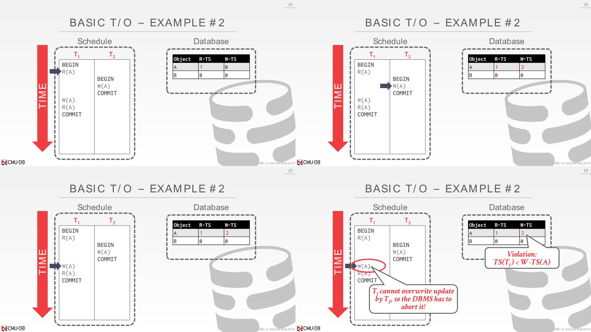

TS(T1)=1, TS(T2)=2

1. TS(T1) > W-TS(A)：ok，set R-TS(A)=1
2. TS(T2) > R-TS(A) and TS(T2) > W-TS(A): ok, set W-TS(B)=2
3. TS(T1) < W-TS(A): abort

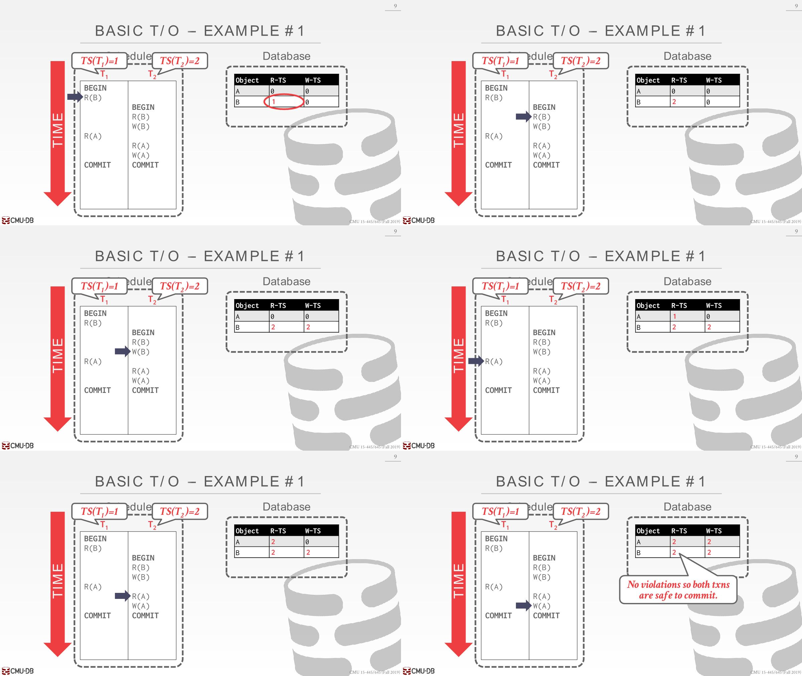

总结：读X的时候需要检验W-TS(X)，也就读的时候不能有事务将该值写过；写的时候需要校验R-TS(X)和W-TS(X)，也就是写的某个对象的时候，这个对象不能被别的事物读过或者写过，否则读的值可能是旧值或者写的时候将之前写的值覆盖了。

### Optimization: Thomas Write Rule

- If TS(Ti) < R-TS(X): Abort and restart Ti
- If TS(Ti) < W-TS(X)
  - Thomas Write Rule: Ignore the write and allow transaction to continue. 放弃该事务对数据库中X对象的写入操作，但是会在本地变量中写入（读的时候已经复制了一份到本地变量），后续所有的X读操作都是基于本地变量。
  - 违背了timestamp order但是结果依旧正确
-  Else: Allow Ti to write X and update W-TS(X)

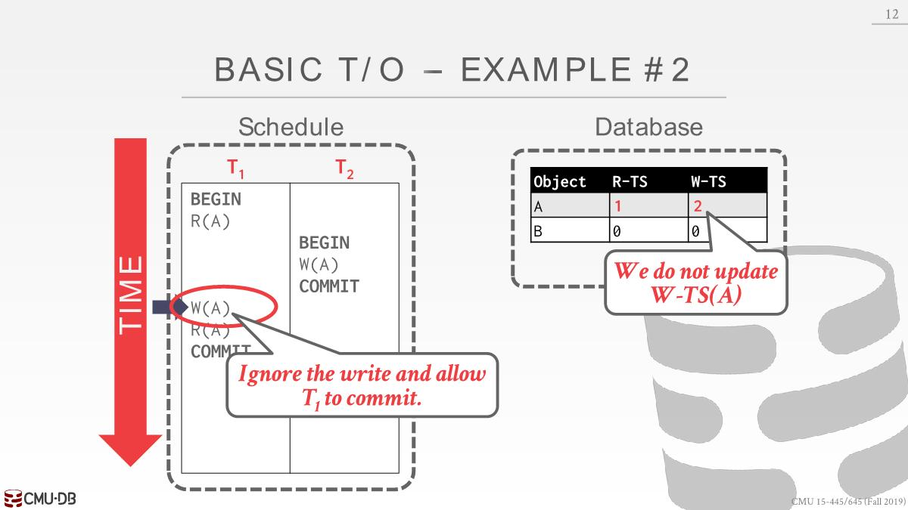

### Conclusion

该方法可以预防死锁，但是可能会发生starvation的情况，假设有一个先执行的但是要执行很久的事务正在运行，后续有若干个只是更新tuple的值执行很快的事务，这时候长时间事务可能写的值都会无效。因为后续的事务可能会从长事务中读取值，导致长事务需要abort并restart。

### Recoverable Schedule

Basic T/O permits schedules that are not recoverable.

一个事务只有当 【它所依赖的数据的对应事务】 已经都提交的情况下，它再进行提交，这样的schedule是可恢复的。

T2读取到了T1中的A，先commit T2，过了一会，T1被abort了。

This is not recoverable  because we cannot restart T1.（猜测这里不能restart的原因是abort后没有对应日志了）

### Potential Issues

- High overhead from copying data to transaction’s workspace and from updating timestamps.
- Long running transactions can get starved
- 高并发系统上分配时间戳会有性能问题（猜测是每个事务都得有个唯一的时间戳，每个读值或者更新值时候也得更新时间戳）

## Optimistic Concurrency Control (OCC)

假设事务都是短事务，冲突很少（所有事物都是只读的，或者是访问的数据是没有交集的），那么就没有必要加锁进而浪费性能

- The DBMS creates a **private workspace** for each transaction. buffer pool manager提供支持，当内存容量不足的时候可能会交换到磁盘 
  - All modifications are applied to the workspace.
  - Any object read is copied into workspace  ensure repeatable reads.
  - No other transaction can read the changes made by another transaction in its private workspace

- When a transaction commits, the DBMS compares the transaction’s workspace **write set** to see whether it conflicts with other transactions. 
  - If there are no conflicts, the write set is installed into the "global" database

### OCC Phases

1. **Read Phase**: Track(*跟踪*) the read/write sets of transactions and store their writes in a private workspace.
2. **Validation Phase**: When a transaction commits, check whether it conflicts with other transactions.
3. **Write Phase**: If validation succeeds, apply private changes to database. Otherwise abort and restart
   the transaction.

事务的哪些操作属于哪些阶段是由数据库决定的，不是在事务中指定，就好像2PL一样也是数据库帮你实现的。

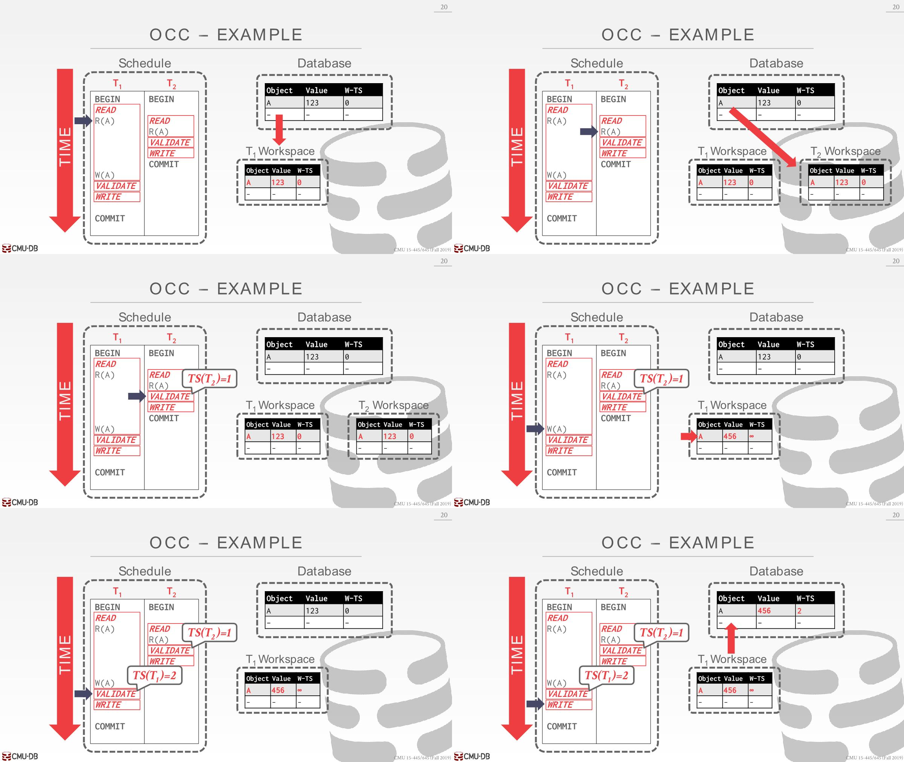

1. T1 读A，将其复制到私有空间，并携带上write timestamp
2. T2同样如此
3. T2进入Validation Phase阶段，数据库为其分配一个时间戳。但是不需要验证任何东西，因为只是一个只读事务。接着进入Write Phase然后提交完事了。
4. T1 写A，但是这时候还没有分配时间戳（Validation Phase才分配时间戳），所以W-TS(A)赋值为无限大
5. T1进入Validation Phase，分配一个时间戳，系统中没有其他并发事务
6. T1进入Write Phase，将本地数据所做的修改写回到主数据库中，还要A的write timestamp为TS(T2)

### Validation Phase

- This is where the DBMS checks whether a transaction conflicts with other transactions. 
  - The DBMS needs to guarantee that only serializable schedules are permitted. 
  - The DBMS assigns transactions timestamps when they enter the validation phase.
- When the txn invokes **COMMIT**, the DBMS checks  if it conflicts with other txns.

- 实现方式是确保被修改的东西不会与系统中所有其他并发执行的事务产生read write conflict或者write write conflict。
  - 维护系统中所有正在运行的事务的全局视野，便可以知道事务所做的修改，这样就可以决定事务的执行顺序
  - Validation和Write阶段按顺序执行，确保同时只有一个事务在执行验证操作，实际上也可以并行验证
- 有两种验证方法：Backward Validation、Forward Validation，但是在系统中只能使用一种，不能同时使用。

#### Backward Validation

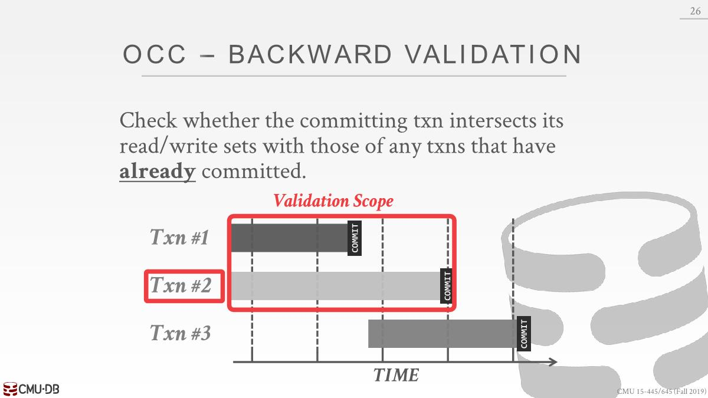

T2准备commit，找到所有比TS(T2)小的事务，执行验证操作

现在T1比T2先提交，可能存在某在情况，T1更新了某个数据，该数据应该被T2读取到，但是在这里很明显没有，T1修改的是私有副本并且T2读到的是数据库里面的值，所以应该要杜绝这种情况。

#### Forward Validation

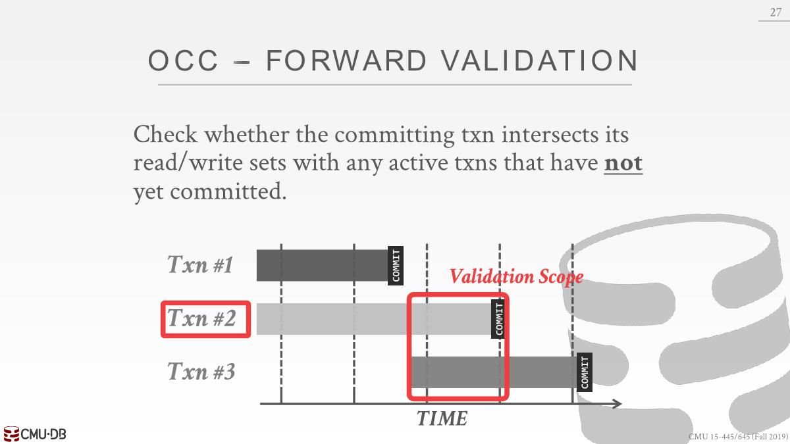

找到所有并发执行但是还没有commit的事务

可能会出现一种情况，T2更新了私有副本某个数据，但是T2是在T3之前执行的，T2从数据库中读取到的是旧值，T2应该看到T3修改的值。

验证通过的情况有三种：

1. 每个事务的三个阶段没有交集
   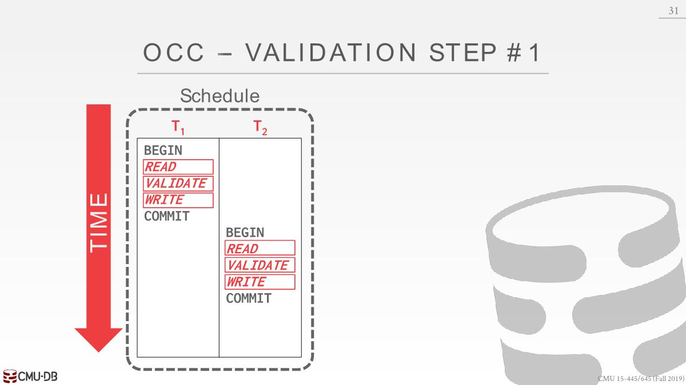

2. 在一个事务T2开启其write phase时候，另一个事务T1已经结束了（这里的意思应该是执行到验证阶段但是并没有执行验证），并且T1中写的对象在T2中没有出现
   T2先验证，所以TS(T2)>TS(T1)，按照时间戳排序，T2在T1之前执行，因为T2没有做修改，所以T1可以继续执行

   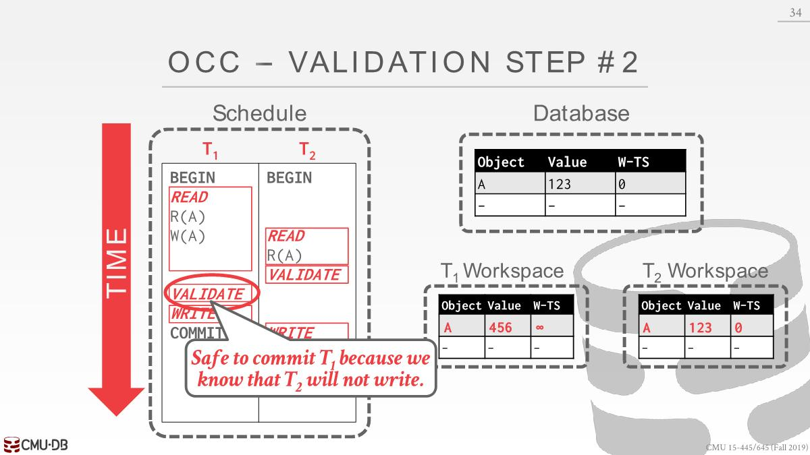

   T1先验证，所以TS(T1)>TS(T2)，按照时间戳排序，T1在T2之前执行，此时T2应该看到T1的修改，但是在这里T2读到的是数据库中的旧值，所以需要abort T1。

   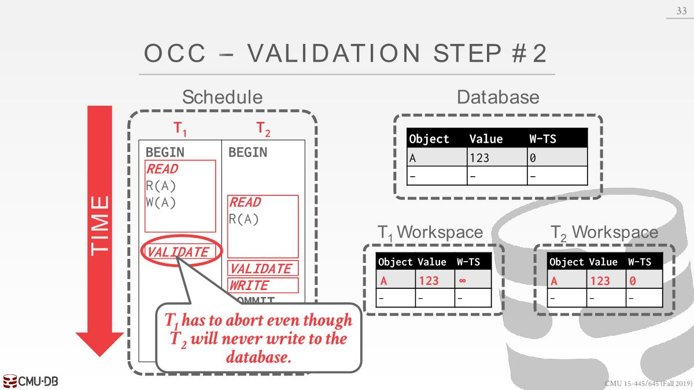

3. `WriteSet(Ti)`和`ReadSet(Tj)`没有交集，`WriteSet(Ti)`和`ReadSet(Tj)`没有交集
   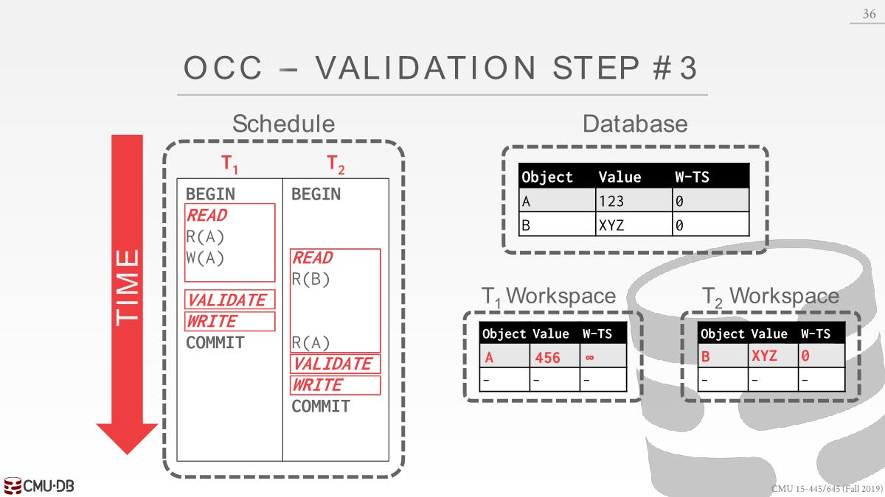

### Potential Issues

- High overhead for copying data locally into the transaction’s private workspace.
-  Suffers(*遭受*) from timestamp allocation bottleneck(*瓶颈*).
-  Validation/Write phase bottlenecks.
- Aborts are potentially more wasteful than in other protocols because they only occur after a transaction has already executed.

在冲突很多的情况下，2PL和OCC都不太行，效果都差不多，2PL会存在大量争取锁的情况，OCC会存在做了大量工作后回滚的情况。

## Partition-Based T/O

当系统中存在很多的并发事务的情况下，进行验证阶段需要获取latches去保护write set和read set（验证时候需要查看数据，同时事务也在并发执行，可能也会写数据），即使事务之间的冲突率很低，但是latches的竞争也会导致很多的开销。

- An alternative is to split the database up in disjoint subsets(*不相交子集*) called **horizontal partitions** (aka shards) and then only check for conflicts between transactions that are running in the same partition. 
  - Every partition has one transaction execution thread.

- Partitions are protected by a single lock. Transactions are assigned timestamps based on when they arrive at the DBMS. Each transaction is queued at the partitions it needs before it starts running.
  - The transaction acquires a partition’s lock if it has the lowest timestamp in that partition’s queue.
  - The transaction starts when it has all of the locks for all the partitions that it will access during execution.
  - Transactions can read/write anything that they want at the partitions that they have locked. If a transaction tries to access a partition that it does not have the lock, it is aborted + restarted. 中止该事务，获取更多的lock并重新执行该事务
- All updates occur in place. 直接修改数据库上的值， 不需要latches去维护一些数据结构
  - Maintain a separate in-memory buffer to undo changes if  the txn aborts.
  - If a txn tries to write to a partition that it does not  have the lock, it is aborted + restarted.

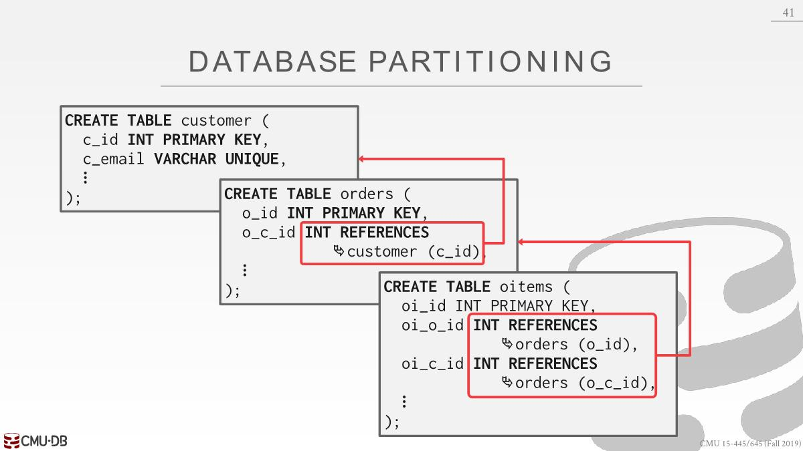

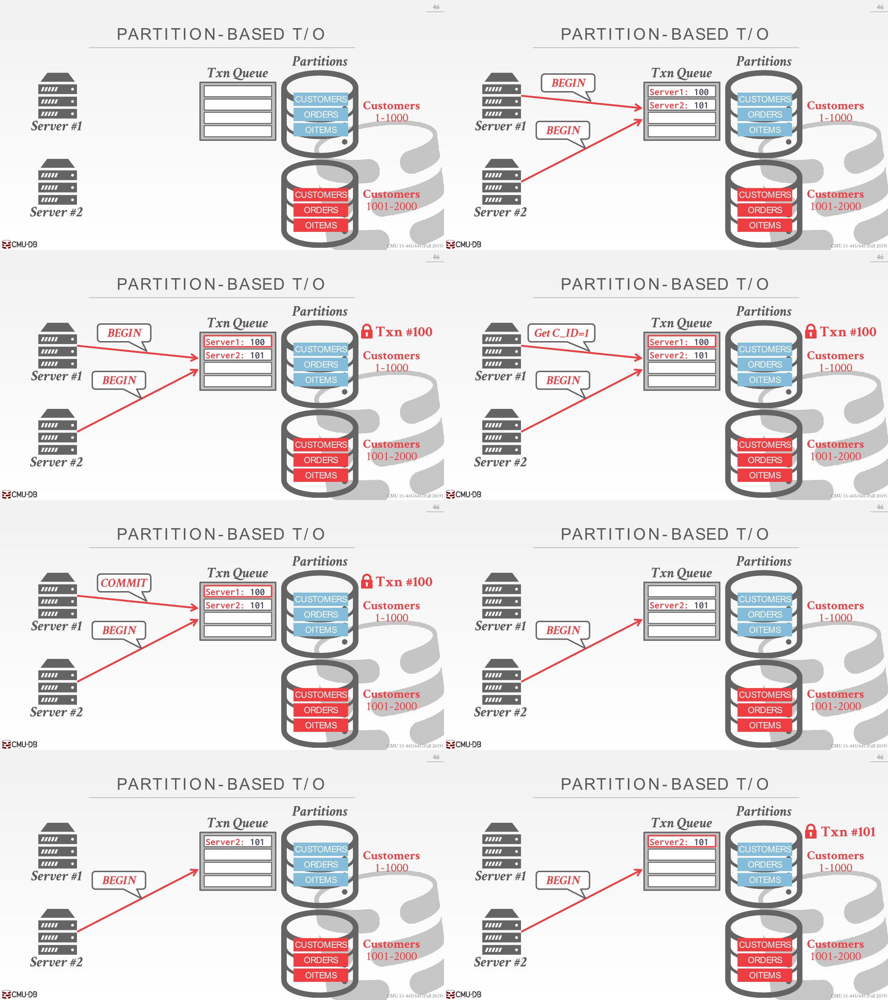

### Potential Issues

- Partition-based T/O protocol is fast if
  1. the DBMS knows what partitions the transaction needs before it starts and 
  2. most (if not all) transactions only need to access a single partition

- The protocol only works if
  1. transactions are stored procedures (network communication causes the partition to idle because it has to wait for the next query to execute) and 
  2. transactions only touch one partition (multi-partition transactions cause partitions to be idle because partitions have to wait for the next query to execute). 热点分区，别的分区没有访问到

## Dynamic Databases

上述只是讨论了数据的查询和更新的状态，并没有考虑到插入数据的情况。如果还是以上述的规则去处理插入数据的话，可能会遇上幻读的现象

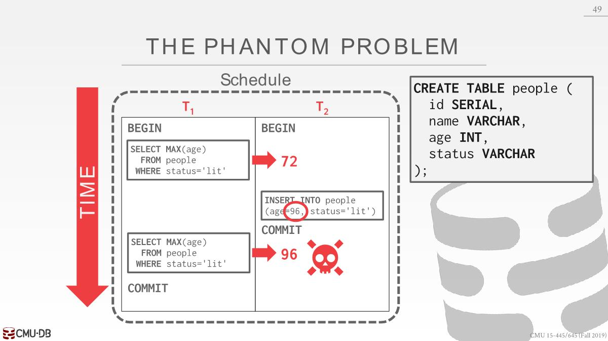

其实这里T1锁住的是已经存在的数据，对于正在插入的数据是没有锁定的（可以回去看看是数据库是怎么锁住数据的），所以就出现了这种现象。

### Predicate Locking

条件锁：根据status='lit'找到所有的tuple，然后锁定

这样是可行的，但是开销太大而且太复杂，条件有可能是表达式，很少会有数据库使用该方法

### Index Locking

If there is a dense index on the status field then the  txn can lock index page containing the data with  status='lit'.

插入操作都需要遍历索引然后更新索引，这样就拿不到锁

### Locking Without An Index

gap lock

- 表的每个page加锁，避免其它记录的 status被修改成 lit
- 表本身加锁，防止status='lit'的记录插入或者删除

### Repeating Scans

提交事务前须确保读取到的所有数据都是在你提交事务前读取的，如果不是就重启

# Isolation Levels

- Serializability is useful because it allows  programmers to ignore concurrency issues. 
  - But enforcing it may allow too little concurrency  and limit performance.  使用lock或者各种规则限制事务以此达到Serializability，如果不满足则需要重启事务。
  - We may want to use a weaker level of consistency  to improve scalability.

- Isolation levels control the extent(*程度*) that a transaction is exposed to(*暴露*) the actions of other concurrent transactions.

- 暴露uncommitted changes提高并发性可能会造成以下问题

  - **Dirty Read**: Reading uncommitted data.
  - **Unrepeatable Reads**: Redoing a read results in a different result.
  - **Phantom Reads**: Insertion or deletions result in different results for the same range scan queries.

- Isolation Levels (Strongest to Weakest):

  - **SERIALIZABLE**: No Phantoms, all reads repeatable, and no dirty reads.
    - Obtain all locks first; plus index  locks, plus strict 2PL.
  - **REPEATABLE READS**: Phantoms may happen.
    - Same as above, but no index  locks.
  - **READ-COMMITTED**: Phantoms and unrepeatable reads may happen.
    - Same as above, but S locks are  released immediately.
  - **READ-UNCOMMITTED**: All anomalies may happen
    - Same as above, but allows  dirty reads (no S locks).

  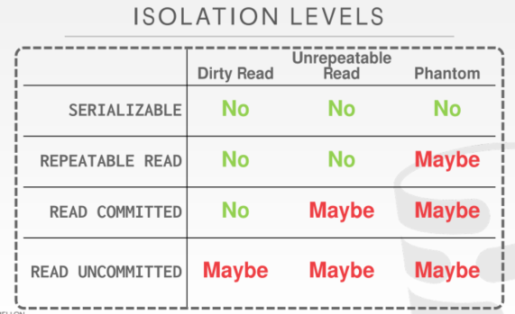

