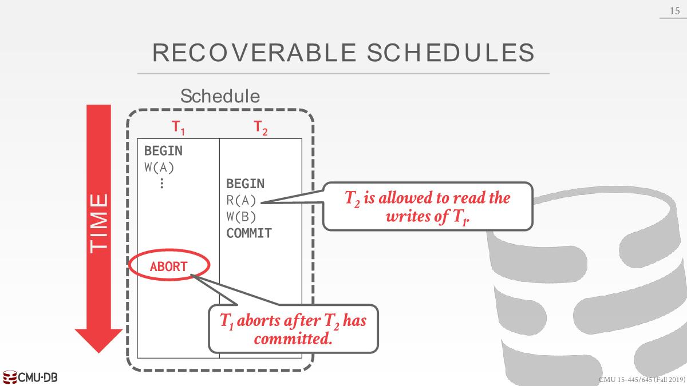

# T/O Concurrency Control

- Timestamp ordering (T/O) is a optimistic class of concurrency control protocols where the DBMS assumes that transaction conflicts are rare. 

- Instead of requiring transactions to acquire locks before they are allowed to read/write to a database object, the DBMS instead uses **timestamps** to determine the serializability **order of transactions**.

---

- Each transaction $T_i$ is assigned a **unique fixed timestamp** that is monotonically increasing(*单调递增*)
  - Let TS$(T_i)$ be the timestamp allocated to transaction $T_i$
  - Different schemes(*不同的方案*) assign timestamps at different times  during the txn.  不同的时间戳协议对应的分配时间戳机制不同，可以在事务执行期内任意时间点给事务分配时间。

- If TS$(T_i)$ < TS$(T_j)$, then the DBMS must ensure that the execution schedule is equivalent to a serial schedule  where $T_i$ appears before $T_j$.

- Multiple timestamp allocation implementation strategies
  - System clock. 缺点：分布式、机器同步时间后可能会回调时间、冬至时夏至时时间调整

  - Logical counter. 缺点：分布式、值的长度

  - Hybrid(*混合*). 同时使用上述两种方法进行匹配，常见

## Basic T/O

- Every database object X is tagged with(*标记*) timestamp of the last transaction that successfully did read/write.

  - W-TS(X): Write timestamp on object X.

  - R-TS(X): Read timestamp on object X.

### Read Operations

- If TS$(T_i)$ < W-TS(X): abort $T_i$，重启$T_i$并分配一个新的时间戳。（x在未来某个时间点被修改了，$T_i$不应该看到这个）
- Else（也就是在该事务中，不会读到x”未来的值“，因为在未来某个时刻，某个事务可能会将该值覆盖，不能读取到已经覆盖了的值）
  - Allow $T_i$ to read X.
  - Update R-TS(X) to max(R-TS(X), TS($T_i$)).
  - Have to make a local copy of X to ensure repeatable reads for $T_i$.
  - Last step may be skipped in lower isolation levels.

### Write Operations

- If TS($T_i$) < R-TS(X) or TS($T_i$) < W-TS(X)：abort and restart
- Else
  - Allow $T_i$ to write X and update W-TS(X) to $T_i$.
  -  Also have to make a local copy of X to ensure repeatable reads for $T_i$.

- 需要在事务开始时间就分配一个时间戳

### Example

TS(T1)=1, TS(T2)=2

1. TS(T1) > W-TS(A)：ok，set R-TS(A)=1
2. TS(T2) > R-TS(A) and TS(T2) > W-TS(A): ok, set W-TS(B)=2
3. TS(T1) < W-TS(A): abort

总结：读X的时候需要检验W-TS(X)，也就读的时候不能有事务将该值写过；写的时候需要校验R-TS(X)和W-TS(X)，也就是写的某个对象的时候，这个对象不能被别的事物读过或者写过，否则读的值可能是旧值或者写的时候将之前写的值覆盖了。

### Optimization: Thomas Write Rule

- If TS($T_i$) < R-TS(X): Abort and restart $T_i$
- If TS($T_i$) < W-TS(X)
  - Thomas Write Rule: Ignore the write and allow transaction to continue. 放弃该事务对数据库中X对象的写入操作，但是会在本地变量中写入（读的时候已经复制了一份到本地变量），后续所有的X读操作都是基于本地变量。
  - 违背了timestamp order但是结果依旧正确
-  Else: Allow $T_i$ to write X and update W-TS(X)

### Conclusion

该方法可以预防死锁，但是可能会发生starvation的情况，假设有一个先执行的但是要执行很久的事务正在运行，后续有若干个只是更新tuple的值执行很快的事务，这时候长时间事务可能写的值都会无效。因为后续的事务可能会从长事务中读取值，导致长事务需要abort并restart。

### Recoverable Schedule

Basic T/O permits schedules that are not recoverable.

一个事务只有当 【它所依赖的数据的对应事务】 已经都提交的情况下，它再进行提交，这样的schedule是可恢复的。

T2读取到了T1中的A，先commit T2，过了一会，T1被abort了。

This is not recoverable  because we cannot restart T1.（猜测这里不能restart的原因是abort后没有对应日志了）

### Potential Issues

- High overhead from copying data to transaction’s workspace and from updating timestamps.
- Long running transactions can get starved
- 高并发系统上分配时间戳会有性能问题（猜测是每个事务都得有个唯一的时间戳，每个读值或者更新值时候也得更新时间戳）

## Optimistic Concurrency Control (OCC)

假设事务都是短事务，冲突很少（所有事物都是只读的，或者是访问的数据是没有交集的），那么就没有必要加锁进而浪费性能

- The DBMS creates a **private workspace** for each transaction
  - All modifications are applied to the workspace.
  - Any object read is copied into workspace.
  - No other transaction can read the changes made by another transaction in its private workspace

- When a transaction commits, the DBMS compares the transaction’s workspace **write set** to see whether it conflicts with other transactions. 
  - If there are no conflicts, the write set is installed into the "global" database

### OCC Phases

1. **Read Phase**: Track(*跟踪*) the read/write sets of transactions and store their writes in a private workspace.
2. **Validation Phase**: When a transaction commits, check whether it conflicts with other transactions.
3. **Write Phase**: If validation succeeds, apply private changes to database. Otherwise abort and restart
   the transaction.

事务的哪些操作属于哪些阶段是由数据库决定的，不是在事务中指定，就好像2PL一样也是数据库帮你实现的。

1. T1 读A，将其复制到私有空间，并携带上write timestamp
2. T2同样如此
3. T2进入Validation Phase阶段，数据库为其分配一个时间戳。但是不需要验证任何东西，因为只是一个只读事务。接着进入Write Phase然后提交完事了。
4. T1 写A，但是这时候还没有分配时间戳（Validation Phase才分配时间戳），所以W-TS(A)赋值为无限大
5. T1进入Validation Phase，分配一个时间戳，系统中没有其他并发事务
6. T1进入Write Phase，将本地数据所做的修改写回到主数据库中，还要A的write timestamp为TS(T2)

### Validation Phase

- This is where the DBMS checks whether a transaction conflicts with other transactions. 
  - The DBMS needs to guarantee that only serializable schedules are permitted. 
  - The DBMS assigns transactions timestamps when they enter the validation phase.

- 实现方式是确保被修改的东西不会与系统中所有其他并发执行的事务产生read write conflict或者write write conflict。