# Multi-Version Concurrency Control

MVCC是比 concurrency control protocol更大的概念，并不是OCC、T/O、2PL之类的东西，是设计和构建数据库系统的一种方式，即通过维护多版本数据来做到并发执⾏事务。

- The DBMS maintains multiple physical versions of a single logical object in the database.
  - When a transaction writes to an object, the DBMS creates a new version of that object.
  - When a transaction reads an object, it reads the newest version that existed when the transaction started.

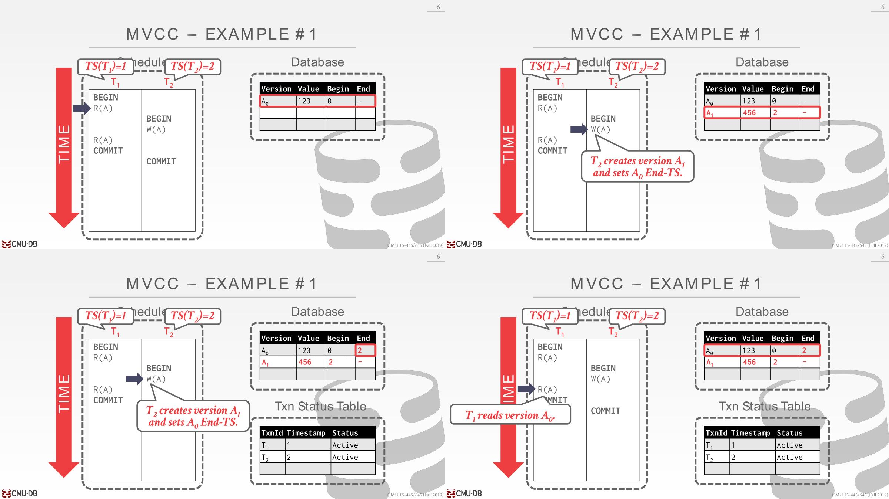

---

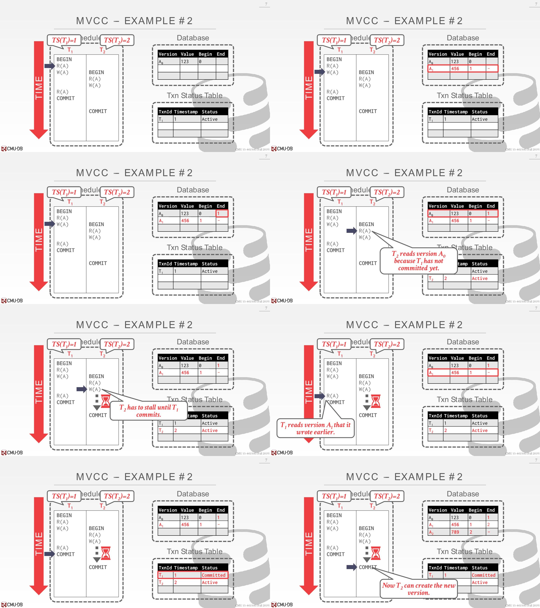

T2 R(A)读取A0还是A1取决于隔离级别

T2 W(A)时遇到了write-write confict，假设使用2PL，那么需要等待T1提交后才会继续执行

# Design Decisions

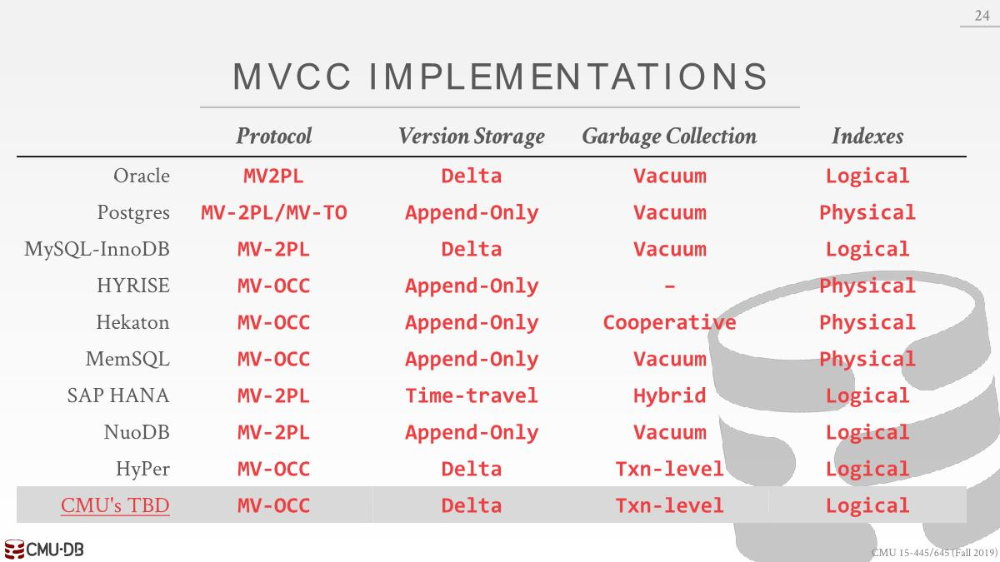

## Concurrency Control Protocol

遇上write-write conflict时需要使用其中一种协议：Timestamp Ordering、Optimistic Concurrency Control、Two-Phase Locking

## Version Storage

- This how the DBMS will store the different physical versions of a logical object.

- The DBMS uses the tuple’s pointer field to create a **version chain** per logical tuple. 类似链表 
  - This allows the DBMS to find the version that is visible to a particular transaction at runtime.
  - Indexes always point to the head of the chain. 
  - A thread traverses chain until you find the version that is visible to you. 
  - Different storage schemes determine where/what to store for each version.

### Append-Only Storage

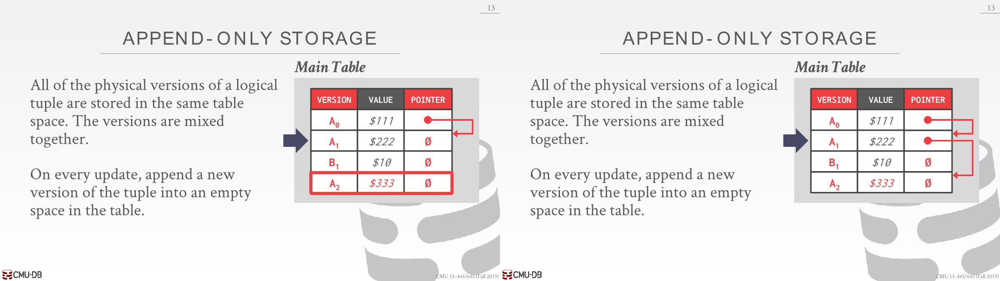

可以按照从新到旧或者从旧到新排序

### Time-Travel Storage

main table保存每个tuple的最新版本

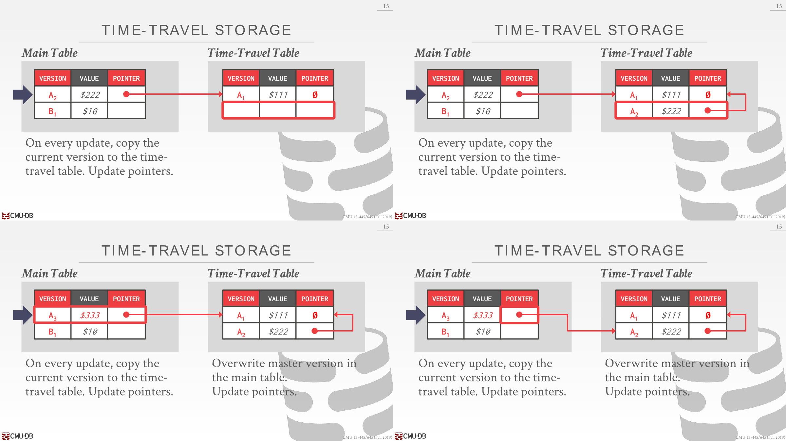

### Delta Storage

更新时只复制这次更新的值，不需要保存整个tuple。下面的例子是只有一个属性value

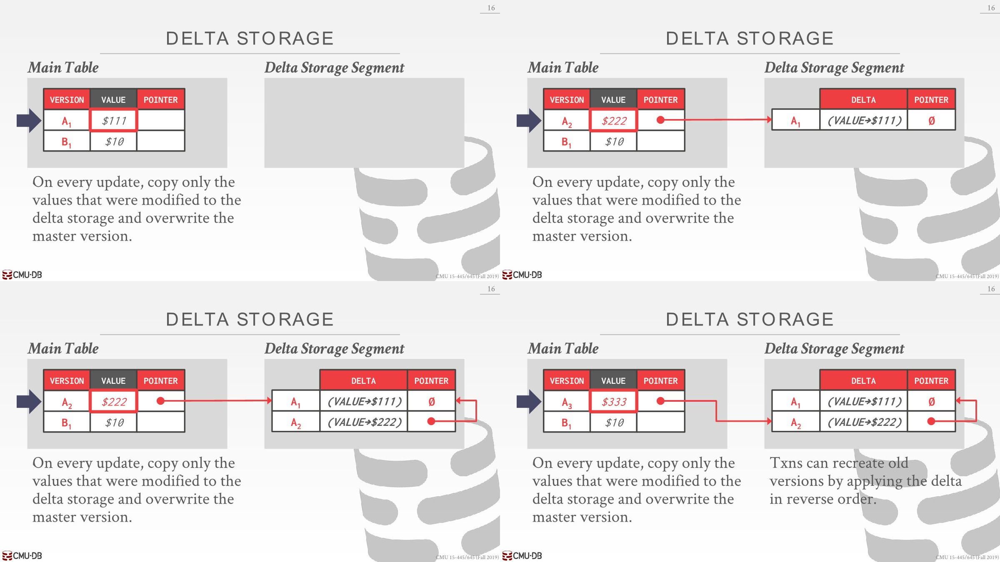

## Garbage Collection

The DBMS needs to remove reclaimable(*可回收的*) physical  versions from the database over time(*随着时间的推移*). 一些过时的数据和aborted txn创建的

How to look for expired versions?

How to decide when it is safe to reclaim memory?

### Tuple Level

需要sequential scan on tables，通过使用版本和现在活跃的事务列表确定是否已经过期，不仅要扫描内存中的page，还要扫描交换到磁盘的page

#### Background Vacuuming

查看begin和end，A100和B100不在T1和T2的时间范围内，可以回收掉

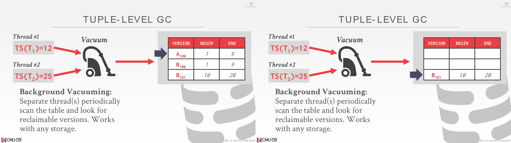

可以做的一个优化是，为数据库中所有的dirty page维护一个bitmap，每次更新数据时候可以将bit设置为1，这样清理的时候就可以知道哪些需要清理了，一旦清理完成就设置为0

#### Cooperative Cleaning

线程执行查询的时候会对数据的版本进行检查，并看看能否去回收这些空间，如果可以就会回收掉。只适用于从旧到新的排序。

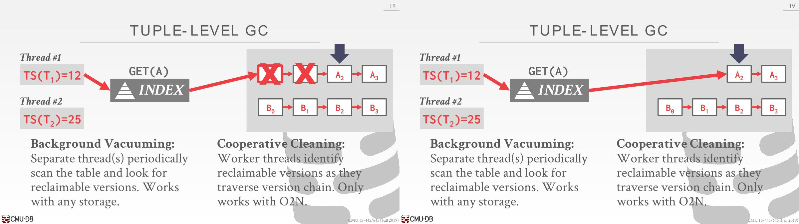

### Transaction Level

Each transaction keeps track of its own read/write set. 

When a transaction completes, the garbage collector can use that to identify what tuples to reclaim. 

The DBMS determines when all versions created by a finished transaction are no longer visible.

## Index Management

Indexes always point to the head of the chain.  如何去维护index和version chain呢

### Physical Pointers

物理地址由pageid和offset组成，每当创建某个数据的新版本时，都得更新索引。当workload是OLTP时候，可能会有数十个索引，每次更新version chain的时候都得更新所有对应的索引，这种做法成本很高。

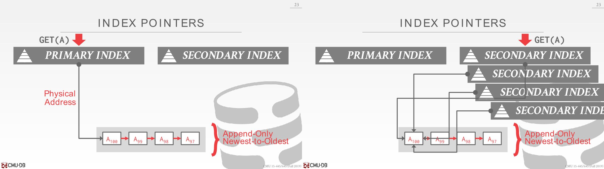

### Logical Pointers

一种方案是只保存Primary index到version chain的关系，Secondary index得通过Primary index查找version chain，每次更新tuple和version chain关系时候只需要更新Primary index就行

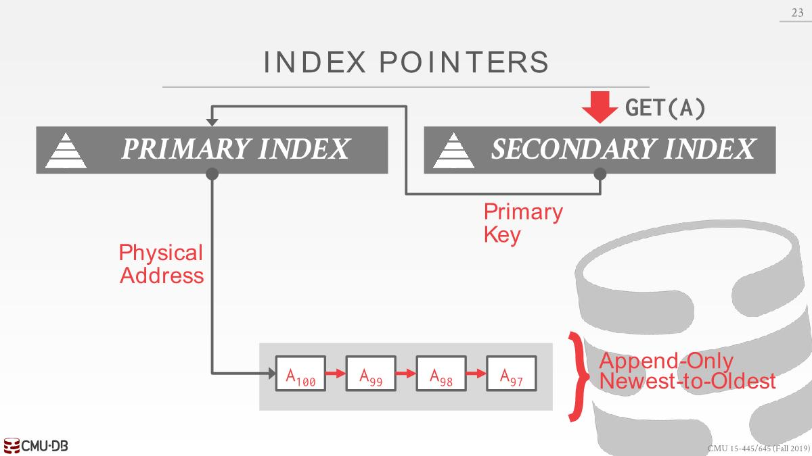

另外一种方式是使用中间层，每个tuple都有一个唯一id，使用hash tabl将tuple id和物理位置映射，发生改变时只需要修改中间层即可

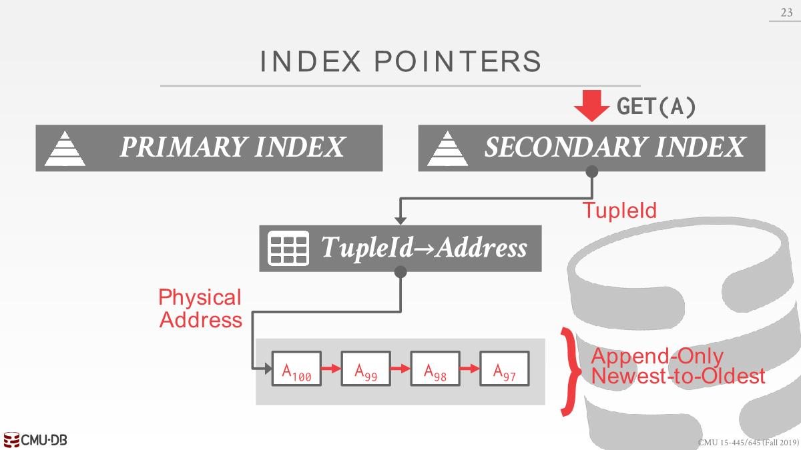
