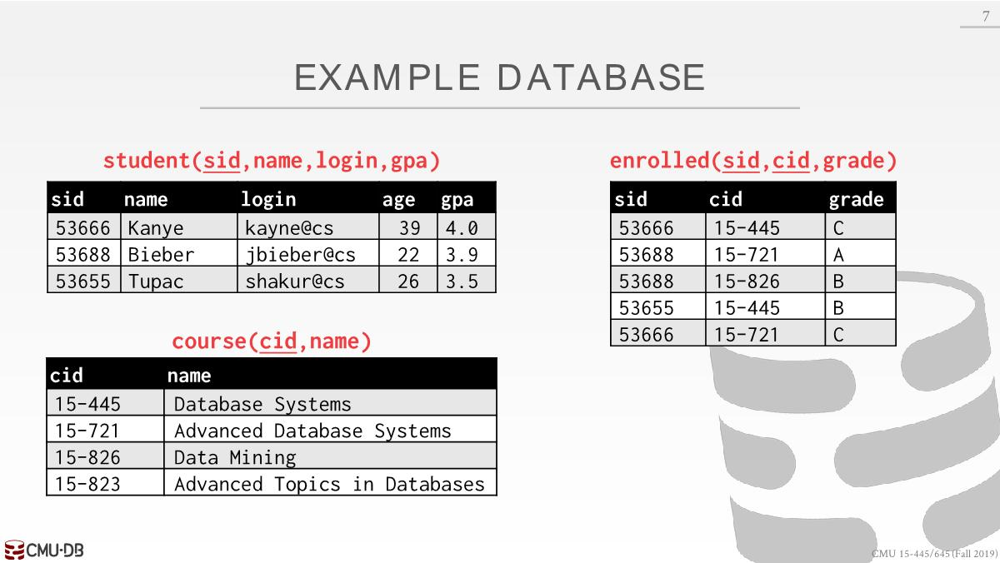
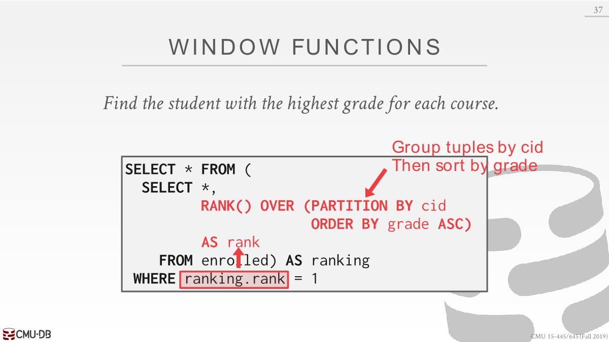
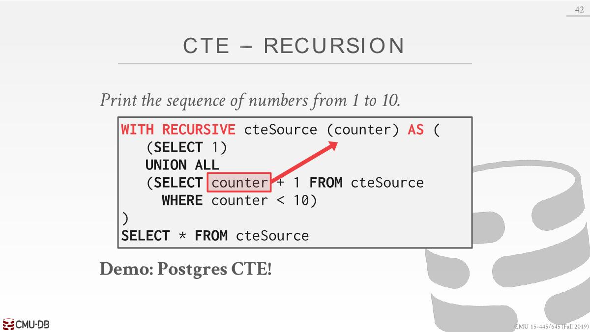

# Advanced-SQL

## Windows Functions

```sql
SELECT ... FUNC-NAME(...) OVER (...) FROM tableName;
```

- `FUNC-NAME`:
  - Aggregation(*聚合*) Functions: `MAX()`, `MIN()`, `AVG()`...
  - Special Window Functions:
    - `ROW_NUMBER()`: row number of the current row
    - `RANK()`: Order position of the current row.

- `OVER`: How to slice up(*切分*) data

### ROW_NUMBER



先执行整个查询，再调用窗口函数对结果进行处理

```sql
SELECT *, ROW_NUMBER() OVER () AS row_num FROM enrolled
```

|sid|cid|grade|row_num|
|:----|:----|:----|:----|
|53666|15-445|C|1|
|53688|15-721|A|2|
|53688|15-826|B|3|
|53655|15-445|B|4|
|53666|15-721|C|5|

The `OVER` keyword specifies how to group together tuples when computing the window function.

Use `PARTITION` BY to specify group.

```sql
SELECT cid, sid, 
  ROW_NUMBER() OVER (PARTITION BY cid) 
  FROM enrolled ORDER BY cid
```

|cid|sid|row_number|
|:----|:----|:----|
|15-445|53666|1|
|15-445|53655|2|
|15-721|53688|1|
|15-721|53666|2|
|15-826|53688|1|

### RANK

You can also include an `ORDER BY` in the window  grouping to sort entries in each group.

Find the student with the highest grade for each course:



|sid|cid|grade|rank|
|:----|:----|:----|:----|
|53655|15-445|B|1|
|53688|15-721|A|1|
|53688|15-826|B|1|

RANK：分组排序后对组内进行排名。如果没有事先排序，则输出的rank列的值都是1

```sql
SELECT *, 
    RANK() OVER (
        PARTITION BY cid 
        ORDER BY grade ASC) AS rank
    FROM enrolled
```

|sid|cid|grade|rank|
|:----|:----|:----|:----|
|53655|15-445|B|1|
|53666|15-445|C|2|
|53688|15-721|A|1|
|53666|15-721|C|2|
|53688|15-826|B|1|

使用窗口函数的好处是能够看到表的其他列，如果只是用聚合函数，则不能得到别的列：

```sql
SELECT MIN(grade) FROM enrolled GROUP BY cid;
```

## Common Table Expressions

with子句会在执行正常查询之前执行

Find student record with the highest id that is enrolled  in at least one course：

```sql
WITH cteSource (maxId) AS (
  SELECT MAX(sid) FROM enrolled
) 
SELECT name FROM student, cteSource
  WHERE student.sid = cteSource.maxId
```

CTE特别之处是可以进行递归，嵌套查询则不能，但是很少用CTE来实现递归



上图生成1~10序列，counter会将上一个结果作为参数传递给下一查询。
