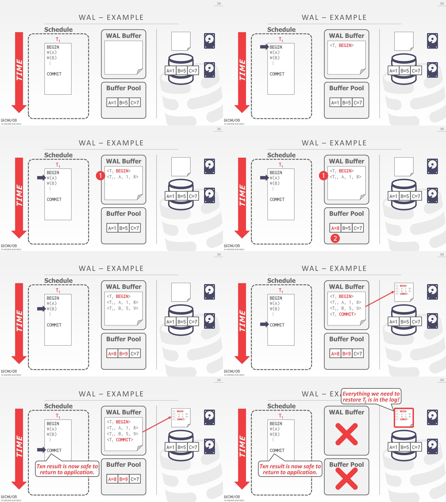
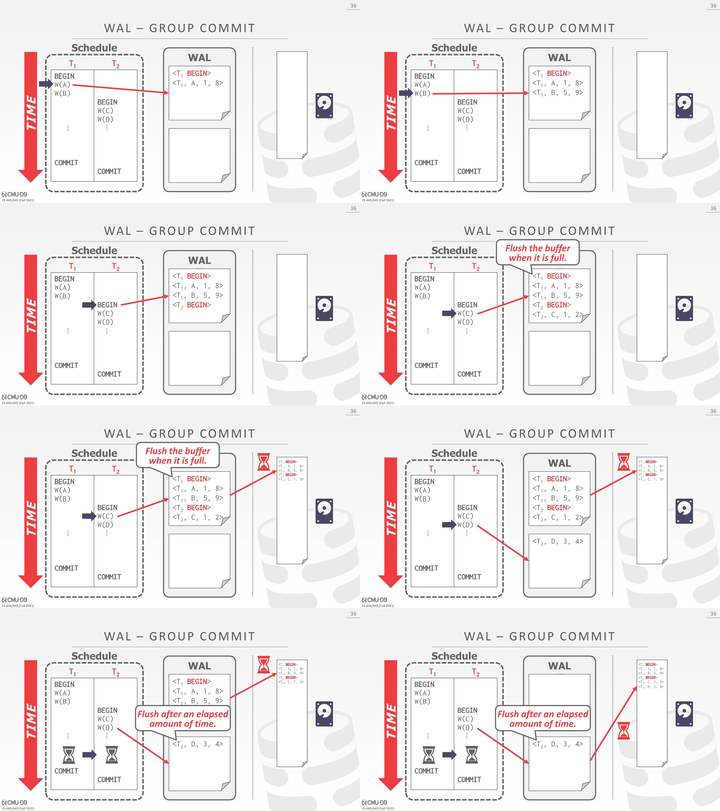
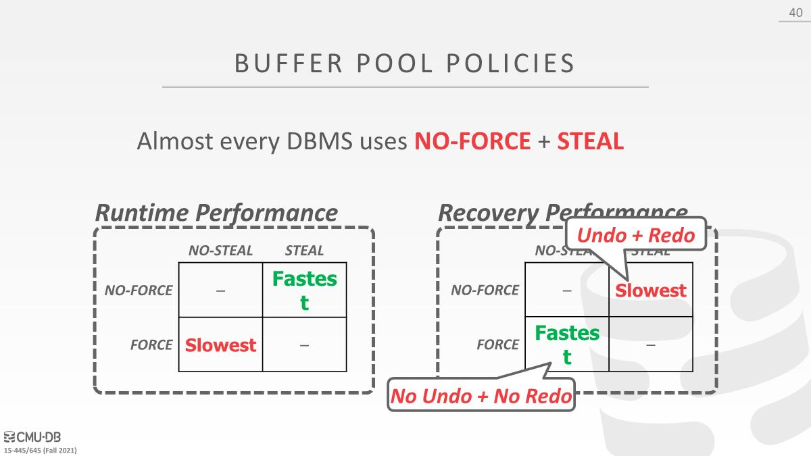
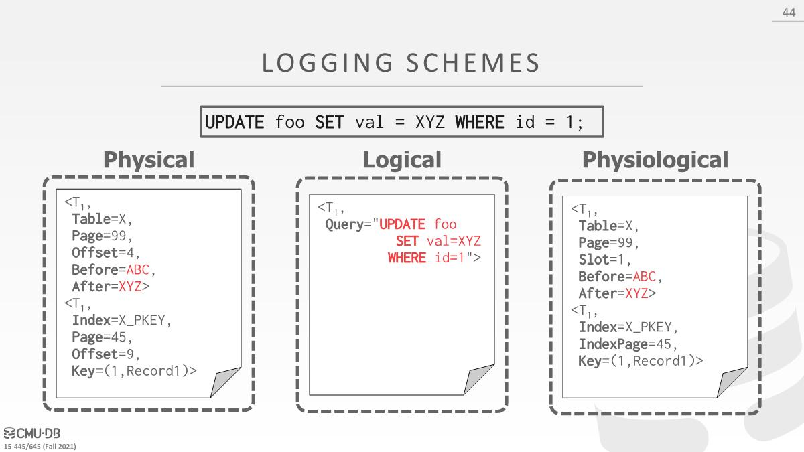
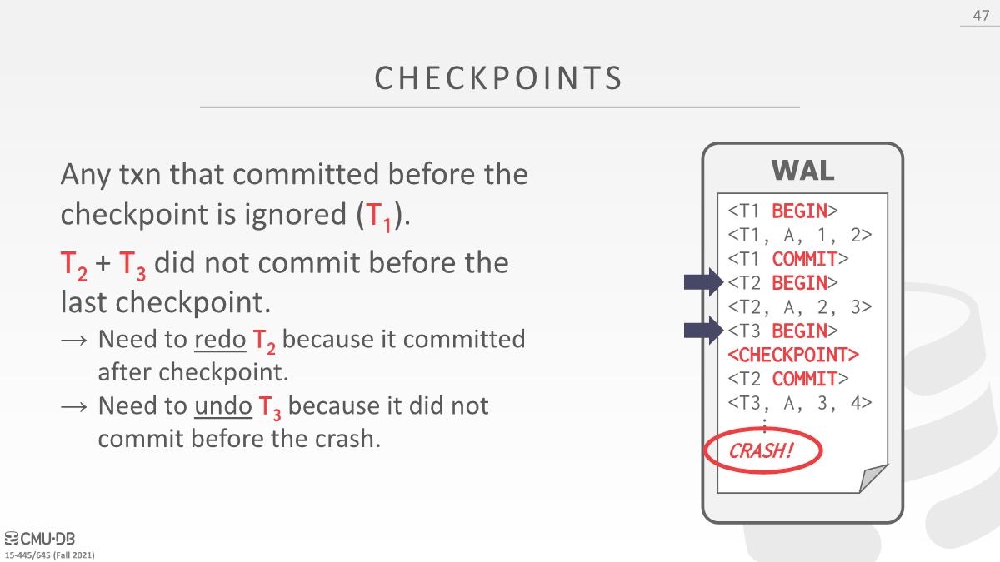

# Crash Recovery

- Recovery algorithms are techniques to ensure database consistency, transaction atomicity, and durability despite failures(*故障时的持久性*). 

- Recovery algorithms have two parts
  - Actions during normal txn processing to ensure that the DBMS can recover from a failure
  - Actions after a failure to recover the database to a state that ensures atomicity, consistency, and durability.

# Failure Classification

## Transaction Failures

- **Logical Errors**: A transaction cannot complete due to some internal error condition (e.g., integrity, constraint violation). 违反内部完整性约束，比如插入一个值要引用的外键不存在，确保所有修改都被回滚并且不会落地。
-  **Internal State Errors**: The DBMS must terminate an active transaction due to an error condition
  (e.g., deadlock) 

## System Failures

- **Software Failure**: There is a problem with the DBMS implementation (e.g., uncaught divide-by-zero exception) and the system has to halt(*不得不停止*).
- **Hardware Failure**: The computer hosting the DBMS crashes. We assume that non-volatile storage contents are not corrupted by system crash. 托管DBMS的机器crash并且假设崩溃后存储设备不会损坏

##  Storage Media Failure

**Non-Repairable(*不可修复的*) Hardware Failure**: A head(*磁头*) crash or similar disk failure destroys all or parts of nonvolatile storage. Destruction is assumed to be detectable(*假设破坏是可检测的*). No DBMS can recover from this. Database must be restored from archived version.

# Undo Redo

- The primary storage location of the database is on  non-volatile storage, but this is much slower than  volatile storage.

- Use volatile memory for faster access
  - First copy target record into memory.
  - Perform the writes in memory.
  - Write dirty records back to disk.

- The DBMS needs to ensure the following  guarantees
  - The changes for any txn are durable(*持久的*) once(*一旦*) the DBMS has  told somebody that it committed
  - No partial changes are durable if the txn aborted.

为了提供上述的保证，使用的核心原理是undo和redo

- undo：维护一些信息，这种信息能够撤销对数据库中某个对象所做的任何修改
- redo：与undo相反，重新执行对某个对象的修改

How the DBMS supports this functionality  depends on how it manages the buffer pool.

- 假设数据库只有一个page，将page放到buffer pool，然后就可以读和修改了

- T2 commit，将修改写回到磁盘（此时T1也修改了该page未提交，这里假设可以强制写回到磁盘）
- T1 执行到abort，应该将磁盘中的内容也修改回来，但是此时数据库崩溃，恢复之后看到了不应该存在的值

所以在这里应该有两个问题需要确认

- 在事务提交之前，是否可以强制将与其相关的dirty page写回到磁盘（比如T2写回磁盘，也会把T1的修改写回了）
- 在事务提交之前，是否能够复制一个page或者从buffer pool中移除page

解决上述问题有两个策略：Steal和Force

# Buffer Pool Management Policies

No-Steal: Any changes made by uncommitted transaction cannot be written a disk.

Force: All changes that transaction made have to be written to disk before the transactions allowed to commit.

T2 commit时，因为No-Steal策略，需要将page复制一份，只提交T2修改的内容（因为2PL之类的协议会记录事务的write set和read set，所以想要知道事务修改了哪些内容很简单）。然后T1 abort处理起来就很简单，因为T1修改的数据还没有写入磁盘，只在内存中。

这个方案的好处是DBMS崩溃后回滚方便，因为不需要回滚什么，本应该在磁盘上内容就会在磁盘上了（不需要执行redo）

坏处是需要复制、多次写入到磁盘、一次更新多page时候可能会遇上问题（比如硬件只保证写入一个4kb page原子性，有多个page可能写入中途崩溃了，需要额外的工作跟踪这个）、无法将未提交事务所修改过的数据写出到磁盘可能会遇到内存占满的情况（write set必须都放在内存中，不能在执行中将dirty page写入到磁盘，可能会造成某些事务无法执行）。

# Shadow Paging

- The DBMS maintains two separate copies of the database (**master**, **shadow**). 

  - Updates are only made in the shadow copy. 
  - When a transaction commits, atomically switch the shadow to become the new master.
  - This is an example of a **NO-STEAL** + **FORCE** system.

- Implementation

  - Organize the database pages in a tree structure where the root is a single disk page.

  - There are two copies of the tree, the master and the shadow
    - The root points to the master copy
    - Updates are applied to the shadow copy

  - To install updates, overwrite the root so it points to the shadow, thereby(*从而*) swapping the master and shadow.
    - Before overwriting the root, none of the transactions updates are part of the disk-resident database. 
    - After overwriting the root, all of the transactions updates are part of the disk resident database.

在开始的时候，shadow page table指向的page与master page table指向的page相同

修改page的时候，将要修改的page复制到磁盘上的临时空间中，在那里修改数据

要commit的时候，将db root指向shadow page table某一部分，将修改持久化，读取新数据只需要从root找到shadow page table即可

- Supporting rollbacks and recovery is easy. 
  - **Undo**: Remove the shadow pages. Leave the  master and the DB root pointer alone. 不用理会
  - **Redo**: Not needed at all.

缺点：复制成本太高，即使是采用了树形结构只复制变化的部分；提交事务的成本也高，需要将修改过的每个page、page table以及db root写到磁盘；数据碎片化，需要gc；Only supports one writer txn at a time or txns in a batch.一次性提交一个事务或者一次性提交一批事务。

# Write-Ahead Logging

- The DBMS records all the changes made to the database in a log file (on stable storage) before the change is made to a disk page. 
  - The log contains sufficient(*足够的*) information to perform the necessary undo and redo actions to restore the database after a crash. 
    -  Each log entry contains information about the change to a single object：
    - Transaction ID、Object ID、Before V alue (used for UNDO，该对象被修改前的值)、After V alue (used for REDO).
  - 在将数据库对象刷新到磁盘之前，DBMS必须将与数据库对象所做的更改相对应的日志文件记录写入磁盘
  - When the transaction starts, write a  record to the log for each transaction to mark its starting point.
  - When a transaction finishes, write a  record to the log and make sure all log records are flushed before it returns an acknowledgment(*确定*) to the application.
- This is an example of a STEAL + NO-FORCE system. 
  - Steal：在事务被实际提交前，只要这些事务所对应的日志先落地到磁盘，就能够将这些dirty page写出到磁盘
  - No-Force：不要求事务对这些对象所做的所有修改都落地到磁盘，只要求这些日志记录被写入到磁盘

- Almost every DBMS uses write-ahead logging (WAL) because it has the fastest runtime performance.
  - But the DBMS’s recovery time with WAL is slower than shadow paging because it has to replay the log.

## Group Commit

When should the DBMS write log entries to disk: Log entries to disk should be done when transaction commits. You can use group commit to batch multiple log flushes together to amortize(*分摊*) overhead.

When should the DBMS write dirty records to disk?

有两个WAL buffer，类似于shadow paging，一开始先往第一个WAL buffer中添加数据。当第一个满了的时候，会调用FSync写出到磁盘。当⼀个WAL buffer中的数据被刷出到磁盘时，就会去往另⼀个WAL buffer中填充数据。在上⼀次数据刷出到磁盘之后，过了⼀定的时间，此时WAL buffer 并没有满，依然可以将 buffer内的数据刷出到磁盘，算是某种调优，比如知道FSync的耗时，可以设置个超时，到点就可以继续刷出到磁盘。

## Logging Schemes

实现记录日志的方案，上面只是讲到了每个日志中应该包含什么

### Physical Logging

- Record the changes made to a specific location in the database.
  - Example: Position of a record in a page

### Logical Logging

- Record the high level operations executed by transactions. Not necessarily restricted to single page.
  - Example: The UPDATE, DELETE, and INSERT queries  invoked by a txn.
- Requires less data written in each log record than physical logging. 比如使用⼀条更新语句去更新10亿条tuple
- Difficult to implement recovery with logical  logging if you have concurrent txns.
  - 难以去弄清楚在系统发生崩溃前，对数据库所做的修改实际有哪些已经被写入到磁盘。比如更新了10亿个page上的10亿个tuple，可能只有⼀半的tuple被写入到了磁盘，如何知道重启后该更新哪个page，该重新执行哪些操作？
  - Also takes longer to recover because you must reexecute every txn all over again.

### Physiological Logging

- Hybrid approach where log records target a  single page but do not specify organization of  the page. 其实就是记录到了page层次，但是没有具体记录page中的某个位置的变化，只记录了相对路径。
  - Identify tuples based on their slot number 
  - Allows DBMS to reorganize pages after a log record has  been written to disk

# Checkpoints

The main problem with write-ahead logging is that the log file will grow forever.

After a crash, the DBMS has to replay the entire log, which can take a long time if the log file is large. 

Thus, the DBMS can periodically takes a **checkpoint** where it flushes all buffers out to disk. 将buffer pool中所有dirty page刷出到磁盘

如果使用的是Steal+No-Force策略，并不要求在事务被提交前，该事务所修改的dirty page被刷出到磁盘，所以如果崩溃了，并不清楚这些page是否被刷出到磁盘。如果使用checkpoint，就知道在这个点所有东西都已经写入到磁盘

## Blocking Checkpoint

- The DBMS stops accepting new transactions and waits for all active transactions to complete.
- Flush all log records and dirty blocks currently residing in main memory to stable storage. 
- Write a  `<CHECKPOINT>` entry to the log and flush to stable storage.

- We have to stall all txns when take a checkpoint to ensure a consistent snapshot.sss

- Scanning the log to find uncommitted txns can take a long time.

- Not obvious how often the DBMS should take a checkpoint.
  - Checkpointing too often causes the runtime performance to degrade.System spends too much time flushing buffers.
  - But waiting a long time is just as bad: The checkpoint will be large and slow. Makes recovery time much longer.
