# ARIES

**A**lgorithms for **R**ecovery and **I**solation **E**xploiting **S**emantics (ARIES) is a recovery algorithm developed at IBM research in early 1990s for the DB2 system.

并不是所有系统都像本文中定义的那样实现ARIES，但这些系统的实现都接近ARIES。

There are three key concepts in the ARIES recovery protocol:

- **Write Ahead Logging**: Any change is recorded in log on stable storage before the database change is written to disk (STEAL + NO-FORCE).
- **Repeating History During Redo**: On restart, retrace(*回溯*) actions and restore database to exact(*确切的*) state before crash.
- **Logging Changes During Undo**: Record undo actions to log to ensure action is not repeated in the event of repeated failures.

# WAL Records

Write-ahead log records extend the DBMS’s log record format to include a globally unique *log sequence number* (LSN). 对于一个事务来说，日志序列号不需要是连续的，取决于使用哪种并发控制协议。

系统中的各个组件跟踪属于它们的LSN

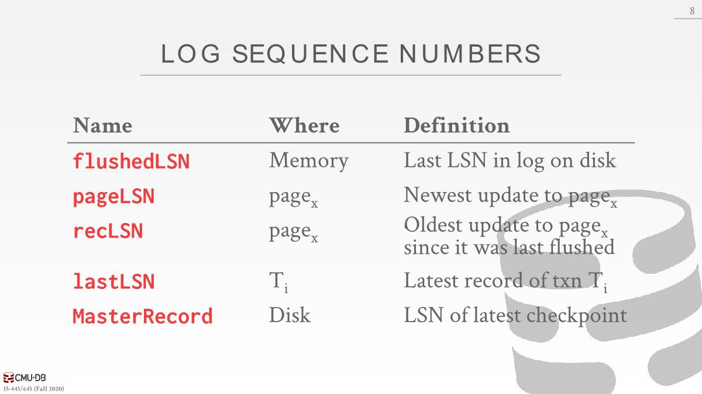

- Each data page contains
  - **pageLSN**: The LSN of the most recent update to that page.
  - **recLSN**: Oldest update to page since it was last flushed(*自从上次flush以来*).
- The **flushedLSN** in memory is updated every time the DBMS writes out the WAL buffer to disk. 是一个指针，指向某个lastLSN

每次修改数据时候，会先往内存中的log buffer添加记录并且得到该日志的LSN，然后修改page并更新pageLSN（因为拿到了write latch，所以可以直接更新）。每当从buffer pool中移除page的时候始终会去更新flushedLSN，以弄清楚已经往磁盘写入了多少log。

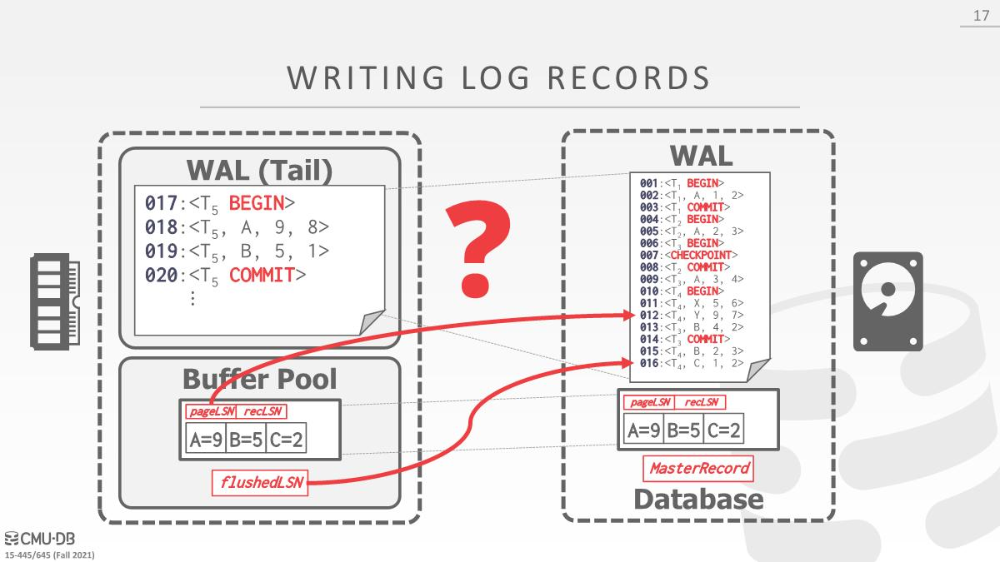

假设pageLSN=12，flushedLSN=16，现在想将page flush到磁盘，因为pageLSN<=flushedLSN，代表日志已经落地到磁盘，可以flush到磁盘。

假设pageLSN=19，不能刷出到磁盘，因为对应的日志还没有落地到磁盘。

# Normal Execution

下面的讨论都是基于以下简化的事务特征：

- All log records fit within a **single page**.
- Disk writes are **atomic**.
- Single-versioned tuples with **Strict 2PL**.
- **STEAL + NO-FORCE** buffer management with WAL.

## Transaction Commit

When a transaction goes to commit, the DBMS first writes COMMIT record to log buffer in memory. Then the DBMS flushes all log records up to and including the transaction’s COMMIT record to disk. Note that these log flushes are sequential, synchronous writes to disk. There can be multiple log records per log page.

Once the COMMIT record is safely stored on disk, the DBMS returns an acknowledgment back to the application that the transaction has committed.

 At some later point, the DBMS will write a special **TXN-END** record to log. This indicates that the transaction is completely finished in the system and there will not be anymore log records for it. These TXN-END records are used for internal bookkeeping and do not need to be flushed immediate.

当事务commit记录被持久化到磁盘，可以告诉外界已经成功提交了，但是事务内部并未完全完成，依旧可以去维护一些内部元数据，比如维护bookkeeping代表所有活跃的事务，当添加TXN-END的时候就看不到与该事务相关的任何信息，可以从内部的bookkeeping中移除。

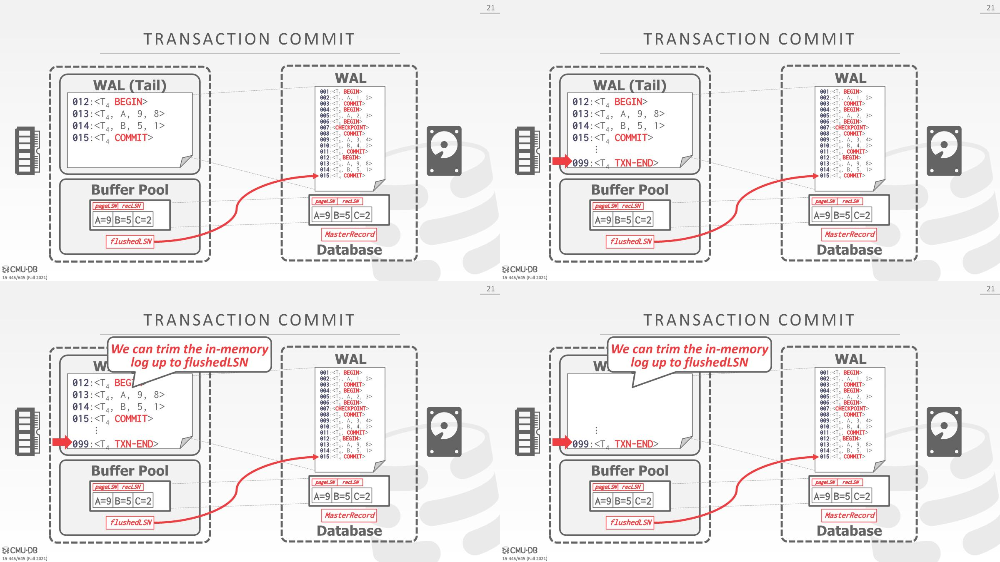

## Transaction Abort

- Aborting a transaction is a special case of the ARIES undo operation applied to only one transaction. *undo的一种特殊情况*

- We need to add another field to our log records
  - prevLSN: The previous LSN for the txn. 为了避免通过反复扫描日志来弄清楚需要撤销哪些操作，可以通过prevLSN找到与某个txn相关的所有操作（并没有记录往磁盘中写入了哪些page）
  - This maintains a linked-list for each txn that makes it easy to walk through its records.
  - The DBMS adds CLRs to the log like any other record but they never need to be undone.

在BEGIN语句中，并没有prevLSN，设置为nil

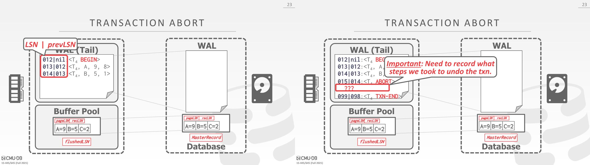

如何记录abort的动作：compensation log record (CLR)，CLR描述了为撤销前一个更新记录的操作而采取的操作。

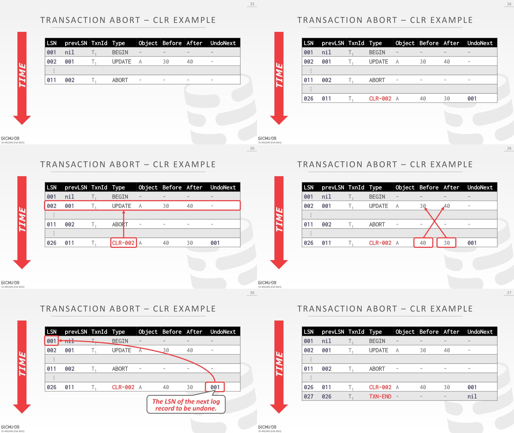

处理事务的abort操作时会创建一个CLR日志，会和该事务执行的一个更新操作相关联。日志中有一个undoNext字段指向需要撤销的下一条日志，在这里指向的是begin，所以不需要继续撤销了，添加TXN-END即可。

# Checkpointing

The first two blocking checkpoint methods discussed below pause transactions during the checkpoint process. 

This pausing is necessary to ensure that the DBMS does not miss updates to pages during the checkpoint.

Then, a better approach that allows transactions to continue to execute during the checkpoint but requires the DBMS to record additional information to determine what updates it may have missed is presented.

## Blocking Checkpoints

The DBMS halts(*暂停*) the execution of transactions and queries when it takes a checkpoint to ensure that it writes a consistent snapshot of the database to disk.

1. Halt the start of any new transactions.
2. Wait until all active transactions finish executing.
3. Flush dirty pages to disk.

This is bad for runtime performance but makes recovery trivially easy.

## Slightly Better Blocking Checkpoints

与之前的检查点方案类似，不同之处在于DBMS不需要等待active transactions完成执行，但是会阻塞写事务。

假设在内存中有3个page，有一个事务在运行，已经修改了page3，在要更新page1前checkpoint开始了，此时事务获取不到page1的write latch，该事务暂停下来，checkpoint会扫描每个page和buffer pool，将它们刷出到磁盘。这里会将page1、2和已经修改的page3刷出到磁盘。

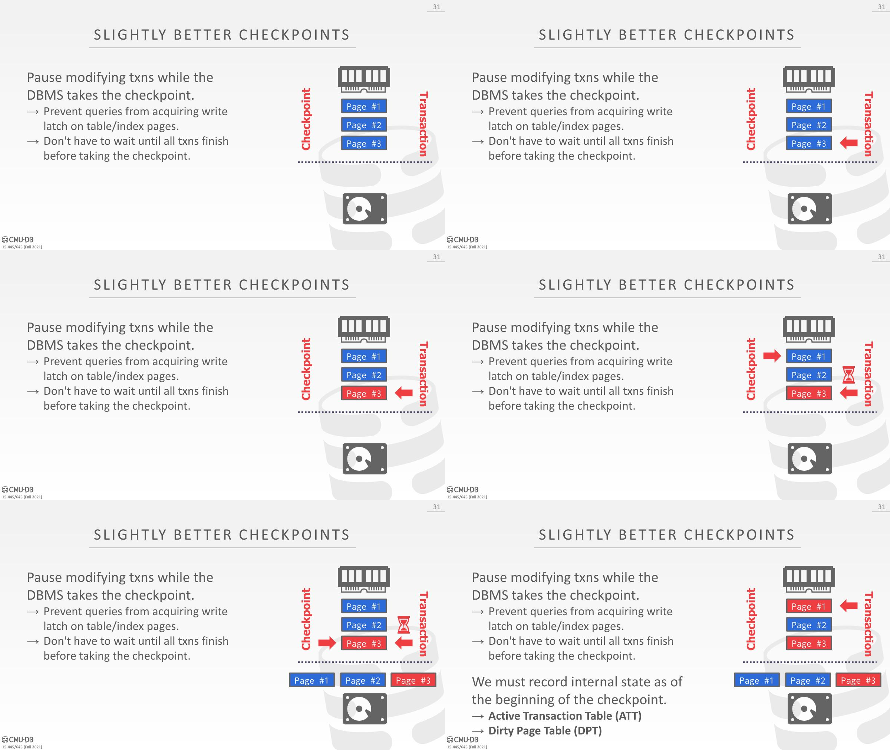

然后checkpoint结束，事务接着运行，开始更新page1，此时会出现一个问题，checkpoint包含了一个无法确定是否可以完成的事务的数据，这时候checkpoint和实际的数据就不一致了。checkpoint其实就是数据库某个时间点的数据快照，但是这个快照里面包含了一些不确定的数据，这些数据可能会被回滚，也可能有最新值，即使有wal，崩溃后撤销这些脏修改会特别慢，因为得对一个个单独页面进行更新，通过记录更多的元数据，可以避免这样的开销。

为了解决这个不一致的问题，需要记录一些状态：

- **Active Transaction Table (ATT)**
  - The ATT represents the state of transactions that are actively running in the DBMS. 
  - A transaction’s entry is removed after the DBMS completes the commit/abort process for that transaction.  所以没有finished之类的状态
  - For each transaction entry, the ATT contains the following information:
    - transactionId: Unique transaction identifier
    -  status: The current mode of the transaction (Running, Committing, Undo Candidate). Candidate表示到达TXN-END之前，遇到⼀些情况不得不做undo操作
    - lastLSN: Most recent LSN written by transaction
- **Dirty Page Table (DPT)**
  - The DPT contains information about the pages in the buffer pool that were modified by uncommitted transactions.
  - One entry per dirty page in the buffer pool
    - recLSN: The LSN of the log record that first caused the page to be dirty

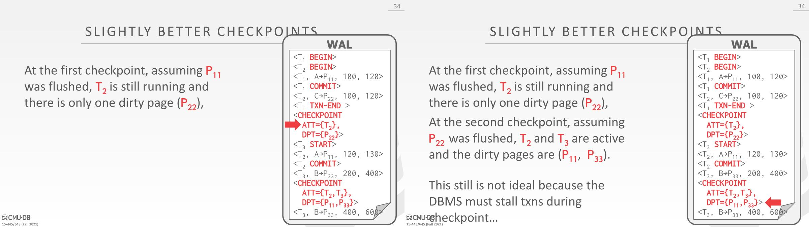

## Fuzzy Checkpoint

- A fuzzy checkpoint is where the DBMS allows active txns to continue the run while the system flushes dirty pages to disk.

- New log records to track checkpoint boundaries
  - **CHECKPOINT-BEGIN**: Indicates start of checkpoint 
  - **CHECKPOINT-END**: Contains **ATT** + **DPT**.

checkpoint成功完成时，MasterRecord指向checkpoint-begin记录的LSN。

在checkpoint之后启动的任何txn都不会记录在checkpoint-end记录中的ATT中。

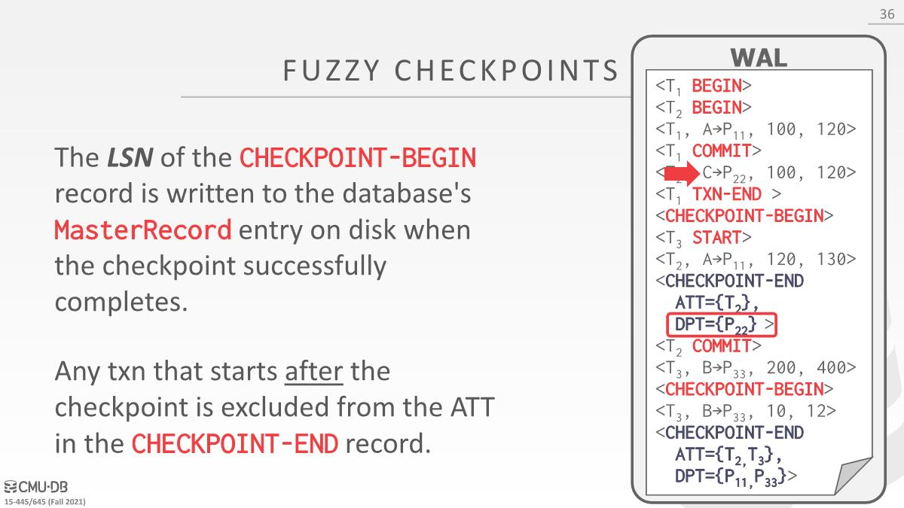

#  ARIES Recovery

Upon start-up after a crash, the DBMS will execute the following phases

- **Analysis**: Read WAL from last CHECKPOINT-END to identify dirty pages in the buffer pool and active txns at the time of the crash.  当log刷出去的时候，不一定也会将buffer pool中的page也刷出去，所以没有将DPT记录在log之内，所以从log找不到dirty page，需要在恢复阶段重新构建。
- **Redo**: Repeat **all** actions starting from an appropriate point(*适当的位置*) in the log.
- **Undo**: Reverse the actions of transactions that did not commit before the crash.

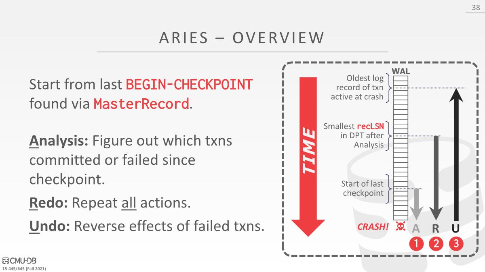

1. The DBMS starts the recovery process by examining(*检查*) the log starting from the last BEGIN-CHECKPOINT found via MasterRecord
2. It then begins the Analysis phase by scanning forward through time to build out ATT and DPT.
3. In the Redo phase, the algorithm jumps to the smallest recLSN, which is the oldest log record that may have modified a page not written to disk. The DBMS then applies all changes from the smallest recLSN.
4. The Undo phase starts at the oldest log record of a transaction active at crash and reverses all changes up to that point.

## Analysis Phase

Start from last checkpoint found via the database’s MasterRecord LSN.

1. Scan log forward from the checkpoint.
2. If the DBMS finds a TXN-END record, remove its transaction from ATT.
3. All other records, add transaction to ATT with status UNDO, and on commit, change transaction status to COMMIT. 沿着时间线往前走，不知道是否被中止
4. For UPDATE log records, if page P is not in the DPT, then add P to DPT and set P ’s recLSN to the log record’s LSN.

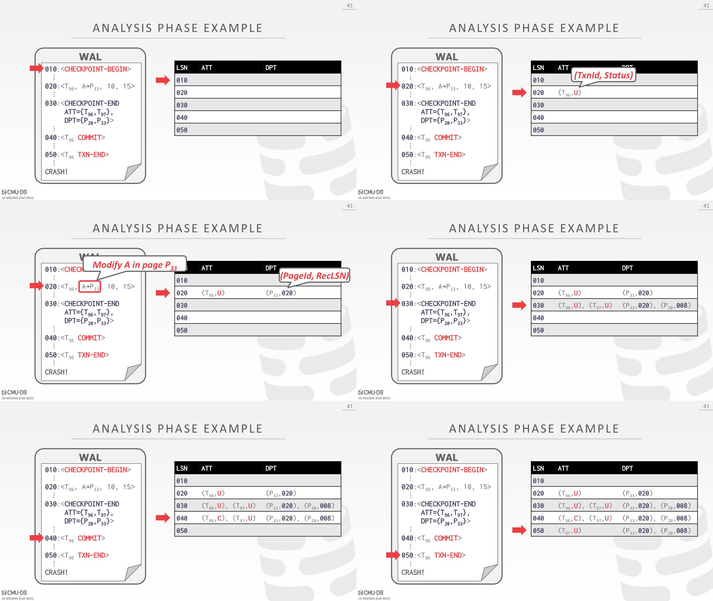

根据第三条规则，填充T96日志
需要abort T97，未在log中看到相关日志，不确定这些page是否写出到磁盘了。

## Redo Phase

- The goal of this phase is for the DBMS to repeat history to reconstruct(*重建*) its state up to the moment of the crash(*崩溃时的状态*). 

- It will reapply all updates (even aborted transactions) and redo CLRs.
- The DBMS scans forward from log record containing smallest **recLSN** in the DPT. 修改page的第一条记录，可能还没有将对应的数据写出到磁盘

## Undo Phase

- Undo all txns that were active at the time of crash and therefore will never commit.
  - These are all the txns with **U** status in the ATT after the Analysis Phase.
- Once the last transaction has been successfully aborted, the DBMS flushes out the log and then is ready to start processing new transactions.

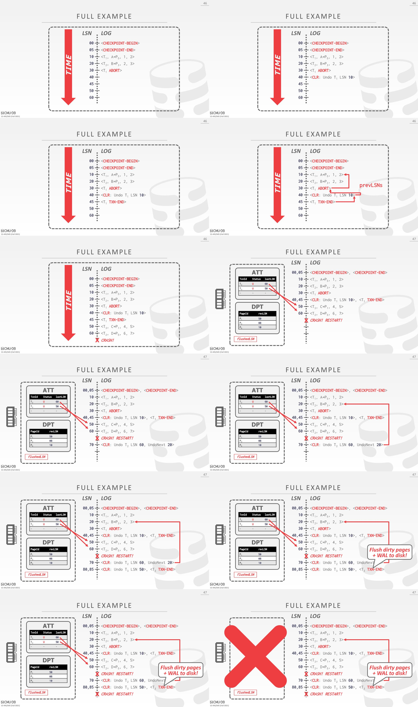

- T1 abort后会创建一个CLR代表想要undo T1的修改

- 在analysis phase，填充ATT和DPT，有两个活跃的事务T2和T3，这两个都是处于undo status，所以这两个不会被提交，选出lastLSN大于recLSN并且最大的那个，会先添加一个CLR然后undo T2

- 添加undoNext指向下一个要undo的log
- 为T3添加一条CLR，undo T3

- 添加txn-end日志后，可以将所有的dirty pages刷出到磁盘，所有的修改信息已经写入到WAL并刷出到磁盘了

假设后面又crash，
