#  System Architectures

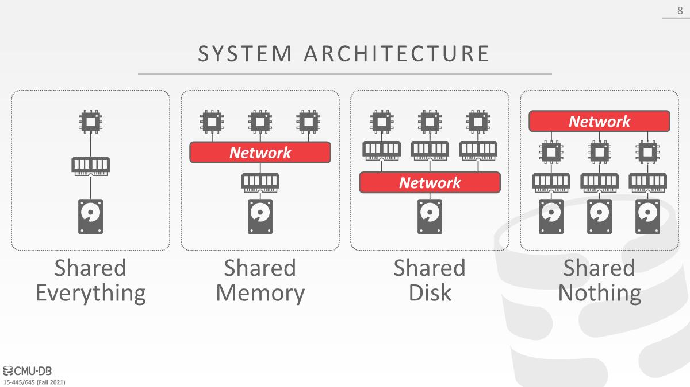

A single-node DBMS uses what is called a **shared everything** architecture. 

This single node executes workers on a local CPU(s) with its own local memory address space and disk. 

## Shared Memory

- An alternative to shared everything architecture in distributed systems is shared memory. 

- CPUs have access to common memory address space via a fast interconnect. CPUs also share the same disk.

- In practice, most DBMSs do not use this architecture, as it is provided at the OS / kernel level. It also causes problems, since each process’s scope of memory is the same memory address space, which can be modified by multiple processes.

- Each processor has a global view of all the in-memory data structures. Each DBMS instance on a processor has to “know” about the other instances.

## Shared Disk

- In a shared disk architecture, all CPUs can read and write to a single logical disk directly via an interconnect, but each have their own private memories. This approach is more common in cloud-based DBMSs.
- DBMS的执行层可以独立于存储层进行扩展。添加新的存储节点或执行节点不会影响其他层中数据的布局或位置。
- Nodes must send messages between them to learn about other node’s current state. That is, since memory is local, if data is modified, changes must be communicated to other CPUs.
- Nodes have their own buffer pool and are considered stateless. A node crash does not affect the state of the database since that is stored separately on the shared disk. The storage layer persists the state in the case of crashes.

计算节点会从shared-disk系统中拉取数据并放入它们的本地内存，以及计算结果

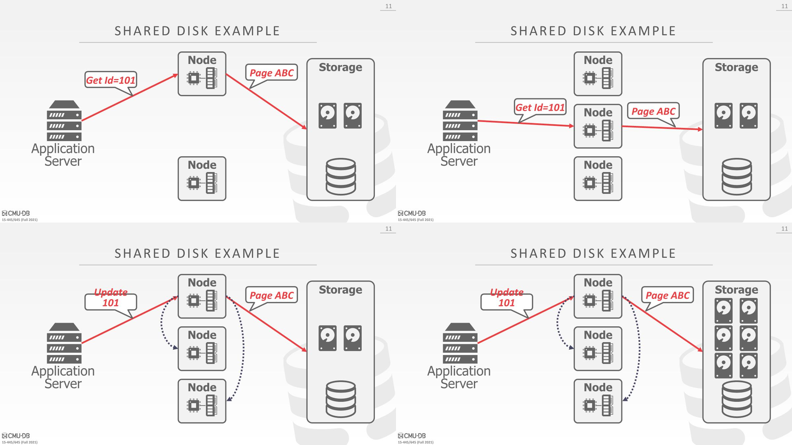

## Shared Nothing

大部分人会考虑这种架构

- In a shared nothing environment, each node has its own CPU, memory, and disk. Nodes only communicate with each other via network.
- It is more difficult to increase capacity in this architecture because the DBMS has to physically move data to new nodes. 
- It is also difficult to ensure consistency across all nodes in the DBMS, since the nodes must coordinate with each other on the state of transactions. 
- The advantage, however, is that shared nothing DBMSs can potentially(*潜在的*) achieve better performance and are more efficient then other types of distributed DBMS architectures.

每个节点上都拥有该数据库中的⼀部分数据，标注了该节点所拥有的数据范围，会将查询请求发送给数据所在节点进行本地计算并返回结果

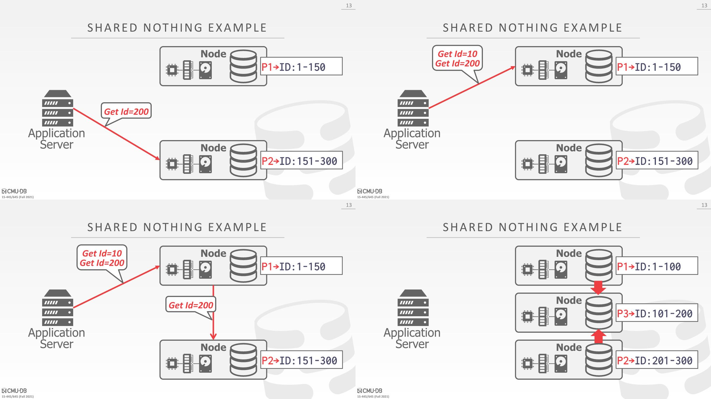

垂直扩展机器成本更高，并且得到收益也会递减，一台机器的硬盘内存cpu存在着上限。

# Design Issues

1. How does the application find data? 

2. How should queries be executed on a distributed data? Should the query be pushed to where the data is located? Or should the data be pooled into a common location to execute the query? 
3. How does the DBMS ensure correctness?
4. Another design decision to make involves(*涉及*) deciding how the nodes will interact(*交互*) in their clusters. 
   - Two options are `homogeneous` and `heterogeneous` nodes, which are both used in modern-day systems. 同构节点异构节点

## Homogeneous Nodes

- Every node in the cluster can perform the same set of tasks (albeit on potentially(*尽管可能在*) different partitions of data), lending itself well to(*从而很好地*) a shared nothing architecture.  可以将查询发送给任意一个节点，该节点会弄清楚所寻找的结果是什么。
- This makes provisioning and failover(*配置和故障转移*) “easier”. Failed tasks are assigned to available nodes.

## Heterogeneous Nodes

给每个节点分配指定的任务，添加节点时候需要知道应该添加的节点是哪种类型的。

Mongodb使用的是这种架构，有一些特殊用途的节点，负责处理系统中特定的任务。当应用程序想要发送一个请求来执行一个查询时，会始终跑到router节点，router节点并不清楚有什么数据，会去查询config server弄清楚数据在哪些分片中。接着router节点将请求发送给shared server，shared server执行查询并返回结果。

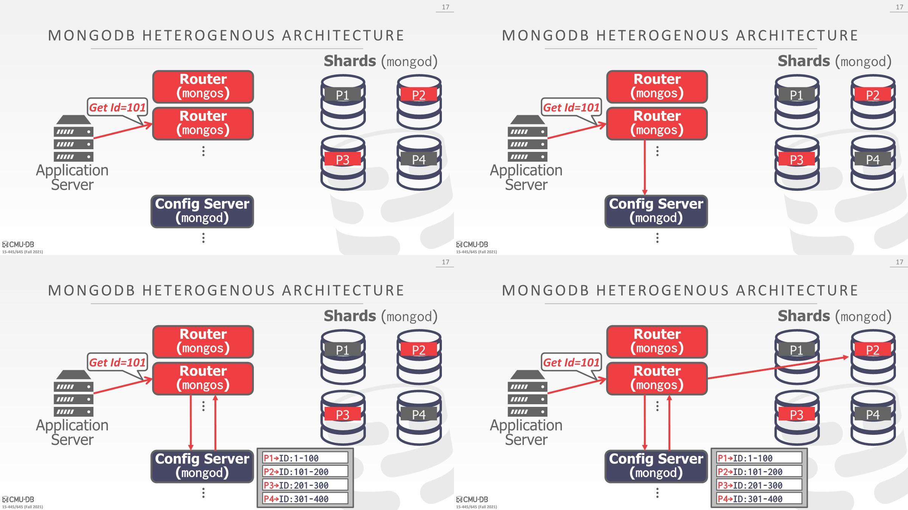

# Data Transparency

数据透明度

- Users should not be required to know where data is physically located, how tables are partitioned or replicated.

- A query that works on a single-node DBMS should work the same on a distributed DBMS.

# Partitioning Schemes

- Distributed system must partition the database across multiple resources, including disks, nodes, processors.

- This process is sometimes called sharding in NoSQL systems.
- When the DBMS receives a query, it first analyzes the data that the query plan needs to access. The DBMS may potentially send fragments of the query plan to different nodes, then combines the results to produce a single answer.

- The goal of a partitioning scheme is to maximize single-node transactions, or transactions that only access data contained on one partition. 
  - This allows the DBMS to not need to coordinate the behavior of concurrent transactions running on other nodes. 
  - On the other hand, a distributed transaction accesses data at one or more partitions. This requires expensive, difficult coordination.

## Naive Data Partitioning

- Each node stores one table, assuming enough storage space for a given node.

- This is easy to implement because a query is just routed to a specific partitioning. 
- This can be bad, since it is not scalable. 
- One partition’s resources can be exhausted(*耗尽*) if that one table is queried on often, not using all nodes available.

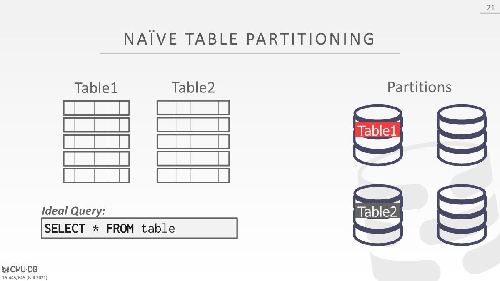

## Horizontal Partitioning

- More commonly used is horizontal partitioning, which splits a table’s tuples into disjoint subsets.
- Choose column(s) that divides the database equally in(*平均*) terms of size, load, or usage, called the partitioning key(s).
- The DBMS can partition a database physically (shared nothing) or logically (shared disk) via hash partitioning or range partitioning.

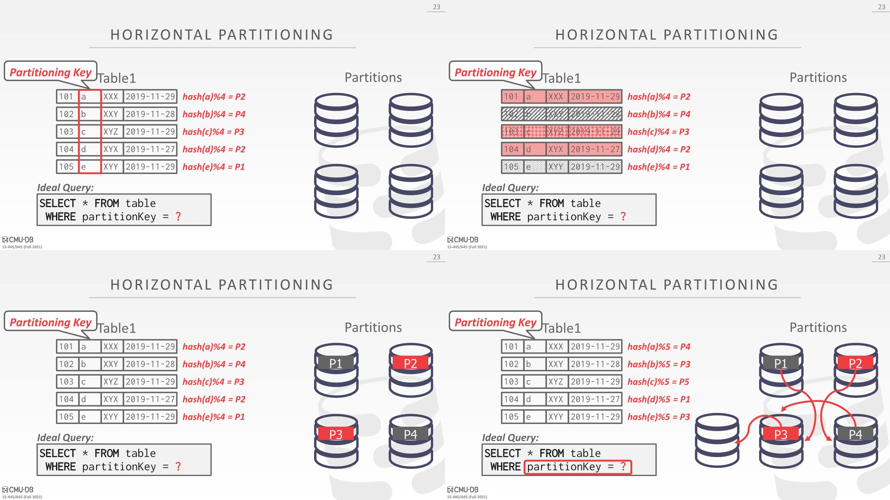

hash(tuple)% number of partitions

在某个分区找不到数据时候，会路由到别的分区

缺点是进行范围查询会很麻烦，因为无法对一个范围进行hash并放到同一个分区。

如果要更新partitioning key，需要移动数据，比如新增一个分区，可能会移动整个数据库的每一条数据，需要使用一致性hash（Consistent Hashing）处理这个问题。

### Consistent Hashing

它允许在不移动任何数据的情况下，能够对集群中的分区进行增量更新和移除

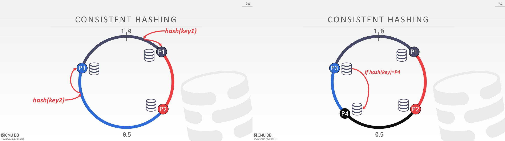

顺时针找到第一个分区

增加一个分区D，BD区域的结果原本是发到C，现在需要发到D，只需要更新环，每个分区的数据不需要移动

---

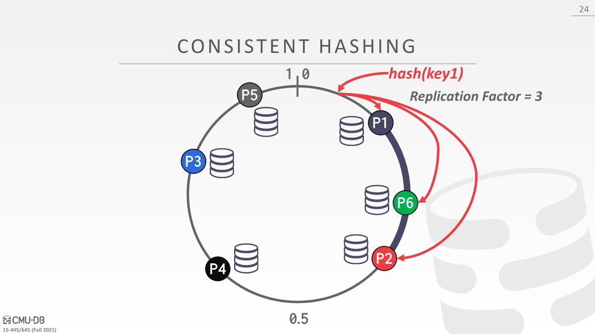
The Replication Factor (RF) is equivalent to the number of nodes where data (rows and partitions) are replicated.

比如AFB三个副本，读的话可以任意读其中一个，但是需要保证一致性

### Logical And Physical Partitioning

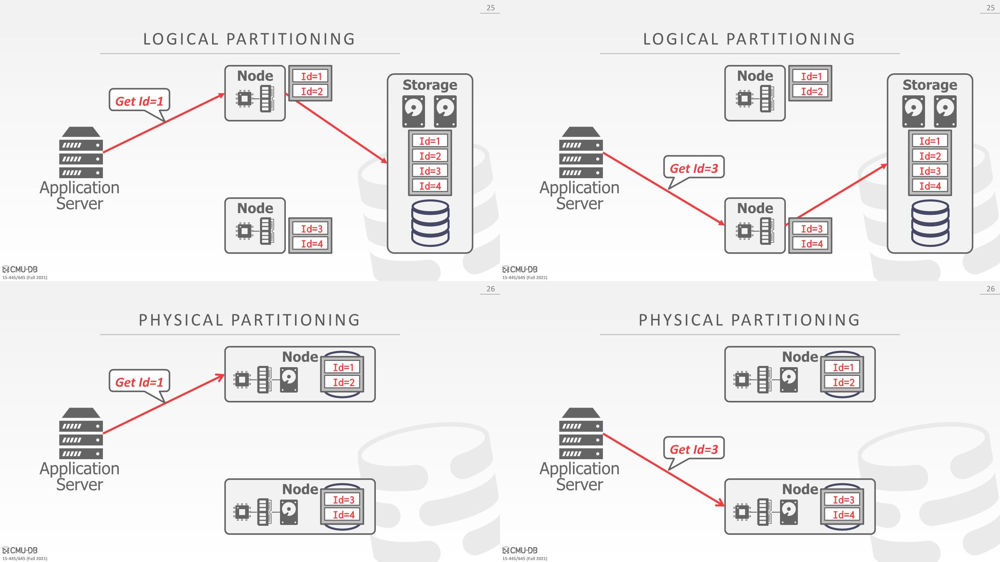

# Distributed Concurrency Control

If our DBMS supports multi-operation and distributed txns, we need a way to coordinate their execution in the system. 以某种⽅式来决定允许谁去做哪些事情，以及什么时候去提交事务，当所有⼈都赞同的话，就会进⾏提交。

Two different approaches: Centralized and Decentralized

## Centralized coordinator

The centralized coordinator acts as a global “traffic cop”(*交通警察*) that coordinates all the behavior. 所有⼈都会跑到某个中心，这个地⽅能看到系统中所发生的一切，它会去判断是否允许进行提交。

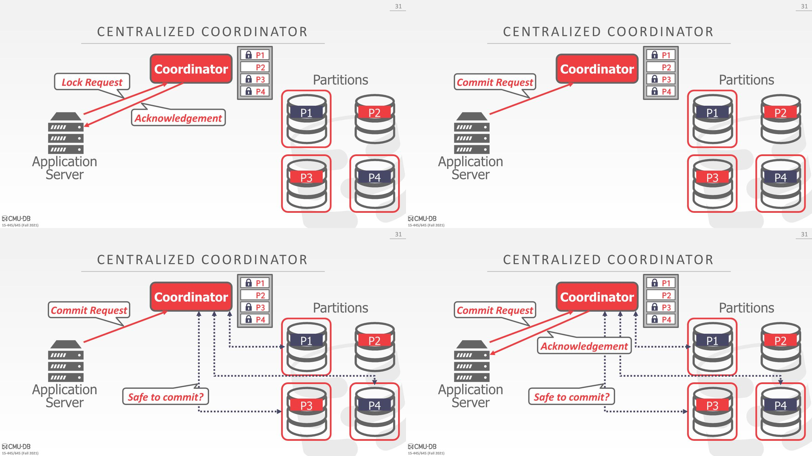

A TP Monitor is an example of a centralized coordinator for distributed DBMSs.

1. 请求lock，获得p1，p3，p4的lock
2. application对这些分区进行修改，然后询问coordinator是否可以提交
3. coordinator会和这些分区确认，如果都ok就可以提交

## Middleware

More common is to use a centralized coordinator as a middleware.

middleware会弄清楚查询所涉及的数据分别哪个分区，所做的事情和 TP monitor⼀样，会先和分区服务器沟通。

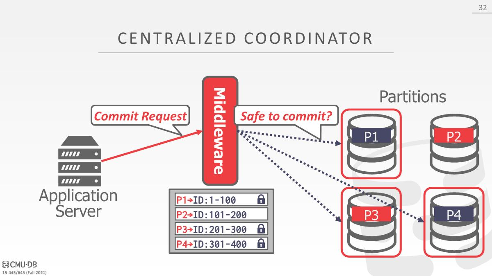

这个方式很普遍，Facebook有世界最大的MySQL集群，Google广告业务，Youtube等都是以这种形式

## Decentralized coordinator

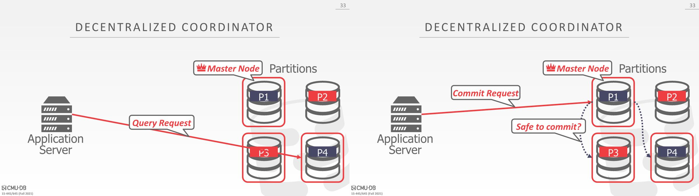

- In a decentralized approach, nodes organize themselves. 

- The client directly sends queries to one of the partitions. 
  - This *home partition* will send results back to the client. The home partition is in charge of(*负责*) communicating with other partitions and committing accordingly(相应的).
- 可以将所有查询请求直接发送到主节点或其他节点
