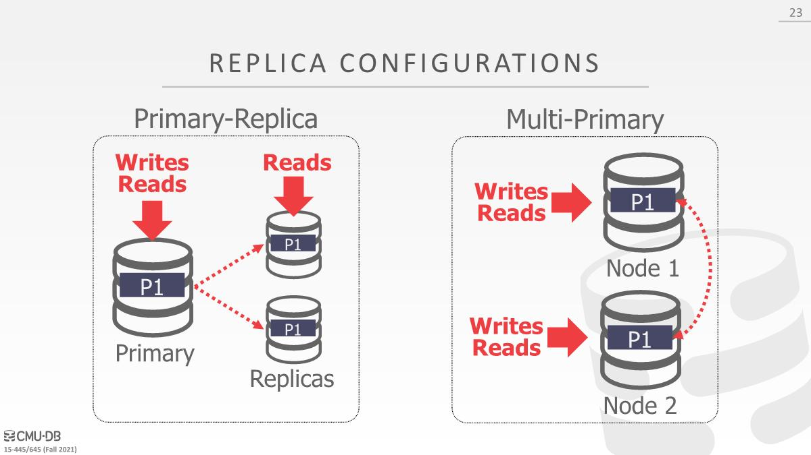
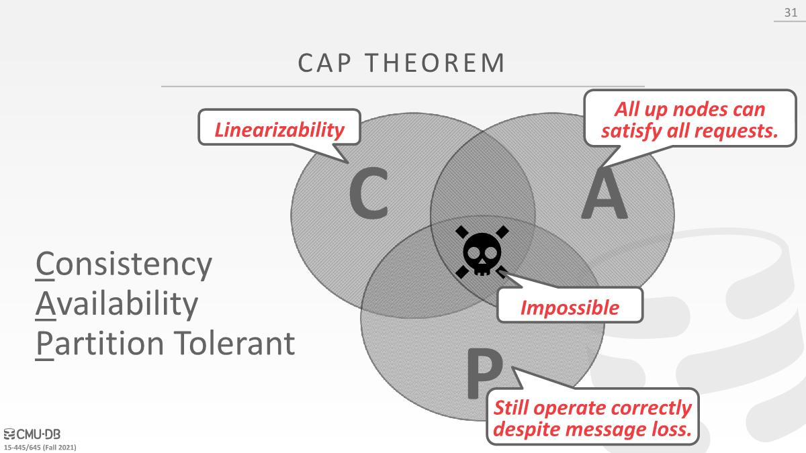
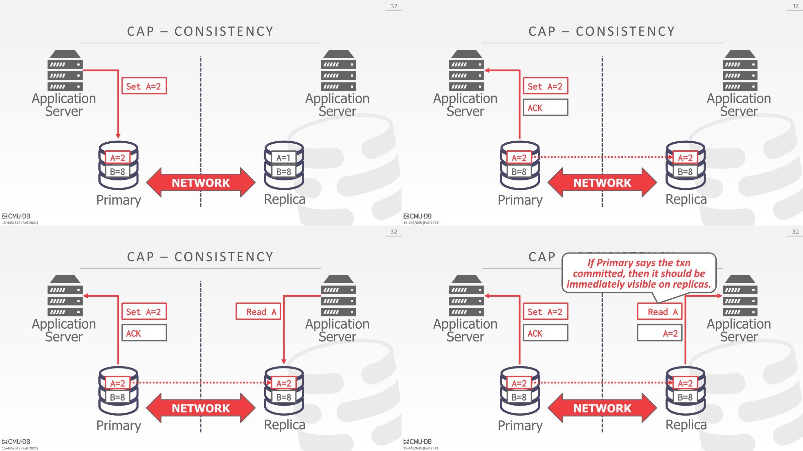
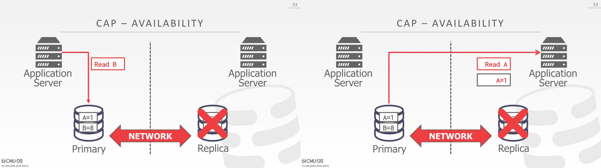
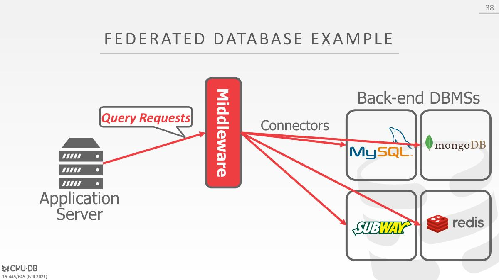
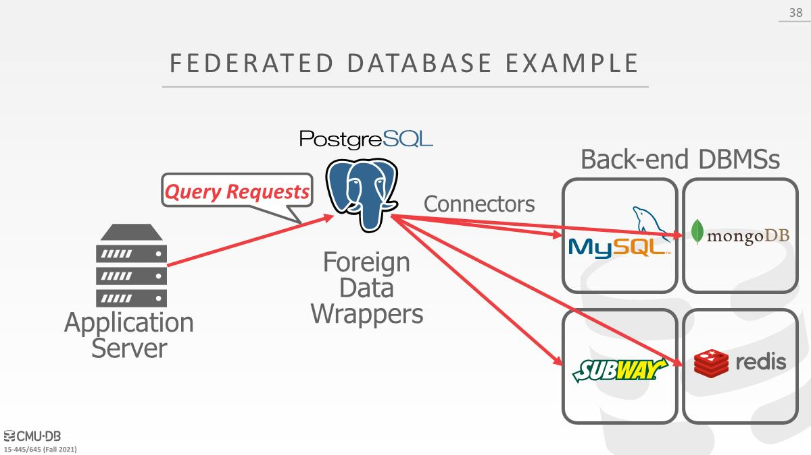

If the other nodes in a distributed DBMS cannot be trusted, then the DBMS needs to use a byzantine fault tolerant protocol (e.g., blockchain) for transactions.

# Atomic Commit Protocols

某个节点知道该如何与其他节点进⾏通信，现在提交事务是否安全

- Two-Phase Commit (Common) 可能是最流行的，paxos的退化版本
- Three-Phase Commit (Uncommon) 
- Four phase (Uncommon)  微软提出，FaRM分布式数据库中使用，因为使用到了RDMA（远程内存访问）
- Paxos (Common)
- Raft (Common)
- ZAB (Apache Zookeeper)
- Viewstamped Replication (first probably correct protocol)

2PL提交中的coordinator和Paxos的vote其实是一回事，只是2PL提交要让所有⼈同意才能提交事务，Paxos只需要大多数同意就可以提交事务。

# Replication

⼤多数⼈不需要某种partitioned distributed DBMS来处理workload，使用replication的方式就足够了

## Number of Primary Nodes

根据primary node的数量有两种选择

### Primary-Replica

- All updates go to a designated(*指定的*) primary for each object. 
- The primary propagates(*传播*) updates to its replicas without an atomic commit protocol, coordinating all updates that come to it. (*处理所有的update*)
- Read-only transactions may be allowed to access replicas if the most up-to-date information is not needed. 
- If the primary goes down, then hold an election to select a new primary.

### Multi-Primary

Transactions can update data objects at any replica. Replicas must synchronize with each other using an atomic commit protocol like Paxos or 2PC.

## K-Safety

- K-safety is a threshold for determining the fault tolerance of the replicated database. 
- The value K represents the number of replicas per data object that must always be available. 
- If the number of replicas goes below this threshold, then the DBMS halts execution(*停止执行*) and takes itself offline.
- A higher value of K reduces risk of losing data. It is a threshold to determine how available a system can be

通过监控⼀个数据对象所对应的拷⻉数量，来得知系统中存活的replica的数量

## Propagation Scheme

- When a transaction commits on a replicated database, the DBMS decides whether it must wait for that transaction’s changes to propagate to other nodes before it can send the acknowledgement to the application client. 
- There are two propagation levels: Synchronous (strong consistency) and asynchronous (eventual consistency*最终一致性*).

- In a **synchronous** scheme, the primary sends updates to replicas and then waits for them to acknowledge that they fully applied (i.e., logged) the changes. 
  - Then, the primary can notify the client that the update has succeeded. 
  - It ensures that the DBMS will not lose any data due to strong consistency. 
  - This is more common in a traditional DBMS.

- In an **asynchronous** scheme, the primary immediately returns the acknowledgement to the client without waiting for replicas to apply the changes. 
  - Stale reads(*读到旧数据*) can occur in this approach, since updates may not be fully applied to replicas when read is occurring. 
  - If some data loss can be tolerated(*容忍*), this option can be a viable(*可行的*) optimization. 
  - This is used commonly in NoSQL systems.

## Propagation Timing

- For **continuous** propagation timing, the DBMS sends log messages immediately as it generates them. 
  - Note that a commit or abort message needs to also be sent. 
  - Most systems use this approach.

- For on **commit** propagation timing, the DBMS only sends the log messages for a transaction to the replicas once the transaction is committed. 
  - This does not waste time for sending log records for aborted transactions.

## Active vs Passive

- active-active：事务彼此独立运行，在master上运行该事务，在replica上也运行该事务，提交的时候需要检查最后的结果是否一样，需要花精力确保如何更好地以完全相同的顺序执行事务
- active-passive：首先在master上执行事务，然后将修改传播到replica，可以发送修改后的二进制（ physical bytes that were changed），SQL语句，或者ahead log。

# CAP Theorem

It is impossible for a distributed system to always be **Consistent**, **Available**, and **Partition Tolerant**. Only two of these three properties can be chosen.

- **Consistent**：强一致性。Once a write completes, all future reads should return the value of that write applied or a later write applied. Additionally, once a read has been returned, future reads should return that value or the value of a later applied write.
  - 写操作确定后，以后所有的读要么是读到修改后的值，要么是后面修改的值（这个写之后可能还有写，两个写完成后读到的值）。读操作确定后，以后所有的读要么返回的这个值（上次确定读到的值），要么是后面修改的值（读之后的写操作覆盖值）。总体意思是时间只能往前走。
    

- **Availability**：any client making a request for data gets a response, even if one or more nodes are down
  
- **Partition tolerance**：the cluster continues to function even if there is a "partition" (communication break) between two nodes (both nodes are up, but can't communicate).

NoSQL系统倾向AP（最终一致性，即使不能相互通信，节点也会保持在线可处理查询，分区恢复后重新同步数据，可能会获取到旧的数据），其他倾向CP（强一致性，当分区发生在任意两个节点之间时，必须关闭不一致的节点直到恢复一致）或者CA（如果系统中出现了分区，就无法实现C和A）

# Federated Databases

Distributed architecture that connects together multiple DBMSs into a single logical system. 不同的DBMS

A query can access data at any location.

middleware重写和拆分sql中的部分内容，以使用不同的api在不同的DBMS上执行

PostgreSQL有⼀种叫做Foreign Data Wrappers的东西，可以连接不同的数据源，但是对外则是一个普通的PG数据库