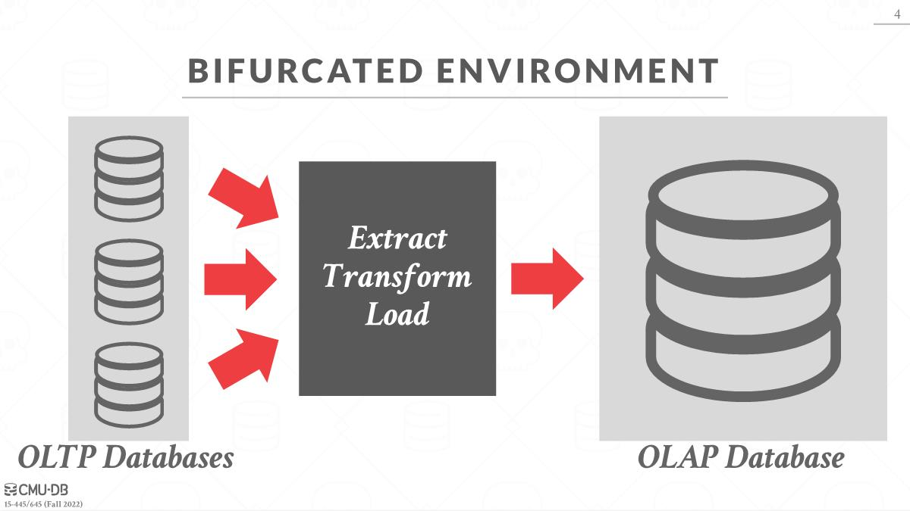

# Decision Support Systems

- For a read-only OLAP database, it is common to have a bifurcated(*分叉的*) environment, where there are multiple instances of OLTP databases that ingest(*摄取*) information from the outside world which is then fed into(*馈入*) the backend OLAP database, sometimes called a data warehouse(*数据仓库*). 

- There is an intermediate step called ETL, or Extract, Transform, and Load, which combines the OLTP databases into a universal schema for the data warehouse.

The two approaches for modeling an analytical database are star schemas and snowflake schemas.

