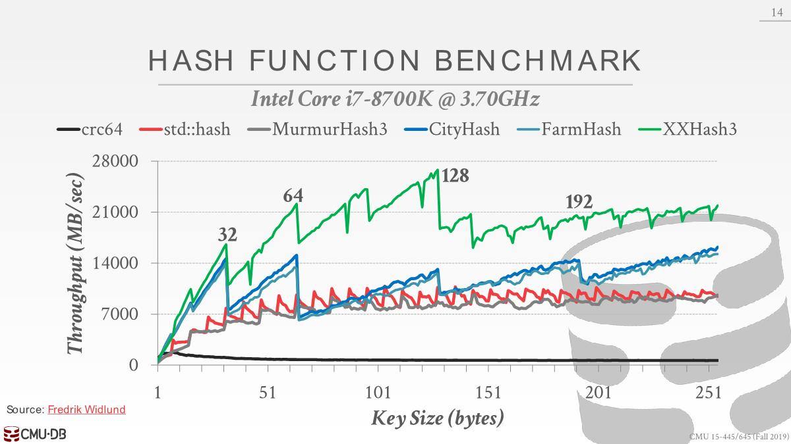
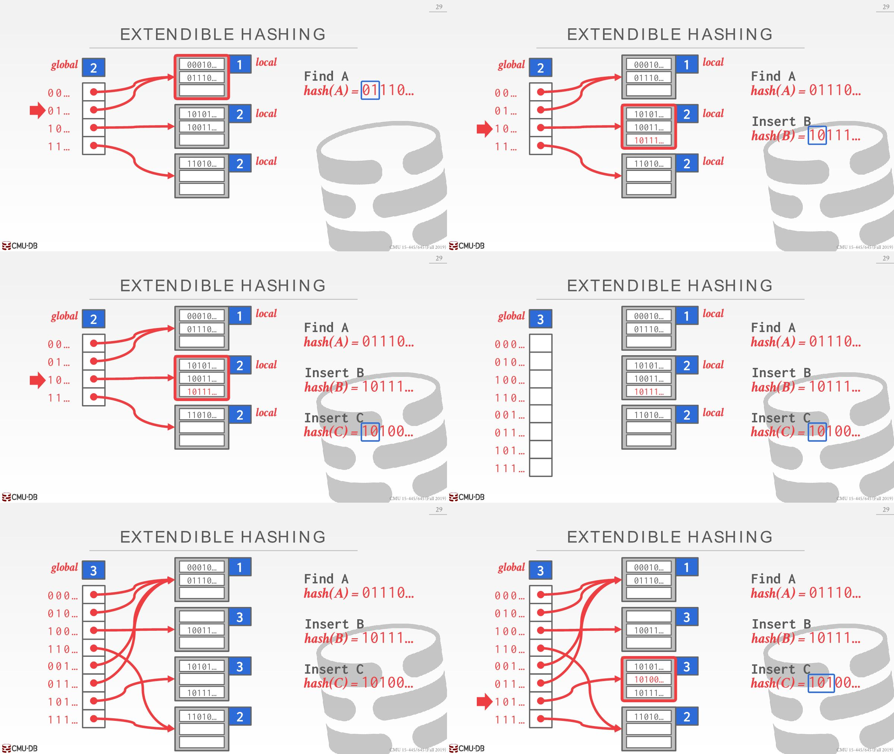
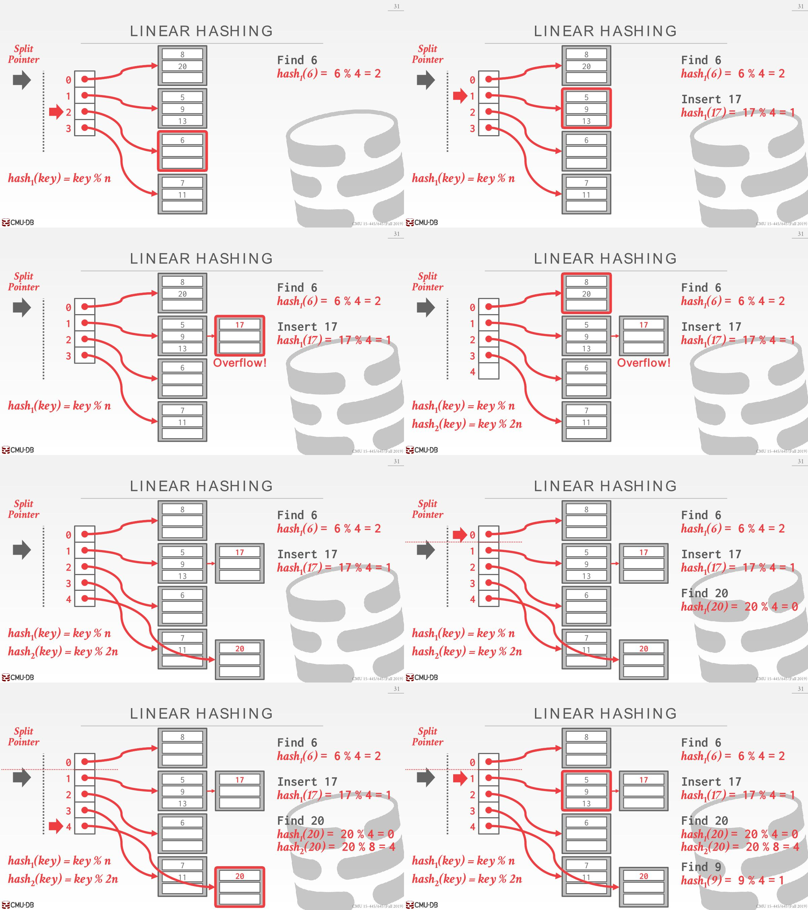

# Hash Tables

## Data structures

How  to support the DBMS's execution engine to read/write data from pages.

Two types of data structures: Hash Tables/Trees

Design Decisions:

- **Data organization**: How we layout data structure in memory/pages and what  information to store to support efficient access.
- **Concurrency**: How to enable multiple threads to access the data  structure at the same time without causing problems.

## Hash Tables

- Space Complexity: `O(n)`
- Operation Complexity:
  - Average: `O(1)`
  - Worst: `O(n)`
- 用于执行查询（比如join连接使用构建临时hash table），page table，Internal Meta-data，Core Data Storage（只用到点对点查询，并没有范围查询）等，通常不会在表索引上面使用hash table。

### Design

- **Hash Function**
  - How to map a large key space into a smaller domain.
  - Trade-off(*权衡*) between being fast vs. collision(*碰撞*) rate.
- **Hashing Schema**
  - How to handle key collisions after hashing.
  - Trade-off between allocating a large hash table(分配一个很大的数组，几乎很少会碰撞) vs  additional instructions to find/insert keys(碰撞时需要一些额外的指令去处理).

### Hash Function

- For any input key, return an integer representation of that key.
- We do not want to use a cryptographic hash function(e.g. SHA-256) for DBMS hash tables.
- We want something that is **fast** and has a **low collision rate**.

常见的Hash函数：

1. `CRC-64` (1975): Used in networking for error detection. 碰撞率低但是速度非常慢
2. `MurmurHash` (2008): Designed to a fast, general purpose(*通用*) hash function. 
3. `Google CityHash` (2011): Designed to be faster for short keys (<64 bytes).
4. `Fackbook XXHash` (2012): From the creator of zstd compression. 速度快碰撞率低，首选。
5. `Google FarmHash` (2014): Newer version of CityHash with better collision rates.

当key的大小为32 byte和64 byte时，farmhash、CityHash以及XXHash3性能比较突出。这是因为它们所进行计算处理的key都刚好填满单个cache line（Cache Line 是CPU和主存之间数据传输的最小单位）。从内存中读取一次数据时，可以将64 byte的key放到cache，可以一次操作从cache中拿到想要的数据。

当key的大小超过64 byte后，CityHash或FarmHash会切换到另一种不同的算法上，这就会导致速度上的不同。

### Static Hashing Schema

分配内存的时候，已经知道了保存的key的数量。如果空间不够需要扩容，一般扩容2倍，需要复制数据并打散数据，效率很低，一般会知道key的数量，这样就不用扩容

#### Linear Probe Hashing

open addressing(开地址法)

This is the most basic hashing scheme. It is also typically the fastest.

解决冲突：从下一个位置开始找，直到找一个空闲位置（环形数组，可以一直回到开头）。

定位元素：Hash得到index，但是index对应的不一定是想要的数据，如果不是则遍历后面的index，所以每个index对应的数据是key和value，保存key需要确定是不是想要的key。

删除元素：不能直接删除元素，比如Hash(A)=1实际存储在index=2，Hash(B)=2实际存储在index=3，如果直接删除A进而删除index=2处的数据，那么取B的时候会算到index=2的位置，但是该位置为空，误认为B没有存储值在Hash表。解决方法：打软删除标记，取B的时候看到软删除继续往下查询，但是会浪费空间。或者删除后移动后面的数据填补空闲位置，但是这样会导致数据不对应，比较麻烦。

如果key不是唯一的，比如插入(1,2)和(1,3)。有两种方法解决：第一种是hash表的值存为链表，第二种则是将重复的key存储为多个entry，查询时候如果想全部取出值，得一直遍历到空的值为止（因为插入重复key的时候是顺着后面找直到找到一个空的位置）

#### Robin Hood Hashing

开地址法的扩展，试着对整个hash table进行平衡，让每个key尽可能靠近它原本所在的位置，这样每个key都是相对平衡的，在全局下尽快的查找，而不是针对于某个key。

`[0]`代表实际插入的位置和原本hash的位置相差多远

- C：hash到了A的位置，刚开始`A[0]==C[0]`，所以顺着下面插，更新C为`[1]`
- D：hash到了C位置，因为`C[1]>D[0]`，C比D更poor，所以D插下面，更新D为`[1]`
- E：hash到了A位置，`A[0]==E[0]`，往下插，`C[1]==E[1]`，往下插，`D[1]<E[2]`，E更poor(离原本想插的位置越远)，E插到D位置，D往下插。
- F：hash到D位置，`D[2]>F[0]`，D比F更poor，F往下插。

需要对更多的条件进行检查，看看能否将一个放到另一个的位置上，就要做更多的写入操作，这导致更多的缓存无效，实际上比不过开地址法。

#### Cuckoo Hashing

Instead of using a single hash table, this approach maintains **multiple hash tables** with different hash functions. The hash function are the same algorithm (e.g., XXHash, CityHash); they generate different hashes for the same key by **using different seed values**. 大多数只使用两个Hash Table。

1. 插入A时候，hash1(A)和hash2(A)算出要插入的位置，两个位置都是空的，随机插一个（也可以用更高级的做法，比如从整体出发，不过随机已经足够了）
2. hash1(B)算出的位置不是空闲，只能插入hash2(B)的位置
3. hash1(C)和hash2(C)的位置都不是空闲，随机选择一个插入，替换掉Hash Table2中的B。B要放到Hash Table1，通过hash1(B)算出位置，替换掉A，A通过hash2(A)插入到Hash Table2。

If we find a cycle, then we can rebuild all of the hash tables with new hash function seeds (less common) or rebuild the hash tables using larger tables (more common).

Look-ups and deletions are always `O(1)` because only one location per hash table is checked.

### Dynamic Hashing Schema

Dynamic hashing schemes are able to resize the hash table on demand without needing to rebuild the entire table. The schemes perform this resizing in different ways that can either maximize reads or writes.

#### Chained Hashing

This is the most common dynamic hashing scheme. The DBMS maintains a linked list of buckets for each slot in the hash table.

If bucket is full, add another bucket to that chain. The hash table can grow infinitely because the DBMS keeps adding new buckets.

每个bucket就是一个page，可以在内存，也可以是磁盘

#### Extendible Hashing

Improved variant(*改进*) of chained hashing that **splits buckets** instead of letting chains to grow forever. This approach allows multiple slot locations in the hash table to point to the **same bucket chain**.

global counter：检查生成的hash值的前几位，以此决定跳到哪个slot位置

local counter：需要看几个bit才能找到bucket

- Find A：global counter为2，需要查看hash(A)前两位01，定位到第二个slot，由此定位到bucket

- Insert B：根据hash值前两位10定位到第三个slot，对应的bucket还有空间，可插入
- Insert C：对应的bucket没有多余空间
- 拆分：global count增加1变为3（slot array扩容2倍，如果local counter小于global counter则不需要扩容），同时需要拆分的bucket的local counter+1。增加一个新的bucket，移动一部分数据过去并reshuffle

slot array扩容的时候，需要用latch锁住，直到扩容拆分成功，这会成为一个性能瓶颈。

#### Linear Hashing

- The hash table maintains a **split pointer** that tracks the  next bucket to split. **When any bucket overflows, split the bucket at the pointer location**. 无需使用latch锁住。

- Use multiple hashes(相同算法不同seed) to find the right bucket for a given key.
- The overflow criterion(*标准*) is left up to(*由...决定*) the implementation.

- 添加一个split pointer指向slot 0，跟踪想要拆分的bucket（不管是哪个bucket是溢出）。此时`hash(key) = key % n`，n为num slot array
- Insert 17：bucket空间不足，创建一个新的bucket，然后插入17。
  - 并且对spilt pointer处触发一次拆分，往slot array中添加一个entry，此时`hash(key) = key % 2n`。split pointer会帮助我们决定是使用第一个hash函数还是第二个。
  - 拆分之后将split pointer往下移动一个单位
- Find 20：使用第一个函数计算，如果结果小于等于split pointer所在的位置，代表对应的bucket已经被拆分过。此时需要使用第二个函数计算
- Find 9：大于splint pointer的位置，对应的bucket还没有被拆分，直接使用hash结果查找即可。

删除就是插入的相反操作。

