# Trees Indexes

- A table index is a **replica** of a **subset of a table’s columns** that is organized in such a way that allows the DBMS to find tuples more quickly than performing a sequential scan. 

- The DBMS ensures that **the contents of the tables** and **the indexes** are always in **sync**.

- It is the DBMS’s job to figure out(找出) the **best indexes** to use to execute queries. There is a trade-off on the number of indexes to create per database (indexes use storage and require maintenance). 占用磁盘和buffer pool、表内容和索引同步的开销

## B+ Tree

- A B+Tree is a **self-balancing** tree data structure that keeps data **sorted** and allows searches, sequential access, insertion, and deletions in **O(log(n))**.

- Optimized for systems that read and write  large blocks of data. 能够在磁盘非常缓慢，内存有限的情况下进行高效的索引查找。

- Every node in a B+Tree contains an array of key/value pairs
  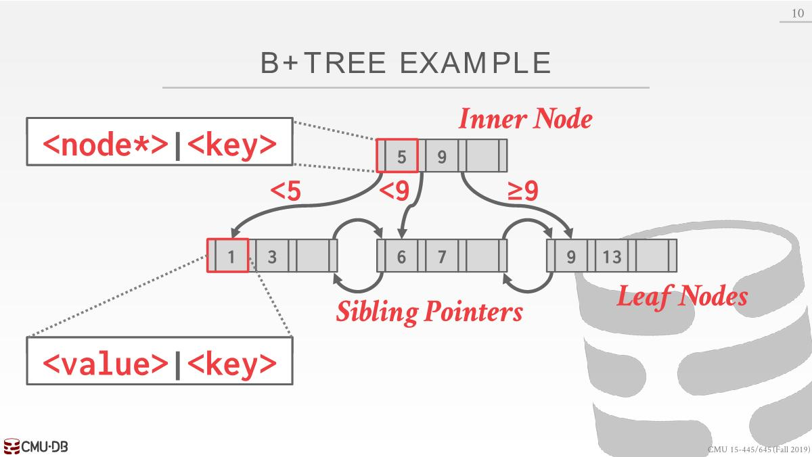
  - Arrays at every node are (almost) sorted by the keys.
  - Two approaches for leaf node values
    - Record IDs: A pointer to the location of the tuple
    - Tuple Data: The actual contents of the tuple is stored in the leaf node

## Leaf Nodes

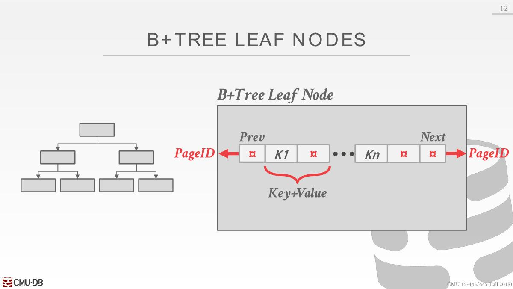

上图为教科书式结构，key和value存储在一起，pageID指向兄弟节点。但在实际数据库中是以下面的形式将数据分开存储的，存在像slot header的内容，可以从中知道树的高度，还有多少个空闲的slot，前一个和后一个节点是什么。分开存储key和value，有效利用缓存，当查找的时候，只使用到key，可以只把key加载到内存，如果像上面key和value一样混在一起，则还把value加载进来，浪费缓存。

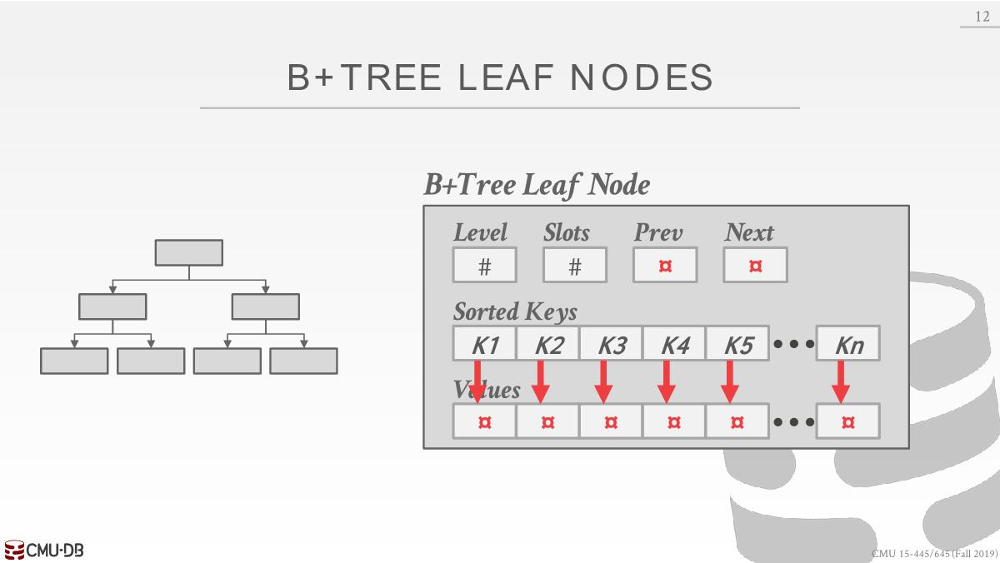

B-Tree vs B+Tree：

- space 
  - The original **B-Tree** from 1972 stored `keys + values` in **all nodes** in the tree. 不会有重复的key，每个key只出现在一个节点，空间效率高。
  - A **B+Tree** only stores values in leaf nodes. Inner nodes only guide the search process. inner节点会有某个key当作路标，所以会有重复key。

- update node
  - 当修改B-Tree node的时候可能会给其他节点也带来影响（为了平衡可能需要修改向上的节点和向下的节点），这样latch锁也需要额外在两个反向上加。
  - B+Tree只修改叶子节点，但是结果只会影响到向上的结果，只加一个latch锁就行。

## Insertion

1. Find correct leaf L.
2.  Add new entry into L in sorted order
   -  If L has enough space, the operation done.
   - Otherwise split L into two nodes L and L2：找到叶子节点的中间位置，将中间位置左边所有key放入一个节点，右边的放到另外一个节点。将中间的key（保护新插入的值算出的）复制到上面作为新的根节点。

---

插入2 6 4 1 5，max degree=3(non-null children, Every inner node with k keys has k+1 non-null children)
https://www.cs.usfca.edu/~galles/visualization/BPlusTree.html

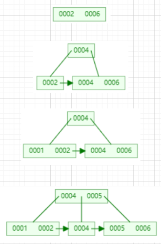

## Clustered Indexes

数据库默认情况是以任何顺序将tuple插入到任何的page中，有时想让数据（比如主键）以某种形式进行排列，创建表的时候可以创建一个聚簇索引，数据库系统会排序存储数据在磁盘上，这样只读取一部分page能找到对应的数据，对于某些任务（比如根据主键进行范围查询）会很有用。

某些系统会默认使用（当创建表的时候会自动使用），比如MySQL将tuple保存到叶子节点上（索引在磁盘上保存），保证磁盘上的page中的tuple都是以主键顺序排序的，如果没有主键，MySQL会自动以record id（tuple实际位置）之类的创建一个主键。

但是在其他DBMS中，比如SQL Server，Oracle，可以指定CLUSTER按哪些列去排序。

```sql
CREATE TABLE emails(id SERIAL PRIMARY KEY, email VARCHAR(128))
CREATE INDEX idx_emails_tree ON emails USING BTREE(email)
CLUSTER emails USING idx_emails_tree
```

强制Postgre根据索引定义来对整个表进行重新排序（对于pg来讲CLUSTER是一次性操作，对后续的插入不影响，其他DBMS则不是），允许能在表上进行二分查找，在不使用索引的情况下复杂度是log(n)。
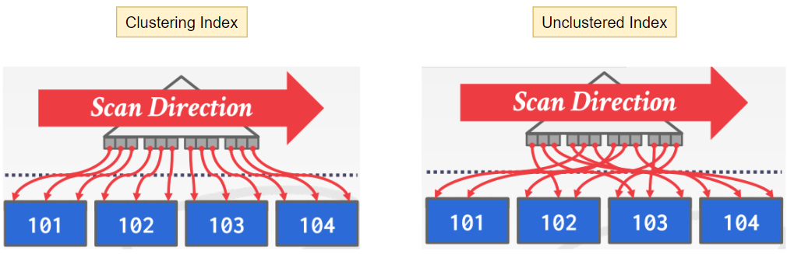 

## Select Conditions

假设在两列上面定义一个复合索引（composite key）

- Find key=(A, B)：先比较第一个key，再比较第二个key（这里图的比较应该不取等，如果取等，AC应该存放在第一个node）
  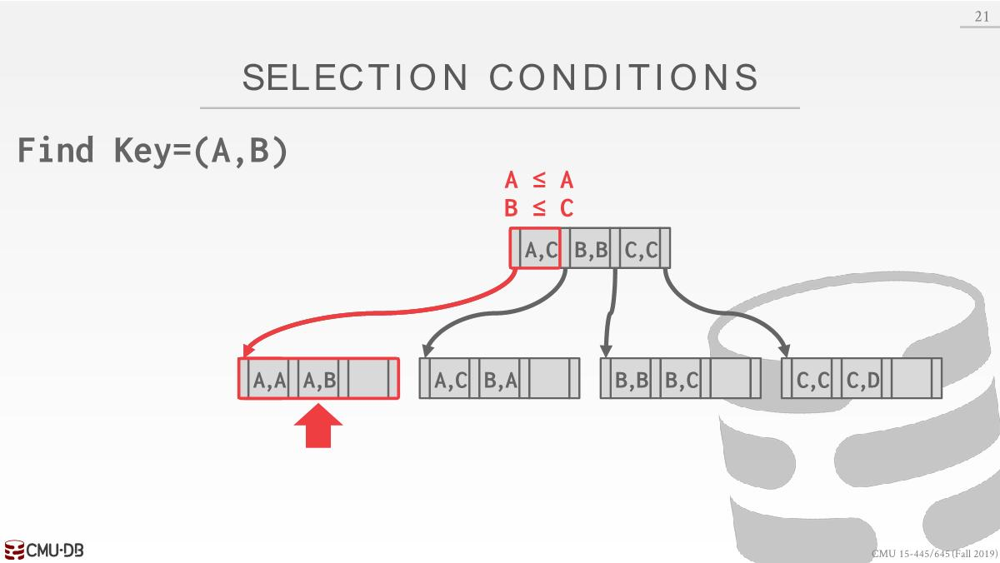
- Find key=(A, *)：找到第一个叶子结点后，沿着叶子结点找直到遇到大于A为止。
  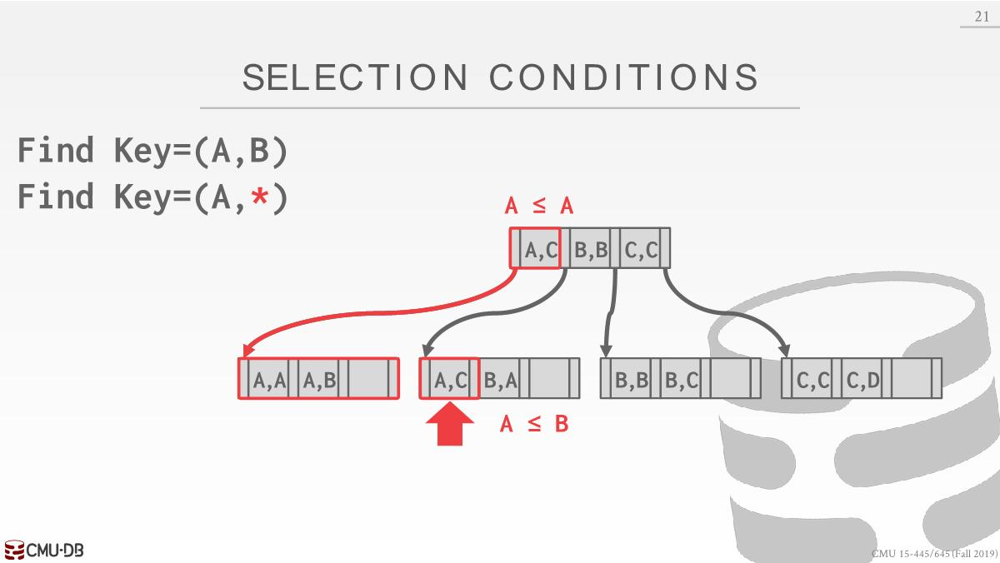
- Find key=(*, B)：根据第二个key多次找出所有的可能叶子，然后将所有符合结果整合。查找过程中会用不同的实际值代替`*`，并对数据进行多次遍历。oracle称为skip scan。
  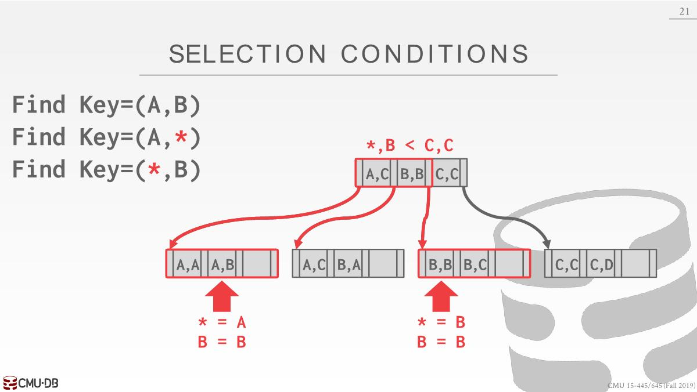

## B+Tree Design Decisions

### Node Size

- 一般可以将B+Tree中的node当作表中的page来思考，存储设备越慢，B+Tree 的最佳节点大小就越大。HDD ~1MB、SSD: ~10KB 、In-Memory: ~512B

- 对于Leaf Node Scans，node大小适合大点，可以进行更多的循序扫描。对于Root-to-Leaf Traversals，node大小适合小点。

### Merge Threshold

有时候节点并未达到half full的情况就得对节点进行合并。但是在实际上并不会立即进行合并操作，因为可能下次操作适合，又往节点中插入了些数据，又得将它进行拆分，合并的代价是昂贵的。

可以放宽要求，在后台定期调整树的平衡。甚至有时候会直接重建整一棵树，修复所有的问题，比如银行每周日早上关闭服务，可能做的一件事情就是重建索引。

### Variable Length keys

- Pointers：节点保存的是指向属性或者tuple的指针（比如record id），得重新拿page看下实际保存的值，速度很慢。
- Variable Length Nodes：允许一个节点的大小根据它所保存的东西来变化，因为我们想让page大小在buffer pool和磁盘中始终是一样，就无须去担心该如何找到空闲空间将数据放进去，这是个糟糕的想法。
- Padding：使用null或者0填充，以此来保存一样大小，PG采用此方式，这是一种取舍，为了保存数据，得浪费空间。
- Key Map/Indirection：Embed an array of pointers that map to the key + value 
  list within the node. 和slotted page的布局很像，根据offset确定数据。key+value从后往前存，sorted key map从前往后存。每个node的大小是固定的，如果这个node没有足够的空间，可以使用一个overflow page链接到这里。
  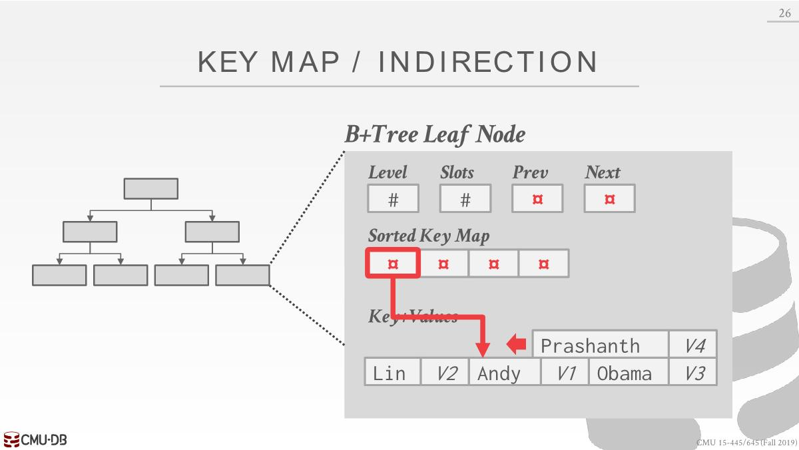

​		指针数据每个元素一般有16bit大小，空间充足，可以将每个字符串的首字母放到数组，如果第一个字符没有一样，则可以直接遍历下一个，这些都是在内存中做的（node的大小和磁盘中的page大小可能不一样）。
​		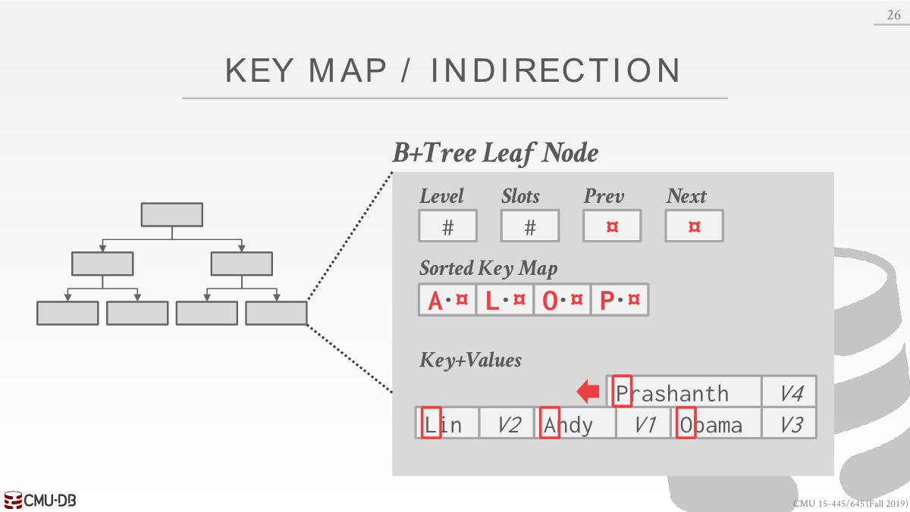

### Non-Unique Indexes

#### Duplicate Keys

Use the same leaf node layout but store duplicate keys multiple times.

如何快速确定这个key对应的value就是所需的，因为key都是一样的，可以添加个record id精准匹配。同时如果没有添加record id，插入时候可能会形成两个数值一样的page，这样得扫描过去，效率就很低，如果有record id，可以定位到是哪个page。

Add the tuple's unique record id as part of the key to  ensure that all keys are unique.The DBMS can still use partial keys to find tuples.根据key和record id确定，这个有点傻逼，有了record id为什么还要查索引呢。

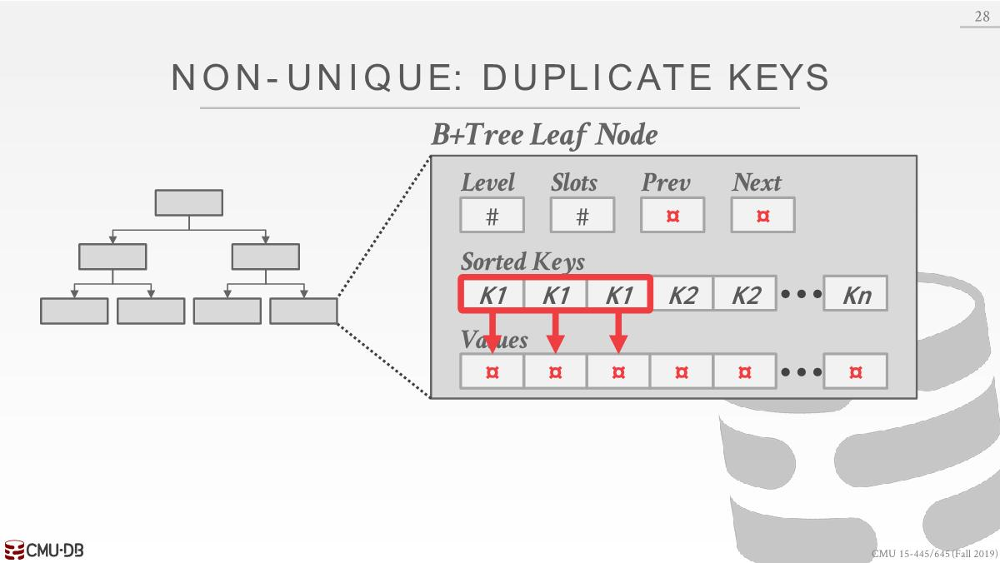

对于更高级的层次来看

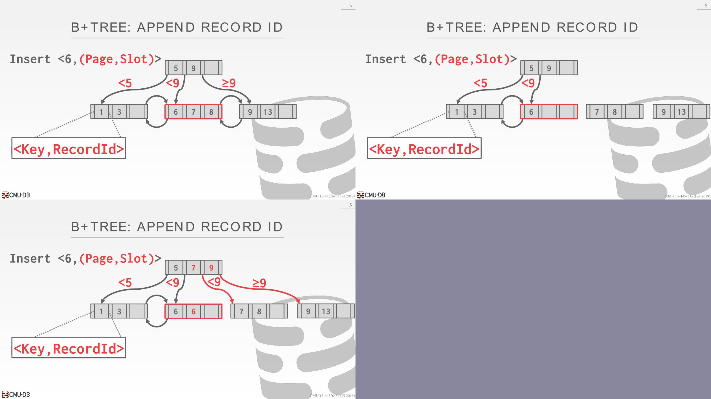

添加一个record id好处是不用对树结构进行修改，缺点是会增加索引大小

#### Value Lists

Store each key only once and maintain a linked list of unique values.

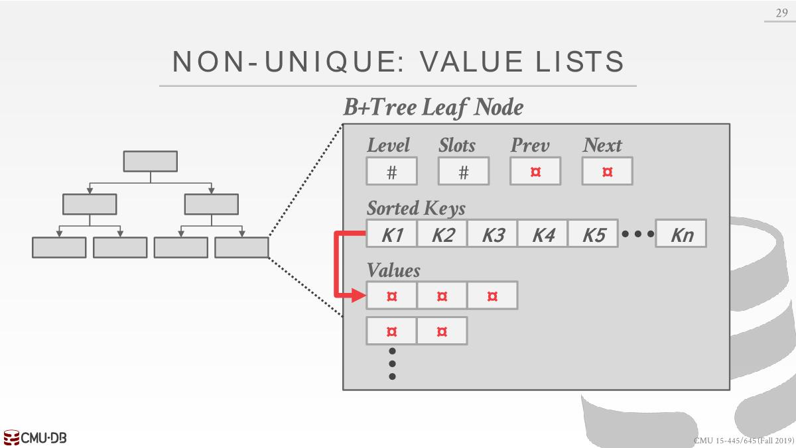

如果数量太多，则需要挂链

Allow leaf nodes to spill into overflow nodes that contain  the duplicate keys.This is more complex to maintain and modify.

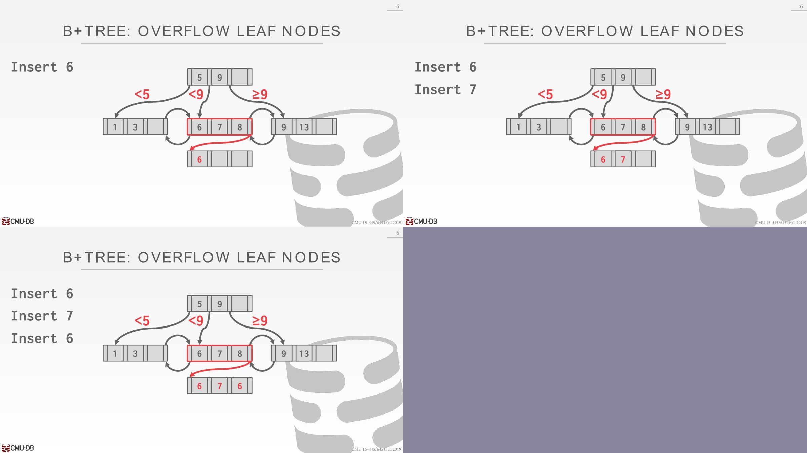

### Intra-Node Search

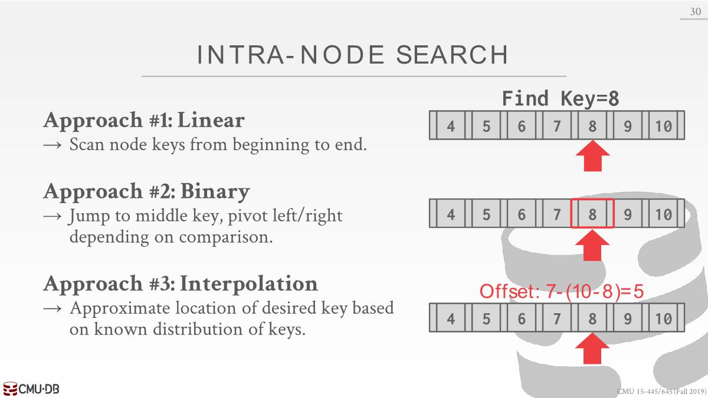

- 线性查找：遍历key数组直到找到想要的key
- 二分
- Interpolation: 使用某种数学方式估计key所大概要搜索的起点，比如offset: `7-(10-8)=5`，7为key的个数，key最大值为10，要找的是8，计算出来5，第五个位置就是起点。不适用于字符串。
  （上述公式只是示例，实际可见：https://en.wikipedia.org/wiki/Interpolation_search）

##  Optimizations

### Prefix Compression

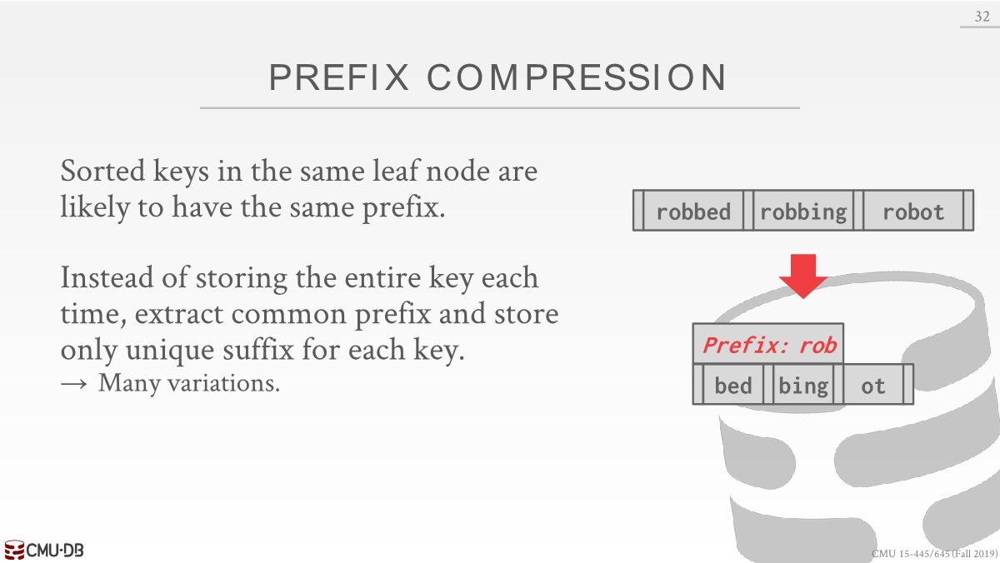

如果保存record id在根节点，这会节省大量空间，因为在同一个page的record id都是类似的，只需要保存offset即可。

### Suffix Truncation

- The keys in the inner nodes are only used to “direct traffic”, we do not need the entire key.
- Store a minimum prefix that is needed to correctly route probes into the index.

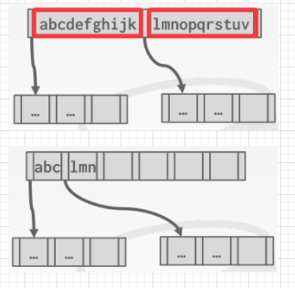

叶子节点依旧保存完整的整个key。在实际应用上，prefix compression更常用。

### Bulk Inserts

- The fastest way to build a B+Tree from scratch(*从头*) is to first sort the keys and then build the index from the bottom up(*自下而上*).

- This will be faster than inserting one-by-one since there are no splits or merges.

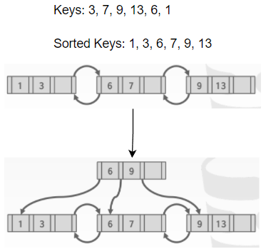

### Pointer Swizzling

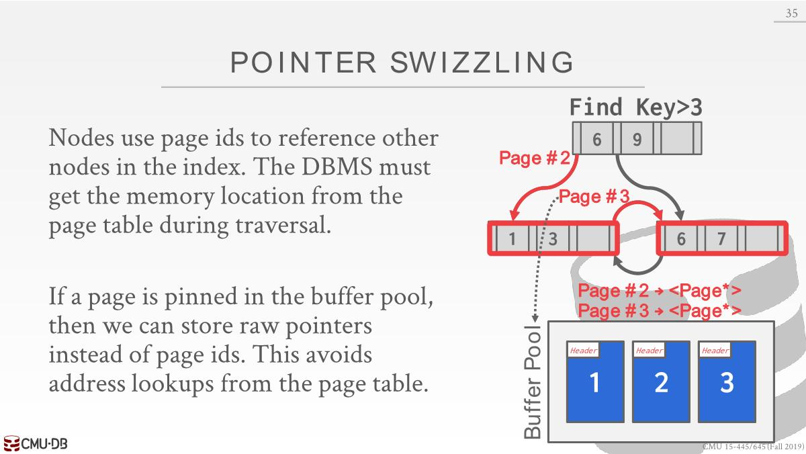

在根节点处保存了下一个节点的page id，然后从buffer pool中查到拿到指针，兄弟节点也是如此，将page id转变为指针。

这个过程效率不高，因为得实用latch保护buffer pool中的hash table。

如果一个page固定在buffer pool，那么可以直接存储原始指针，而不是page id，避免查buffer pool的开销。

