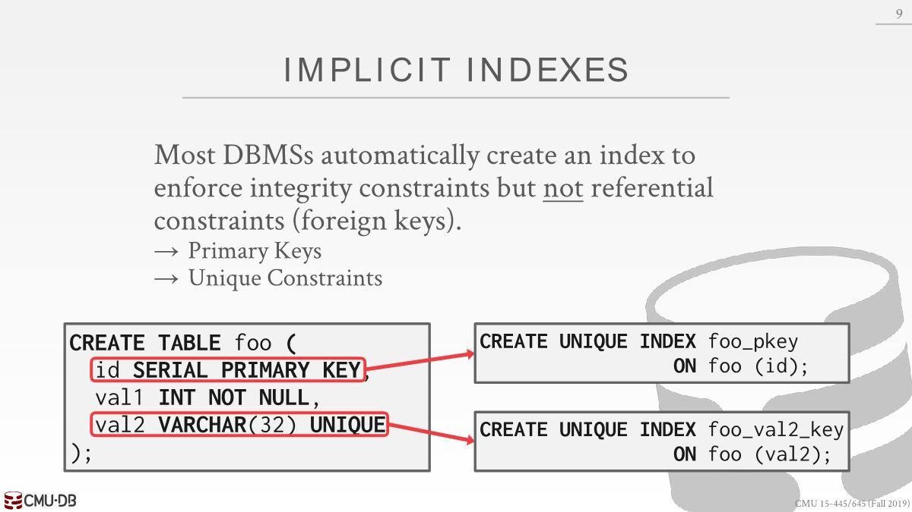
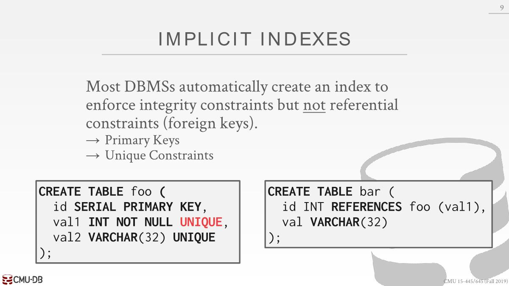
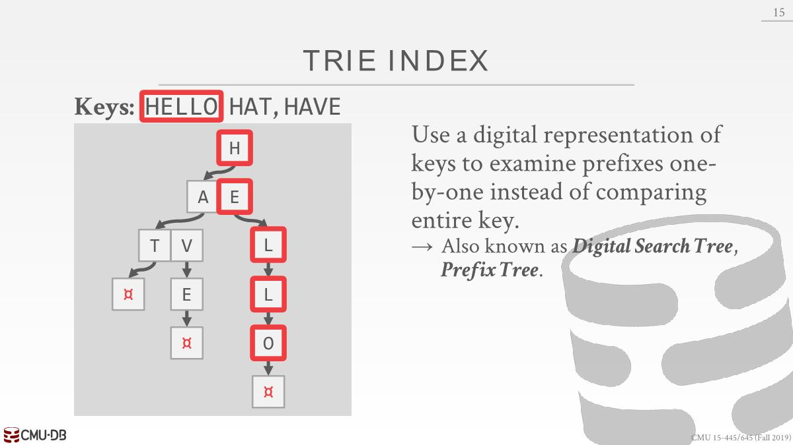
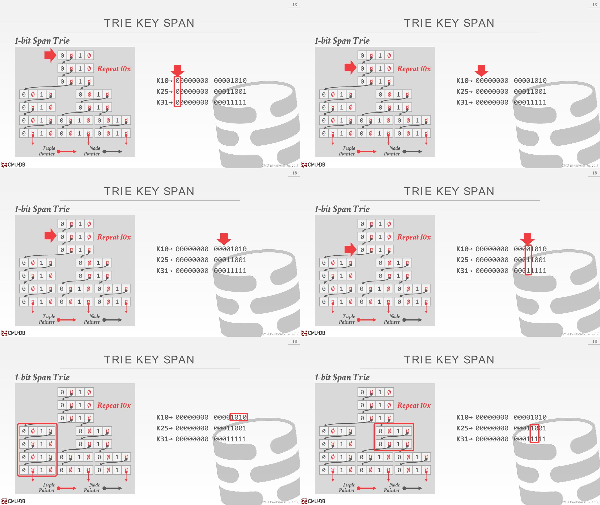
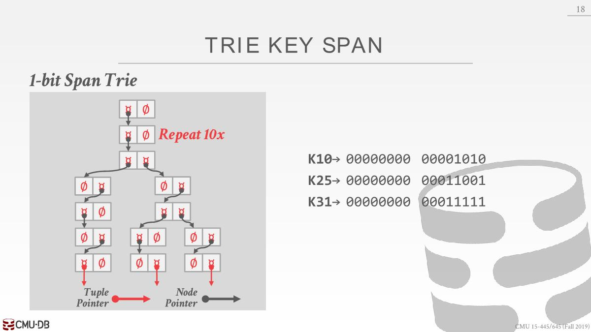
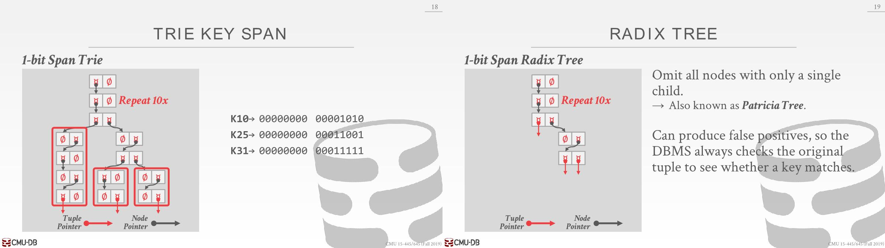

# Additional Index Usage

## Implicit Index

Most DBMSs automatically create an index to  enforce integrity constraints(*完整性约束*) but not referential  constraints(*引用约束*) (foreign keys).

创建表的时候自动创建索引



对于外键来讲，则不会自动创建，在没有索引的情况，不能使用引用约束，所以得使用unique关键字，自动创建一个索引。每当插入数据到bar表的时候，为了确保能匹配到foo表的数据，可以在索引中查找是否有匹配的数据。



## Partial Indexes

Create an index on a **subset of the  entire table**. This potentially reduces  its size and the amount of overhead(*开销*) to maintain it.

One common use case is to partition indexes by date ranges. Create a separate index per month, year.

```sql
CREATE INDEX idx_foo ON foo (a, b) WHERE c = 'WuTang';
SELECT b FROM foo WHERE a = 123 AND c = 'WuTang';
```

当tuple匹配这个条件后就可以放进这个索引中（a，b也有索引），如果c不是这个字符串，则不能使用索引。

## Covering Indexes

If **all the fields** needed to process the  query are **available in an index**, then  the DBMS does not need to retrieve  the tuple. This reduces contention(*竞争*) on the DBMS's buffer pool resources. 还可能减少了以此磁盘io

```sql
CREATE INDEX idx_foo ON foo (a, b);
# a和b都在索引
SELECT b FROM foo WHERE a = 123;
```

可运用在其他类型查询，比如聚合、join

## Index Include Columns

Embed additional columns in indexes to support index-only queries. These extra columns are only stored  in the leaf nodes and are not part of  the search key.

PostgreSQL最新版和SQL Server支持，MySQL和Oracle不支持。

```sql
CREATE INDEX idx_foo ON foo (a, b) INCLUDE (c);
SELECT b FROM foo WHERE a = 123 AND c = 'WuTang';
```

搜索a的时候使用索引，找到叶子节点，然后顺着叶子节点搜索符合c的值的数据。尽管可以将c也加入到inner node，但是这样的好处是不会让索引整体变得太大。

## Function/Expression Indexes

```sql
#登录日期为周二
SELECT * FROM users WHERE EXTRACT(dow FROM login) = 2;

CREATE INDEX idx_user_login ON users (EXTRACT(dow FROM login));
# 或者使用partial i
CREATE INDEX idx_user_login ON foo (login) WHERE EXTRACT(dow FROM login) = 2;
```

# Trie Index

The inner node keys in a B+Tree cannot tell you  whether a key exists in the index. You must always  traverse to the leaf node. 因为inner node中可能会保存那些不再存在于tree中的
key的拷贝，删除节点时候取决于拆分和合并的方式，inner node可能使用已经删除了的key作为路标。如果能够在inner node中就能决定key存在不存在就很好。这就是Trie Index（Digital Search Tree, Prefix Tree）能做的。



底部和B+Tree一样，可以是record id，也可以是tuple。

Trie的形状取决于key的分布以及它们的长度，不管key插入的顺序（B+Tree会根据插入的顺序决定树的形态，取决于合并和拆分操作），也不需要再平衡操作。

所有操作的时间复杂度都是O(k)，k指key的长度。

span是树的每层每个节点中digit的个数



这里很明显可以不需要空间去表示0和1，这个是水平压缩，减少每个trie节点的大小



垂直压缩：Omit(*忽略*) all nodes with only a single  child. 以移除下面没有其他明显区分路径的所有节点（移除无用分支路径，即真实情况是看似多条路线，但只有一条存储了明确key的路线），所以需要查看原始tuple决定是否匹配



# Radix Tree

Trie并不像B+Tree那样，它并没有任何标准的方式来进行维护（插入，删除。更新）


删除HAT只是将原来位置的slot变为空的slot。

可以把数据压实，不同的实现做不同的事情。

# Inverted Indexes

- The tree indexes that we've discussed so far are useful for "point" and "range" queries:
  - Find all customers in the 15217 zip code.
  - Find all orders between June 2018 and September 2018.
- They are not good at keyword searches:
  - Find all Wikipedia articles that contain the word "Pavlo"
  - `SELECT pageID FROM revisions WHERE content LIKE '%Pavlo%';`这样是不对的，即使给content建立了索引，也只能循序扫描所有数据，而且content可能会很大，整个树很大。而且查询语句不太符合要求，是要找到Pavlo相关信息，这里可能会查出AndyPavlo相关信息。
